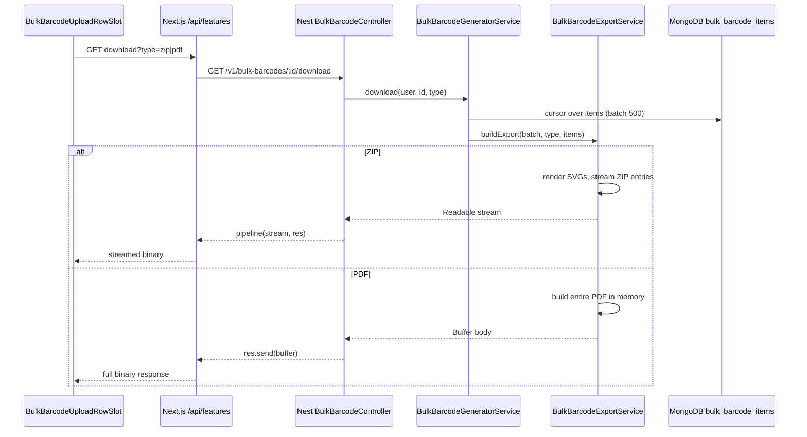
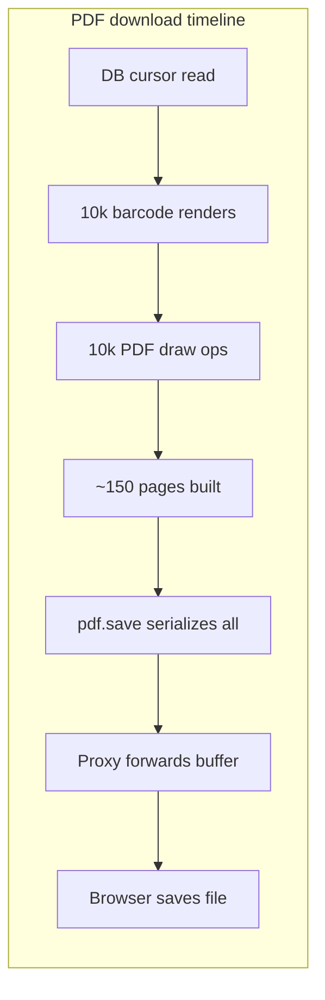
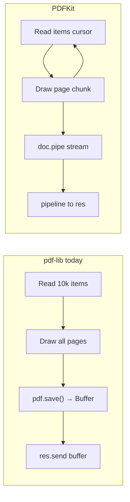

# Bulk Barcode ZIP & PDF Export — Architecture & Performance Notes

A learning reference for how bulk barcode downloads work in Link Lab, why they can be slow or fail, what was fixed, and how PDFKit could improve PDF exports further.

---

## Overview

Bulk barcode exports support two formats:

| Format | Best for | Backend strategy | Client delivery |
|--------|----------|------------------|-----------------|
| **ZIP** | Raw SVG files + `summary.csv` | Stream while generating | Browser streams to disk |
| **PDF** | Printable barcode sheets | Build document, then send | Full buffer (today) |

Both are requested through the Next.js feature proxy:

```text
/api/features/bulk-barcodes/:id/download?type=zip
/api/features/bulk-barcodes/:id/download?type=pdf
```

Which forwards to the Nest backend:

```text
GET /v1/bulk-barcodes/:id/download?type=zip|pdf
```

---

## End-to-end flow



There is **no background job, queue, polling, or presigned URL** pattern. Everything is one synchronous HTTP request unless changed later.

---

## Key files

| Purpose | Path |
|---------|------|
| Download UI | `client/src/modules/dashboard/schema-driven/custom-slots/bulk-barcode-generator/BulkBarcodeUploadRowSlot.tsx` |
| Streaming download route | `client/src/app/api/features/bulk-barcodes/[id]/download/route.ts` |
| Feature proxy (catch-all) | `client/src/app/api/features/[...path]/route.ts` |
| Nest download controller | `server/src/modules/features/bulkBarcodeGenerator/bulk-barcode-generator.controller.ts` |
| Download service | `server/src/modules/features/bulkBarcodeGenerator/bulk-barcode-generator.service.ts` |
| ZIP/PDF builder | `server/src/modules/features/bulkBarcodeGenerator/bulk-barcode-export.service.ts` |
| Barcode renderer | `server/src/modules/features/barcodeGenerator/barcode-renderer.service.ts` |
| Limits/constants | `server/src/modules/features/bulkBarcodeGenerator/bulk-barcode-generator.constants.ts` |

---

# ZIP exports

## How ZIP generation works

ZIP uses a **streaming** strategy on the backend:

1. Open a `PassThrough` stream
2. Read items from MongoDB via cursor (500 rows per batch)
3. For each item: render SVG with `bwipjs.toSVG()` on demand
4. Write ZIP local headers + file bytes immediately
5. Append `summary.csv` and central directory at the end
6. Pipe stream to HTTP response via `pipeline(file.stream, res)`

```typescript
// Controller — ZIP returns a stream
if (file.stream) {
  return pipeline(file.stream, res);
}
```

### Why ZIP is the better choice for large batches

- HTTP response can start as soon as the first ZIP bytes are written
- MongoDB reads items in batches instead of loading all documents at once
- Only small ZIP metadata is kept in memory while bytes flow to the client
- SVG files are rendered only when ZIP is requested (not stored at upload time)
- Backpressure is respected via the stream `drain` event

### ZIP optimizations applied

- **Parallel SVG rendering**: batches of 16 barcodes rendered concurrently (`BULK_BARCODE_ZIP_RENDER_CONCURRENCY`)
- **Proxy streaming**: Next.js no longer buffers the full ZIP with `arrayBuffer()`
- **Dedicated download route**: `maxDuration = 300` (5 minutes) for large exports
- **Large-batch frontend**: hidden iframe download for 500+ rows (browser streams to disk, no JS blob)

---

# PDF exports

## How PDF generation works (current: pdf-lib)

PDF uses a **buffer-then-send** strategy:

```typescript
if (type === BulkBarcodeDownloadType.PDF) {
  return {
    body: await this.buildPdf(items),  // entire PDF in memory
    contentType: 'application/pdf',
    filename: this.buildFilename(bulkBarcode, type),
  };
}
```

Steps for every download:

1. Create `PDFDocument` with `pdf-lib`
2. Loop through **every row** (up to 10,000)
3. For each item:
   - **New items**: `bwipjs.raw()` → draw bars as PDF rectangles (vector, fast)
   - **Legacy items with stored `svg`**: render PNG → embed image (slow fallback)
4. Lay out barcodes in a grid (currently 6 columns per page)
5. Call `Buffer.from(await pdf.save())` — serialize entire document
6. Send complete buffer via `res.send(file.body)`

Nothing is sent to the browser until **all** of the above finishes.

---

## Why PDF download is very slow

### 1. Entire PDF must be built before download starts (biggest reason)

Unlike ZIP, PDF cannot stream with the current `pdf-lib` approach. For 10,000 rows the user waits for:

- All barcode renders
- All PDF draw operations
- Full `pdf.save()` serialization

Only then does the browser receive the first byte.

### 2. Per-barcode CPU work scales with row count

| Step | What happens |
|------|----------------|
| DB read | MongoDB cursor, 500 rows at a time |
| Barcode render | `bwipjs.raw()` via `renderRawLinear()` per item |
| PDF drawing | Multiple `pdf-lib` calls per barcode (frame, background, bars, label, format text) |
| Page management | New pages added as the grid fills |

That is **thousands of render + draw operations** on a single request thread.

### 3. Large document finalization

With 6 columns per page, a 10,000-row batch produces roughly **150+ pages**. The final step:

```typescript
return Buffer.from(await pdf.save());
```

`pdf.save()` compresses and serializes the **entire** document into one in-memory buffer. This alone can take a long time.

### 4. Legacy items are much slower

If rows still have stored `svg` data, the code uses PNG rasterization:

```typescript
const images = await Promise.all(
  itemsBatch.map((item) => this.buildPdfBarcodeImage(item)),
);
// bwipjs.toBuffer() → pdf.embedPng()
```

PNG embed is **much slower** than vector `renderRawLinear()` for large batches.

### 5. Request goes through multiple hops

```text
Browser → Next.js proxy → Nest backend → MongoDB
```

PDF waits for the backend to finish the full buffer before the proxy forwards anything. On Vercel/serverless this risks long runtime and high memory.

### 6. No background job / pre-generation

Exports are generated **on demand** at click time. Every PDF click repeats the full build.

### 7. PDF is inherently heavier than ZIP for this use case

| | ZIP | PDF |
|---|-----|-----|
| Generation | SVG per file, streamed as built | Full paginated document |
| Streaming | Yes (`PassThrough`) | No (full buffer) |
| Output for 10k rows | ~10k small SVG files + CSV | ~150+ page single document |
| Best for | Raw barcode files | Printing |

---

## Rough time breakdown (10,000 rows, PDF)



Most time is spent in **B + C + E** — all before download visibly starts.

---

# Export strategy options (design decisions)

The codebase documents several strategies and why the current ones were chosen:

| Strategy | How it works | Good for | Why not always best |
|----------|--------------|----------|---------------------|
| Store every SVG at upload | Pre-render all SVGs before saving batch | Small batches, fast re-download | Slows 5k–10k uploads; large Mongo documents |
| Store every PNG at upload | Pre-render PNG buffers | Fast image PDFs for small batches | High CPU/storage; wasteful if user only wants ZIP |
| ZIP as one full buffer | Collect all ZIP parts in memory, then send | Small ZIPs | High memory; response can't start until ZIP is complete |
| **Stream ZIP while reading** ✓ | Cursor + on-demand SVG + stream entries | Large ZIP exports | Manual ZIP headers/CRC; current ZIP approach |
| PDF: SVG → PNG → embedPng | Convert each barcode to PNG in pdf-lib | Legacy SVG rows | Too slow for 10k rows |
| PDF: direct PNG generation | `bwipjs.toBuffer()` + embed | Image PDFs | Thousands of image objects |
| **PDF: vector bars** ✓ | `bwipjs.raw()` + draw rectangles | Large printable PDFs | Legacy SVG rows need PNG fallback |

### Why vector PDF (current approach) was chosen over image PDF

- New items skip PNG conversion entirely
- `bwipjs.raw()` gives barcode module widths directly
- `pdf-lib` draws rectangles instead of embedding thousands of raster images
- Compact grid reduces page count
- Legacy SVG rows still work via slower PNG fallback

Rendering and embedding thousands of PNG images is too slow for large exports. Drawing bars as PDF rectangles avoids image conversion and produces a smaller PDF.

---

# What went wrong in production (Vercel)

## Symptom

`FUNCTION_INVOCATION_FAILED` after ~90 seconds when downloading ZIP/PDF for 10,000-row batches.

## Root causes

### 1. Next.js proxy buffered the entire file

```typescript
// Old behavior — blocked until complete
const responseBody = await backendResponse.arrayBuffer();
return new NextResponse(responseBody, { status });
```

This negated backend ZIP streaming and caused:
- Vercel function timeout
- Out-of-memory from holding full file in serverless function
- Possible ~4.5 MB response limit issues on serverless

### 2. Frontend held full file as blob

```typescript
const blob = await response.blob();
URL.createObjectURL(blob);
```

Triple memory: backend → proxy → browser.

### 3. PDF built entirely before any bytes sent

Even with proxy fixes, PDF still waits for full `buildPdf()` + `pdf.save()`.

---

# Fixes applied

## 1. Streaming download route

`client/src/app/api/features/bulk-barcodes/[id]/download/route.ts`

- Pipes backend response directly to browser (no `arrayBuffer()`)
- `maxDuration = 300` (5 minutes)

## 2. Streaming in catch-all proxy

Bulk download requests through `[...path]` also stream instead of buffering.

## 3. Smarter frontend download

`BulkBarcodeUploadRowSlot.tsx`:

| Batch size | Strategy |
|------------|----------|
| **500+ rows** | Hidden iframe — browser streams to disk; auth refreshed first |
| **< 500 rows** | `fetch` + `blob()` — better error handling and Safari behavior |

## 4. Backend ZIP optimization

- Parallel SVG rendering in batches of 16
- PDF layout: 6 columns per page (was 4) — fewer pages

---

# PDFKit — a better path for PDF

## Current (pdf-lib) vs PDFKit

| | **pdf-lib (now)** | **PDFKit** |
|---|-------------------|------------|
| Model | Build full doc → `pdf.save()` → send buffer | Write pages incrementally → pipe stream |
| Time to first byte | After all 10k barcodes + full save | As soon as first pages are written |
| Memory | Entire PDF in one `Buffer` | Lower; stream chunks out |
| Nest integration | `res.send(file.body)` | `doc.pipe(res)` — **same as ZIP** |
| Vector bars | `page.drawRectangle()` | `doc.rect()` — similar |

PDFKit would let PDF use the **same streaming path ZIP already uses**.

## What PDFKit would improve

1. **Download starts sooner** — browser shows progress instead of a long spinner
2. **Lower memory** — no giant `Buffer.from(await pdf.save())`
3. **Better proxy behavior** — Next.js forwards chunks instead of waiting for full file
4. **Less timeout risk** — work spread over request lifetime

## What PDFKit would NOT fix

- Still must process **10,000 barcode renders** (`bwipjs.raw()`) and draw operations
- ~150+ pages of content
- Legacy `svg` rows still need PNG embed path
- PDF will still be slower than ZIP for 10k rows — just more reliable and responsive

## Architecture comparison



## Sketch: PDFKit streaming export

```typescript
// Instead of buildPdf() returning Buffer
openPdfStream(items): Readable {
  const doc = new PDFDocument({ size: 'LETTER', margin: 16 });
  const stream = new PassThrough();
  doc.pipe(stream);

  void this.writePdfStream(items, doc).then(() => doc.end());

  return stream;
}

// In buildExport:
if (type === PDF) {
  return { stream: this.openPdfStream(items), contentType: 'application/pdf', ... };
}
```

Controller already supports `file.stream` — minimal controller change.

## API migration (pdf-lib → PDFKit)

| pdf-lib | PDFKit |
|---------|--------|
| `PDFDocument.create()` | `new PDFDocument()` |
| `pdf.addPage()` | `doc.addPage()` |
| `page.drawRectangle()` | `doc.rect().fill()` |
| `page.drawText()` | `doc.text()` |
| `pdf.embedPng()` | `doc.image(pngBuffer, x, y, { width, height })` |
| `rgb(r,g,b)` from hex | `doc.fillColor('#hex')` |
| `await pdf.save()` | `doc.end()` |

Vector barcode logic (`drawPdfRawBars` using `symbol.sbs`) ports cleanly — mostly rectangles and text.

## Options ranked

| Approach | Speed gain | Complexity |
|----------|------------|------------|
| **PDFKit streaming** | High (TTFB + memory) | Medium — rewrite export service |
| More columns / parallel render | Medium | Low — partly done |
| Async job + storage download link | Highest for UX | High — queue, storage, UI |
| PDF row cap (e.g. 2k) + “use ZIP” message | High perceived fix | Low |
| Keep pdf-lib | None for large batches | None |

## Recommendation

**PDFKit is a good next step** for faster, more reliable PDF downloads without a full async job system. It aligns with how ZIP already works and removes the biggest structural bottleneck (buffer-then-send).

Realistic expectations for 10,000 rows:

- **ZIP** — best choice for raw files; streaming works well
- **PDF with PDFKit** — download starts sooner, less memory, fewer timeouts — still CPU-heavy

Implementation steps:

1. Add `pdfkit` (+ `@types/pdfkit`)
2. Replace `buildPdf()` with `openPdfStream()`
3. Port layout + `drawPdfRawBars` to PDFKit API
4. Return `{ stream }` instead of `{ body }` for PDF

---

# Quick reference

## What to tell users

| Rows | ZIP | PDF |
|------|-----|-----|
| Small (< 500) | Fast | Acceptable |
| Large (500–10,000) | Recommended; streams well | Slow; consider ZIP for bulk files |
| 10,000 | Works with streaming fixes | Very slow; PDFKit or async jobs would help |

## Constants (server)

```typescript
BULK_BARCODE_MAX_ROWS = 10_000
BULK_BARCODE_DOWNLOAD_READ_BATCH_SIZE = 500
BULK_BARCODE_ZIP_RENDER_CONCURRENCY = 16
BULK_BARCODE_PDF_IMAGE_BATCH_SIZE = 25  // legacy svg rows only
```

## Frontend thresholds

```typescript
LARGE_EXPORT_ROW_THRESHOLD = 500   // iframe streaming download
STREAMING_DOWNLOAD_CLEAR_MS = 120_000
```

---

# Related docs

- `client/docs/browser-zip-pdf-download-notes.md` — Safari, blob vs anchor, proxy Content-Length
- `client/docs/features/bulk-barcode-generator.md` — feature overview
- `server/src/modules/features/bulkBarcodeGenerator/bulk-barcode-generator.md` — full API and export design

---

*Last updated: learning note covering ZIP/PDF architecture, Vercel failure analysis, applied fixes, and PDFKit migration path.*
