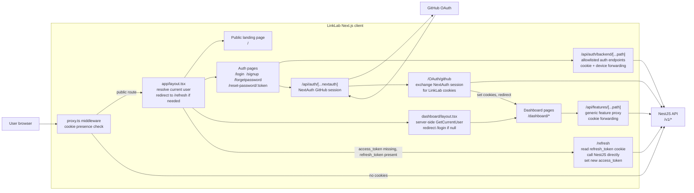
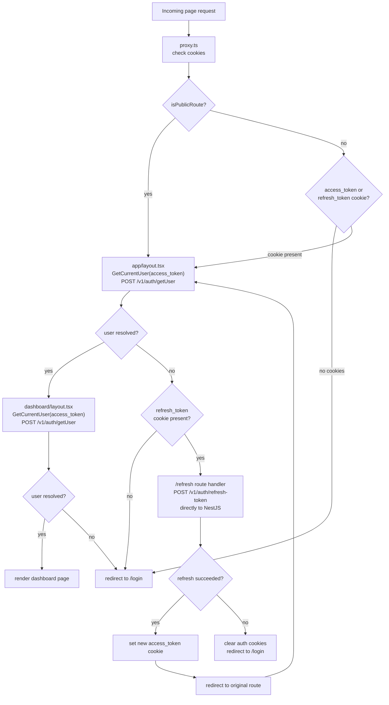
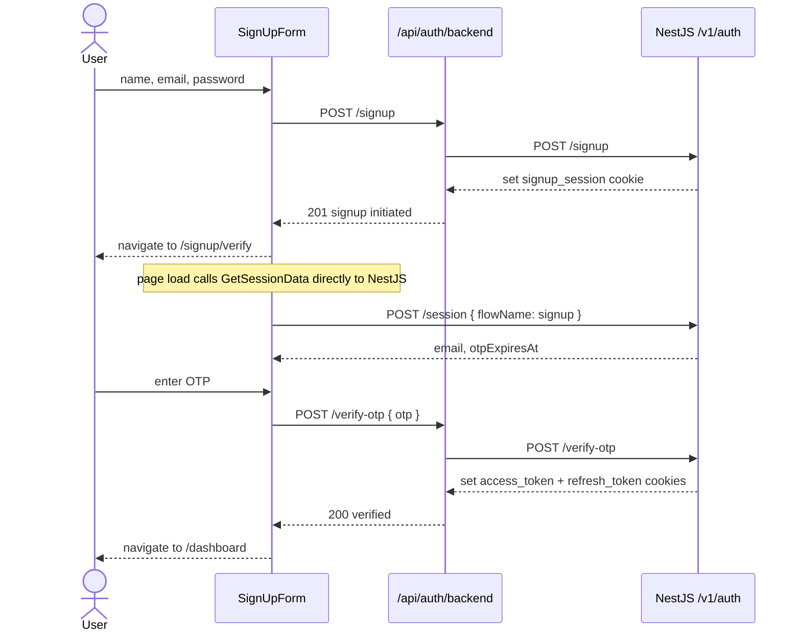
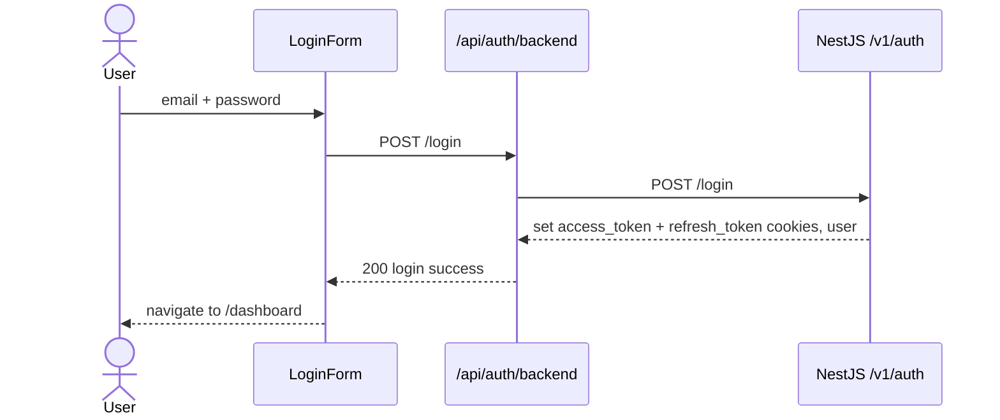
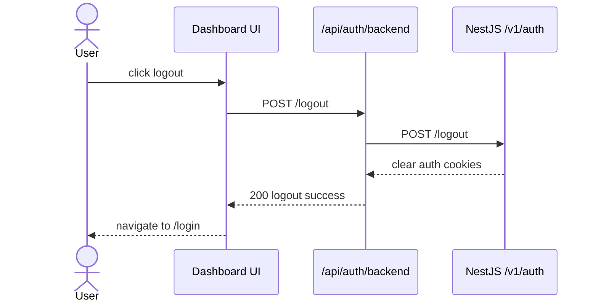
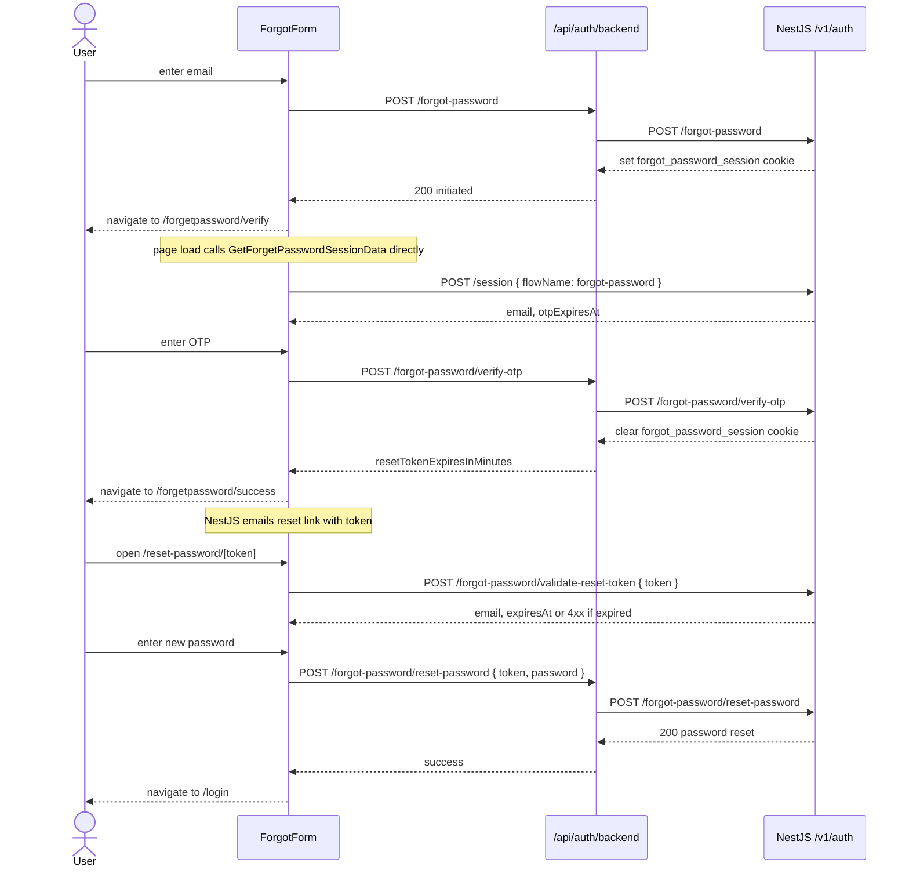
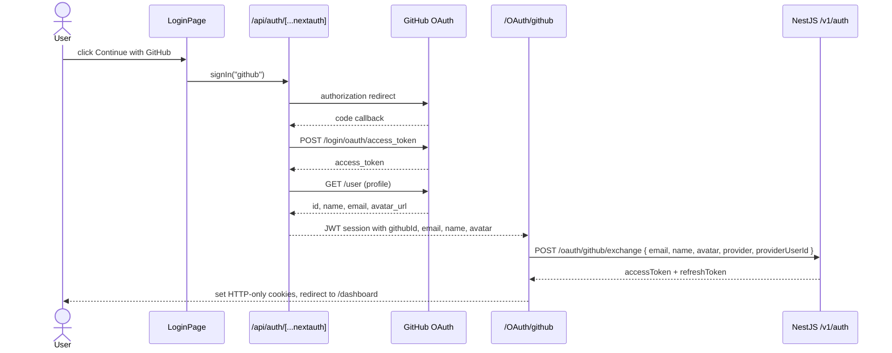
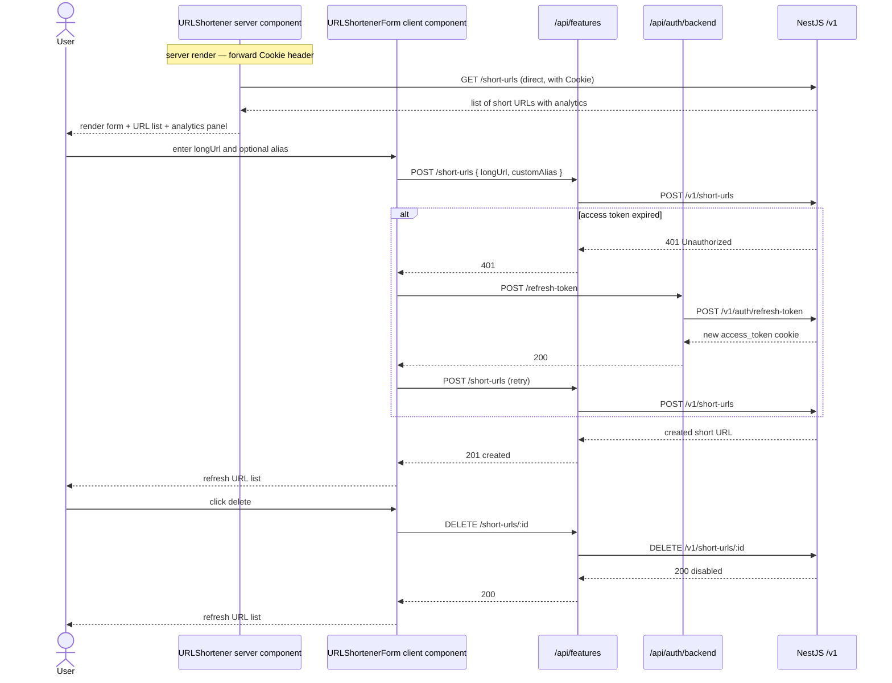

# LinkLab Client Architecture

## Project

LinkLab is a web dashboard that brings URL shortening, QR, barcode, link
inspection, DNS, and one-time-link tools into one authenticated workspace.

The client is built with:

- Next.js 15 App Router
- React 19 and TypeScript
- NextAuth for GitHub OAuth
- Tailwind CSS and reusable dashboard UI components
- HTTP-only cookies for access and refresh tokens, and flow-specific session cookies

## Current Feature Status

| Feature                | Client status                                          | Data path                                                            |
| ---------------------- | ------------------------------------------------------ | -------------------------------------------------------------------- |
| Authentication         | Implemented                                            | Next.js auth proxy to NestJS                                         |
| URL Shortener          | Implemented                                            | Next.js feature proxy to NestJS                                      |
| Dashboard overview     | Placeholder route                                      | Intended to aggregate server and browser data                        |
| QR Code Generator      | Placeholder route                                      | No active implementation                                             |
| QR Code Scanner        | Placeholder                                            | Intended browser file processing and local storage                   |
| Dynamic QR Generator   | Placeholder                                            | Intended local prototype, server support required for real redirects |
| Link Expander          | Placeholder                                            | Server support required for real redirect inspection                 |
| Broken Link Checker    | Placeholder                                            | Server support required for real HTTP checks                         |
| Barcode Generator      | Placeholder                                            | Intended browser canvas and local storage                            |
| Barcode Decoder        | Placeholder                                            | Real decoder library or server support required                      |
| DNS and Domain Checker | Placeholder                                            | Server or external DNS/WHOIS service required                        |
| One-Time Links         | Placeholder                                            | Server support required for secure single-use behavior               |
| Settings               | Placeholder                                            | Intended theme, preferences, local history, and logout               |

---

## System Architecture

The client is a Next.js App Router application. Every request first passes
through the Next.js middleware (`proxy.ts`) which checks cookies and redirects
unauthenticated users before any page renders. The root layout (`app/layout.tsx`)
then resolves the current user server-side and handles the refresh redirect.
Protected dashboard pages get a second server-side user check inside the
dashboard layout (`app/(protected)/dashboard/layout.tsx`).

Two API route groups act as proxies so the browser never talks to NestJS directly:

- `/api/auth/backend/[...path]` — auth proxy with an explicit allowlist of
  permitted endpoints. Forwards cookies and enriches requests with device and
  location headers before passing them to NestJS.
- `/api/features/[...path]` — feature proxy that forwards any method and cookie
  header to the matching NestJS route path.

Client-side service calls that need an authenticated NestJS endpoint go through
`requestWithRefresh`, which transparently retries once after posting to the auth
proxy refresh route on a 401 response.

GitHub OAuth is handled by NextAuth (`/api/auth/[...nextauth]`). After NextAuth
resolves the GitHub session, the `/OAuth/github` route handler calls the NestJS
exchange endpoint directly, sets the LinkLab HTTP-only cookies, and redirects
to the dashboard.

---

## Route Protection and Session Flow

The middleware runs on every non-static request. It only checks cookie
presence — not validity. The root layout performs the actual token validation
by calling `GetCurrentUser` (POST `/v1/auth/getUser`) with the access token. If
the access token is absent or invalid but a refresh token cookie exists, the
root layout redirects to `/refresh`. The `/refresh` route handler calls NestJS
`/v1/auth/refresh-token` directly with the refresh token from the cookie, sets
a new `access_token` cookie, and redirects back to the original route. The
dashboard layout repeats `GetCurrentUser` as a second guard and redirects to
`/login` if the user cannot be resolved.

Pages involved:
- `src/proxy.ts` — middleware
- `src/app/layout.tsx` — root layout, first user resolution
- `src/app/(auth)/refresh/route.ts` — token refresh route handler
- `src/app/(protected)/dashboard/layout.tsx` — protected layout, second user guard

---

## Auth Proxy

All browser-initiated auth calls go to `/api/auth/backend/[...path]`. The route
handler maintains an explicit allowlist and rejects anything not on it. It
forwards cookies, user-agent, IP headers, and enriches requests with
`x-device-info` and `x-location-info` derived from Vercel edge headers. All
`set-cookie` headers from NestJS are forwarded back to the browser using
`getSetCookie()`.

Allowed endpoints on the auth proxy:

| Proxy path | NestJS route |
| --- | --- |
| `POST /api/auth/backend/signup` | `POST /v1/auth/signup` |
| `POST /api/auth/backend/verify-otp` | `POST /v1/auth/verify-otp` |
| `POST /api/auth/backend/resend-otp` | `POST /v1/auth/resend-otp` |
| `POST /api/auth/backend/session` | `POST /v1/auth/session` |
| `POST /api/auth/backend/login` | `POST /v1/auth/login` |
| `POST /api/auth/backend/logout` | `POST /v1/auth/logout` |
| `POST /api/auth/backend/refresh-token` | `POST /v1/auth/refresh-token` |
| `POST /api/auth/backend/forgot-password` | `POST /v1/auth/forgot-password` |
| `POST /api/auth/backend/forgot-password/verify-otp` | `POST /v1/auth/forgot-password/verify-otp` |
| `POST /api/auth/backend/forgot-password/reset-password` | `POST /v1/auth/forgot-password/reset-password` |

File: `src/app/api/auth/backend/[...path]/route.ts`

---

## Feature Proxy

Dashboard feature calls go to `/api/features/[...path]`. The proxy forwards the
full path, query string, method, body, and cookie header to the matching NestJS
route. There is no allowlist — the NestJS JWT guard handles authorization.

| Proxy path | NestJS route |
| --- | --- |
| `POST /api/features/short-urls` | `POST /v1/short-urls` |
| `GET /api/features/short-urls` | `GET /v1/short-urls` |
| `DELETE /api/features/short-urls/:id` | `DELETE /v1/short-urls/:id` |
| `PATCH /api/features/short-urls/:id` | `PATCH /v1/short-urls/:id` |

File: `src/app/api/features/[...path]/route.ts`

---

## Signup Flow

Pages involved:
- `src/app/(auth)/signup/page.tsx` → `src/modules/auth/pages/SignUp.tsx`
- `src/app/(auth)/signup/verify/page.tsx` → `src/modules/auth/pages/SignUpOTP.tsx`
- `src/modules/auth/components/SignUpForm.tsx`
- `src/modules/auth/components/OTPForm.tsx`
- `src/service/auth/index.ts` — `Signup`, `VerifySignUpOTP`, `ResendOTP`, `GetSessionData`

| Step | Client call | Proxy | NestJS |
| --- | --- | --- | --- |
| Submit signup form | `Signup(name, email, password)` | `POST /api/auth/backend/signup` | `POST /v1/auth/signup` |
| Load OTP page | `GetSessionData(cookieHeader)` | direct | `POST /v1/auth/session` |
| Resend OTP | `ResendOTP()` with `flowName: signup` | `POST /api/auth/backend/resend-otp` | `POST /v1/auth/resend-otp` |
| Submit OTP | `VerifySignUpOTP(otp)` | `POST /api/auth/backend/verify-otp` | `POST /v1/auth/verify-otp` |

---

## Login Flow

Pages involved:
- `src/app/(auth)/login/page.tsx` → `src/modules/auth/pages/Login.tsx`
- `src/modules/auth/components/LoginForm.tsx`
- `src/service/auth/index.ts` — `Login`

| Step | Client call | Proxy | NestJS |
| --- | --- | --- | --- |
| Submit login | `Login(email, password)` | `POST /api/auth/backend/login` | `POST /v1/auth/login` |

---

## Logout Flow

Pages involved:
- `src/modules/dashboard/component/settings/UserSettingsClient.tsx` (or any component calling logout)
- `src/service/auth/index.ts` — `Logout`

| Step | Client call | Proxy | NestJS |
| --- | --- | --- | --- |
| Logout | `Logout()` | `POST /api/auth/backend/logout` | `POST /v1/auth/logout` |

---

## Forgot Password Flow

Pages involved:
- `src/app/(auth)/forgetpassword/page.tsx` → `src/modules/auth/pages/ForgetPassword.tsx`
- `src/app/(auth)/forgetpassword/verify/page.tsx` → `src/modules/auth/pages/ForgetPasswordOTP.tsx`
- `src/app/(auth)/forgetpassword/success/page.tsx` → `src/modules/auth/pages/SuccessfullyResetLink.tsx`
- `src/app/(auth)/reset-password/[token]/page.tsx` → `src/modules/auth/pages/PasswordReset.tsx` or `ResetTokenExpired.tsx`
- `src/modules/auth/components/ForgetPasswordForm.tsx`
- `src/modules/auth/components/ForgetPasswordOTPForm.tsx`
- `src/service/auth/index.ts` — `ForgetPassword`, `GetForgetPasswordSessionData`, `ForgetPasswordResendOTP`, `VerifyForgetPasswordOTP`, `ValidateResetPasswordToken`, `ResetPassword`

| Step | Client call | Proxy | NestJS |
| --- | --- | --- | --- |
| Submit email | `ForgetPassword(email)` | `POST /api/auth/backend/forgot-password` | `POST /v1/auth/forgot-password` |
| Load OTP page | `GetForgetPasswordSessionData(cookieHeader)` | direct | `POST /v1/auth/session` |
| Resend OTP | `ForgetPasswordResendOTP()` with `flowName: forgot-password` | `POST /api/auth/backend/resend-otp` | `POST /v1/auth/resend-otp` |
| Submit OTP | `VerifyForgetPasswordOTP(otp)` | `POST /api/auth/backend/forgot-password/verify-otp` | `POST /v1/auth/forgot-password/verify-otp` |
| Validate reset token | `ValidateResetPasswordToken(token)` | direct to NestJS | `POST /v1/auth/forgot-password/validate-reset-token` |
| Reset password | `ResetPassword(token, password)` | `POST /api/auth/backend/forgot-password/reset-password` | `POST /v1/auth/forgot-password/reset-password` |

---

## GitHub OAuth Flow

Pages involved:
- `src/app/(auth)/login/page.tsx` — GitHub button triggers NextAuth sign-in
- `src/app/api/auth/[...nextauth]/route.ts` — NextAuth handler
- `src/lib/OAuth.ts` — NextAuth config, custom GitHub token exchange, JWT/session callbacks
- `src/app/(auth)/OAuth/github/route.ts` — exchange NextAuth session for LinkLab cookies
- `src/context/OAuthWrapper.tsx` — wraps app with NextAuth SessionProvider

| Step | Where | Target |
| --- | --- | --- |
| Initiate OAuth | NextAuth `signIn("github")` | `https://github.com/login/oauth/access_token` |
| Token exchange | `OAuth.ts` custom request handler | GitHub token endpoint |
| Session complete | `/OAuth/github` GET handler | `POST /v1/auth/oauth/github/exchange` direct to NestJS |
| Set cookies | `/OAuth/github` response | `access_token` + `refresh_token` HTTP-only cookies |

---

## URL Shortener Flow

Pages involved:
- `src/app/(protected)/dashboard/url-shortener/page.tsx`
- `src/modules/dashboard/pages/URLShortener.tsx` — async server component, fetches initial list
- `src/modules/dashboard/component/url-shortener/URLShortenerForm.tsx` — create link
- `src/modules/dashboard/component/url-shortener/URLShortenerUrlsPanel.tsx` — list links
- `src/modules/dashboard/component/url-shortener/URLShortenerAnalyticsPanel.tsx` — click analytics
- `src/modules/dashboard/component/url-shortener/URLShortenerDeleteModal.tsx` — confirm delete
- `src/service/dashboard/url-shortener/index.ts` — `GetUserShortUrls`, `CreateShortUrl`, `DeleteShortUrl`
- `src/service/request-with-refresh.ts` — wraps all feature calls, retries on 401

| Step | Client call | Route | NestJS |
| --- | --- | --- | --- |
| Page load (server) | `GetUserShortUrls({ Cookie })` | direct to NestJS | `GET /v1/short-urls` |
| Create short URL | `CreateShortUrl(longUrl, alias?)` | `POST /api/features/short-urls` → feature proxy | `POST /v1/short-urls` |
| Delete short URL | `DeleteShortUrl(id)` | `DELETE /api/features/short-urls/:id` → feature proxy | `DELETE /v1/short-urls/:id` |
| 401 on any call | `requestWithRefresh` retries | `POST /api/auth/backend/refresh-token` → auth proxy | `POST /v1/auth/refresh-token` |

---

## Dashboard Tool Pages (Placeholders)

These routes render a placeholder component. No API calls are wired. Server
support is required before real implementations can be added.

| Route | Page file | Client component |
| --- | --- | --- |
| `/dashboard` | `dashboard/page.tsx` | `DashboardOverviewClient.tsx` |
| `/dashboard/qr-code-generator` | `qr-code-generator/page.tsx` | `QrCodeGenerator.tsx` |
| `/dashboard/qr-scanner` | `qr-scanner/page.tsx` | `QRScannerClient.tsx` |
| `/dashboard/dynamic-qr` | `dynamic-qr/page.tsx` | `DynamicQRGeneratorClient.tsx` |
| `/dashboard/link-expander` | `link-expander/page.tsx` | `LinkExpanderClient.tsx` |
| `/dashboard/broken-link-checker` | `broken-link-checker/page.tsx` | `BrokenLinkCheckerClient.tsx` |
| `/dashboard/barcode-generator` | `barcode-generator/page.tsx` | `BarcodeGeneratorClient.tsx` |
| `/dashboard/barcode-decoder` | `barcode-decoder/page.tsx` | `BarcodeDecoderClient.tsx` |
| `/dashboard/dns-checker` | `dns-checker/page.tsx` | `DNSDomainCheckerClient.tsx` |
| `/dashboard/one-time-link` | `one-time-link/page.tsx` | `OneTimeLinkClient.tsx` |
| `/dashboard/settings` | `settings/page.tsx` | `UserSettingsClient.tsx` |
