# LinkLab Server Architecture

## Project

The LinkLab server is a NestJS API that currently provides:

- Local signup, OTP verification, login, logout, and JWT refresh
- Forgot-password OTP and reset-link workflows
- GitHub account exchange from the NextAuth client
- Authenticated URL creation, management, redirect resolution, and analytics
- Generated SVG avatars
- Internal Redis string and hash management endpoints
- Asynchronous transactional email through AWS SQS and a Lambda mail worker
- Cron-triggered persistence of URL click analytics

MongoDB stores durable users and short URLs. Redis stores temporary auth
sessions, locks, redirect cache entries, and pending click analytics.

## Current Feature Coverage

| Product feature        | Server status                  | Main controller(s) |
| ---------------------- | ------------------------------ | ------------------ |
| Authentication         | Implemented                    | `AuthController` |
| URL Shortener          | Implemented                    | `UrlShortenerController`, `UrlShortenerRedirectController` |
| Avatar generation      | Implemented supporting feature | `AvatarController` |
| Link Expander          | Implemented                    | `LinkExpanderController` |
| Broken Link Checker    | Implemented                    | `BrokenLinkCheckerController` |
| Barcode Generator      | Implemented                    | `BarcodeGeneratorController` |
| Bulk Barcode Generator | Implemented                    | `BulkBarcodeGeneratorController` |
| One-Time Links         | Implemented                    | `OneTimeLinkController`, `OneTimeLinkRedirectController` |
| QR Code Generator      | No server module               | — |
| QR Code Scanner        | No server module               | — |
| Dynamic QR Generator   | No server module               | — |
| Barcode Decoder        | No server module               | — |
| DNS and Domain Checker | No server module               | — |

---

## System Architecture

Every HTTP request enters through `RequestContextMiddleware`, which stamps a
`startTime` and `clientIp` on the request object and logs the incoming line.
Cookie parsing (`cookie-parser`) runs as Express middleware registered in
`main.ts`.

The global `JwtAuthGuard` then inspects route metadata set by the `@Public`,
`@Internal`, and default-protected decorators:

- `@Public()` — guard passes immediately, no token check
- `@Internal()` — guard passes immediately; `InternalApiMiddleware` on those
  routes separately validates the `x-internal-api-key` header
- default (protected) — guard extracts the JWT from the `Authorization: Bearer`
  header or the `access_token` cookie, verifies it with `JWT_ACCESS_SECRET`,
  and attaches the payload as `req.user`

After the guard, the global `ValidationPipe` transforms and validates DTOs with
`class-validator`. On success, `SuccessResponseInterceptor` wraps the controller
return value in a standard envelope (`success`, `statusCode`, `message`, `data`,
`timeStamp`, `path`). Routes decorated with `@SkipResponseInterceptor()` bypass
this wrapping (used by the health check, redirect, and GitHub exchange endpoints).
`LoggingInterceptor` logs every request and response duration and redacts
sensitive fields. `AllExceptionsFilter` catches everything not handled upstream
and shapes it into the standard error envelope.

Files:
- `src/main.ts` — bootstrap, CORS, cookie-parser, ValidationPipe
- `src/app.module.ts` — global filter, guard, interceptors, middleware binding
- `src/middleware/request-context.middleware.ts`
- `src/middleware/internal-api.middleware.ts`
- `src/guards/jwt-auth.guard.ts`
- `src/filters/all-exceptions.filter.ts`
- `src/interceptors/logging.interceptor.ts`
- `src/interceptors/success-response.interceptor.ts`
- `src/decorators/public.decorator.ts`
- `src/decorators/internal.decorator.ts`
- `src/decorators/skip-success-interceptor.decorator.ts`

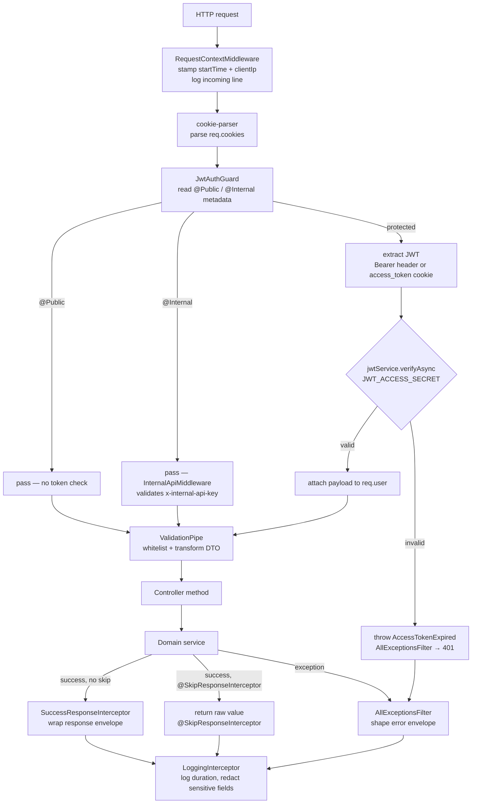

---

## MongoDB Schemas

### User — `src/models/user.schema.ts`

Collection: `users`

| Field | Type | Notes |
| --- | --- | --- |
| `name` | String | required, 2–100 chars |
| `email` | String | required, unique, lowercase, indexed |
| `avatar` | String \| null | auto-set to `/v1/avatar?name=…` on pre-save if absent |
| `provider` | `local` \| `github` | default `local` |
| `providerUserId` | String \| null | unique sparse index |
| `isEmailVerified` | Boolean | default `false` |
| `lastLoginAt` | Date \| null | |
| `password` | String | optional, `select: false`, min 8 chars |
| `createdAt` | Date | timestamps |
| `updatedAt` | Date | timestamps |

Indexes: `email` (unique), `providerUserId` (unique sparse), `createdAt desc`

### ShortUrl — `src/models/short-url.schema.ts`

Collection: `short_urls`

| Field | Type | Notes |
| --- | --- | --- |
| `userId` | ObjectId | ref User, indexed |
| `requestBodyHash` | String \| null | SHA-256 of request body, duplicate guard |
| `longUrl` | String | required |
| `alias` | String | required, unique, 3–32 chars, lowercase |
| `status` | `active` \| `disabled` | default `active` |
| `clicksPersisted` | Number | flushed from Redis by cron |
| `lastClickedAt` | Date \| null | |
| `createdAt` / `updatedAt` | Date | timestamps |

Compound indexes: `(userId, createdAt desc)`, `(userId, status, _id desc)`,
`(alias, status)`, `(userId, requestBodyHash, status)`

### Barcode — `src/models/barcode.schema.ts`

Collection: `barcodes`

| Field | Type | Notes |
| --- | --- | --- |
| `userId` | ObjectId | ref User, indexed |
| `format` | BarcodeFormat | indexed |
| `content` | String | normalized per format, max 256 chars |
| `barWidth` / `height` / `margin` | Number | rendering controls |
| `barColor` / `backgroundColor` | String | lowercased by service |
| `showValue` | Boolean | controls human-readable text |
| `requestBodyHash` | String \| null | duplicate guard, cleared on delete |
| `svg` | String | rendered barcode SVG |
| `status` | `active` \| `deleted` | soft-delete flag |
| `downloadCounts` | Object | `{ svg, png }` |
| `totalDownloads` | Number | incremented on download |
| `lastDownloadType` / `lastDownloadedAt` | String / Date | latest export metadata |

Indexes: `(userId, createdAt desc)`, `(userId, format, createdAt desc)`,
`(userId, status, createdAt desc)`, unique partial `(userId, requestBodyHash)`.

### BulkBarcode — `src/models/bulk-barcode.schema.ts`

Collection: `bulk_barcodes`

| Field | Type | Notes |
| --- | --- | --- |
| `userId` | ObjectId | ref User, indexed |
| `fileName` | String | upload name or auto-generated label |
| `totalRows` / `generatedCount` / `failedCount` | Number | batch totals |
| `downloadCounts` | Object | `{ zip, pdf }` |
| `totalDownloads` | Number | incremented on export |
| `status` | `completed` \| `deleted` | soft-delete flag |
| `items` | Array | embedded row, content, format, label, svg |
| `deletedAt` | Date \| null | set on delete |

Index: `(userId, status, createdAt desc)`.

### LinkExpander — `src/models/link-expander.schema.ts`

Collection: `link_expanders`

| Field | Type | Notes |
| --- | --- | --- |
| `userId` | ObjectId | ref User, indexed |
| `url` | String | normalized source URL |
| `destinationUrl` | String | final URL or source URL on failure |
| `status` | `success` \| `failed` \| `deleted` | lookup state |
| `redirectCount` | Number | followed redirect count |
| `errorMessage` | String \| null | populated for failed lookups |

Indexes: `(userId, status, _id desc)`, unique partial `(userId, url)` for
non-deleted lookups.

### BrokenLinkChecker — `src/models/broken-link-checker.schema.ts`

Collection: `broken_link_checks`

| Field | Type | Notes |
| --- | --- | --- |
| `userId` | ObjectId | ref User, indexed |
| `url` / `finalUrl` | String | normalized source and final URL |
| `statusCode` | Number \| null | target response status |
| `status` | `working` \| `broken` \| `deleted` | check state |
| `isBroken` / `isUnsafe` | Boolean | dashboard filters |
| `safetyStatus` | `no_known_threat` \| `unsafe` \| `unchecked` | reputation result |
| `safetyProvider` | String \| null | e.g. Google Safe Browsing/local policy |
| `threatTypes` | String[] | external or local threat labels |
| `contentType` / `contentLength` / `contentDisposition` | Mixed | response metadata |
| `errorMessage` | String \| null | network or status failure reason |
| `redirectCount` | Number | followed redirect count |

Indexes: `(userId, status, _id desc)`, `(userId, safetyStatus, _id desc)`,
`(userId, createdAt desc)`.

### OneTimeLink — `src/models/one-time-link.schema.ts`

Collection: `one_time_links`

| Field | Type | Notes |
| --- | --- | --- |
| `userId` | ObjectId | ref User, indexed |
| `originalUrl` | String | normalized destination |
| `alias` | String | unique, lowercase, 3–32 chars |
| `status` | `active` \| `used` \| `deleted` | consumption state |
| `passwordProtected` | Boolean | whether password is required |
| `passwordHash` | String \| null | bcrypt hash for protected links |
| `usedAt` / `deletedAt` | Date \| null | lifecycle timestamps |

Indexes: `(userId, createdAt desc)`, `(userId, status, _id desc)`,
`(alias, status)`.

---

## Redis Key Patterns

| Key | Type | Purpose |
| --- | --- | --- |
| `signup:lock:{email}` | String | one-signup-at-a-time lock with TTL |
| `signup:session:{sessionId}` | Hash | full signup session fields |
| `fp:lock:{email}` | String | forgot-password in-progress lock |
| `fp:session:{sessionId}` | Hash | full forgot-password session fields |
| `short-url:lookup:{alias}` | String (JSON) | redirect cache entry |
| `short-url:analytics:{alias}` | Hash | `count` + `lastClickedAt` |

---

## Auth Endpoints

All endpoints live under `POST /v1/auth/…` on `AuthController`.

| Method | Route | Guard | Cookie in | Cookie out |
| --- | --- | --- | --- | --- |
| POST | `/v1/auth/signup` | `@Public` | — | `signup_session` |
| POST | `/v1/auth/verify-otp` | `@Public` | `signup_session` | clears `signup_session`, sets `access_token` + `refresh_token` |
| POST | `/v1/auth/resend-otp` | `@Public` | `signup_session` or `forgot_password_session` | — |
| POST | `/v1/auth/session` | `@Public` | `signup_session` or `forgot_password_session` | — |
| POST | `/v1/auth/login` | `@Public` | — | `access_token` + `refresh_token` |
| POST | `/v1/auth/logout` | `@Public` | — | clears all auth + flow cookies |
| POST | `/v1/auth/getUser` | protected | `access_token` (cookie or Bearer) | — |
| POST | `/v1/auth/refresh-token` | `@Public` | `refresh_token` cookie or body | `access_token` |
| POST | `/v1/auth/forgot-password` | `@Public` | — | `forgot_password_session` |
| POST | `/v1/auth/forgot-password/verify-otp` | `@Public` | `forgot_password_session` | clears `forgot_password_session` |
| POST | `/v1/auth/forgot-password/validate-reset-token` | `@Public` | — | — |
| POST | `/v1/auth/forgot-password/reset-password` | `@Public` | — | — |
| POST | `/v1/auth/oauth/github/exchange` | `@Public` + `@SkipResponseInterceptor` | — | — (tokens returned in body) |

---

## Signup Flow

Services: `SignupFlowService`, `TokenService`, `NotificationService`
Redis: `signup:lock:{email}` (String), `signup:session:{sessionId}` (Hash)
MongoDB: `users`
SQS: `VERIFY_EMAIL`, `WELCOME_EMAIL`

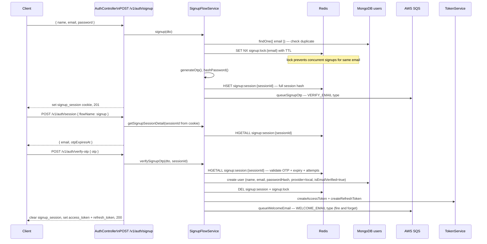

---

## Login Flow

Services: `AuthService`, `TokenService`
MongoDB: `users`

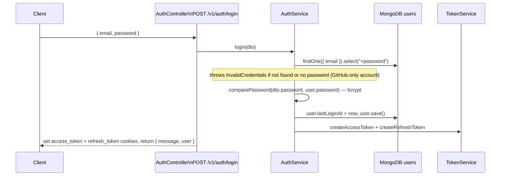

---

## Get Current User / Token Refresh / Logout

Services: `AuthService`, `TokenService`
MongoDB: `users`

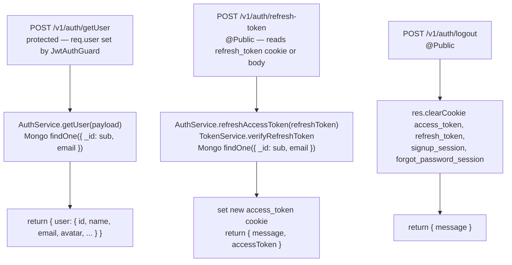

---

## Forgot Password Flow

Services: `ForgotPasswordFlowService`, `TokenService`, `NotificationService`
Redis: `fp:lock:{email}` (String), `fp:session:{sessionId}` (Hash)
MongoDB: `users`
SQS: `FORGOT_PASSWORD`, `RESET_PASSWORD`, `RESET_PASSWORD` (password-changed)

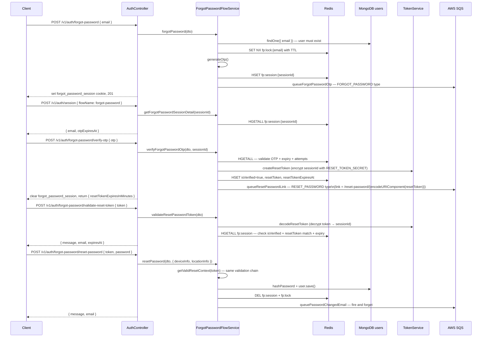

---

## GitHub OAuth Exchange

Service: `AuthService`
MongoDB: `users`
SQS: `WELCOME_EMAIL` (new users only)

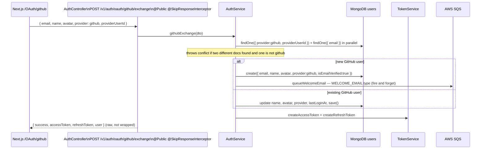

---

## Implemented Feature Controller Logic and Data Flow

This section tracks every controller-backed feature that exists in the server
today. The common pre-controller path for protected routes is:

1. `RequestContextMiddleware` adds request timing and client IP metadata.
2. `JwtAuthGuard` verifies `Authorization: Bearer ...` or `access_token`.
3. `ValidationPipe` validates and transforms DTO/query values.
4. The controller checks `req.user` where needed and calls its service.
5. The service re-checks that the authenticated user still exists in MongoDB.
6. Domain exceptions flow to `AllExceptionsFilter`; successful JSON responses
   are wrapped by `SuccessResponseInterceptor` unless explicitly skipped.

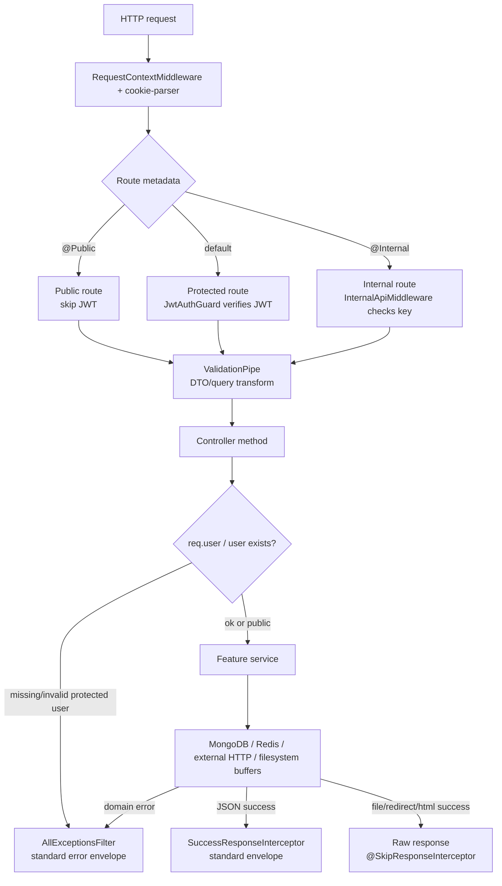

### AuthController — `/v1/auth`

Primary data stores: `users`, Redis signup/forgot-password sessions, AWS SQS.

#### Signup Flow

- User sends `POST /v1/auth/signup` with `name`, `email`, and `password`.
- Request passes through `RequestContextMiddleware`, cookie parser, `JwtAuthGuard`
  public-route check, and `ValidationPipe`.
- DTO validation checks required fields, email format, and password rules.
- `AuthController.signup` calls `SignupFlowService.signup`.
- Service checks MongoDB `users` collection for the same email.
- If user already exists, service throws a duplicate signup/auth exception.
- If user does not exist, service creates a Redis lock key
  `signup:lock:{email}` with `SET NX` so the same email cannot start parallel
  signup flows.
- Service hashes the password, generates OTP and session id, then stores the
  pending signup data in Redis hash `signup:session:{sessionId}`.
- Service sends verify-email OTP payload to SQS through `NotificationService`.
- Controller sets `signup_session` HTTP-only cookie and returns success.

#### Verify Signup OTP Flow

- User sends `POST /v1/auth/verify-otp` with OTP and existing
  `signup_session` cookie.
- Request passes through middleware, public guard path, and DTO validation.
- Controller reads `signup_session` cookie and calls
  `SignupFlowService.verifySignupOtp`.
- Service reads Redis hash `signup:session:{sessionId}`.
- Service checks session exists, OTP matches, OTP is not expired, and attempts
  are still allowed.
- If verification fails, service updates/uses attempt state and throws the
  matching OTP/session exception.
- If verification passes, service creates the user in MongoDB with verified
  email and local provider.
- Service deletes `signup:session:{sessionId}` and `signup:lock:{email}` from
  Redis.
- Service creates access and refresh tokens through `TokenService`.
- Service queues welcome email through SQS.
- Controller clears `signup_session`, sets `access_token` and `refresh_token`,
  and returns the logged-in user response.

#### Login Flow

- User sends `POST /v1/auth/login` with email and password.
- Request passes through middleware, public guard path, and DTO validation.
- Controller calls `AuthService.login`.
- Service queries MongoDB `users` by email and explicitly selects password.
- Service rejects missing users, GitHub-only users without password, and invalid
  bcrypt password comparison.
- If credentials are valid, service updates `lastLoginAt`.
- Service creates access and refresh tokens.
- Controller sets auth cookies and returns user data.

#### Forgot Password Flow

- User sends `POST /v1/auth/forgot-password` with email.
- Request passes through middleware, public guard path, and DTO validation.
- Controller calls `ForgotPasswordFlowService.forgotPassword`.
- Service checks MongoDB `users` for the email.
- If user exists, service creates Redis lock `fp:lock:{email}` with `SET NX`.
- Service generates OTP/session id and stores Redis hash
  `fp:session:{sessionId}`.
- Service queues forgot-password OTP email through SQS.
- Controller sets `forgot_password_session` cookie.

#### Forgot Password OTP and Reset Flow

- User sends `POST /v1/auth/forgot-password/verify-otp` with OTP and
  `forgot_password_session` cookie.
- Service reads `fp:session:{sessionId}` from Redis and checks OTP, expiry, and
  attempts.
- Service creates encrypted reset token with `TokenService`, stores token and
  expiry back into Redis, and queues reset-link email.
- Controller clears `forgot_password_session`.
- User sends `POST /v1/auth/forgot-password/validate-reset-token` with token.
- Service decrypts token, loads Redis session, and checks verified flag, token
  match, and reset-token expiry.
- User sends `POST /v1/auth/forgot-password/reset-password` with token and new
  password.
- Service repeats reset-token validation, hashes new password, updates MongoDB
  user password, deletes Redis session and lock, and queues password-changed
  email.

#### Refresh, Get User, Logout, and GitHub OAuth Flow

- `getUser` request passes protected guard, then service confirms token subject
  still exists in MongoDB before returning profile data.
- `refresh-token` request reads refresh token from cookie/body, verifies it,
  checks MongoDB user existence, creates a new access token, and sets cookie.
- `logout` request clears access, refresh, signup, and forgot-password cookies;
  it is safe when cookies are already missing.
- GitHub exchange request is public and raw; service matches provider id/email
  in MongoDB, creates or updates GitHub user, queues welcome email for new users,
  then returns access and refresh tokens to the Next.js handler.

| Endpoint | Controller flow | Service/data flow | Handled edges |
| --- | --- | --- | --- |
| `POST /signup` | Public DTO validation, create signup session, set `signup_session` cookie | Check duplicate email, take Redis `signup:lock:{email}`, hash password, store OTP session hash, enqueue verify email | Existing email, concurrent signup lock, email queue failures handled as domain/service errors |
| `POST /verify-otp` | Read `signup_session`, verify OTP, clear flow cookie, set access/refresh cookies | Load Redis session, check OTP/expiry/attempts, create verified local user, delete session and lock, enqueue welcome email | Missing session cookie, expired OTP, exhausted attempts, duplicate user race |
| `POST /resend-otp` | Use requested flow and active flow cookie | Refresh OTP/session expiry and enqueue the matching OTP email | Unsupported flow, missing/expired session |
| `POST /session` | Use `flowName` to read signup or forgot-password session details | Return safe session metadata such as email and expiry | Missing or invalid session id |
| `POST /login` | Public login DTO, set access/refresh cookies | Find user with password selected, bcrypt compare, update `lastLoginAt`, issue tokens | Unknown email, GitHub-only user without password, bad password |
| `POST /getUser` | Protected route reads `req.user` | Find user by token subject/email and serialize safe profile | Expired token, user deleted after token issue |
| `POST /refresh-token` | Read cookie or body token, set new access cookie | Verify refresh token, confirm user still exists, create access token | Missing/invalid refresh token, deleted user |
| `POST /logout` | Public route clears auth and flow cookies | No persistence change | Idempotent even when cookies are absent |
| `POST /forgot-password` | Public DTO validation, set `forgot_password_session` cookie | Confirm user exists, take Redis `fp:lock:{email}`, create OTP session, enqueue email | Unknown email, concurrent flow lock |
| `POST /forgot-password/verify-otp` | Read forgot-password cookie, clear it after OTP success | Validate OTP/session, create encrypted reset token, store token fields in Redis, enqueue reset link | Missing cookie, expired OTP, exhausted attempts |
| `POST /forgot-password/validate-reset-token` | Public token validation | Decode token to session id, compare stored token, expiry, and verified flag | Tampered token, expired token, consumed/deleted session |
| `POST /forgot-password/reset-password` | Public reset DTO | Revalidate reset token, hash new password, save user, delete Redis session/lock, enqueue changed email | Invalid token, missing user, expired session |
| `POST /oauth/github/exchange` | Public raw response for NextAuth exchange | Match by GitHub provider id and/or email, create or update GitHub user, issue access and refresh tokens | Local/GitHub account conflict, missing provider identity |

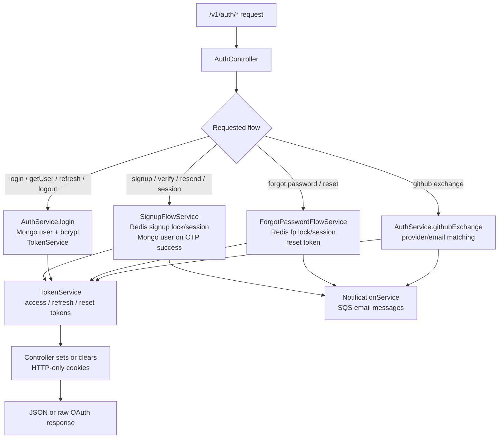

### BulkBarcodeGeneratorController — `/v1/bulk-barcodes`

Primary data store: `bulk_barcodes`. Upload parsing supports `.csv`, `.xlsx`,
and `.json`; exports are ZIP or PDF buffers.

#### Generate Bulk Barcode Flow

- User sends `POST /v1/bulk-barcodes` with either auto-generation fields or
  uploaded `bulkFile`.
- Request passes through middleware, JWT guard, multipart file interceptor, and
  DTO validation.
- Controller checks authenticated user and calls `BulkBarcodeGeneratorService.generate`.
- Service checks MongoDB `users` for authenticated user existence.
- Service chooses mode: `auto` when no upload is needed, or `upload` when file is
  provided/requested.
- In auto mode, service builds rows from requested format and count.
- In upload mode, service validates file exists, size is within limit, and file
  name has exactly one allowed extension.
- Parser reads CSV, JSON, or XLSX into row objects.
- Service checks min/max row count, required fields, supported formats,
  duplicate format/content rows, and format-specific content rules.
- If any row validation fails, service returns a structured validation error.
- Service renders SVG for every valid row.
- Service creates completed MongoDB `bulk_barcodes` document with embedded items.
- Controller returns generated/failed counts and batch metadata.

#### Bulk Barcode List, Analytics, Template, Download, and Delete Flow

- User sends protected list/analytics/activity/export-mix/delete/download
  request, or public raw template download request.
- Protected requests pass middleware, JWT guard, and query validation.
- Service confirms MongoDB user exists and scopes all records by `userId`.
- List returns non-deleted batches with pagination.
- Analytics and activity aggregate MongoDB batch counts, generated rows, and
  download totals.
- Template download builds CSV, JSON, or XLSX template in memory and returns raw
  attachment.
- Batch download confirms owner and non-deleted status, builds ZIP or PDF export,
  increments MongoDB download counters, and returns raw attachment.
- Delete confirms owner and soft-deletes batch by setting status and `deletedAt`.

| Endpoint | Controller flow | Service/data flow | Handled edges |
| --- | --- | --- | --- |
| `POST /` | Protected multipart route with `bulkFile` limit | Choose auto or upload mode, validate file extension/size, parse rows, validate row count/content/duplicates, render SVGs, persist completed batch | Missing upload file, double extensions, over 5 MB, invalid headers, invalid JSON/XLSX, min/max row violations, duplicate row content |
| `GET /` | Protected pagination | List non-deleted batches by owner | Empty list |
| `GET /analytics` | Protected | Count batches, generated rows, uploaded rows, downloads | Zero-data analytics |
| `GET /analytics/activity/:period/:date` | Protected | Aggregate batch creation over week/month/year and compare previous period | Invalid period/date |
| `GET /analytics/export-mix` | Protected | Aggregate ZIP/PDF download counters and percentages | Percentages return `0` when total is zero |
| `GET /templates/:type` | Raw template download | Build CSV, JSON, or XLSX template in memory | Invalid template type |
| `DELETE /:id` | Protected | Confirm owner, soft-delete batch | Invalid id, not found, access denied |
| `GET /:id/download?type=zip|pdf` | Protected raw download | Confirm owner, build export, increment download counters and last download metadata | Invalid download type, export build errors |

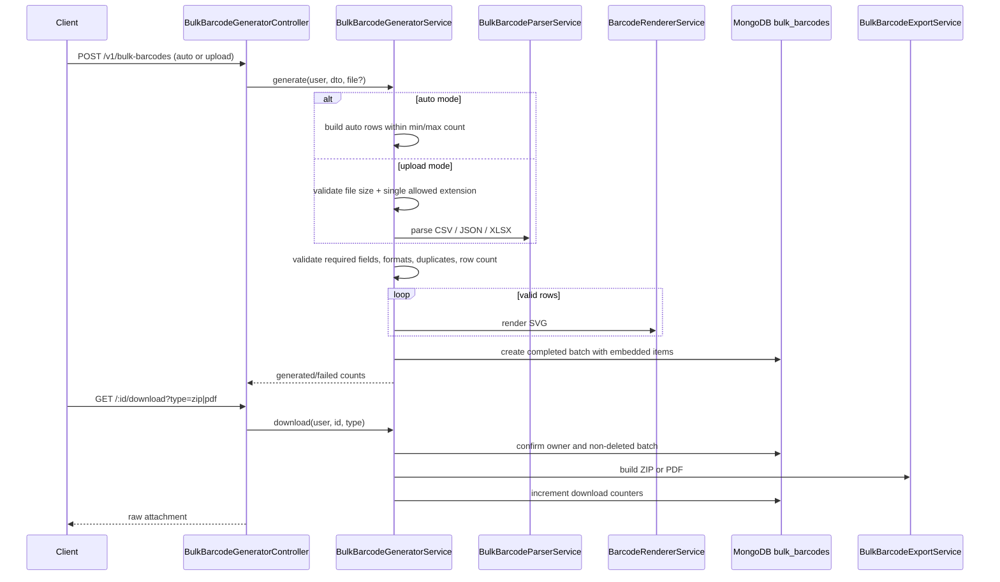

### LinkExpanderController — `/v1/link-expanders`

Primary data store: `link_expanders`. External network calls use manual redirect
following with timeout and public-destination checks.

#### Expand Link Flow

- User sends `POST /v1/link-expanders` with URL.
- Request passes through request middleware, JWT guard, and DTO validation.
- Controller checks authenticated user and calls `LinkExpanderService.expandLink`.
- Service checks MongoDB `users` for authenticated user existence.
- Service normalizes URL and requires HTTP/HTTPS style URL.
- Service checks MongoDB `link_expanders` for same user and same non-deleted URL.
- If duplicate exists, service throws duplicate request exception.
- Service checks destination host and DNS results to block localhost, private IP,
  link-local, and internal network targets.
- Service sends `HEAD` request with manual redirect handling and timeout.
- If target returns `405`, service retries with `GET`.
- If redirect response contains `Location`, service resolves next URL and repeats
  public-destination checks until final URL or max redirect count.
- Service saves success or failed lookup in MongoDB with destination URL,
  redirect count, and error message.
- If lookup failed, service throws expansion failure after saving the failed
  record so analytics/history still show the attempt.
- Controller returns expanded link on success.

#### Link Expander List, Analytics, and Delete Flow

- User sends protected list, analytics, or delete request.
- Request passes through middleware, guard, and query/id validation.
- Controller checks authenticated user and calls service.
- Service checks MongoDB user existence.
- List reads non-deleted `link_expanders` records scoped by `userId`.
- Analytics counts total non-deleted lookups, failed lookups, and redirect sum.
- Delete converts id, checks record exists, checks ownership, and soft-deletes
  by setting status to `deleted`.

| Endpoint | Controller flow | Service/data flow | Handled edges |
| --- | --- | --- | --- |
| `POST /` | Protected expand DTO | Normalize HTTP URL, block duplicate non-deleted request, follow redirects with `HEAD` then `GET` fallback, persist success or failed lookup | Private/localhost/link-local destinations blocked, max redirects returns failed status, timeout/fetch errors recorded, failed lookup is saved then returned as domain failure |
| `GET /` | Protected pagination | Cursor/page list of non-deleted lookups | Invalid cursor |
| `GET /analytics` | Protected | Count lookups, sum redirect counts, count failed records | Zero-data analytics |
| `DELETE /:id` | Protected | Confirm owner, soft-delete lookup | Invalid id, not found, access denied |

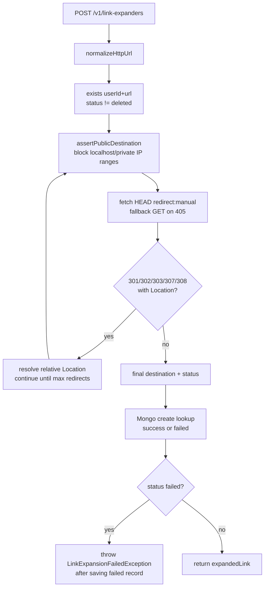

### BrokenLinkCheckerController — `/v1/broken-link-checkers`

Primary data store: `broken_link_checks`. Optional external reputation check uses
Google Safe Browsing when `GOOGLE_SAFE_BROWSING_API_KEY` is configured.

#### Check Broken Link Flow

- User sends `POST /v1/broken-link-checkers` with URL.
- Request passes through middleware, JWT guard, and DTO validation.
- Controller checks authenticated user and calls
  `BrokenLinkCheckerService.checkLink`.
- Service checks MongoDB `users` for authenticated user existence.
- Service normalizes URL and blocks private/internal destinations using hostname,
  IP, and DNS resolution checks.
- Service sends `HEAD` request with manual redirect handling and timeout.
- If target returns `405`, service retries with ranged `GET` so it does not
  download the full body.
- Service follows redirects until final URL or max redirect count.
- Service marks link broken when final response is not OK, max redirects are hit,
  or network/probe fails.
- Service captures status code, content type, content length,
  content-disposition, redirect count, and error message.
- If Google Safe Browsing key exists, service checks original and final URLs.
- Service also applies local unsafe-download rules using file extension,
  content type, and attachment disposition.
- Service creates MongoDB `broken_link_checks` record with health and safety
  result.
- Controller returns working, broken, or unsafe check result.

#### Broken Link List, Analytics, and Delete Flow

- User sends protected list, analytics, or delete request.
- Request passes through middleware, guard, and query/id validation.
- Service confirms MongoDB user exists.
- List reads non-deleted checks scoped by user with pagination/cursor support.
- Analytics counts checked, working, broken, and unsafe records.
- Delete converts id, checks record exists, checks ownership, and soft-deletes by
  setting status to `deleted`.

| Endpoint | Controller flow | Service/data flow | Handled edges |
| --- | --- | --- | --- |
| `POST /` | Protected check DTO | Normalize URL, follow redirects with HEAD/GET, capture status/content metadata, inspect Safe Browsing and local download-risk rules, persist result | Private destinations blocked, max redirects returns broken 508, timeout/fetch errors become broken result, Safe Browsing failure downgrades to `unchecked` |
| `GET /` | Protected pagination | Cursor/page list of non-deleted checks | Invalid cursor |
| `GET /analytics` | Protected | Count checked, working, broken, unsafe records | Zero-data analytics |
| `DELETE /:id` | Protected | Confirm owner, soft-delete check | Invalid id, not found, access denied |

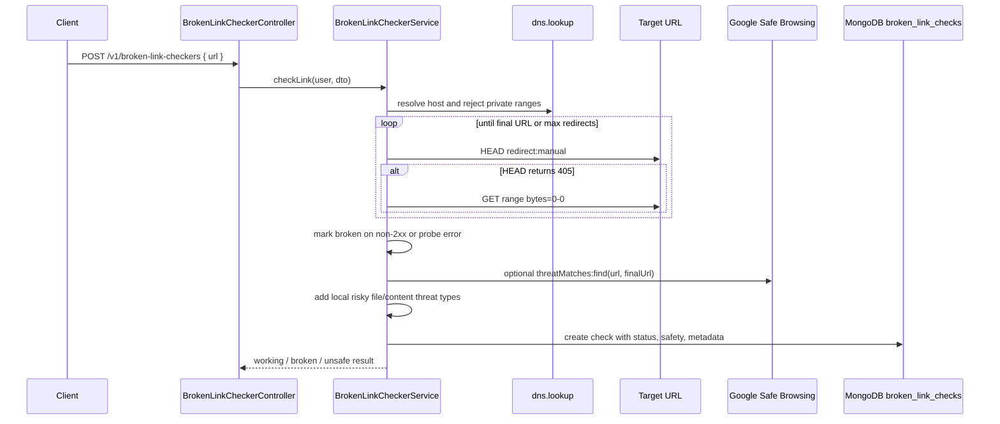

### AvatarController — `/v1/avatar`

Primary output: generated SVG, no persistence on the endpoint itself.

#### Avatar Flow

- Browser or saved user avatar URL sends `GET /v1/avatar?name=...`.
- Request passes through middleware and public guard path.
- Controller validates name query and calls `AvatarService`.
- Service derives initials from one-word or multi-word names.
- Service hashes the name to choose a stable background color.
- Service escapes SVG text values and builds SVG.
- Controller sets SVG content type and public cache header, then returns raw SVG.

| Endpoint | Controller flow | Service/data flow | Handled edges |
| --- | --- | --- | --- |
| `GET /v1/avatar?name=...` | Public raw SVG route | Validate query, derive initials, hash name into stable palette, escape SVG text, set `image/svg+xml` and cache headers | Missing/blank names, SVG escaping |

### RedisStringController and RedisHashController — `/v1/redis/*`

Primary store: Redis. These routes are public to the JWT guard but protected by
`@Internal()` and `InternalApiMiddleware`.

#### Internal Redis Flow

- Internal caller sends request to `/v1/redis/string/*` or `/v1/redis/hash/*`
  with `x-internal-api-key`.
- Request passes through middleware and public/internal guard metadata.
- `InternalApiMiddleware` compares header value with `INTERNAL_API_KEY`.
- If key is missing or invalid, middleware rejects request before controller
  logic.
- String controller creates, reads, updates, patches, expires, renames, or
  deletes Redis string keys.
- Hash controller creates, reads, updates, patches, expires, renames, or deletes
  Redis hash keys and fields.
- Raw endpoints return unparsed Redis values; normal endpoints parse stored JSON
  values when possible.
- Controllers return operation result through standard success envelope.

| Controller | Data flow | Handled edges |
| --- | --- | --- |
| `RedisStringController` | Create/get/update/patch/expire/rename/delete string keys, optionally parse JSON values and preserve TTL on update | Missing internal key, invalid TTL/key operation, raw vs parsed value variants |
| `RedisHashController` | Create/get/update/patch/delete hash fields, set expiry, rename hashes, return raw or parsed fields | Missing internal key, field-level patch/delete semantics, existence and TTL checks |

---

## Avatar

Controller: `AvatarController` at `GET /v1/avatar`
Decorator: `@Public()`
Service: `AvatarService`

When a user is created without an explicit avatar, the `User` pre-save hook sets
`avatar = BACKEND_URL/v1/avatar?name={encodedName}`. The avatar endpoint derives
initials from the name, picks a stable background color using a hash of the name,
and returns an SVG with `Cache-Control: public, max-age=86400`.

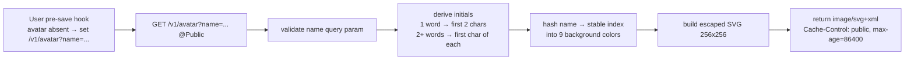

---

## Email Delivery

Service: `NotificationService` → `SqsService` → AWS SQS → Lambda → Nodemailer

`NotificationService` renders an HTML template using `renderTemplate` (string
interpolation), then calls `SqsService.sendMail` which puts a JSON message onto
the configured SQS queue. A Lambda function polls the queue, receives a batch,
and sends each message via Nodemailer SMTP.

| Email type | SQS `type` field | Trigger |
| --- | --- | --- |
| Signup OTP | `VERIFY_EMAIL` | `SignupFlowService.signup` |
| Welcome | `WELCOME_EMAIL` | `SignupFlowService.verifySignupOtp`, `AuthService.githubExchange` |
| Forgot password OTP | `FORGOT_PASSWORD` | `ForgotPasswordFlowService.forgotPassword` |
| Reset password link | `RESET_PASSWORD` | `ForgotPasswordFlowService.verifyForgotPasswordOtp` |
| Password changed | `RESET_PASSWORD` | `ForgotPasswordFlowService.resetPassword` |

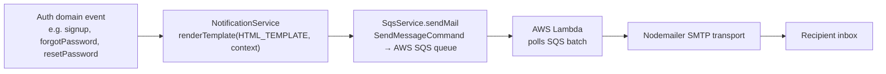

---

## Internal Redis API

Controllers: `RedisStringController` at `/v1/redis/string`,
`RedisHashController` at `/v1/redis/hash`
Decorators: `@Public()` + `@Internal()` — `InternalApiMiddleware` validates
`x-internal-api-key` header against `INTERNAL_API_KEY` env var

### String operations (`/v1/redis/string`)

| Method | Route | Operation |
| --- | --- | --- |
| POST | `/v1/redis/string` | create (SET with optional TTL) |
| POST | `/v1/redis/string/nx` | create if not exists (SET NX) |
| GET | `/v1/redis/string/:key` | get (parsed JSON) |
| GET | `/v1/redis/string/:key/raw` | get raw string |
| GET | `/v1/redis/string/:key/exists` | check existence |
| GET | `/v1/redis/string/:key/ttl` | get TTL |
| PUT | `/v1/redis/string` | update (SET, optional preserve TTL) |
| PATCH | `/v1/redis/string/fields` | update fields (partial JSON merge) |
| PATCH | `/v1/redis/string/expire` | set TTL |
| PATCH | `/v1/redis/string/rename` | rename key |
| DELETE | `/v1/redis/string/:key` | delete |

### Hash operations (`/v1/redis/hash`)

| Method | Route | Operation |
| --- | --- | --- |
| POST | `/v1/redis/hash` | create (HSET with optional TTL) |
| POST | `/v1/redis/hash/nx` | create if not exists |
| GET | `/v1/redis/hash/:key` | get all fields (parsed) |
| GET | `/v1/redis/hash/:key/raw` | get raw fields |
| GET | `/v1/redis/hash/:key/exists` | check existence |
| GET | `/v1/redis/hash/:key/ttl` | get TTL |
| PUT | `/v1/redis/hash` | full replace |
| PATCH | `/v1/redis/hash/fields` | update specific fields |
| PATCH | `/v1/redis/hash/fields/delete` | delete specific fields |
| PATCH | `/v1/redis/hash/expire` | set TTL |
| PATCH | `/v1/redis/hash/rename` | rename key |
| DELETE | `/v1/redis/hash/:key` | delete |

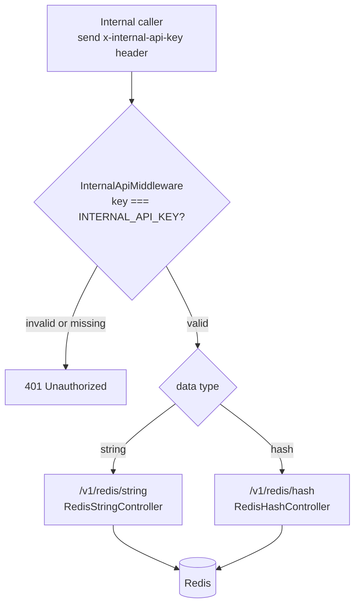

---

## Unimplemented Features

These advertised tools have no NestJS controller, service, schema, or route.
Each will need at minimum: DTO, controller, service, persistence layer,
security rules, and tests before the client can wire real API calls.

| Feature | Suggested module path |
| --- | --- |
| QR Code Generator | `src/modules/features/qr-generator/` |
| QR Code Scanner | `src/modules/features/qr-scanner/` |
| Dynamic QR Generator | `src/modules/features/dynamic-qr/` |
| Barcode Decoder | `src/modules/features/barcode-decoder/` |
| DNS and Domain Checker | `src/modules/features/dns-checker/` |
