# LinkLab Server Architecture

## Project

The LinkLab server is a NestJS API that currently provides:

- Local signup, OTP verification, login, logout, and JWT refresh
- Forgot-password OTP and reset-link workflows
- GitHub account exchange from the NextAuth client
- Authenticated URL creation, management, redirect resolution, and analytics
- Generated SVG avatars
- Internal Redis string and hash management endpoints
- Asynchronous transactional email through AWS SQS and a Lambda mail worker
- Cron-triggered persistence of URL click analytics

MongoDB stores durable users and short URLs. Redis stores temporary auth
sessions, locks, redirect cache entries, and pending click analytics.

## Current Feature Coverage

| Product feature        | Server status                  |
| ---------------------- | ------------------------------ |
| Authentication         | Implemented                    |
| URL Shortener          | Implemented                    |
| Avatar generation      | Implemented supporting feature |
| QR Code Generator      | No server module               |
| QR Code Scanner        | No server module               |
| Dynamic QR Generator   | No server module               |
| Link Expander          | No server module               |
| Broken Link Checker    | No server module               |
| Barcode Generator      | Implemented                    |
| Barcode Decoder        | No server module               |
| DNS and Domain Checker | No server module               |
| One-Time Links         | No server module               |

---

## System Architecture

Every HTTP request enters through `RequestContextMiddleware`, which stamps a
`startTime` and `clientIp` on the request object and logs the incoming line.
Cookie parsing (`cookie-parser`) runs as Express middleware registered in
`main.ts`.

The global `JwtAuthGuard` then inspects route metadata set by the `@Public`,
`@Internal`, and default-protected decorators:

- `@Public()` — guard passes immediately, no token check
- `@Internal()` — guard passes immediately; `InternalApiMiddleware` on those
  routes separately validates the `x-internal-api-key` header
- default (protected) — guard extracts the JWT from the `Authorization: Bearer`
  header or the `access_token` cookie, verifies it with `JWT_ACCESS_SECRET`,
  and attaches the payload as `req.user`

After the guard, the global `ValidationPipe` transforms and validates DTOs with
`class-validator`. On success, `SuccessResponseInterceptor` wraps the controller
return value in a standard envelope (`success`, `statusCode`, `message`, `data`,
`timeStamp`, `path`). Routes decorated with `@SkipResponseInterceptor()` bypass
this wrapping (used by the health check, redirect, and GitHub exchange endpoints).
`LoggingInterceptor` logs every request and response duration and redacts
sensitive fields. `AllExceptionsFilter` catches everything not handled upstream
and shapes it into the standard error envelope.

Files:
- `src/main.ts` — bootstrap, CORS, cookie-parser, ValidationPipe
- `src/app.module.ts` — global filter, guard, interceptors, middleware binding
- `src/middleware/request-context.middleware.ts`
- `src/middleware/internal-api.middleware.ts`
- `src/guards/jwt-auth.guard.ts`
- `src/filters/all-exceptions.filter.ts`
- `src/interceptors/logging.interceptor.ts`
- `src/interceptors/success-response.interceptor.ts`
- `src/decorators/public.decorator.ts`
- `src/decorators/internal.decorator.ts`
- `src/decorators/skip-success-interceptor.decorator.ts`

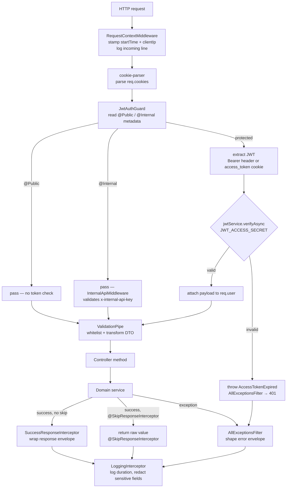

---

## MongoDB Schemas

### User — `src/models/user.schema.ts`

Collection: `users`

| Field | Type | Notes |
| --- | --- | --- |
| `name` | String | required, 2–100 chars |
| `email` | String | required, unique, lowercase, indexed |
| `avatar` | String \| null | auto-set to `/v1/avatar?name=…` on pre-save if absent |
| `provider` | `local` \| `github` | default `local` |
| `providerUserId` | String \| null | unique sparse index |
| `isEmailVerified` | Boolean | default `false` |
| `lastLoginAt` | Date \| null | |
| `password` | String | optional, `select: false`, min 8 chars |
| `createdAt` | Date | timestamps |
| `updatedAt` | Date | timestamps |

Indexes: `email` (unique), `providerUserId` (unique sparse), `createdAt desc`

### ShortUrl — `src/models/short-url.schema.ts`

Collection: `short_urls`

| Field | Type | Notes |
| --- | --- | --- |
| `userId` | ObjectId | ref User, indexed |
| `requestBodyHash` | String \| null | SHA-256 of request body, duplicate guard |
| `longUrl` | String | required |
| `alias` | String | required, unique, 3–32 chars, lowercase |
| `status` | `active` \| `disabled` | default `active` |
| `clicksPersisted` | Number | flushed from Redis by cron |
| `lastClickedAt` | Date \| null | |
| `createdAt` / `updatedAt` | Date | timestamps |

Compound indexes: `(userId, createdAt desc)`, `(userId, status, _id desc)`,
`(alias, status)`, `(userId, requestBodyHash, status)`

---

## Redis Key Patterns

| Key | Type | Purpose |
| --- | --- | --- |
| `signup:lock:{email}` | String | one-signup-at-a-time lock with TTL |
| `signup:session:{sessionId}` | Hash | full signup session fields |
| `fp:lock:{email}` | String | forgot-password in-progress lock |
| `fp:session:{sessionId}` | Hash | full forgot-password session fields |
| `short_url:lookup:{alias}` | String (JSON) | redirect cache entry |
| `short_url:analytics:{alias}` | Hash | `count` + `lastClickedAt` |

---

## Auth Endpoints

All endpoints live under `POST /v1/auth/…` on `AuthController`.

| Method | Route | Guard | Cookie in | Cookie out |
| --- | --- | --- | --- | --- |
| POST | `/v1/auth/signup` | `@Public` | — | `signup_session` |
| POST | `/v1/auth/verify-otp` | `@Public` | `signup_session` | clears `signup_session`, sets `access_token` + `refresh_token` |
| POST | `/v1/auth/resend-otp` | `@Public` | `signup_session` or `forgot_password_session` | — |
| POST | `/v1/auth/session` | `@Public` | `signup_session` or `forgot_password_session` | — |
| POST | `/v1/auth/login` | `@Public` | — | `access_token` + `refresh_token` |
| POST | `/v1/auth/logout` | `@Public` | — | clears all auth + flow cookies |
| POST | `/v1/auth/getUser` | protected | `access_token` (cookie or Bearer) | — |
| POST | `/v1/auth/refresh-token` | `@Public` | `refresh_token` cookie or body | `access_token` |
| POST | `/v1/auth/forgot-password` | `@Public` | — | `forgot_password_session` |
| POST | `/v1/auth/forgot-password/verify-otp` | `@Public` | `forgot_password_session` | clears `forgot_password_session` |
| POST | `/v1/auth/forgot-password/validate-reset-token` | `@Public` | — | — |
| POST | `/v1/auth/forgot-password/reset-password` | `@Public` | — | — |
| POST | `/v1/auth/oauth/github/exchange` | `@Public` + `@SkipResponseInterceptor` | — | — (tokens returned in body) |

---

## Signup Flow

Services: `SignupFlowService`, `TokenService`, `NotificationService`
Redis: `signup:lock:{email}` (String), `signup:session:{sessionId}` (Hash)
MongoDB: `users`
SQS: `VERIFY_EMAIL`, `WELCOME_EMAIL`

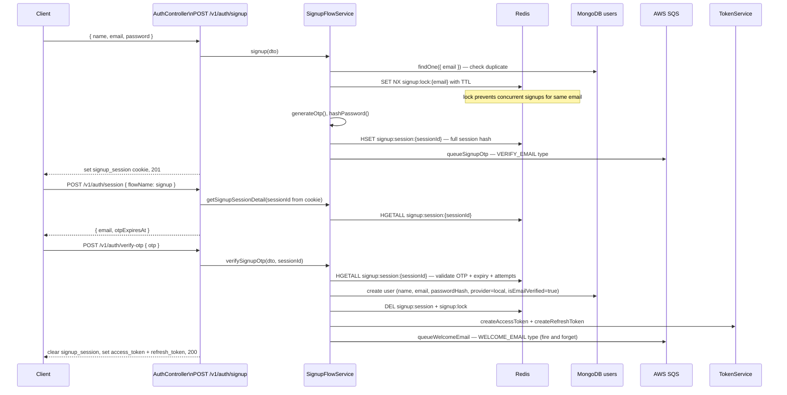

---

## Login Flow

Services: `AuthService`, `TokenService`
MongoDB: `users`

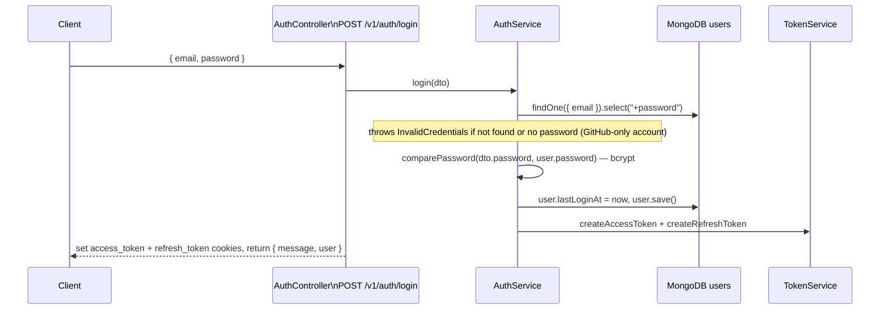

---

## Get Current User / Token Refresh / Logout

Services: `AuthService`, `TokenService`
MongoDB: `users`

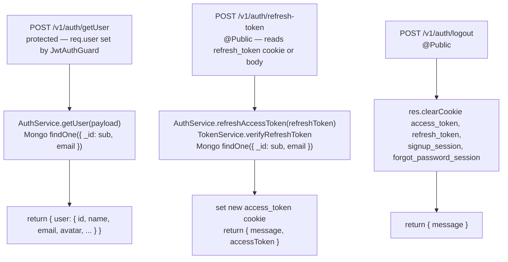

---

## Forgot Password Flow

Services: `ForgotPasswordFlowService`, `TokenService`, `NotificationService`
Redis: `fp:lock:{email}` (String), `fp:session:{sessionId}` (Hash)
MongoDB: `users`
SQS: `FORGOT_PASSWORD`, `RESET_PASSWORD`, `RESET_PASSWORD` (password-changed)

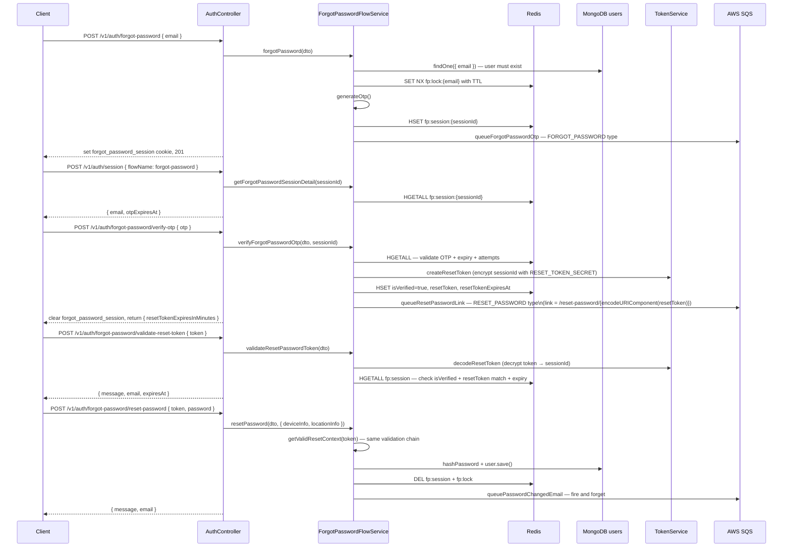

---

## GitHub OAuth Exchange

Service: `AuthService`
MongoDB: `users`
SQS: `WELCOME_EMAIL` (new users only)

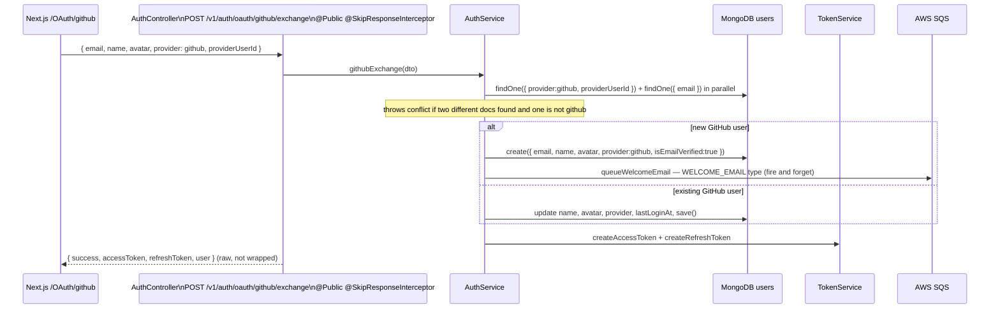

---

## URL Shortener — CRUD

Controller: `UrlShortenerController` at `/v1/short-urls` (all protected)
Service: `UrlShortenerService`
MongoDB: `short_urls`, `users`
Redis: `short_url:lookup:{alias}` (JSON String), `short_url:analytics:{alias}` (Hash)

| Method | Route | Operation |
| --- | --- | --- |
| POST | `/v1/short-urls` | create |
| GET | `/v1/short-urls` | list (cursor-paginated) |
| GET | `/v1/short-urls/:id` | get by id |
| PUT | `/v1/short-urls/:id` | update longUrl / alias |
| DELETE | `/v1/short-urls/:id` | soft-delete (set status=disabled) |

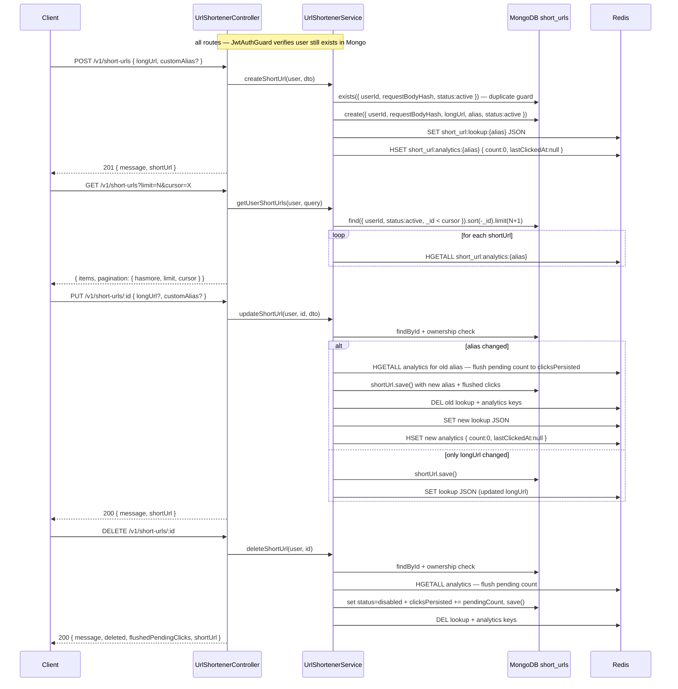

---

## URL Shortener — Public Redirect

Controller: `UrlShortenerRedirectController` at `GET /r/:alias`
Decorator: `@Public()` + `@SkipResponseInterceptor()`
Redis: `short_url:lookup:{alias}`, `short_url:analytics:{alias}`
MongoDB: `short_urls` (cache miss only)

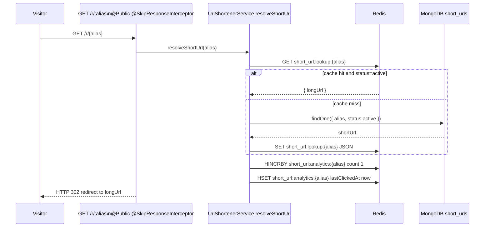

---

## Analytics Persistence — Cron

Controller: `CronController` at `GET /v1/api/cron/url-shortener`
Decorator: `@Public()` — uses its own `Authorization: Bearer {CRON_SECRET}` check
Service: `CronJobService`
MongoDB: `short_urls`
Redis: `short_url:analytics:{alias}` (Hash)

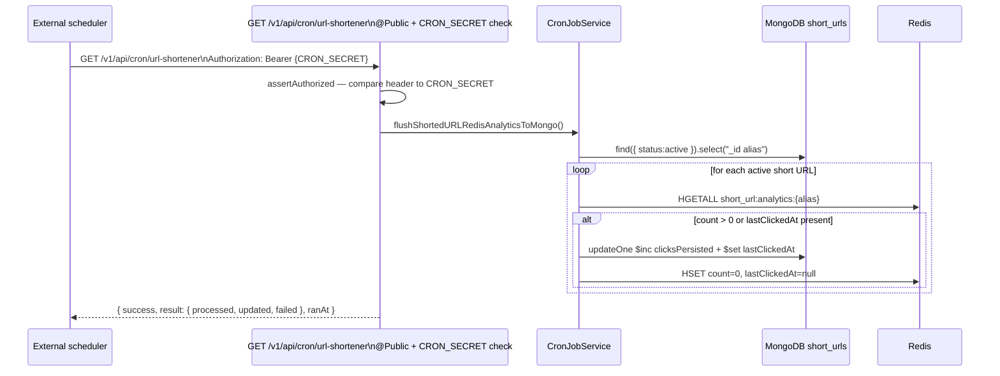

---

## Avatar

Controller: `AvatarController` at `GET /v1/avatar`
Decorator: `@Public()`
Service: `AvatarService`

When a user is created without an explicit avatar, the `User` pre-save hook sets
`avatar = BACKEND_URL/v1/avatar?name={encodedName}`. The avatar endpoint derives
initials from the name, picks a stable background color using a hash of the name,
and returns an SVG with `Cache-Control: public, max-age=86400`.

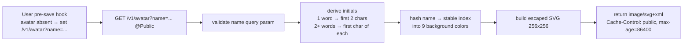

---

## Email Delivery

Service: `NotificationService` → `SqsService` → AWS SQS → Lambda → Nodemailer

`NotificationService` renders an HTML template using `renderTemplate` (string
interpolation), then calls `SqsService.sendMail` which puts a JSON message onto
the configured SQS queue. A Lambda function polls the queue, receives a batch,
and sends each message via Nodemailer SMTP.

| Email type | SQS `type` field | Trigger |
| --- | --- | --- |
| Signup OTP | `VERIFY_EMAIL` | `SignupFlowService.signup` |
| Welcome | `WELCOME_EMAIL` | `SignupFlowService.verifySignupOtp`, `AuthService.githubExchange` |
| Forgot password OTP | `FORGOT_PASSWORD` | `ForgotPasswordFlowService.forgotPassword` |
| Reset password link | `RESET_PASSWORD` | `ForgotPasswordFlowService.verifyForgotPasswordOtp` |
| Password changed | `RESET_PASSWORD` | `ForgotPasswordFlowService.resetPassword` |

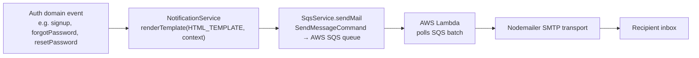

---

## Internal Redis API

Controllers: `RedisStringController` at `/v1/redis/string`,
`RedisHashController` at `/v1/redis/hash`
Decorators: `@Public()` + `@Internal()` — `InternalApiMiddleware` validates
`x-internal-api-key` header against `INTERNAL_API_KEY` env var

### String operations (`/v1/redis/string`)

| Method | Route | Operation |
| --- | --- | --- |
| POST | `/v1/redis/string` | create (SET with optional TTL) |
| POST | `/v1/redis/string/nx` | create if not exists (SET NX) |
| GET | `/v1/redis/string/:key` | get (parsed JSON) |
| GET | `/v1/redis/string/:key/raw` | get raw string |
| GET | `/v1/redis/string/:key/exists` | check existence |
| GET | `/v1/redis/string/:key/ttl` | get TTL |
| PUT | `/v1/redis/string` | update (SET, optional preserve TTL) |
| PATCH | `/v1/redis/string/fields` | update fields (partial JSON merge) |
| PATCH | `/v1/redis/string/expire` | set TTL |
| PATCH | `/v1/redis/string/rename` | rename key |
| DELETE | `/v1/redis/string/:key` | delete |

### Hash operations (`/v1/redis/hash`)

| Method | Route | Operation |
| --- | --- | --- |
| POST | `/v1/redis/hash` | create (HSET with optional TTL) |
| POST | `/v1/redis/hash/nx` | create if not exists |
| GET | `/v1/redis/hash/:key` | get all fields (parsed) |
| GET | `/v1/redis/hash/:key/raw` | get raw fields |
| GET | `/v1/redis/hash/:key/exists` | check existence |
| GET | `/v1/redis/hash/:key/ttl` | get TTL |
| PUT | `/v1/redis/hash` | full replace |
| PATCH | `/v1/redis/hash/fields` | update specific fields |
| PATCH | `/v1/redis/hash/fields/delete` | delete specific fields |
| PATCH | `/v1/redis/hash/expire` | set TTL |
| PATCH | `/v1/redis/hash/rename` | rename key |
| DELETE | `/v1/redis/hash/:key` | delete |

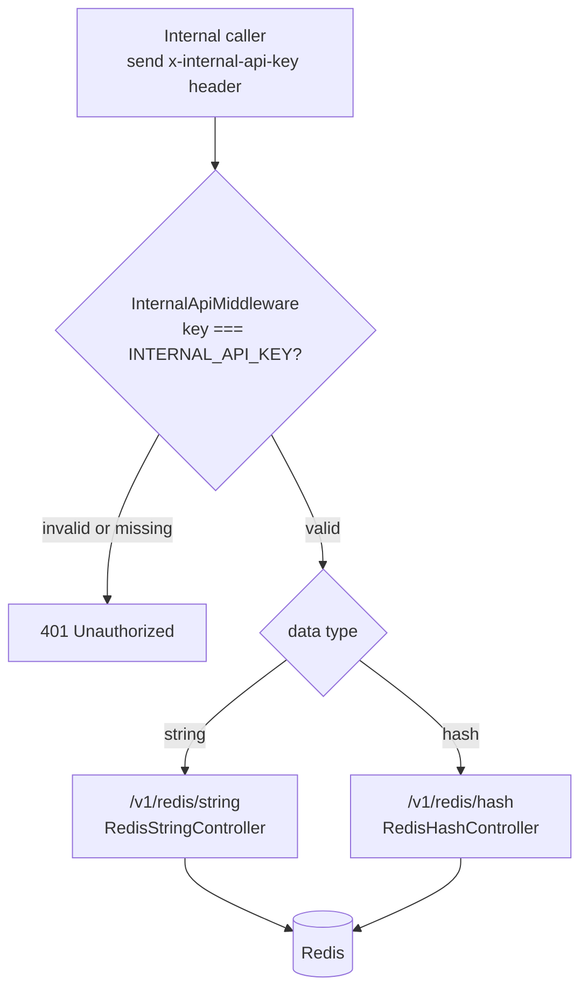

---

## Unimplemented Features

These advertised tools have no NestJS controller, service, schema, or route.
Each will need at minimum: DTO, controller, service, persistence layer,
security rules, and tests before the client can wire real API calls.

| Feature | Suggested module path |
| --- | --- |
| QR Code Generator | `src/modules/features/qr-generator/` |
| QR Code Scanner | `src/modules/features/qr-scanner/` |
| Dynamic QR Generator | `src/modules/features/dynamic-qr/` |
| Link Expander | `src/modules/features/link-expander/` |
| Broken Link Checker | `src/modules/features/broken-link-checker/` |
| Barcode Decoder | `src/modules/features/barcode-decoder/` |
| DNS and Domain Checker | `src/modules/features/dns-checker/` |
| One-Time Links | `src/modules/features/one-time-link/` |
