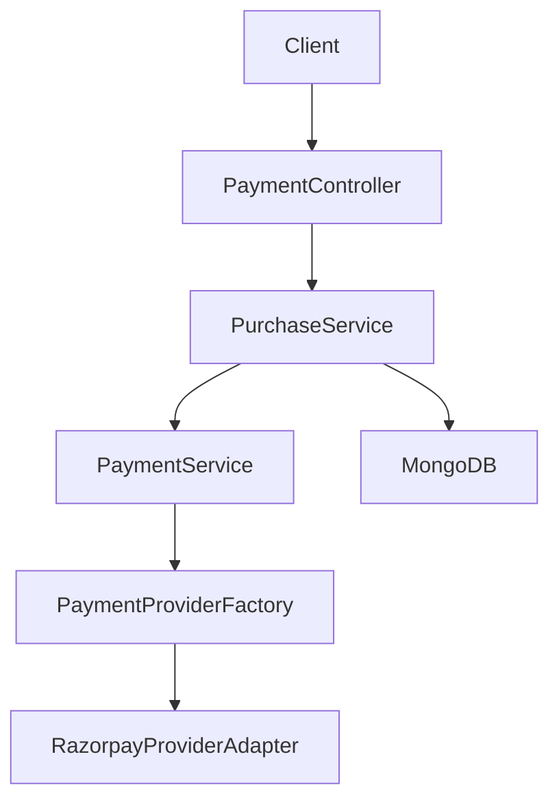
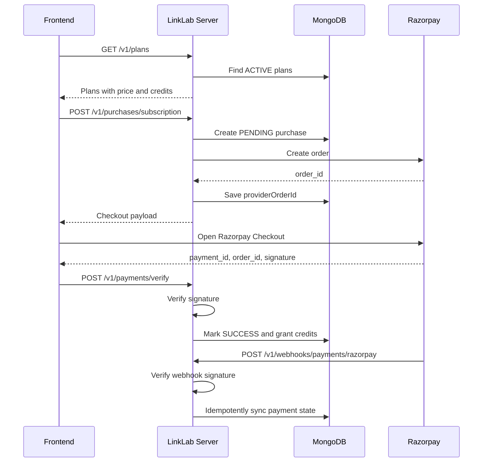

# Payment Architecture and API Usage Flow

This document defines the complete payment design for LinkLab:

- Current Razorpay integration pathProvider-independent payment layer
- 
- Required schemas and their use cases
- Server API request and response contracts
- API-key based public API access
- Credit usage and transaction flow

The goal is simple: **business logic should not depend directly on Razorpay or
any other payment gateway**. Razorpay is the first implemented provider, but the
payment layer must allow another provider to be added later through a new
adapter.

## Core Rules

- The frontend must never send trusted `amount`, `currency`, or `credits`.
- Plan price and credits must always come from the backend `Plan` record.
- Payment providers collect money; LinkLab grants subscriptions and credits.
- Credits must be stored as a numeric field, not parsed from description text.
- Payment completion must be idempotent because verify calls and webhooks can
both arrive for the same payment.
- API keys must be stored as hashes and shown only once.


## Module Structure

Recommended files:

```text
server/src/modules/payment/
  payment.module.ts
  payment.controller.ts
  payment.service.ts
  purchase.service.ts
  payment-provider.factory.ts
  types/
    payment-provider.types.ts
  providers/
    razorpay.provider.ts
  dto/
    create-subscription-purchase.dto.ts
    verify-payment.dto.ts
```

Recommended schemas:

```text
server/src/models/
  plan.schema.ts
  purchase.schema.ts
  subscription.schema.ts
  user-credit-balance.schema.ts
  credit-transaction.schema.ts
  api-key.schema.ts
  payment-webhook-event.schema.ts
```


## Provider-Independent Payment Layer

Controllers and business services should call `PaymentService`. `PaymentService`
selects a provider adapter through `PaymentProviderFactory`.




For now, only `RAZORPAY` is supported. Later, another provider can be added by
creating a new adapter and extending the factory.

### Provider Types

```ts
export type PaymentProvider = 'RAZORPAY';

export interface CreateProviderOrderInput {
  purchaseId: string;
  userId: string;
  amount: number;
  currency: string;
  planName: string;
  receipt: string;
  metadata: Record<string, string>;
}

export interface ProviderOrderResult {
  provider: PaymentProvider;
  providerOrderId: string;
  amount: number;
  currency: string;
  checkoutPayload: Record<string, unknown>;
}

export interface VerifyProviderPaymentInput {
  purchaseId: string;
  providerOrderId: string;
  providerPaymentId?: string;
  providerSignature?: string;
}

export interface ProviderPaymentResult {
  verified: boolean;
  provider: PaymentProvider;
  providerOrderId: string;
  providerPaymentId?: string;
  failureReason?: string;
}

export interface ParseProviderWebhookInput {
  rawBody: Buffer;
  headers: Record<string, string | string[] | undefined>;
}

export interface ProviderWebhookEvent {
  provider: PaymentProvider;
  eventId: string;
  eventType: 'PAYMENT_SUCCEEDED' | 'PAYMENT_FAILED';
  providerOrderId?: string;
  providerPaymentId?: string;
  occurredAt: Date;
  rawPayload: Record<string, unknown>;
}

export interface PaymentProviderAdapter {
  provider: PaymentProvider;

  createOrder(input: CreateProviderOrderInput): Promise<ProviderOrderResult>;

  verifyPayment(
    input: VerifyProviderPaymentInput,
  ): Promise<ProviderPaymentResult>;

  parseWebhook(input: ParseProviderWebhookInput): Promise<ProviderWebhookEvent>;
}
```


### Provider Factory

```ts
@Injectable()
export class PaymentProviderFactory {
  constructor(private readonly razorpayProvider: RazorpayProvider) {}

  getProvider(provider: string): PaymentProviderAdapter {
    if (provider === 'RAZORPAY') {
      return this.razorpayProvider;
    }

    throw new Error(`Unsupported payment provider: ${provider}`);
  }
}
```


### Payment Service

```ts
@Injectable()
export class PaymentService {
  constructor(private readonly providerFactory: PaymentProviderFactory) {}

  createOrder(provider: string, input: CreateProviderOrderInput) {
    return this.providerFactory.getProvider(provider).createOrder(input);
  }

  verifyPayment(provider: string, input: VerifyProviderPaymentInput) {
    return this.providerFactory.getProvider(provider).verifyPayment(input);
  }

  parseWebhook(provider: string, input: ParseProviderWebhookInput) {
    return this.providerFactory.getProvider(provider).parseWebhook(input);
  }
}
```


## Razorpay Integration


### Install Package

```bash
npm install razorpay
```


### Environment Variables

```text
PAYMENT_DEFAULT_PROVIDER=RAZORPAY
RAZORPAY_KEY_ID=rzp_test_xxxxx
RAZORPAY_KEY_SECRET=xxxxx
RAZORPAY_WEBHOOK_SECRET=xxxxx
```

Add these to `server/src/config/env.schema.ts`:

```ts
PAYMENT_DEFAULT_PROVIDER: z.literal('RAZORPAY').default('RAZORPAY'),
RAZORPAY_KEY_ID: z.string().min(1).optional(),
RAZORPAY_KEY_SECRET: z.string().min(1).optional(),
RAZORPAY_WEBHOOK_SECRET: z.string().min(1).optional(),
```

In production, make Razorpay keys required.

### Razorpay Flow




### Razorpay Adapter Responsibilities

`RazorpayProvider` should:

- Create Razorpay orders.
- Return frontend checkout payload.
- Verify checkout signatures.
- Verify webhook signatures using raw request body.
- Normalize Razorpay webhook events into `ProviderWebhookEvent`.

Signature verification uses:

```text
HMAC_SHA256(razorpay_order_id + "|" + razorpay_payment_id, RAZORPAY_KEY_SECRET)
```

Webhook verification uses:

```text
HMAC_SHA256(raw_request_body, RAZORPAY_WEBHOOK_SECRET)
```


## Required Schemas

Create **7 main schemas** for the full payment and API usage flow.


| No. | Schema                | Collection               | Required                  | Use Case                              |
| --- | --------------------- | ------------------------ | ------------------------- | ------------------------------------- |
| 1   | `Plan`                | `plans`                  | Yes                       | Store purchasable subscription plans. |
| 2   | `Purchase`            | `purchases`              | Yes                       | Track one payment attempt.            |
| 3   | `Subscription`        | `subscriptions`          | Yes                       | Track user's active paid plan.        |
| 4   | `UserCreditBalance`   | `user_credit_balances`   | Yes                       | Store current credit balance.         |
| 5   | `CreditTransaction`   | `credit_transactions`    | Yes                       | Audit credit and debit history.       |
| 6   | `PaymentWebhookEvent` | `payment_webhook_events` | Yes                       | Deduplicate provider webhook retries. |
| 7   | `ApiKey`              | `api_keys`               | Yes for public API access | Authenticate public API usage.        |


Minimum first checkout version:

- `Plan`
- `Purchase`
- `Subscription`
- `UserCreditBalance`
- `CreditTransaction`

Before production webhooks:

- Add `PaymentWebhookEvent`

Before public API billing:

- Add `ApiKey`


## Schema Details


### 1. Plan

Stores plans shown to users.

Important fields:


| Field          | Type                              | Use                                     |
| -------------- | --------------------------------- | --------------------------------------- |
| `name`         | `string`                          | Display name, such as `Starter`.        |
| `code`         | `string`                          | Stable code, such as `STARTER_MONTHLY`. |
| `price`        | `number`                          | Amount charged.                         |
| `currency`     | `string`                          | Currency, such as `INR`.                |
| `description`  | `string[]`                        | UI bullet points.                       |
| `credits`      | `number`                          | Credits granted after payment success.  |
| `tenure`       | `MONTHLY` / `YEARLY` / `LIFETIME` | Plan duration.                          |
| `status`       | `ACTIVE` / `INACTIVE`             | Purchasable state.                      |
| `isPopular`    | `boolean`                         | Pricing UI flag.                        |
| `displayOrder` | `number`                          | Pricing sort order.                     |


Example:

```json
{
  "name": "Starter",
  "code": "STARTER_MONTHLY",
  "price": 499,
  "currency": "INR",
  "description": [
    "1000 credits/month",
    "API access",
    "Basic analytics"
  ],
  "credits": 1000,
  "tenure": "MONTHLY",
  "status": "ACTIVE",
  "isPopular": false,
  "displayOrder": 1
}
```

Indexes:

```ts
PlanSchema.index({ code: 1 }, { unique: true });
PlanSchema.index({ status: 1, displayOrder: 1 });
```


### 2. Purchase

Tracks one payment attempt. It starts as `PENDING` and becomes `SUCCESS` only
after provider verification.

Important fields:


| Field               | Type                                                       | Use                           |
| ------------------- | ---------------------------------------------------------- | ----------------------------- |
| `userId`            | `ObjectId`                                                 | Buyer.                        |
| `purchaseType`      | `SUBSCRIPTION`                                             | Purchase kind.                |
| `planId`            | `ObjectId`                                                 | Purchased plan.               |
| `planCode`          | `string`                                                   | Plan code snapshot.           |
| `credits`           | `number`                                                   | Credits snapshot.             |
| `amount`            | `number`                                                   | Price snapshot.               |
| `currency`          | `string`                                                   | Currency snapshot.            |
| `status`            | `PENDING` / `SUCCESS` / `FAILED` / `EXPIRED` / `CANCELLED` | Payment state.                |
| `paymentProvider`   | `RAZORPAY`                                                 | Provider used.                |
| `providerOrderId`   | `string`                                                   | Razorpay order id.            |
| `providerPaymentId` | `string`                                                   | Razorpay payment id.          |
| `providerSignature` | `string`                                                   | Checkout signature.           |
| `failureReason`     | `string`                                                   | Failed payment reason.        |
| `idempotencyKey`    | `string`                                                   | Duplicate request protection. |


Indexes:

```ts
PurchaseSchema.index({ userId: 1, createdAt: -1 });
PurchaseSchema.index({ userId: 1, status: 1, createdAt: -1 });
PurchaseSchema.index({ providerOrderId: 1 }, { unique: true, sparse: true });
PurchaseSchema.index({ providerPaymentId: 1 }, { unique: true, sparse: true });
PurchaseSchema.index(
  { userId: 1, idempotencyKey: 1 },
  { unique: true, sparse: true },
);
```


### 3. Subscription

Tracks paid access after successful purchase.

Important fields:


| Field        | Type                               | Use                       |
| ------------ | ---------------------------------- | ------------------------- |
| `userId`     | `ObjectId`                         | Owner.                    |
| `planId`     | `ObjectId`                         | Plan reference.           |
| `planCode`   | `string`                           | Plan code snapshot.       |
| `purchaseId` | `ObjectId`                         | Purchase that created it. |
| `status`     | `ACTIVE` / `EXPIRED` / `CANCELLED` | Subscription state.       |
| `startedAt`  | `Date`                             | Start date.               |
| `expiresAt`  | `Date`                             | End date.                 |


Indexes:

```ts
SubscriptionSchema.index({ userId: 1, status: 1, expiresAt: -1 });
SubscriptionSchema.index({ purchaseId: 1 }, { unique: true });
```


### 4. UserCreditBalance

Stores current balance for fast reads.

Important fields:


| Field              | Type       | Use                       |
| ------------------ | ---------- | ------------------------- |
| `userId`           | `ObjectId` | One balance per user.     |
| `totalCredits`     | `number`   | Credits granted.          |
| `usedCredits`      | `number`   | Credits consumed.         |
| `remainingCredits` | `number`   | Credits available.        |
| `lastPurchasedAt`  | `Date`     | Last successful purchase. |
| `resetAt`          | `Date`     | Next monthly reset date.  |


Indexes:

```ts
UserCreditBalanceSchema.index({ userId: 1 }, { unique: true });
```


### 5. CreditTransaction

Append-only ledger for all credit changes.

Important fields:


| Field             | Type                                   | Use                                  |
| ----------------- | -------------------------------------- | ------------------------------------ |
| `userId`          | `ObjectId`                             | Owner.                               |
| `transactionType` | `CREDIT` / `DEBIT`                     | Add or consume credits.              |
| `credits`         | `number`                               | Number of credits changed.           |
| `balanceBefore`   | `number`                               | Balance before change.               |
| `balanceAfter`    | `number`                               | Balance after change.                |
| `source`          | `SUBSCRIPTION_PURCHASE` / feature code | Why it happened.                     |
| `purchaseId`      | `ObjectId`                             | Purchase reference for paid credits. |
| `subscriptionId`  | `ObjectId`                             | Subscription reference.              |
| `requestId`       | `string`                               | Feature request id for debits.       |


Indexes:

```ts
CreditTransactionSchema.index({ userId: 1, createdAt: -1 });
CreditTransactionSchema.index(
  { purchaseId: 1, source: 1 },
  {
    unique: true,
    partialFilterExpression: {
      source: 'SUBSCRIPTION_PURCHASE',
    },
  },
);
CreditTransactionSchema.index(
  { userId: 1, requestId: 1, source: 1 },
  { unique: true, sparse: true },
);
```


### 6. PaymentWebhookEvent

Stores processed provider events so retries do not grant credits twice.

Important fields:


| Field               | Type                                   | Use                               |
| ------------------- | -------------------------------------- | --------------------------------- |
| `provider`          | `RAZORPAY`                             | Provider name.                    |
| `eventId`           | `string`                               | Provider event id or fallback id. |
| `eventType`         | `PAYMENT_SUCCEEDED` / `PAYMENT_FAILED` | Normalized event.                 |
| `providerOrderId`   | `string`                               | Razorpay order id.                |
| `providerPaymentId` | `string`                               | Razorpay payment id.              |
| `purchaseId`        | `ObjectId`                             | Matched purchase.                 |
| `processingStatus`  | `PROCESSED` / `IGNORED` / `FAILED`     | Server result.                    |
| `rawPayload`        | `object`                               | Debug payload.                    |
| `receivedAt`        | `Date`                                 | Received time.                    |


Indexes:

```ts
PaymentWebhookEventSchema.index(
  { provider: 1, eventId: 1 },
  { unique: true },
);
PaymentWebhookEventSchema.index({ providerOrderId: 1 });
PaymentWebhookEventSchema.index({ purchaseId: 1 });
```


### 7. ApiKey

Stores API keys for public API access. Store only the hash.

Important fields:


| Field        | Type                 | Use                      |
| ------------ | -------------------- | ------------------------ |
| `userId`     | `ObjectId`           | Key owner.               |
| `name`       | `string`             | User-visible key name.   |
| `keyPrefix`  | `string`             | Safe display prefix.     |
| `keyHash`    | `string`             | Hash of the full key.    |
| `status`     | `ACTIVE` / `REVOKED` | Whether key can be used. |
| `lastUsedAt` | `Date`               | Last successful usage.   |


Indexes:

```ts
ApiKeySchema.index({ userId: 1, createdAt: -1 });
ApiKeySchema.index({ keyPrefix: 1 });
ApiKeySchema.index({ keyHash: 1 }, { unique: true });
```


## Payment API Contracts

The examples below show the response `data` shape. The existing success
interceptor can wrap them with the standard response envelope.

### List Plans

```http
GET /v1/plans
```

Response:

```json
{
  "plans": [
    {
      "id": "plan_1",
      "name": "Starter",
      "code": "STARTER_MONTHLY",
      "price": 499,
      "currency": "INR",
      "description": [
        "1000 credits/month",
        "API access"
      ],
      "credits": 1000,
      "tenure": "MONTHLY",
      "isPopular": false,
      "displayOrder": 1
    }
  ]
}
```


### Create Subscription Purchase

```http
POST /v1/purchases/subscription
Authorization: Bearer <jwt>
Content-Type: application/json
Idempotency-Key: buy-starter-2026-07-06
```

Request:

```json
{
  "planId": "plan_1",
  "paymentProvider": "RAZORPAY"
}
```

Response:

```json
{
  "purchase": {
    "id": "purchase_1",
    "status": "PENDING",
    "purchaseType": "SUBSCRIPTION",
    "planId": "plan_1",
    "planCode": "STARTER_MONTHLY",
    "amount": 499,
    "currency": "INR",
    "credits": 1000,
    "paymentProvider": "RAZORPAY",
    "providerOrderId": "order_123"
  },
  "checkout": {
    "provider": "RAZORPAY",
    "keyId": "rzp_test_xxxxx",
    "providerOrderId": "order_123",
    "amount": 499,
    "currency": "INR",
    "name": "LinkLab",
    "description": "Starter",
    "metadata": {
      "purchaseId": "purchase_1"
    }
  }
}
```


### Verify Payment

```http
POST /v1/payments/verify
Authorization: Bearer <jwt>
Content-Type: application/json
```

Request:

```json
{
  "purchaseId": "purchase_1",
  "paymentProvider": "RAZORPAY",
  "providerOrderId": "order_123",
  "providerPaymentId": "pay_123",
  "providerSignature": "signature_123"
}
```

Response:

```json
{
  "purchase": {
    "id": "purchase_1",
    "status": "SUCCESS",
    "paymentProvider": "RAZORPAY",
    "providerOrderId": "order_123",
    "providerPaymentId": "pay_123"
  },
  "subscription": {
    "id": "subscription_1",
    "status": "ACTIVE",
    "planCode": "STARTER_MONTHLY",
    "startedAt": "2026-07-06T10:05:00.000Z",
    "expiresAt": "2026-08-06T10:05:00.000Z"
  },
  "credits": {
    "totalCredits": 1000,
    "usedCredits": 0,
    "remainingCredits": 1000
  }
}
```


### Razorpay Webhook

```http
POST /v1/webhooks/payments/razorpay
X-Razorpay-Signature: <signature>
Content-Type: application/json
```

Response:

```json
{
  "received": true
}
```


## Payment Completion Flow

After successful verification or webhook:

1. Find purchase by `purchaseId` or `providerOrderId`.
2. If purchase is already `SUCCESS`, return existing state.
3. If purchase is not `PENDING`, reject or ignore safely.
4. Mark purchase `SUCCESS`.
5. Save `providerPaymentId` and `providerSignature`.
6. Create `Subscription`.
7. Update `UserCreditBalance`.
8. Create `CreditTransaction` with source `SUBSCRIPTION_PURCHASE`.
9. Return purchase, subscription, and balance.

Use a MongoDB transaction when possible.

## API-Key Based Flow

API keys let paid users call public APIs with:

```http
X-API-Key: sk_live_abcdxxxxxxxxxxxx
```

The real key is returned only once when created. The server stores only:

- `keyPrefix`
- `keyHash`
- metadata such as name, owner, status, and last used time


### Create API Key

```http
POST /v1/api-keys
Authorization: Bearer <jwt>
Content-Type: application/json
```

Request:

```json
{
  "name": "Production Key"
}
```

Response:

```json
{
  "apiKey": {
    "id": "api_key_1",
    "name": "Production Key",
    "keyPrefix": "sk_live_abcd",
    "status": "ACTIVE",
    "createdAt": "2026-07-06T10:10:00.000Z"
  },
  "secret": "sk_live_abcdxxxxxxxxxxxx"
}
```

Store:

```json
{
  "userId": "user_1",
  "name": "Production Key",
  "keyPrefix": "sk_live_abcd",
  "keyHash": "hashed_api_key",
  "status": "ACTIVE",
  "lastUsedAt": null
}
```


### List API Keys

```http
GET /v1/api-keys
Authorization: Bearer <jwt>
```

Response:

```json
{
  "apiKeys": [
    {
      "id": "api_key_1",
      "name": "Production Key",
      "keyPrefix": "sk_live_abcd",
      "status": "ACTIVE",
      "lastUsedAt": null,
      "createdAt": "2026-07-06T10:10:00.000Z"
    }
  ]
}
```


### Revoke API Key

```http
DELETE /v1/api-keys/api_key_1
Authorization: Bearer <jwt>
```

Response:

```json
{
  "apiKey": {
    "id": "api_key_1",
    "status": "REVOKED"
  }
}
```


## Public API Usage Flow

Example public API:

```http
POST /api/v1/broken-link-checker
X-API-Key: sk_live_abcdxxxxxxxxxxxx
Content-Type: application/json
```

Request:

```json
{
  "url": "https://example.com"
}
```

Backend flow:

1. Read `X-API-Key`.
2. Extract prefix for quick lookup.
3. Hash full key.
4. Find active `ApiKey`.
5. Resolve `userId`.
6. Check active subscription if required.
7. Check `UserCreditBalance.remainingCredits`.
8. Execute the feature.
9. Deduct credits with an atomic update.
10. Create `CreditTransaction` with `transactionType=DEBIT`.
11. Update `ApiKey.lastUsedAt`.
12. Return feature result and remaining credits.

Response:

```json
{
  "result": {
    "url": "https://example.com",
    "status": "COMPLETED",
    "brokenLinks": []
  },
  "credits": {
    "charged": 5,
    "remainingCredits": 995
  }
}
```


### Insufficient Credits Response

```json
{
  "success": false,
  "message": "Insufficient credits",
  "error": {
    "code": "INSUFFICIENT_CREDITS",
    "details": {
      "requiredCredits": 5,
      "remainingCredits": 2
    }
  }
}
```


### Invalid API Key Response

```json
{
  "success": false,
  "message": "Invalid API key",
  "error": {
    "code": "INVALID_API_KEY"
  }
}
```


## Credit Charging Rules

For simple features:

1. Check credits before execution.
2. Execute feature.
3. Deduct credits after success.

For expensive or long-running features:

1. Reserve credits before execution.
2. Mark reservation consumed after success.
3. Refund reservation if execution fails.

For the first version, use the simple flow unless the feature is expensive.

Atomic debit example:

```ts
await this.creditBalanceModel.updateOne(
  {
    userId,
    remainingCredits: { $gte: requiredCredits },
  },
  {
    $inc: {
      usedCredits: requiredCredits,
      remainingCredits: -requiredCredits,
    },
  },
);
```

Then create a debit transaction:

```ts
await this.creditTransactionModel.create({
  userId,
  transactionType: 'DEBIT',
  credits: requiredCredits,
  balanceBefore,
  balanceAfter,
  source: 'BROKEN_LINK_CHECKER',
  requestId,
});
```


## Endpoint Summary


| Method   | Route                            | Auth                | Purpose                                     |
| -------- | -------------------------------- | ------------------- | ------------------------------------------- |
| `GET`    | `/v1/plans`                      | Public or protected | List active plans.                          |
| `POST`   | `/v1/purchases/subscription`     | JWT                 | Create pending purchase and provider order. |
| `GET`    | `/v1/purchases/:purchaseId`      | JWT                 | Read one owned purchase.                    |
| `POST`   | `/v1/payments/verify`            | JWT                 | Verify checkout success.                    |
| `POST`   | `/v1/webhooks/payments/razorpay` | Razorpay signature  | Process webhook event.                      |
| `GET`    | `/v1/subscriptions/current`      | JWT                 | Read current subscription.                  |
| `GET`    | `/v1/credits/balance`            | JWT                 | Read credit balance.                        |
| `GET`    | `/v1/credits/transactions`       | JWT                 | Read credit ledger.                         |
| `POST`   | `/v1/api-keys`                   | JWT                 | Create API key.                             |
| `GET`    | `/v1/api-keys`                   | JWT                 | List API keys.                              |
| `DELETE` | `/v1/api-keys/:id`               | JWT                 | Revoke API key.                             |
| `POST`   | `/api/v1/:feature`               | API key             | Execute paid public API.                    |


## Flow to Schema Mapping


| Flow Step                 | Schemas Used                                                                                |
| ------------------------- | ------------------------------------------------------------------------------------------- |
| Show pricing              | `Plan`                                                                                      |
| User clicks buy           | `Plan`, `Purchase`                                                                          |
| Razorpay order created    | `Purchase`                                                                                  |
| Payment verify success    | `Purchase`, `Subscription`, `UserCreditBalance`, `CreditTransaction`                        |
| Razorpay webhook success  | `PaymentWebhookEvent`, `Purchase`, `Subscription`, `UserCreditBalance`, `CreditTransaction` |
| Show current subscription | `Subscription`, `Plan`                                                                      |
| Show credit balance       | `UserCreditBalance`                                                                         |
| Show credit history       | `CreditTransaction`                                                                         |
| Create API key            | `ApiKey`                                                                                    |
| Public API usage          | `ApiKey`, `Subscription`, `UserCreditBalance`, `CreditTransaction`                          |


## Security Checklist

- Store provider secrets only in environment variables.
- Verify Razorpay checkout signature on the server.
- Verify Razorpay webhook signature using raw request body.
- Store API keys as hashes, not plain text.
- Return the full API key only once.
- Scope all protected reads by authenticated `userId`.
- Never trust frontend amount, currency, credits, or plan code.
- Deduplicate webhooks by provider and event id.
- Use unique indexes to prevent double credits.
- Log errors without logging secrets, full API keys, or full signatures.


## Future Provider Integration

To add another payment gateway later:

1. Keep all existing business schemas.
2. Add a new provider adapter implementing `PaymentProviderAdapter`.
3. Add the provider to `PaymentProvider`.
4. Extend `PaymentProviderFactory`.
5. Add provider-specific environment variables.
6. Keep `PurchaseService`, subscription logic, and credit logic unchanged.

The payment layer exists so the business system remains stable even when the
gateway changes.