# Barcode Generator

## What is a barcode generator?

A barcode generator converts human-readable data into a machine-readable visual
symbol. The output is usually an image, such as SVG or PNG, that can be scanned
by barcode scanners, mobile cameras, warehouse devices, or retail point-of-sale
systems.

A barcode is not just a decorative image. It follows a barcode standard that
defines which characters are allowed, how bars and spaces are encoded, whether a
check digit is required, and how scanners should read the result. The generator
is responsible for taking user input, validating it against the selected
standard, rendering the symbol correctly, and exporting it in a useful format.

## Why barcode generators exist

Barcode generators were created to make physical and operational workflows
faster, more reliable, and easier to automate. A person can type a product code,
inventory number, shipment identifier, or internal reference into software and
produce a scannable label immediately.

They solve these problems:

- Manual typing creates mistakes in warehouses, stores, labs, and offices.
- Long IDs are slow to enter repeatedly.
- Product and shipment labels need a common scannable format.
- Teams need printable or downloadable barcode assets without design software.
- Systems need a durable record of generated labels, download activity, and
  formats used.

## Who uses it?

Barcode generation is useful for:

- Retail teams that need product labels such as `EAN13` or `UPCA`.
- Inventory and warehouse teams that need item, shelf, bin, or shipment labels.
- Operations teams that track assets, documents, returns, or packaging.
- Event and admin teams that create badges, tickets, or internal references.
- Developers building dashboards where users need barcode images on demand.

## Where it is used

Barcodes are commonly used on product packaging, warehouse labels, shipping
cartons, invoices, ID cards, lab samples, asset tags, ticketing systems,
manufacturing lines, and internal admin tools.

Different barcode formats exist because different industries need different
rules. For example, `EAN13` and `UPCA` are common for retail products, `ITF14`
is common on trade-item cartons, `CODE39` is common in industrial inventory, and
`CODE128` is flexible for general text and numbers.

## How a barcode is created

At a high level, barcode generation follows this path:

1. Choose a barcode standard, such as `CODE128`, `EAN13`, `UPCA`, `CODE39`, or
   `ITF14`.
2. Validate the content against that standard.
3. Normalize the content if the standard allows it.
4. Calculate or validate any required check digit.
5. Encode the content into bars and spaces.
6. Render the bars, optional human-readable text, margins, colors, and size.
7. Export the barcode as SVG, PNG, or another image/document format.

In LinkLab, step 5 and most of step 6 are delegated to `@bwip-js/node`.
LinkLab handles application concerns around authentication, validation,
normalization, storage, duplicate prevention, file delivery, and analytics.

## How to build a barcode generator from scratch

Building a barcode generator without a package means implementing the barcode
standard yourself. The work has two major parts:

- Encoder: convert validated content into a sequence of narrow/wide bars and
  spaces.
- Renderer: draw that sequence into SVG, canvas, PNG, PDF, or another output
  format.

The safest way to build from scratch is to support one format first, prove it
scans reliably, then add more formats. `CODE39` is usually the easiest first
format because it has a small character set and simple narrow/wide patterns.
`EAN13`, `UPCA`, and `ITF14` are harder because they need numeric encodings,
guard bars, left/right parity rules, and check digits. `CODE128` is more complex
because it has multiple code sets, shifting, start codes, and a modulo-103 check
symbol.

### From-scratch architecture

A clean custom implementation should split barcode generation into small
steps:

1. `validateInput(format, content)` checks allowed characters and length.
2. `normalizeInput(format, content)` trims, uppercases where required, and adds
   missing check digits when the standard allows it.
3. `encode(format, normalizedContent)` returns a barcode plan, not an image.
4. `layout(plan, options)` converts bars/spaces into positioned rectangles.
5. `renderSvg(layout)` converts rectangles into SVG markup.
6. `renderPng(svg)` optionally rasterizes SVG to PNG.
7. `verifyOutput()` tests known inputs against known expected patterns and real
   scanner behavior.

The internal model can be simple:

```ts
type BarSegment = {
  type: 'bar' | 'space';
  width: number;
};

type BarcodePlan = {
  format: 'CODE39' | 'EAN13' | 'UPCA' | 'ITF14' | 'CODE128';
  content: string;
  humanText: string;
  modules: BarSegment[];
};

type RenderOptions = {
  moduleWidth: number;
  height: number;
  margin: number;
  barColor: string;
  backgroundColor: string;
  showValue: boolean;
};
```

The encoder should return logical module widths. The renderer should not care
about check digits, character sets, or barcode standards. It should only draw
the plan it receives.

### How to render bars as SVG

Once the encoder returns a list of bar/space segments, SVG rendering is
straightforward:

1. Start `x` at the quiet-zone margin.
2. For each segment, calculate `segmentWidth = segment.width * moduleWidth`.
3. If the segment is a bar, draw a `<rect>` at the current `x`.
4. Move `x` forward by `segmentWidth`.
5. Add optional human-readable text under the bars.
6. Wrap everything in an `<svg>` with a background rectangle.

Example renderer shape:

```ts
function renderBarcodeSvg(
  plan: BarcodePlan,
  options: RenderOptions,
): string {
  let x = options.margin;
  const barHeight = options.showValue ? options.height - 18 : options.height;
  const rects: string[] = [];

  for (const segment of plan.modules) {
    const width = segment.width * options.moduleWidth;

    if (segment.type === 'bar') {
      rects.push(
        `<rect x="${x}" y="${options.margin}" width="${width}" height="${barHeight}" fill="${options.barColor}" />`,
      );
    }

    x += width;
  }

  const totalWidth = x + options.margin;
  const totalHeight = options.height + options.margin * 2;
  const text = options.showValue
    ? `<text x="${totalWidth / 2}" y="${totalHeight - options.margin}" text-anchor="middle" font-family="Arial" font-size="14" fill="${options.barColor}">${escapeXml(plan.humanText)}</text>`
    : '';

  return [
    `<svg xmlns="http://www.w3.org/2000/svg" width="${totalWidth}" height="${totalHeight}" viewBox="0 0 ${totalWidth} ${totalHeight}">`,
    `<rect width="100%" height="100%" fill="${options.backgroundColor}" />`,
    rects.join(''),
    text,
    `</svg>`,
  ].join('');
}
```

Any text or color values inserted into SVG should be validated or escaped. Do
not place raw user input directly into SVG text without escaping XML
characters.

### Example: CODE39 from scratch

`CODE39` is built from a fixed pattern table. Each character maps to nine
elements: five bars and four spaces. Three elements are wide and six are
narrow. A `*` start/stop character wraps the content.

Implementation plan:

1. Normalize content by trimming and uppercasing.
2. Validate with `^[0-9A-Z .$/+%-]+$`.
3. Add start and stop markers: `*${content}*`.
4. Map each character to a narrow/wide pattern.
5. Convert each pattern into alternating bar/space segments.
6. Add a narrow inter-character space between symbols.
7. Render the segment list as SVG.

Example pattern table fragment:

```ts
const CODE39_PATTERNS: Record<string, string> = {
  '0': 'nnnwwnwnn',
  '1': 'wnnwnnnnw',
  '2': 'nnwwnnnnw',
  '3': 'wnwwnnnnn',
  A: 'wnnnnwnnw',
  B: 'nnwnnwnnw',
  C: 'wnwnnwnnn',
  '-': 'nwnnnnwnw',
  '.': 'wwnnnnwnn',
  ' ': 'nwwnnnwnn',
  '*': 'nwnnwnwnn',
};
```

Example encoder shape:

```ts
function encodeCode39(rawContent: string): BarcodePlan {
  const content = rawContent.trim().toUpperCase();

  if (!/^[0-9A-Z .$/+%-]+$/.test(content)) {
    throw new Error('Invalid CODE39 content');
  }

  const symbols = `*${content}*`;
  const modules: BarSegment[] = [];

  for (const [symbolIndex, symbol] of [...symbols].entries()) {
    const pattern = CODE39_PATTERNS[symbol];

    if (!pattern) {
      throw new Error(`Unsupported CODE39 symbol: ${symbol}`);
    }

    for (const [index, widthCode] of [...pattern].entries()) {
      modules.push({
        type: index % 2 === 0 ? 'bar' : 'space',
        width: widthCode === 'w' ? 3 : 1,
      });
    }

    if (symbolIndex < symbols.length - 1) {
      modules.push({ type: 'space', width: 1 });
    }
  }

  return {
    format: 'CODE39',
    content,
    humanText: content,
    modules,
  };
}
```

This produces a real barcode plan without relying on a barcode package. The
scanner reliability then depends on correct patterns, quiet zones, contrast,
module width, print size, and output scaling.

### Example: GTIN check digit from scratch

`EAN13`, `UPCA`, and `ITF14` use GTIN-style check digits. LinkLab already uses
this approach in `barcode-content.utils.ts`.

Algorithm:

1. Read the payload digits from right to left.
2. Multiply alternating digits by `3`, then `1`.
3. Sum the weighted digits.
4. The check digit is `(10 - (sum % 10)) % 10`.

```ts
function calculateGtinCheckDigit(payload: string): number {
  const sum = [...payload].reverse().reduce((total, digit, index) => {
    const weight = index % 2 === 0 ? 3 : 1;

    return total + Number(digit) * weight;
  }, 0);

  return (10 - (sum % 10)) % 10;
}
```

For `EAN13`, accept 12 digits and append the calculated digit, or accept 13
digits and compare the final digit with the calculated value. The same idea
applies to `UPCA` with 11/12 digits and `ITF14` with 13/14 digits.

### What makes EAN13 and UPCA harder

`EAN13` and `UPCA` are not just a table of wide and narrow bars. They encode
digits using fixed-width module patterns and guard bars.

An `EAN13` encoder has to handle:

- Left guard, center guard, and right guard patterns.
- Six left-side digits and six right-side digits.
- Different left-side parity patterns based on the first digit.
- Right-side digit patterns.
- Check digit validation.
- Quiet zones around the barcode.
- Human-readable text placement that does not interfere with guard bars.

For a from-scratch implementation, the encoder should keep exact module
patterns as strings such as `101`, `01010`, and digit encodings like
`0001101`. Then the renderer converts `1` to bar modules and `0` to space
modules.

### What makes CODE128 harder

`CODE128` can encode many ASCII characters compactly, but it is more involved:

- It has Code Set A, B, and C.
- It has different start symbols for each code set.
- Code Set C packs numeric pairs efficiently.
- It supports shifts and code-set changes.
- It requires a modulo-103 check symbol.
- The final barcode includes start, encoded symbols, check symbol, and stop.

A minimal custom `CODE128` implementation can start with Code Set B only, which
supports common printable characters. A production implementation should choose
code sets intelligently so numeric content is compact and scanner-compatible.

### Scratch implementation testing checklist

A custom barcode generator must be tested more heavily than normal UI code
because a barcode can look plausible but fail to scan.

Use this checklist:

- Unit-test every supported character pattern.
- Unit-test known check digit examples.
- Snapshot-test generated SVG for fixed inputs.
- Compare module patterns against the official symbology specification.
- Print samples at realistic sizes and scan them with multiple devices.
- Test dark-on-light contrast and reject low-contrast color choices if needed.
- Verify quiet zones are large enough.
- Verify SVG scaling does not create fractional bar widths where possible.
- Test very small and very large `barWidth`, `height`, and `margin` values.
- Test human-readable text on and off.
- Test exported PNGs after rasterization.

### When not to build it from scratch

A custom renderer is a good learning exercise and can work for a small number
of formats. It is usually not the best production choice when the product needs
many barcode standards, high scanner reliability, edge-case support, and quick
delivery.

Use a proven package when:

- You need broad format support.
- You need production scanner reliability quickly.
- You do not have time to validate every symbology edge case.
- You need fewer long-term maintenance responsibilities.

Build from scratch when:

- You only need one simple format.
- You need full control over rendering.
- You are learning how barcode symbologies work.
- You can test generated barcodes against real scanners and known standards.

## Supported formats in LinkLab

| Format | What it is for | Content rule | LinkLab normalization |
| --- | --- | --- | --- |
| `CODE128` | General-purpose text and numeric labels | Any text, 1-128 characters | Trim only |
| `EAN13` | International retail product codes | 12 digits to auto-add check digit, or 13 digits with valid check digit | Trim, calculate/validate GTIN check digit |
| `UPCA` | North American retail product codes | 11 digits to auto-add check digit, or 12 digits with valid check digit | Trim, calculate/validate GTIN check digit |
| `CODE39` | Inventory and industrial labels | Uppercase letters, digits, space, and `-.$/+%` | Trim; UI metadata marks uppercase input |
| `ITF14` | Shipping-container and trade-item cartons | 13 digits to auto-add check digit, or 14 digits with valid check digit | Trim, calculate/validate GTIN check digit |

## Package used to generate barcodes

LinkLab uses `@bwip-js/node` for barcode rendering. In `server/package.json`,
the dependency is `@bwip-js/node` with version range `^4.11.1`.

The module wraps it in `BarcodeRendererService`:

- LinkLab maps its enum values to BWIPP barcode IDs using
  `BARCODE_RENDERER_FORMAT`.
- `CODE128` maps to `code128`.
- `EAN13` maps to `ean13`.
- `UPCA` maps to `upca`.
- `CODE39` maps to `code39`.
- `ITF14` maps to `itf14`.
- The renderer calls `bwipjs.toSVG(...)`.
- Rendering errors are converted into `BarcodeGenerationException`.

Renderer options used by LinkLab:

- `bcid`: the renderer barcode type.
- `text`: normalized barcode content.
- `scale`: derived from `barWidth`.
- `height`: converted from requested pixels to BWIPP-friendly millimeters.
- `paddingleft`, `paddingright`, `paddingtop`, `paddingbottom`: derived from
  `margin`.
- `includetext`: controlled by `showValue`.
- `textxalign`: always `center`.
- `barcolor` and `textcolor`: use `barColor`.
- `backgroundcolor`: uses `backgroundColor`.

The height conversion is:

```text
heightInMillimeters = height / 2.835 / barWidth
```

The margin conversion is:

```text
padding = round(margin / barWidth)
```

This keeps the rendered barcode aligned with the UI controls while still
passing values in the shape expected by the renderer.

## How `@bwip-js/node` generates it

`@bwip-js/node` is a Node wrapper around the BWIPP barcode rendering engine. The
caller gives it a barcode type, text, size controls, colors, padding, and
text-display options. The package validates and encodes the text according to
the selected barcode symbology, then returns SVG markup.

In LinkLab, the package is used only for rendering the barcode image. LinkLab
does its own DTO validation, format-specific pre-validation, check-digit
calculation, ownership checks, duplicate checks, persistence, and analytics.

This split matters because rendering libraries are good at drawing correct
barcode symbols, but application code still needs to decide who can generate,
view, update, delete, preview, and download a barcode.

## PNG generation package

LinkLab stores the generated barcode as SVG. For PNG downloads, it uses `sharp`
with version range `^0.34.5` from `server/package.json`.

The download flow is:

```text
sharp(Buffer.from(barcode.svg, 'utf8')).png().toBuffer()
```

SVG is stored because it is compact, scalable, and reusable. PNG is generated on
demand because it is a raster export format and does not need to be stored
twice for every barcode.

## Alternatives

Possible barcode generation alternatives:

| Alternative | Strengths | Tradeoffs |
| --- | --- | --- |
| `JsBarcode` | Popular for browser/client-side barcode rendering; easy SVG/canvas use. | More focused on common 1D formats and client rendering; server export workflows may need extra setup. |
| `bwip-js` / `@bwip-js/node` | Broad format support, server-friendly, SVG output, mature BWIPP-based encoding. | Options are renderer-specific and sometimes need conversion from app-level UI values. |
| `zint` | Very broad barcode support and mature native tooling. | Native dependency/CLI integration can complicate deployment compared with a Node package. |
| External barcode API | Fast to integrate and can offload rendering. | Adds network dependency, cost, privacy concerns, and less control over validation/storage. |
| Custom renderer | Full control over output and UI-specific behavior. | High risk for barcode correctness; each symbology has strict rules and scanner compatibility concerns. |

LinkLab uses `@bwip-js/node` because it fits the server module well: it runs in
Node, supports the selected formats, returns SVG directly, and lets LinkLab keep
barcode generation inside the authenticated API instead of depending on an
external service.

## How LinkLab implements Barcode Generator

Primary files:

- `barcode-generator.controller.ts`: route definitions, auth extraction, raw
  response headers for preview/download.
- `barcode-generator.service.ts`: ownership, validation, persistence, analytics,
  preview, download, and update behavior.
- `barcode-renderer.service.ts`: `@bwip-js/node` wrapper.
- `barcode-content.utils.ts`: format-specific content normalization and check
  digit handling.
- `barcode-generator.constants.ts`: enums, format metadata, limits, and renderer
  mappings.
- `dto/barcode-generator.dto.ts`: request validation.
- `src/models/barcode.schema.ts`: MongoDB schema and indexes.

The module stores generated barcode documents in MongoDB collection
`barcodes`. Each protected request confirms that the JWT subject still exists in
`users` before reading or writing barcode data.

## Internal request pipeline

All protected barcode APIs follow this broad path:

1. Request enters NestJS middleware and global guards.
2. `JwtAuthGuard` verifies the access token and attaches `req.user`.
3. `ValidationPipe` validates and transforms DTO values.
4. `BarcodeGeneratorController.getUser(req)` throws `AccessTokenExpired` if
   `req.user` is missing.
5. `BarcodeGeneratorService.getAuthenticatedUserId` converts `user.sub` to a
   Mongo ObjectId and confirms the user still exists.
6. Service logic performs ownership, validation, rendering, persistence, or
   analytics.
7. JSON responses are wrapped by `SuccessResponseInterceptor`.
8. Preview and download routes skip the interceptor and return raw files.

## MongoDB document

| Field | Purpose |
| --- | --- |
| `userId` | Owner reference for protected access control. |
| `format` | Barcode format enum. Indexed for analytics/listing. |
| `content` | Normalized content that was rendered. |
| `barWidth` | Render scale control, integer `1` to `5`. |
| `height` | Requested visual height in pixels, integer `40` to `300`. |
| `margin` | Requested margin in pixels, integer `0` to `100`. |
| `barColor` | Six-digit hex color, stored lowercase. |
| `backgroundColor` | Six-digit hex color, stored lowercase. |
| `showValue` | Whether human-readable text is rendered below the bars. |
| `requestBodyHash` | SHA-256 hash of render inputs for duplicate protection. |
| `svg` | Stored SVG returned by preview/download and reused for PNG conversion. |
| `status` | `active` or `deleted`; delete is soft-delete. |
| `deletedAt` | Soft-delete timestamp. |
| `downloadCounts.svg` | Number of SVG downloads. |
| `downloadCounts.png` | Number of PNG downloads. |
| `totalDownloads` | Total SVG plus PNG downloads. |
| `lastDownloadType` | Latest download type, `svg` or `png`. |
| `lastDownloadedAt` | Latest download timestamp. |

Important indexes:

- `(userId, createdAt desc)` for list ordering.
- `(userId, format, createdAt desc)` for format-scoped analytics/listing.
- `(userId, status, createdAt desc)` for active/non-deleted lookups.
- Unique partial `(userId, requestBodyHash)` where `requestBodyHash` is a
  string.

Soft delete clears `requestBodyHash`, which allows the same barcode inputs to be
generated again after deletion without violating the unique partial index.

## Validation rules

Shared DTO validation:

- `format` must be one of `CODE128`, `EAN13`, `UPCA`, `CODE39`, or `ITF14`.
- `content` is required and capped at 256 characters by DTO validation.
- `barWidth` must be an integer from `1` to `5`.
- `height` must be an integer from `40` to `300`.
- `margin` must be an integer from `0` to `100`.
- `barColor` and `backgroundColor` must be six-digit hex colors.
- `showValue` must be boolean.
- Pagination defaults to `10` and caps at `50`.
- Download `type` must be `svg` or `png`.

Format-specific content validation:

- `CODE128`: final content must match `^.{1,128}$`.
- `EAN13`: final content must be 13 digits.
- `UPCA`: final content must be 12 digits.
- `CODE39`: final content must match `^[0-9A-Z .$/+%-]+$`.
- `ITF14`: final content must be 14 digits.

Check digit handling:

- `EAN13` accepts 12 digits and calculates digit 13, or accepts 13 digits and
  validates the final digit.
- `UPCA` accepts 11 digits and calculates digit 12, or accepts 12 digits and
  validates the final digit.
- `ITF14` accepts 13 digits and calculates digit 14, or accepts 14 digits and
  validates the final digit.
- Check digit calculation uses the GTIN weighting pattern from right to left:
  alternating weight `3`, then `1`.
- The check digit is `(10 - (sum % 10)) % 10`.

## API summary

| Endpoint | Response type | Details |
| --- | --- | --- |
| `GET /v1/barcodes/formats` | Wrapped JSON, public | Returns format metadata for UI controls and validation hints. |
| `POST /v1/barcodes` | Wrapped JSON, protected | Validates input, prevents duplicate active barcode, renders SVG, stores document. |
| `GET /v1/barcodes` | Wrapped JSON, protected | Lists non-deleted barcodes owned by the user with page metadata. |
| `GET /v1/barcodes/analytics` | Wrapped JSON, protected | Returns generated count, total downloads, and top-format count. |
| `GET /v1/barcodes/analytics/activity/:period/:date` | Wrapped JSON, protected | Returns week/month/year creation activity and growth. |
| `GET /v1/barcodes/analytics/format-mix` | Wrapped JSON, protected | Returns creation distribution and SVG/PNG download totals. |
| `GET /v1/barcodes/:id` | Wrapped JSON, protected | Returns one owned non-deleted barcode. |
| `PUT /v1/barcodes/:id` | Wrapped JSON, protected | Merges update fields, validates, rerenders SVG, and saves changes. |
| `DELETE /v1/barcodes/:id` | Wrapped JSON, protected | Soft-deletes barcode, sets `deletedAt`, clears duplicate hash. |
| `GET /v1/barcodes/:id/preview` | Raw SVG, protected | Returns stored SVG inline with private cache header. |
| `GET /v1/barcodes/:id/download?type=svg\|png` | Raw attachment, protected | Returns SVG or PNG and increments download counters. |

## API request flows

### `GET /v1/barcodes/formats`

What it does:

- Public endpoint.
- Does not call `getUser(req)`.
- Does not require JWT authentication.
- Returns the static `BARCODE_FORMATS` array.
- Used by the frontend to build format pickers, placeholders, length hints,
  regex hints, and uppercase behavior.

Request flow:

1. Client calls `GET /v1/barcodes/formats`.
2. `@Public()` lets the request bypass JWT validation.
3. Controller calls `barcodeService.getFormats()`.
4. Service returns `{ formats: BARCODE_FORMATS }`.
5. Response is wrapped by the success interceptor.

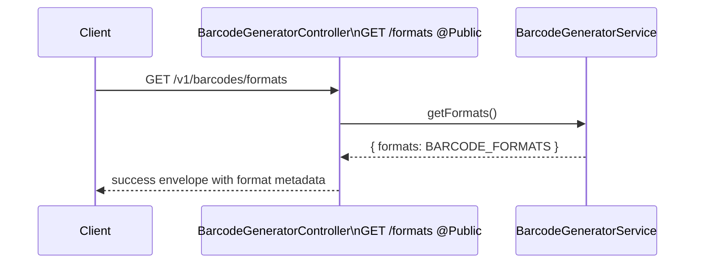

### `POST /v1/barcodes`

What it does:

- Creates a new active barcode for the authenticated user.
- Normalizes and validates content for the selected format.
- Prevents duplicate active barcodes for the same user and render inputs.
- Renders SVG through `BarcodeRendererService`.
- Stores the normalized input and SVG in MongoDB.

Request body:

```json
{
  "format": "CODE128",
  "content": "LINKLAB-2026",
  "barWidth": 2,
  "height": 120,
  "margin": 10,
  "barColor": "#111111",
  "backgroundColor": "#ffffff",
  "showValue": true
}
```

Request flow:

1. Client sends `POST /v1/barcodes` with `GenerateBarcodeDto`.
2. JWT guard attaches `req.user`.
3. `ValidationPipe` validates enum, content, dimensions, colors, and boolean
   values.
4. Controller calls `generate(this.getUser(req), dto)`.
5. Service confirms the user still exists in MongoDB.
6. Service calls `prepareBarcodeInput`.
7. `prepareBarcodeContent` trims content and applies format-specific rules.
8. GTIN formats calculate or validate the check digit.
9. Colors are stored lowercase.
10. Service hashes the normalized render input.
11. Service checks for an existing non-deleted barcode with the same user and
    render inputs.
12. Renderer calls `bwipjs.toSVG`.
13. Service creates the MongoDB document with `status=active`.
14. Service serializes and returns the barcode.

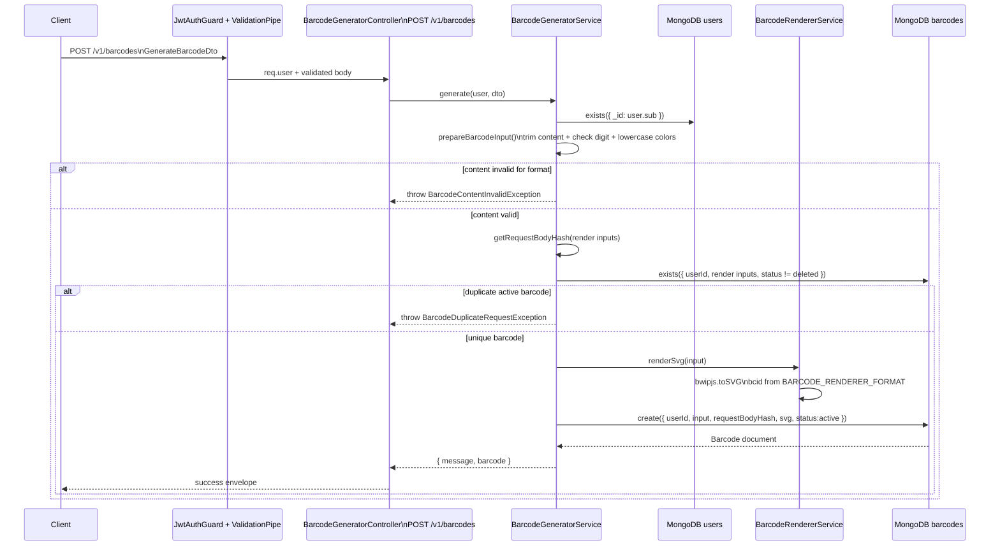

### `GET /v1/barcodes`

What it does:

- Lists non-deleted barcodes owned by the authenticated user.
- Sorts newest first.
- Returns page metadata and a cursor-like last item id.

Query parameters:

- `page`: optional, defaults to `1`, minimum `1`.
- `limit`: optional, defaults to `10`, maximum `50`.

Request flow:

1. Client calls `GET /v1/barcodes?page=1&limit=10`.
2. Controller extracts the authenticated user.
3. Service confirms the user exists.
4. Service calculates `skip = (page - 1) * limit`.
5. Service queries non-deleted barcodes sorted by `createdAt` and `_id`
   descending.
6. Service counts total non-deleted records for pagination.
7. Service serializes each barcode.
8. Service returns `items` and `pagination`.

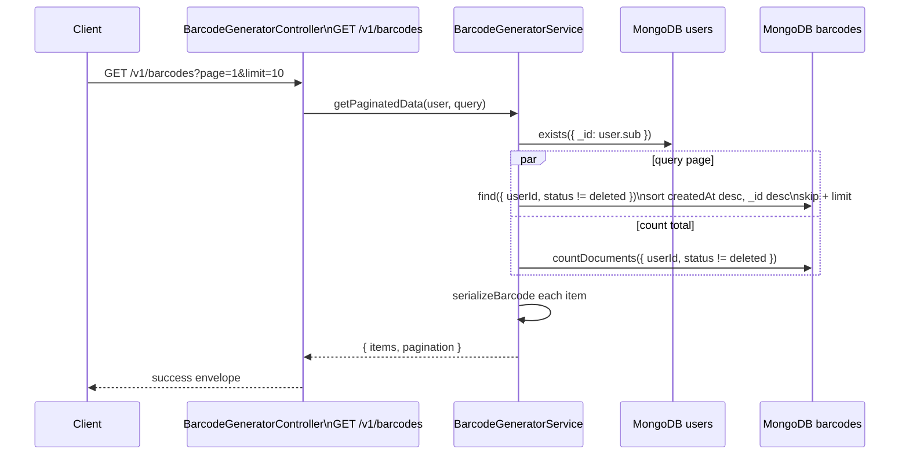

### `GET /v1/barcodes/analytics`

What it does:

- Returns dashboard totals for the authenticated user.
- Counts generated non-deleted barcodes.
- Sums total downloads.
- Finds the most-used format by count.

Returned fields:

- `generated`: total non-deleted barcode records.
- `downloads`: sum of `totalDownloads`.
- `format`: count of the most-used format. This is currently a count, not the
  format name.

Request flow:

1. Controller extracts the authenticated user.
2. Service confirms the user exists.
3. Service runs three MongoDB operations in parallel:
   `countDocuments`, download aggregation, and top-format aggregation.
4. Service returns zero defaults if aggregation rows are empty.

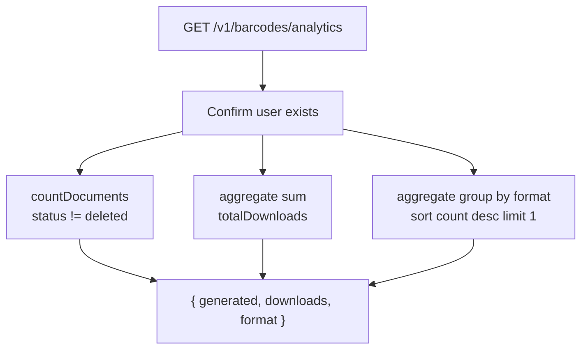

### `GET /v1/barcodes/analytics/activity/:period/:date`

What it does:

- Aggregates barcode creation activity for week, month, or year.
- Uses UTC ranges.
- Compares selected-period total with the previous equivalent period.
- Fills missing labels with count `0`.

Accepted dates:

- `week`: `YYYY-Www`, for example `2026-W01`.
- `month`: `YYYY-MM`, for example `2026-06`.
- `year`: `YYYY`, for example `2026`.

Request flow:

1. Client calls a period route such as
   `GET /v1/barcodes/analytics/activity/week/2026-W01`.
2. Controller passes `{ period, date }` to the service.
3. Service confirms the user exists.
4. Service validates and converts the period/date into `start`, `end`,
   `previousStart`, `previousEnd`, labels, and Mongo date format.
5. Service aggregates current points by date/month.
6. Service counts current total and previous total.
7. Service calculates growth.
8. Service maps expected labels and fills missing counts with `0`.

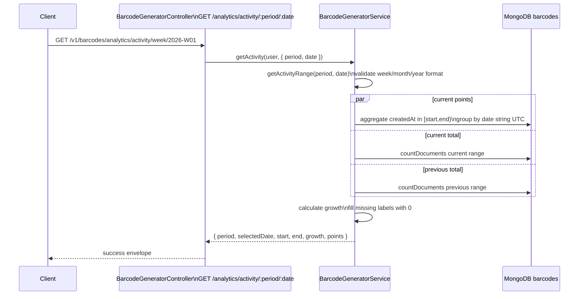

### `GET /v1/barcodes/analytics/format-mix`

What it does:

- Returns distribution of generated barcode formats.
- Returns total SVG and PNG downloads.
- Calculates percentage share for each format.

Request flow:

1. Controller extracts the authenticated user.
2. Service confirms the user exists.
3. Service counts total generated barcodes.
4. Service groups barcodes by `format`.
5. Service sums `downloadCounts.svg` and `downloadCounts.png`.
6. Service calculates `percentage = count / generated * 100`.
7. Service returns zero-safe distribution data.

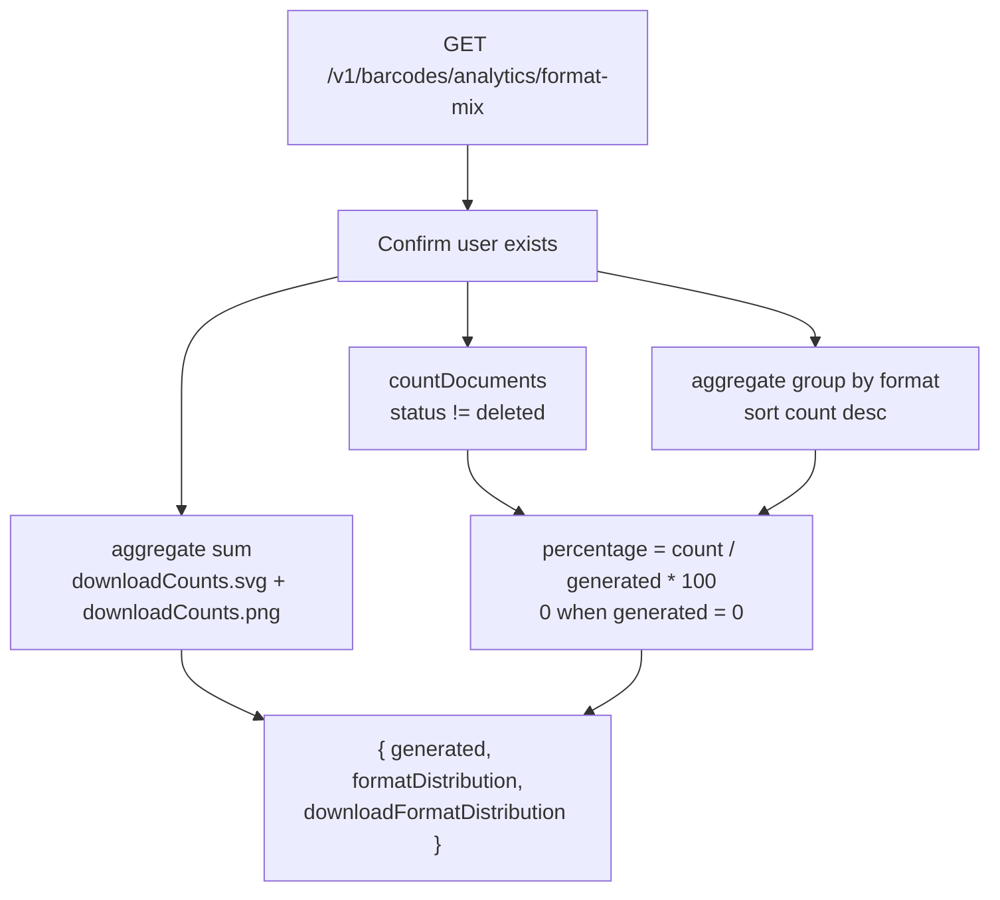

### `GET /v1/barcodes/:id`

What it does:

- Returns one owned non-deleted barcode.
- Rejects invalid ids, missing barcodes, deleted barcodes, and cross-user access.

Request flow:

1. Controller extracts `id` and authenticated user.
2. Service confirms the user exists.
3. Service converts `id` to a Mongo ObjectId.
4. Service loads the barcode by id.
5. Service rejects missing or deleted records.
6. Service compares `barcode.userId` with the authenticated user id.
7. Service returns the serialized barcode.

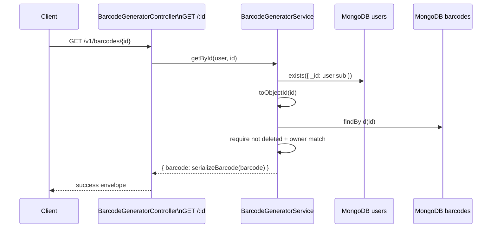

### `PUT /v1/barcodes/:id`

What it does:

- Updates any subset of render fields.
- Rejects empty updates.
- Rejects no-op updates.
- Revalidates the merged input.
- Rerenders SVG when render inputs change.
- Updates the duplicate hash.

Request flow:

1. Client sends a partial `UpdateBarcodeDto`.
2. Controller extracts `id`, body, and authenticated user.
3. Service rejects an empty body.
4. Service loads the owned non-deleted barcode.
5. Service merges existing values with incoming values.
6. Service prepares and validates the merged input.
7. Service compares merged input with the existing document.
8. Service rejects if no render-relevant field changed.
9. Service rerenders SVG through `BarcodeRendererService`.
10. Service updates document fields, `requestBodyHash`, and `svg`.
11. Service saves the document.
12. Duplicate key errors become `BarcodeDuplicateRequestException`.

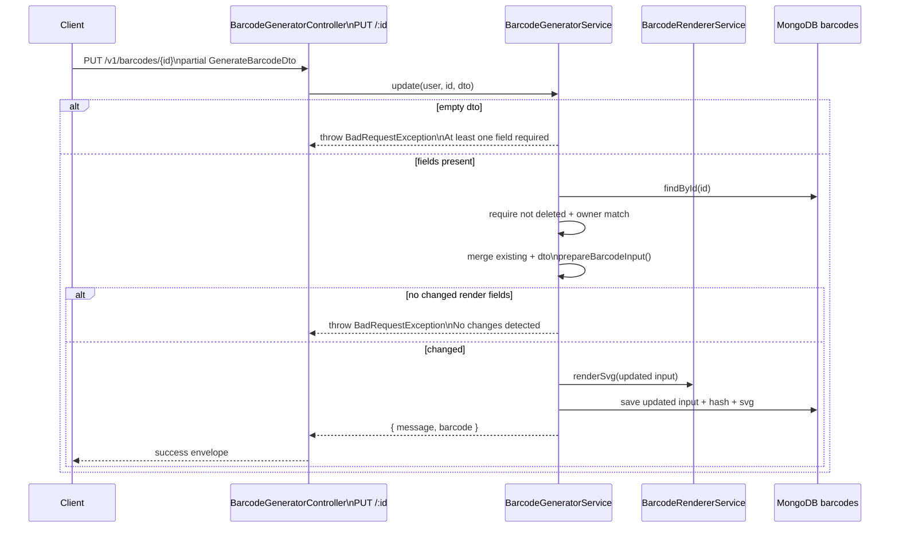

### `DELETE /v1/barcodes/:id`

What it does:

- Soft-deletes an owned barcode.
- Sets `status=deleted`.
- Sets `deletedAt`.
- Clears `requestBodyHash` so the same render inputs can be generated again.

Request flow:

1. Controller extracts `id` and authenticated user.
2. Service loads the owned non-deleted barcode.
3. Service sets `status` to `deleted`.
4. Service sets `deletedAt` to now.
5. Service sets `requestBodyHash` to `null`.
6. Service saves the document.
7. Service returns a delete message.

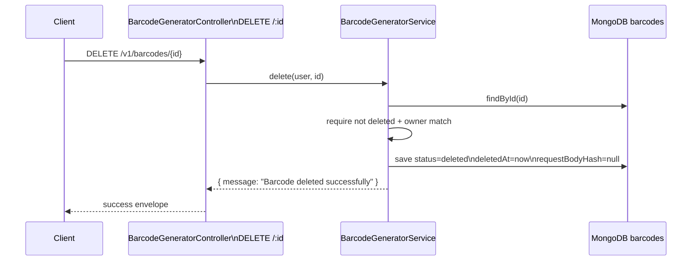

### `GET /v1/barcodes/:id/preview`

What it does:

- Returns the stored SVG as an inline file.
- Skips the success response wrapper.
- Does not increment download counters.

Headers:

- `Content-Type: image/svg+xml; charset=utf-8`
- `Cache-Control: private, max-age=3600`
- `Content-Disposition: inline; filename="barcode-{format}-{id}.svg"`

Request flow:

1. Controller extracts `id` and authenticated user.
2. Service loads the owned non-deleted barcode.
3. Service returns `Buffer.from(barcode.svg, 'utf8')`, content type, and file
   name.
4. Controller sets inline SVG headers.
5. Controller sends raw SVG bytes.

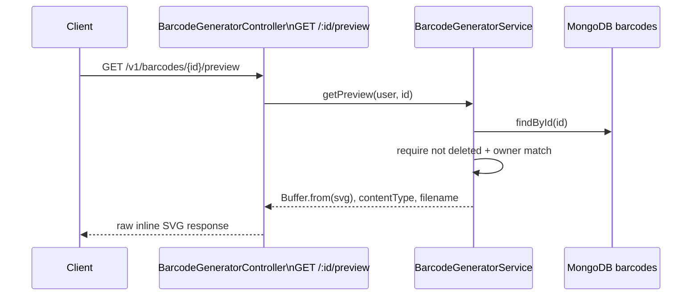

### `GET /v1/barcodes/:id/download?type=svg|png`

What it does:

- Returns a stored SVG or generated PNG as an attachment.
- Skips the success response wrapper.
- Increments download analytics after file creation.
- Records latest download type and timestamp.

Headers:

- SVG: `Content-Type: image/svg+xml; charset=utf-8`
- PNG: `Content-Type: image/png`
- `Cache-Control: private, no-store`
- `Content-Disposition: attachment; filename="barcode-{format}-{id}.{type}"`

Request flow:

1. Client calls `GET /v1/barcodes/{id}/download?type=svg` or
   `GET /v1/barcodes/{id}/download?type=png`.
2. `DownloadBarcodeDto` validates `type`.
3. Controller extracts authenticated user and calls `download`.
4. Service loads the owned non-deleted barcode.
5. If `type=svg`, service returns `Buffer.from(barcode.svg, 'utf8')`.
6. If `type=png`, service uses `sharp` to convert stored SVG to PNG.
7. Service increments `totalDownloads`.
8. Service increments `downloadCounts.svg` or `downloadCounts.png`.
9. Service sets `lastDownloadType` and `lastDownloadedAt`.
10. Controller sends the file as a raw attachment.

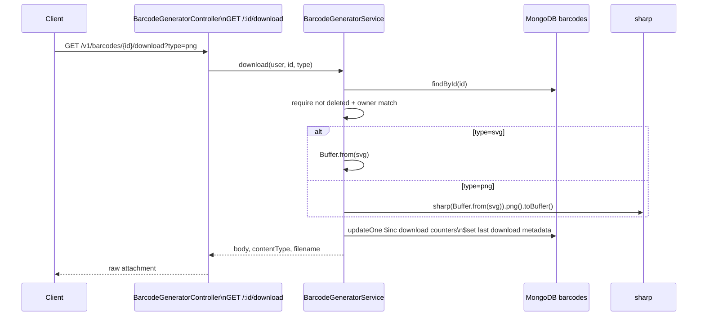

## End-to-end map

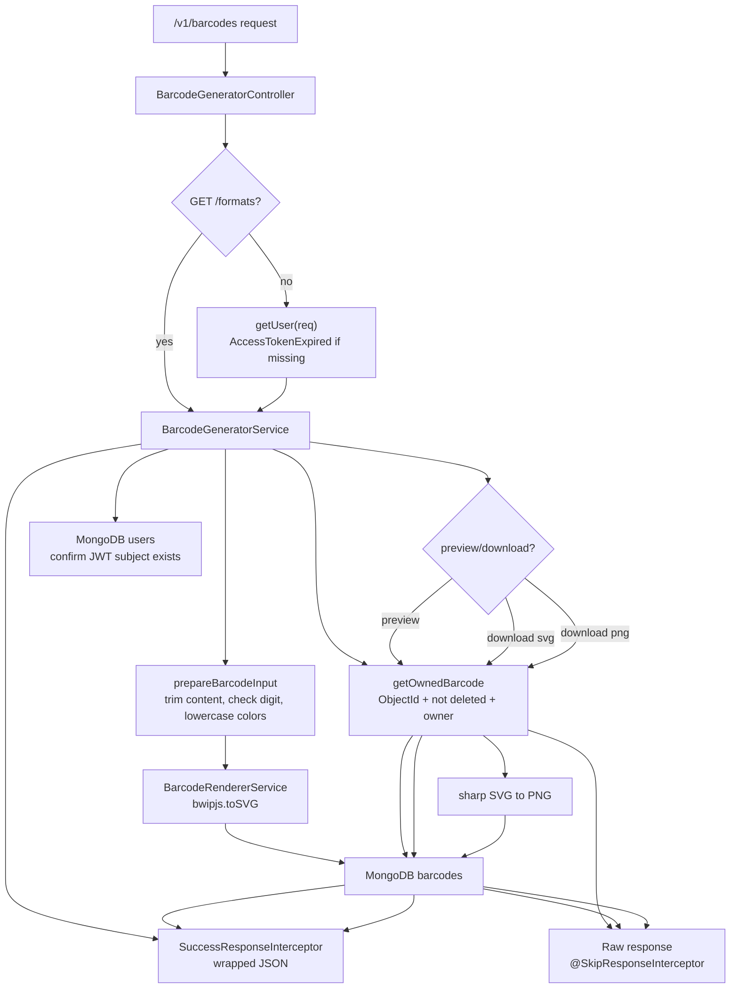

## Detailed working of POST `/v1/barcodes`

This API creates one barcode for the logged-in user and stores the generated SVG
in MongoDB.

Route:

```txt
POST /v1/barcodes
```

Controller method:

```ts
@Post()
generate(@Body() dto: GenerateBarcodeDto, @Req() req: AuthenticatedRequest) {
  return this.barcodeService.generate(this.getUser(req), dto);
}
```

Example request body:

```json
{
  "format": "CODE128",
  "content": "LINKLAB-2025",
  "barWidth": 2,
  "height": 100,
  "margin": 10,
  "barColor": "#000000",
  "backgroundColor": "#ffffff",
  "showValue": true
}
```

### Step 1: DTO validates the request body

`GenerateBarcodeDto` checks that the request body has valid barcode options.

Validation rules:

- `format` must be one of `CODE128`, `EAN13`, `UPCA`, `CODE39`, or `ITF14`.
- `content` must be a non-empty string.
- `content` must not exceed 256 characters.
- `barWidth` must be an integer from `1` to `5`.
- `height` must be an integer from `40` to `300`.
- `margin` must be an integer from `0` to `100`.
- `barColor` must be a six-digit hex color, such as `#000000`.
- `backgroundColor` must be a six-digit hex color, such as `#ffffff`.
- `showValue` must be a boolean.

If validation fails, the request stops before reaching the service.

### Step 2: Controller gets the authenticated user

The controller calls:

```ts
this.getUser(req)
```

`getUser` expects the authentication layer to place the JWT payload on
`req.user`.

```ts
private getUser(req: AuthenticatedRequest): JwtPayload {
  if (!req.user) {
    throw new AccessTokenExpired();
  }

  return req.user;
}
```

If `req.user` is missing, the API throws `AccessTokenExpired`.

### Step 3: Service verifies the user still exists

The service starts with:

```ts
const userId = await this.getAuthenticatedUserId(user);
```

`getAuthenticatedUserId` does two checks:

1. Converts `user.sub` into a MongoDB `ObjectId`.
2. Checks the `users` collection to confirm that user still exists.

```ts
const userId = toObjectId(user.sub, 'Authenticated user id is invalid');
const userExists = await this.userModel.exists({ _id: userId });
```

If the user does not exist anymore, it throws `AccessTokenExpired`.

Console-style flow:

```txt
JWT user.sub received
Convert user.sub to ObjectId
Check users collection
If user exists, continue
If user does not exist, throw AccessTokenExpired
```

### Step 4: Service prepares barcode input

The service calls:

```ts
const barcodeInput = this.prepareBarcodeInput(dto);
```

`prepareBarcodeInput` validates and normalizes barcode content.

```ts
private prepareBarcodeInput(input: BarcodeInput): BarcodeInput {
  const preparedContent = prepareBarcodeContent(input.format, input.content);

  if (!preparedContent.success) {
    throw new BarcodeContentInvalidException(preparedContent.error);
  }

  return {
    ...input,
    content: preparedContent.content,
    barColor: input.barColor.toLowerCase(),
    backgroundColor: input.backgroundColor.toLowerCase(),
  };
}
```

It does these things:

1. Calls `prepareBarcodeContent(format, content)`.
2. Throws `BarcodeContentInvalidException` if the content is invalid.
3. Stores the normalized content.
4. Converts colors to lowercase.

Example:

```txt
Input content: " LINKLAB-2025 "
Input barColor: "#ABCDEF"
Input backgroundColor: "#FFFFFF"

Prepared content: "LINKLAB-2025"
Prepared barColor: "#abcdef"
Prepared backgroundColor: "#ffffff"
```

### Step 5: Content is checked by barcode format

`prepareBarcodeContent` lives in `barcode-content.utils.ts`.

It performs this flow:

```txt
Trim content
Check content is not empty
Load content rule for selected format
Add missing check digit if that format supports it
Check final content against the format pattern
Validate check digit if full content was provided
Return final content
```

Format behavior:

- `CODE128`: accepts general text from 1 to 128 characters.
- `EAN13`: accepts 12 digits and adds the 13th check digit, or validates 13 digits.
- `UPCA`: accepts 11 digits and adds the 12th check digit, or validates 12 digits.
- `CODE39`: accepts uppercase letters, digits, space, and `- . $ / + %`.
- `ITF14`: accepts 13 digits and adds the 14th check digit, or validates 14 digits.

Example for `EAN13`:

```txt
Input: 590123412345
Server calculates check digit: 7
Final content: 5901234123457
```

Example invalid check digit:

```txt
Input: 5901234123458
Expected check digit: 7
Actual check digit: 8
Error: EAN13 check digit is invalid. Expected 7 for 590123412345.
```

### Step 6: Service creates the request hash

The service calls:

```ts
const requestBodyHash = this.getRequestBodyHash(barcodeInput);
```

This creates a SHA-256 hash from the final barcode input.

```ts
private getRequestBodyHash(input: BarcodeInput): string {
  return createHash('sha256')
    .update(
      JSON.stringify({
        format: input.format,
        content: input.content,
        barWidth: input.barWidth,
        height: input.height,
        margin: input.margin,
        barColor: input.barColor,
        backgroundColor: input.backgroundColor,
        showValue: input.showValue,
      }),
    )
    .digest('hex');
}
```

The hash is based on:

- `format`
- `content`
- `barWidth`
- `height`
- `margin`
- `barColor`
- `backgroundColor`
- `showValue`

This hash represents the unique identity of a barcode request.

### Step 7: Service checks duplicate barcode by request hash

The service checks if the same user already has the same active barcode.

```ts
const existingBarcode = await this.barcodeModel
  .exists({
    userId,
    requestBodyHash,
    status: { $ne: BarcodeStatus.DELETED },
  })
  .exec();

if (existingBarcode) {
  throw new BarcodeDuplicateRequestException();
}
```

Meaning:

```txt
Same user + same requestBodyHash + not deleted = duplicate barcode
```

Deleted barcodes are ignored because the filter uses:

```ts
status: { $ne: BarcodeStatus.DELETED }
```

This is the same idea as checking:

```txt
soft deleted = false
```

When a barcode is deleted, the delete function also clears the hash:

```ts
barcode.status = BarcodeStatus.DELETED;
barcode.deletedAt = new Date();
barcode.requestBodyHash = null;
```

So a deleted barcode does not block the user from generating the same barcode
again later.

### Step 8: Service renders the barcode SVG

The service calls:

```ts
const svg = this.renderer.renderSvg(barcodeInput);
```

`BarcodeRendererService` uses `@bwip-js/node`.

```ts
return bwipjs.toSVG({
  bcid: BARCODE_RENDERER_FORMAT[dto.format],
  text: dto.content.trim(),
  scale,
  height: heightInMillimeters,
  paddingleft: padding,
  paddingright: padding,
  paddingtop: padding,
  paddingbottom: padding,
  includetext: dto.showValue,
  textxalign: 'center',
  barcolor: dto.barColor,
  textcolor: dto.barColor,
  backgroundcolor: dto.backgroundColor,
});
```

Format mapping:

```txt
CODE128 -> code128
EAN13   -> ean13
UPCA    -> upca
CODE39  -> code39
ITF14   -> itf14
```

Output:

```txt
svg = "<svg ...>...</svg>"
```

### Step 9: Service saves barcode in MongoDB

The service creates the barcode document:

```ts
const barcode = await this.barcodeModel.create({
  userId,
  ...barcodeInput,
  requestBodyHash,
  svg,
  status: BarcodeStatus.ACTIVE,
});
```

Saved document shape:

```json
{
  "userId": "USER_OBJECT_ID",
  "format": "CODE128",
  "content": "LINKLAB-2025",
  "barWidth": 2,
  "height": 100,
  "margin": 10,
  "barColor": "#000000",
  "backgroundColor": "#ffffff",
  "showValue": true,
  "requestBodyHash": "sha256_hash_value",
  "svg": "<svg>...</svg>",
  "status": "active",
  "downloadCounts": {
    "svg": 0,
    "png": 0
  },
  "totalDownloads": 0,
  "lastDownloadType": null,
  "lastDownloadedAt": null
}
```

The schema also has a unique index:

```ts
BarcodeSchema.index(
  { userId: 1, requestBodyHash: 1 },
  {
    unique: true,
    partialFilterExpression: {
      requestBodyHash: { $type: 'string' },
    },
  },
);
```

This protects the database from duplicate active barcode requests.

### Step 10: Duplicate key error is caught

Even though the service checks duplicates before saving, two identical requests
can arrive at almost the same time.

Example:

```txt
Request A checks duplicate: none found
Request B checks duplicate: none found
Request A saves barcode
Request B tries to save same barcode
MongoDB unique index rejects Request B
```

That is why the service also catches duplicate key errors:

```ts
} catch (error) {
  if (isDuplicateKeyError(error)) {
    throw new BarcodeDuplicateRequestException();
  }

  throw error;
}
```

### Step 11: Service returns the response

After saving, the service returns:

```ts
return {
  message: 'Barcode generated successfully',
  barcode: this.serializeBarcode(barcode),
};
```

`serializeBarcode` converts the MongoDB document into the API response shape.

Example response:

```json
{
  "message": "Barcode generated successfully",
  "barcode": {
    "id": "BARCODE_OBJECT_ID",
    "format": "CODE128",
    "content": "LINKLAB-2025",
    "barWidth": 2,
    "height": 100,
    "margin": 10,
    "barColor": "#000000",
    "backgroundColor": "#ffffff",
    "showValue": true,
    "svg": "<svg>...</svg>",
    "downloadCounts": {
      "svg": 0,
      "png": 0
    },
    "totalDownloads": 0,
    "lastDownloadType": null,
    "lastDownloadedAt": null,
    "createdAt": "2026-07-01T00:00:00.000Z",
    "updatedAt": "2026-07-01T00:00:00.000Z"
  }
}
```

### Complete flow

```txt
POST /v1/barcodes
        |
        v
BarcodeGeneratorController.generate()
        |
        v
GenerateBarcodeDto validates request body
        |
        v
getUser(req) checks authenticated user exists on request
        |
        v
BarcodeGeneratorService.generate(user, dto)
        |
        v
getAuthenticatedUserId(user)
        |
        v
prepareBarcodeInput(dto)
        |
        v
prepareBarcodeContent(format, content)
        |
        v
addMissingCheckDigit() if needed
        |
        v
validateCheckDigit() if needed
        |
        v
getRequestBodyHash(barcodeInput)
        |
        v
barcodeModel.exists({ userId, requestBodyHash, status not deleted })
        |
        v
renderer.renderSvg(barcodeInput)
        |
        v
bwipjs.toSVG(...)
        |
        v
barcodeModel.create(...)
        |
        v
serializeBarcode(barcode)
        |
        v
Return JSON response
```

## Detailed working of other barcode APIs

This section explains every Barcode Generator API except `POST /v1/barcodes`,
which is explained above.

## Detailed working of GET `/v1/barcodes/formats`

This API returns the barcode formats supported by LinkLab.

Route:

```txt
GET /v1/barcodes/formats
```

Controller method:

```ts
@Get('formats')
@Public()
getFormats() {
  return this.barcodeService.getFormats();
}
```

Important point:

```txt
This route is public.
It does not require login.
```

Service method:

```ts
getFormats() {
  return {
    formats: BARCODE_FORMATS,
  };
}
```

What happens:

1. Client calls `GET /v1/barcodes/formats`.
2. Controller handles the request.
3. Because of `@Public()`, authentication is skipped.
4. Controller calls `barcodeService.getFormats()`.
5. Service returns `BARCODE_FORMATS`.
6. API returns format metadata to the frontend.

Example response:

```json
{
  "formats": [
    {
      "value": "CODE128",
      "label": "Code 128",
      "description": "General-purpose barcode for text and numbers.",
      "contentRule": "Any text up to 128 characters"
    },
    {
      "value": "EAN13",
      "label": "EAN-13",
      "description": "Retail product barcode used internationally."
    }
  ]
}
```

Console-style flow:

```txt
GET /v1/barcodes/formats
        |
        v
BarcodeGeneratorController.getFormats()
        |
        v
@Public() skips auth requirement
        |
        v
BarcodeGeneratorService.getFormats()
        |
        v
Return BARCODE_FORMATS
```

MongoDB / aggregation explanation:

```txt
This route does not use MongoDB.
This route does not use aggregation.
It only returns the static BARCODE_FORMATS array from code.
```

## Detailed working of GET `/v1/barcodes`

This API lists the logged-in user's active barcodes with pagination.

Route:

```txt
GET /v1/barcodes?page=1&limit=10
```

Controller method:

```ts
@Get()
getPaginatedData(
  @Query() query: GetPaginatedBarcodesDto,
  @Req() req: AuthenticatedRequest,
): Promise<PaginatedBarcodesResponse> {
  return this.barcodeService.getPaginatedData(this.getUser(req), query);
}
```

Query DTO:

```ts
export class GetPaginatedBarcodesDto {
  page: number = 1;
  limit: number = DEFAULT_BARCODE_PAGE_LIMIT;
}
```

Validation rules:

- `page` is optional.
- `page` must be an integer.
- `page` must be at least `1`.
- `limit` is optional.
- `limit` must be an integer.
- `limit` must be at least `1`.
- `limit` must not exceed `50`.

Service method:

```ts
async getPaginatedData(
  user: JwtPayload,
  query: GetPaginatedBarcodesDto,
): Promise<PaginatedBarcodesResponse> {
  const userId = await this.getAuthenticatedUserId(user);
  const page = query.page;
  const limit = query.limit;
  const skip = (page - 1) * limit;

  const [barcodes, total] = await Promise.all([
    this.barcodeModel
      .find({
        userId,
        status: { $ne: BarcodeStatus.DELETED },
      })
      .sort({
        createdAt: -1,
        _id: -1,
      })
      .skip(skip)
      .limit(limit)
      .exec(),

    this.barcodeModel
      .countDocuments({
        userId,
        status: { $ne: BarcodeStatus.DELETED },
      })
      .exec(),
  ]);
}
```

What happens:

1. Client calls `GET /v1/barcodes?page=1&limit=10`.
2. DTO validates `page` and `limit`.
3. Controller calls `getUser(req)`.
4. Service verifies the authenticated user still exists.
5. Service calculates `skip`.
6. Service fetches non-deleted barcodes owned by that user.
7. Service counts total non-deleted barcodes owned by that user.
8. Service serializes each barcode.
9. Service returns `items` and `pagination`.

Pagination calculation:

```txt
page = 1
limit = 10
skip = (page - 1) * limit
skip = 0
```

MongoDB filter:

```ts
{
  userId,
  status: { $ne: BarcodeStatus.DELETED }
}
```

This means:

```txt
Only return barcodes owned by current user.
Do not return soft-deleted barcodes.
```

Sorting:

```ts
sort({
  createdAt: -1,
  _id: -1,
})
```

This means:

```txt
Newest barcode first.
If two barcodes have same createdAt, sort by newest _id.
```

MongoDB / aggregation explanation:

This route does not use MongoDB aggregation. It uses normal Mongoose queries
because the API needs real barcode documents, not calculated grouped data.

First query:

```ts
this.barcodeModel
  .find({
    userId,
    status: { $ne: BarcodeStatus.DELETED },
  })
  .sort({
    createdAt: -1,
    _id: -1,
  })
  .skip(skip)
  .limit(limit)
  .exec()
```

This means:

```txt
Find active barcodes for current user.
Sort newest first.
Skip previous page records.
Return only current page records.
```

Second query:

```ts
this.barcodeModel
  .countDocuments({
    userId,
    status: { $ne: BarcodeStatus.DELETED },
  })
  .exec()
```

This means:

```txt
Count all active barcodes for current user.
This count is used to build totalItems, totalPages, and hasMore.
```

Example response:

```json
{
  "items": [
    {
      "id": "BARCODE_OBJECT_ID",
      "format": "CODE128",
      "content": "LINKLAB-2025",
      "barWidth": 2,
      "height": 100,
      "margin": 10,
      "barColor": "#000000",
      "backgroundColor": "#ffffff",
      "showValue": true,
      "svg": "<svg>...</svg>",
      "downloadCounts": {
        "svg": 0,
        "png": 0
      },
      "totalDownloads": 0,
      "lastDownloadType": null,
      "lastDownloadedAt": null
    }
  ],
  "pagination": {
    "totalItems": 1,
    "totalPages": 1,
    "hasMore": false,
    "page": 1,
    "limit": 10,
    "cursor": "BARCODE_OBJECT_ID"
  }
}
```

Console-style flow:

```txt
GET /v1/barcodes?page=1&limit=10
        |
        v
Validate query DTO
        |
        v
getUser(req)
        |
        v
getAuthenticatedUserId(user)
        |
        v
Calculate skip
        |
        v
Find active barcodes for user
        |
        v
Count total active barcodes for user
        |
        v
serializeBarcode() for each item
        |
        v
Return items + pagination
```

## Detailed working of GET `/v1/barcodes/analytics`

This API returns summary numbers for the logged-in user's barcode dashboard.

Route:

```txt
GET /v1/barcodes/analytics
```

Controller method:

```ts
@Get('analytics')
getSummary(@Req() req: AuthenticatedRequest) {
  return this.barcodeService.getAnalytics(this.getUser(req));
}
```

Service method:

```ts
async getAnalytics(user: JwtPayload) {
  const userId = await this.getAuthenticatedUserId(user);

  const [generated, downloadAggregation, topFormatRows] = await Promise.all([
    this.barcodeModel.countDocuments({ userId, status: { $ne: BarcodeStatus.DELETED } }),
    this.barcodeModel.aggregate([{ $match: ... }, { $group: ... }]),
    this.barcodeModel.aggregate([{ $match: ... }, { $group: ... }, { $sort: ... }, { $limit: 1 }]),
  ]);
}
```

MongoDB aggregation explanation:

This route uses one normal count query and two aggregation pipelines.

First operation, count generated barcodes:

```ts
this.barcodeModel
  .countDocuments({
    userId,
    status: { $ne: BarcodeStatus.DELETED },
  })
  .exec()
```

This returns a number:

```txt
How many active barcodes this user has generated.
```

Second operation, total downloads aggregation:

```ts
this.barcodeModel
  .aggregate<{ total: number }>([
    {
      $match: {
        userId,
        status: { $ne: BarcodeStatus.DELETED },
      },
    },
    {
      $group: {
        _id: null,
        total: { $sum: '$totalDownloads' },
      },
    },
  ])
  .exec()
```

Stage by stage:

```txt
$match
Keep only current user's active barcode documents.

$group
Combine all matched documents into one group because _id is null.

total: { $sum: '$totalDownloads' }
Add totalDownloads from every matched barcode.
```

Example matched documents:

```json
[
  { "content": "A", "totalDownloads": 2 },
  { "content": "B", "totalDownloads": 5 },
  { "content": "C", "totalDownloads": 1 }
]
```

Aggregation output:

```json
[
  {
    "_id": null,
    "total": 8
  }
]
```

Third operation, top format aggregation:

```ts
this.barcodeModel
  .aggregate<{
    _id: BarcodeFormat;
    count: number;
  }>([
    {
      $match: {
        userId,
        status: { $ne: BarcodeStatus.DELETED },
      },
    },
    {
      $group: {
        _id: '$format',
        count: { $sum: 1 },
      },
    },
    {
      $sort: {
        count: -1,
      },
    },
    {
      $limit: 1,
    },
  ])
  .exec()
```

Stage by stage:

```txt
$match
Keep only current user's active barcode documents.

$group
Group documents by format, for example CODE128 or EAN13.

count: { $sum: 1 }
Add 1 for every barcode in that format group.

$sort
Sort groups by count from highest to lowest.

$limit
Keep only the first row, which is the most-used format.
```

Example aggregation output:

```json
[
  {
    "_id": "CODE128",
    "count": 7
  }
]
```

What happens:

1. Client calls `GET /v1/barcodes/analytics`.
2. Controller checks authenticated user.
3. Service verifies user exists.
4. Service counts active generated barcodes.
5. Service aggregates total downloads.
6. Service finds the most-used format row.
7. Service returns summary numbers.

Returned fields:

- `generated`: total active barcodes created by the user.
- `downloads`: total downloads across all active barcodes.
- `format`: count of the most-used barcode format.

Important note:

```txt
The field named "format" returns a count, not the format name.
For example, if CODE128 is used 7 times, format is 7.
```

Example response:

```json
{
  "generated": 12,
  "downloads": 30,
  "format": 7
}
```

Console-style flow:

```txt
GET /v1/barcodes/analytics
        |
        v
getUser(req)
        |
        v
getAuthenticatedUserId(user)
        |
        v
Count active barcodes
        |
        v
Sum totalDownloads
        |
        v
Group by format and pick top count
        |
        v
Return summary
```

## Detailed working of GET `/v1/barcodes/:id`

This API returns one barcode by id.

Route:

```txt
GET /v1/barcodes/:id
```

Example:

```txt
GET /v1/barcodes/665f1234567890abcdef1234
```

Controller method:

```ts
@Get(':id')
getById(@Param('id') id: string, @Req() req: AuthenticatedRequest) {
  return this.barcodeService.getById(this.getUser(req), id);
}
```

Service method:

```ts
async getById(user: JwtPayload, barcodeId: string) {
  const barcode = await this.getOwnedBarcode(user, barcodeId);

  return {
    barcode: this.serializeBarcode(barcode),
  };
}
```

The important helper is `getOwnedBarcode`.

```ts
private async getOwnedBarcode(
  user: JwtPayload,
  barcodeId: string,
): Promise<BarcodeDocument> {
  const userId = await this.getAuthenticatedUserId(user);
  const id = toObjectId(barcodeId, 'Barcode id is invalid');
  const barcode = await this.barcodeModel.findById(id).exec();

  if (!barcode || barcode.status === BarcodeStatus.DELETED) {
    throw new BarcodeNotFoundException();
  }

  if (String(barcode.userId) !== String(userId)) {
    throw new BarcodeAccessDeniedException();
  }

  return barcode;
}
```

What happens:

1. Client calls `GET /v1/barcodes/:id`.
2. Controller checks authenticated user.
3. Service verifies user exists.
4. Service converts `:id` to MongoDB `ObjectId`.
5. Service finds barcode by id.
6. If barcode does not exist, throw `BarcodeNotFoundException`.
7. If barcode is deleted, throw `BarcodeNotFoundException`.
8. If barcode belongs to another user, throw `BarcodeAccessDeniedException`.
9. Service serializes barcode and returns it.

Example response:

```json
{
  "barcode": {
    "id": "665f1234567890abcdef1234",
    "format": "CODE128",
    "content": "LINKLAB-2025",
    "barWidth": 2,
    "height": 100,
    "margin": 10,
    "barColor": "#000000",
    "backgroundColor": "#ffffff",
    "showValue": true,
    "svg": "<svg>...</svg>",
    "downloadCounts": {
      "svg": 0,
      "png": 0
    },
    "totalDownloads": 0,
    "lastDownloadType": null,
    "lastDownloadedAt": null
  }
}
```

Console-style flow:

```txt
GET /v1/barcodes/:id
        |
        v
getUser(req)
        |
        v
getOwnedBarcode(user, id)
        |
        v
Verify user exists
        |
        v
Convert id to ObjectId
        |
        v
Find barcode by id
        |
        v
Check not deleted
        |
        v
Check owner
        |
        v
serializeBarcode()
        |
        v
Return barcode
```

MongoDB / aggregation explanation:

This route does not use aggregation. It uses a direct lookup by MongoDB `_id`.

```ts
const id = toObjectId(barcodeId, 'Barcode id is invalid');
const barcode = await this.barcodeModel.findById(id).exec();
```

This means:

```txt
Convert route id string to ObjectId.
Find one barcode document by _id.
Then application code checks status and owner.
```

The owner check is done in TypeScript after loading the document:

```ts
if (String(barcode.userId) !== String(userId)) {
  throw new BarcodeAccessDeniedException();
}
```

## Detailed working of PUT `/v1/barcodes/:id`

This API updates one barcode owned by the logged-in user.

Route:

```txt
PUT /v1/barcodes/:id
```

Example request:

```json
{
  "content": "LINKLAB-2026",
  "barColor": "#ff0000"
}
```

Controller method:

```ts
@Put(':id')
edit(
  @Param('id') id: string,
  @Body() dto: UpdateBarcodeDto,
  @Req() req: AuthenticatedRequest,
) {
  return this.barcodeService.update(this.getUser(req), id, dto);
}
```

`UpdateBarcodeDto` is a partial version of `GenerateBarcodeDto`.

That means the client can update one field, many fields, or all fields.

Service method starts with:

```ts
if (Object.keys(dto).length === 0) {
  throw new BadRequestException({
    message: 'At least one field is required to update the barcode',
    error: 'Bad Request',
  });
}
```

So an empty body is rejected.

Then the service loads the barcode:

```ts
const barcode = await this.getOwnedBarcode(user, barcodeId);
```

This checks:

- user exists
- barcode id is valid
- barcode exists
- barcode is not deleted
- barcode belongs to the logged-in user

Then it merges old values with new values:

```ts
const barcodeInput = this.prepareBarcodeInput({
  format: dto.format ?? barcode.format,
  content: dto.content ?? barcode.content,
  barWidth: dto.barWidth ?? barcode.barWidth,
  height: dto.height ?? barcode.height,
  margin: dto.margin ?? barcode.margin,
  barColor: dto.barColor ?? barcode.barColor,
  backgroundColor: dto.backgroundColor ?? barcode.backgroundColor,
  showValue: dto.showValue ?? barcode.showValue,
});
```

Meaning:

```txt
If dto has a new value, use it.
Otherwise keep the existing database value.
```

Then the final merged input is validated again by `prepareBarcodeInput`.

After validation, service checks if anything actually changed:

```ts
const hasChanges =
  barcode.format !== barcodeInput.format ||
  barcode.content !== barcodeInput.content ||
  barcode.barWidth !== barcodeInput.barWidth ||
  barcode.height !== barcodeInput.height ||
  barcode.margin !== barcodeInput.margin ||
  barcode.barColor !== barcodeInput.barColor ||
  barcode.backgroundColor !== barcodeInput.backgroundColor ||
  barcode.showValue !== barcodeInput.showValue;
```

If nothing changed:

```ts
throw new BadRequestException({
  message: 'No changes detected for the barcode',
  error: 'Bad Request',
});
```

If changes exist, the service updates the document:

```ts
barcode.format = barcodeInput.format;
barcode.content = barcodeInput.content;
barcode.barWidth = barcodeInput.barWidth;
barcode.height = barcodeInput.height;
barcode.margin = barcodeInput.margin;
barcode.barColor = barcodeInput.barColor;
barcode.backgroundColor = barcodeInput.backgroundColor;
barcode.showValue = barcodeInput.showValue;
barcode.requestBodyHash = this.getRequestBodyHash(barcodeInput);
barcode.svg = this.renderer.renderSvg(barcodeInput);
```

Important:

```txt
Updating barcode content or style regenerates the SVG.
The old SVG is replaced with the new SVG.
The requestBodyHash is recalculated.
```

Then it saves:

```ts
await barcode.save();
```

If the new barcode matches another existing barcode for the same user, MongoDB
can throw a duplicate key error. The service catches that and throws
`BarcodeDuplicateRequestException`.

Example response:

```json
{
  "message": "Barcode updated successfully",
  "barcode": {
    "id": "665f1234567890abcdef1234",
    "format": "CODE128",
    "content": "LINKLAB-2026",
    "barWidth": 2,
    "height": 100,
    "margin": 10,
    "barColor": "#ff0000",
    "backgroundColor": "#ffffff",
    "showValue": true,
    "svg": "<svg>new svg</svg>"
  }
}
```

Console-style flow:

```txt
PUT /v1/barcodes/:id
        |
        v
Validate update body
        |
        v
Reject empty body
        |
        v
getUser(req)
        |
        v
getOwnedBarcode(user, id)
        |
        v
Merge dto fields with existing barcode fields
        |
        v
prepareBarcodeInput(mergedInput)
        |
        v
Check if any field changed
        |
        v
Recalculate requestBodyHash
        |
        v
Regenerate SVG
        |
        v
Save updated document
        |
        v
Return updated barcode
```

MongoDB / aggregation explanation:

This route does not use aggregation. It uses document lookup and document save.

First MongoDB operation:

```ts
const barcode = await this.getOwnedBarcode(user, barcodeId);
```

Internally, `getOwnedBarcode` uses:

```ts
const barcode = await this.barcodeModel.findById(id).exec();
```

This loads the existing barcode document.

Second MongoDB operation:

```ts
await barcode.save();
```

This writes the changed fields back to MongoDB:

```txt
format
content
barWidth
height
margin
barColor
backgroundColor
showValue
requestBodyHash
svg
updatedAt
```

MongoDB unique index can still reject the save if the new `requestBodyHash`
duplicates another active barcode for the same user.

## Detailed working of DELETE `/v1/barcodes/:id`

This API soft-deletes one barcode.

Route:

```txt
DELETE /v1/barcodes/:id
```

Controller method:

```ts
@Delete(':id')
delete(@Param('id') id: string, @Req() req: AuthenticatedRequest) {
  return this.barcodeService.delete(this.getUser(req), id);
}
```

Service method:

```ts
async delete(user: JwtPayload, barcodeId: string) {
  const barcode = await this.getOwnedBarcode(user, barcodeId);

  barcode.status = BarcodeStatus.DELETED;
  barcode.deletedAt = new Date();
  barcode.requestBodyHash = null;

  await barcode.save();

  return {
    message: 'Barcode deleted successfully',
  };
}
```

What happens:

1. Client calls `DELETE /v1/barcodes/:id`.
2. Controller checks authenticated user.
3. Service loads owned barcode using `getOwnedBarcode`.
4. Service sets `status` to `deleted`.
5. Service sets `deletedAt`.
6. Service clears `requestBodyHash`.
7. Service saves the document.
8. Service returns success message.

Important:

```txt
The barcode is not physically removed from MongoDB.
It is only marked as deleted.
```

This is called soft delete.

Why clear `requestBodyHash`?

```txt
The requestBodyHash is used to prevent duplicate active barcodes.
If a barcode is deleted, the same user should be able to generate it again.
Clearing the hash allows that.
```

Example response:

```json
{
  "message": "Barcode deleted successfully"
}
```

Console-style flow:

```txt
DELETE /v1/barcodes/:id
        |
        v
getUser(req)
        |
        v
getOwnedBarcode(user, id)
        |
        v
Set status = deleted
        |
        v
Set deletedAt = current date
        |
        v
Set requestBodyHash = null
        |
        v
Save document
        |
        v
Return success message
```

MongoDB / aggregation explanation:

This route does not use aggregation. It uses document lookup and document save.

First MongoDB operation:

```ts
const barcode = await this.getOwnedBarcode(user, barcodeId);
```

This loads the barcode document after checking id, delete status, and owner.

Second MongoDB operation:

```ts
await barcode.save();
```

This saves the soft-delete fields:

```txt
status = deleted
deletedAt = current date
requestBodyHash = null
```

Because `requestBodyHash` becomes `null`, MongoDB's unique hash index will not
block the same barcode from being generated again later.

## Detailed working of GET `/v1/barcodes/analytics/activity/:period/:date`

This API returns chart/activity data for barcode creation over a selected
period.

Route:

```txt
GET /v1/barcodes/analytics/activity/:period/:date
```

Examples:

```txt
GET /v1/barcodes/analytics/activity/week/2026-W01
GET /v1/barcodes/analytics/activity/month/2026-07
GET /v1/barcodes/analytics/activity/year/2026
```

Controller method:

```ts
@Get('analytics/activity/:period/:date')
getActivityByPeriod(
  @Param('period') period: BarcodeActivityPeriod,
  @Param('date') date: string,
  @Req() req: AuthenticatedRequest,
) {
  return this.barcodeService.getActivity(this.getUser(req), {
    period,
    date,
  });
}
```

Allowed period values:

```txt
week
month
year
```

Service method:

```ts
async getActivity(user: JwtPayload, query: GetBarcodeActivityDto) {
  const userId = await this.getAuthenticatedUserId(user);
  const range = getActivityRange(query.period, query.date);
  const activeFilter = {
    userId,
    status: { $ne: BarcodeStatus.DELETED },
  };
  const createdAtFilter = { $gte: range.start, $lt: range.end };
}
```

What `getActivityRange` gives:

- `start`: selected period start date.
- `end`: selected period end date.
- `previousStart`: previous period start date.
- `previousEnd`: previous period end date.
- `labels`: chart labels that should appear in response.
- `mongoDateFormat`: date grouping format for MongoDB.

Then service runs three operations:

1. Aggregate current period rows grouped by date label.
2. Count current period total.
3. Count previous period total.

MongoDB aggregation explanation:

The main aggregation groups barcode creation by date label.

```ts
this.barcodeModel
  .aggregate<{ _id: string; count: number }>([
    { $match: { ...activeFilter, createdAt: createdAtFilter } },
    {
      $group: {
        _id: {
          $dateToString: {
            format: range.mongoDateFormat,
            date: '$createdAt',
            timezone: 'UTC',
          },
        },
        count: { $sum: 1 },
      },
    },
    { $sort: { _id: 1 } },
  ])
  .exec()
```

Stage by stage:

```txt
$match
Keep only current user's active barcodes created inside the selected date range.

$group
Group documents by a formatted createdAt date.

$dateToString
Converts createdAt into a label such as 2026-07-01 or 2026-07.

count: { $sum: 1 }
Counts how many barcodes were created for each date label.

$sort
Sort labels in ascending order so the chart points are chronological.
```

For week and month, `range.mongoDateFormat` is:

```txt
%Y-%m-%d
```

So MongoDB groups by day:

```json
[
  {
    "_id": "2026-07-01",
    "count": 2
  },
  {
    "_id": "2026-07-02",
    "count": 4
  }
]
```

For year, `range.mongoDateFormat` is:

```txt
%Y-%m
```

So MongoDB groups by month:

```json
[
  {
    "_id": "2026-01",
    "count": 12
  },
  {
    "_id": "2026-02",
    "count": 8
  }
]
```

The two `countDocuments` queries are not aggregations:

```ts
this.barcodeModel.countDocuments({
  ...activeFilter,
  createdAt: createdAtFilter,
})

this.barcodeModel.countDocuments({
  ...activeFilter,
  createdAt: { $gte: range.previousStart, $lt: range.previousEnd },
})
```

They are used only to calculate growth between current period and previous
period.

Growth calculation:

```ts
const growth =
  previousTotal === 0
    ? currentTotal > 0
      ? 100
      : 0
    : Number(
        (((currentTotal - previousTotal) / previousTotal) * 100).toFixed(1),
      );
```

Meaning:

```txt
If previous total is 0 and current total is greater than 0, growth is 100.
If both are 0, growth is 0.
Otherwise calculate percentage increase/decrease.
```

Example response:

```json
{
  "period": "month",
  "selectedDate": "2026-07",
  "start": "2026-07-01T00:00:00.000Z",
  "end": "2026-08-01T00:00:00.000Z",
  "growth": 25,
  "points": [
    {
      "label": "2026-07-01",
      "count": 2
    },
    {
      "label": "2026-07-02",
      "count": 0
    }
  ]
}
```

Console-style flow:

```txt
GET /v1/barcodes/analytics/activity/:period/:date
        |
        v
getUser(req)
        |
        v
getAuthenticatedUserId(user)
        |
        v
getActivityRange(period, date)
        |
        v
Build activeFilter with userId and not deleted
        |
        v
Aggregate current period barcode counts
        |
        v
Count current period total
        |
        v
Count previous period total
        |
        v
Calculate growth
        |
        v
Map counts into labels
        |
        v
Return chart points
```

## Detailed working of GET `/v1/barcodes/analytics/format-mix`

This API returns barcode format distribution and download type distribution.

Route:

```txt
GET /v1/barcodes/analytics/format-mix
```

Controller method:

```ts
@Get('analytics/format-mix')
getFormatMix(@Req() req: AuthenticatedRequest) {
  return this.barcodeService.getFormatMix(this.getUser(req));
}
```

Service method:

```ts
async getFormatMix(user: JwtPayload) {
  const userId = await this.getAuthenticatedUserId(user);

  const [generated, formatRows, downloadFormatRows] = await Promise.all([
    this.barcodeModel.countDocuments(...),
    this.barcodeModel.aggregate(...),
    this.barcodeModel.aggregate(...),
  ]);
}
```

MongoDB aggregation explanation:

This route uses one normal count query and two aggregation pipelines.

First operation, count total generated:

```ts
this.barcodeModel
  .countDocuments({
    userId,
    status: { $ne: BarcodeStatus.DELETED },
  })
  .exec()
```

This gives the total number used for percentages.

Second operation, format distribution aggregation:

```ts
this.barcodeModel
  .aggregate<{
    _id: BarcodeFormat;
    count: number;
  }>([
    {
      $match: {
        userId,
        status: { $ne: BarcodeStatus.DELETED },
      },
    },
    {
      $group: {
        _id: '$format',
        count: { $sum: 1 },
      },
    },
    {
      $sort: {
        count: -1,
      },
    },
  ])
  .exec()
```

Stage by stage:

```txt
$match
Keep only active barcodes owned by current user.

$group
Create one group for each format.

_id: '$format'
The group key is the format field.

count: { $sum: 1 }
Count how many documents exist in each format group.

$sort
Sort most-used format first.
```

Example output:

```json
[
  {
    "_id": "CODE128",
    "count": 6
  },
  {
    "_id": "EAN13",
    "count": 4
  }
]
```

Then TypeScript converts it into percentages:

```txt
CODE128 percentage = 6 / 10 * 100 = 60
EAN13 percentage = 4 / 10 * 100 = 40
```

Third operation, download type aggregation:

```ts
this.barcodeModel
  .aggregate<{ svg: number; png: number }>([
    {
      $match: {
        userId,
        status: { $ne: BarcodeStatus.DELETED },
      },
    },
    {
      $group: {
        _id: null,
        svg: { $sum: '$downloadCounts.svg' },
        png: { $sum: '$downloadCounts.png' },
      },
    },
    {
      $project: {
        _id: 0,
        svg: 1,
        png: 1,
      },
    },
  ])
  .exec()
```

Stage by stage:

```txt
$match
Keep only active barcodes owned by current user.

$group
Combine all matched documents into one total row.

svg: { $sum: '$downloadCounts.svg' }
Add all SVG download counts.

png: { $sum: '$downloadCounts.png' }
Add all PNG download counts.

$project
Shape the final output.
Remove _id and keep only svg and png.
```

Example matched documents:

```json
[
  { "downloadCounts": { "svg": 2, "png": 1 } },
  { "downloadCounts": { "svg": 6, "png": 2 } }
]
```

Aggregation output:

```json
[
  {
    "svg": 8,
    "png": 3
  }
]
```

What happens:

1. Client calls `GET /v1/barcodes/analytics/format-mix`.
2. Controller checks authenticated user.
3. Service verifies user exists.
4. Service counts active generated barcodes.
5. Service groups active barcodes by `format`.
6. Service sums download counts for `svg` and `png`.
7. Service calculates percentage for each format.
8. Service returns distribution data.

Format percentage helper:

```ts
private getFormatDistribution(
  rows: Array<{ _id: BarcodeFormat; count: number }>,
  total: number,
) {
  return rows.map((row) => ({
    format: row._id,
    count: row.count,
    percentage:
      total > 0 ? Number(((row.count / total) * 100).toFixed(1)) : 0,
  }));
}
```

Example response:

```json
{
  "generated": 10,
  "formatDistribution": [
    {
      "format": "CODE128",
      "count": 6,
      "percentage": 60
    },
    {
      "format": "EAN13",
      "count": 4,
      "percentage": 40
    }
  ],
  "downloadFormatDistribution": {
    "svg": 8,
    "png": 3
  }
}
```

Console-style flow:

```txt
GET /v1/barcodes/analytics/format-mix
        |
        v
getUser(req)
        |
        v
getAuthenticatedUserId(user)
        |
        v
Count active barcodes
        |
        v
Group active barcodes by format
        |
        v
Sum downloadCounts.svg and downloadCounts.png
        |
        v
Calculate format percentages
        |
        v
Return format mix response
```

## Detailed working of GET `/v1/barcodes/:id/preview`

This API returns the stored barcode SVG inline for preview.

Route:

```txt
GET /v1/barcodes/:id/preview
```

Controller method:

```ts
@Get(':id/preview')
@SkipResponseInterceptor()
async preview(
  @Param('id') id: string,
  @Req() req: AuthenticatedRequest,
  @Res() res: Response,
) {
  const file = await this.barcodeService.getPreview(this.getUser(req), id);
  res.setHeader('Content-Type', file.contentType);
  res.setHeader('Cache-Control', 'private, max-age=3600');
  res.setHeader('Content-Disposition', `inline; filename="${file.filename}"`);
  return res.send(file.body);
}
```

Important:

```txt
This route does not return JSON.
It sends raw SVG file content.
```

That is why it uses:

```ts
@SkipResponseInterceptor()
```

Service method:

```ts
async getPreview(user: JwtPayload, barcodeId: string) {
  const barcode = await this.getOwnedBarcode(user, barcodeId);

  return {
    body: Buffer.from(barcode.svg, 'utf8'),
    contentType: 'image/svg+xml; charset=utf-8',
    filename: this.buildFilename(barcode, BarcodeDownloadType.SVG),
  };
}
```

What happens:

1. Client calls `GET /v1/barcodes/:id/preview`.
2. Controller checks authenticated user.
3. Service loads owned barcode using `getOwnedBarcode`.
4. Service converts stored SVG string into a `Buffer`.
5. Service returns file body, content type, and filename.
6. Controller sets response headers.
7. Controller sends raw SVG response.

Response headers:

```txt
Content-Type: image/svg+xml; charset=utf-8
Cache-Control: private, max-age=3600
Content-Disposition: inline; filename="barcode-code128-BARCODE_ID.svg"
```

`inline` means:

```txt
Browser can display it directly instead of forcing download.
```

Console-style flow:

```txt
GET /v1/barcodes/:id/preview
        |
        v
getUser(req)
        |
        v
getOwnedBarcode(user, id)
        |
        v
Read barcode.svg from database document
        |
        v
Buffer.from(barcode.svg, 'utf8')
        |
        v
Set SVG response headers
        |
        v
Send raw SVG
```

MongoDB / aggregation explanation:

This route does not use aggregation. It uses direct document lookup.

```ts
const barcode = await this.getOwnedBarcode(user, barcodeId);
```

Internally:

```ts
const barcode = await this.barcodeModel.findById(id).exec();
```

The SVG is already stored on the document:

```ts
barcode.svg
```

So MongoDB only reads one barcode document. No grouping or calculation is
needed.

## Detailed working of GET `/v1/barcodes/:id/download?type=svg|png`

This API downloads the barcode as SVG or PNG and updates download analytics.

Route:

```txt
GET /v1/barcodes/:id/download?type=svg
GET /v1/barcodes/:id/download?type=png
```

Controller method:

```ts
@Get(':id/download')
@SkipResponseInterceptor()
async download(
  @Param('id') id: string,
  @Query() query: DownloadBarcodeDto,
  @Req() req: AuthenticatedRequest,
  @Res() res: Response,
) {
  const file = await this.barcodeService.download(
    this.getUser(req),
    id,
    query.type,
  );

  res.setHeader('Content-Type', file.contentType);
  res.setHeader('Cache-Control', 'private, no-store');
  res.setHeader(
    'Content-Disposition',
    `attachment; filename="${file.filename}"`,
  );
  return res.send(file.body);
}
```

Query DTO:

```ts
export class DownloadBarcodeDto {
  @IsEnum(BarcodeDownloadType, {
    message: 'type: Download type must be svg or png',
  })
  type!: BarcodeDownloadType;
}
```

Allowed values:

```txt
svg
png
```

Service method:

```ts
async download(
  user: JwtPayload,
  barcodeId: string,
  type: BarcodeDownloadType,
) {
  const barcode = await this.getOwnedBarcode(user, barcodeId);
  let body: Buffer;
  let contentType: string;

  if (type === BarcodeDownloadType.SVG) {
    body = Buffer.from(barcode.svg, 'utf8');
    contentType = 'image/svg+xml; charset=utf-8';
  } else {
    body = await sharp(Buffer.from(barcode.svg, 'utf8')).png().toBuffer();
    contentType = 'image/png';
  }
}
```

What happens for SVG:

```txt
Use stored barcode.svg
Convert SVG string to Buffer
Return image/svg+xml content type
```

What happens for PNG:

```txt
Use stored barcode.svg
Convert SVG string to Buffer
Pass buffer to sharp
Convert SVG to PNG
Return image/png content type
```

Download analytics update:

```ts
await this.barcodeModel
  .updateOne(
    {
      _id: barcode._id,
      userId: barcode.userId,
      status: { $ne: BarcodeStatus.DELETED },
    },
    {
      $inc: {
        totalDownloads: 1,
        [`downloadCounts.${type}`]: 1,
      },
      $set: {
        lastDownloadType: type,
        lastDownloadedAt: new Date(),
      },
    },
  )
  .exec();
```

This does:

```txt
Increase totalDownloads by 1.
Increase downloadCounts.svg or downloadCounts.png by 1.
Set lastDownloadType to svg or png.
Set lastDownloadedAt to current date/time.
```

MongoDB / aggregation explanation:

This route does not use aggregation. It uses:

1. `findById` through `getOwnedBarcode` to load the barcode.
2. `updateOne` to update download analytics counters.

Read operation:

```ts
const barcode = await this.getOwnedBarcode(user, barcodeId);
```

This reads one barcode document and checks ownership.

Update operation:

```ts
this.barcodeModel.updateOne(
  {
    _id: barcode._id,
    userId: barcode.userId,
    status: { $ne: BarcodeStatus.DELETED },
  },
  {
    $inc: {
      totalDownloads: 1,
      [`downloadCounts.${type}`]: 1,
    },
    $set: {
      lastDownloadType: type,
      lastDownloadedAt: new Date(),
    },
  },
)
```

Update operator explanation:

```txt
$inc
Increments numeric fields.
totalDownloads increases by 1.
downloadCounts.svg or downloadCounts.png increases by 1.

$set
Replaces fields with new values.
lastDownloadType becomes svg or png.
lastDownloadedAt becomes current date/time.
```

This is an update query, not aggregation, because the API only changes one
barcode document.

Response headers for SVG:

```txt
Content-Type: image/svg+xml; charset=utf-8
Cache-Control: private, no-store
Content-Disposition: attachment; filename="barcode-code128-BARCODE_ID.svg"
```

Response headers for PNG:

```txt
Content-Type: image/png
Cache-Control: private, no-store
Content-Disposition: attachment; filename="barcode-code128-BARCODE_ID.png"
```

`attachment` means:

```txt
Browser should download the file.
```

Console-style flow:

```txt
GET /v1/barcodes/:id/download?type=png
        |
        v
Validate query.type
        |
        v
getUser(req)
        |
        v
getOwnedBarcode(user, id)
        |
        v
Check requested type
        |
        v
If svg: Buffer.from(barcode.svg)
        |
        v
If png: sharp(svgBuffer).png().toBuffer()
        |
        v
Increment download counters
        |
        v
Set lastDownloadType and lastDownloadedAt
        |
        v
Set file response headers
        |
        v
Send raw file attachment
```

## MongoDB aggregation used in Barcode Generator

Aggregation is used when the server needs calculated data instead of plain
documents.

Normal query example:

```ts
this.barcodeModel.find({ userId })
```

This returns barcode documents.

Aggregation example:

```ts
this.barcodeModel.aggregate([
  { $match: { userId } },
  { $group: { _id: '$format', count: { $sum: 1 } } },
])
```

This returns calculated rows, such as:

```json
[
  {
    "_id": "CODE128",
    "count": 6
  },
  {
    "_id": "EAN13",
    "count": 4
  }
]
```

Think of aggregation like a data pipeline:

```txt
MongoDB documents
        |
        v
$match filters documents
        |
        v
$group combines documents
        |
        v
$sort orders result rows
        |
        v
$limit keeps only some rows
        |
        v
$project reshapes final output
```

### Aggregation stages used here

`$match`

Filters documents before calculation.

Example:

```ts
{
  $match: {
    userId,
    status: { $ne: BarcodeStatus.DELETED },
  },
}
```

Meaning:

```txt
Only use barcodes owned by this user.
Ignore soft-deleted barcodes.
```

`$group`

Groups many documents into summary rows.

Example:

```ts
{
  $group: {
    _id: '$format',
    count: { $sum: 1 },
  },
}
```

Meaning:

```txt
Group barcodes by format.
For each format, count how many documents exist.
```

`$sum`

Adds numbers during grouping.

Example:

```ts
total: { $sum: '$totalDownloads' }
```

Meaning:

```txt
Add totalDownloads from every matched barcode.
```

Another example:

```ts
count: { $sum: 1 }
```

Meaning:

```txt
Add 1 for every document.
This gives document count per group.
```

`$sort`

Orders aggregation result rows.

Example:

```ts
{
  $sort: {
    count: -1,
  },
}
```

Meaning:

```txt
Sort highest count first.
```

`$limit`

Keeps only a fixed number of rows.

Example:

```ts
{
  $limit: 1,
}
```

Meaning:

```txt
Return only the first row.
```

`$project`

Controls the final output shape.

Example:

```ts
{
  $project: {
    _id: 0,
    svg: 1,
    png: 1,
  },
}
```

Meaning:

```txt
Do not return _id.
Return svg.
Return png.
```

`$dateToString`

Converts a date into a string label for chart grouping.

Example:

```ts
{
  $dateToString: {
    format: range.mongoDateFormat,
    date: '$createdAt',
    timezone: 'UTC',
  },
}
```

Meaning:

```txt
Convert createdAt into a label like 2026-07-01 or 2026-07.
Then group barcodes by that label.
```

### Aggregation in GET `/v1/barcodes/analytics`

This API uses two aggregations.

First aggregation: total downloads.

```ts
this.barcodeModel
  .aggregate<{ total: number }>([
    {
      $match: {
        userId,
        status: { $ne: BarcodeStatus.DELETED },
      },
    },
    {
      $group: {
        _id: null,
        total: { $sum: '$totalDownloads' },
      },
    },
  ])
  .exec();
```

Step-by-step:

```txt
$match
Find active barcodes for this user.

$group
Put all matched barcodes into one group because _id is null.
Add totalDownloads from every barcode.
```

Example documents:

```json
[
  {
    "format": "CODE128",
    "totalDownloads": 3
  },
  {
    "format": "EAN13",
    "totalDownloads": 5
  }
]
```

Aggregation result:

```json
[
  {
    "_id": null,
    "total": 8
  }
]
```

The service reads it like this:

```ts
downloads: downloadAggregation[0]?.total ?? 0
```

Why `?? 0`?

```txt
If the user has no barcodes, aggregation returns an empty array.
In that case, downloads should be 0.
```

Second aggregation: top format count.

```ts
this.barcodeModel
  .aggregate<{
    _id: BarcodeFormat;
    count: number;
  }>([
    {
      $match: {
        userId,
        status: { $ne: BarcodeStatus.DELETED },
      },
    },
    {
      $group: {
        _id: '$format',
        count: { $sum: 1 },
      },
    },
    {
      $sort: {
        count: -1,
      },
    },
    {
      $limit: 1,
    },
  ])
  .exec();
```

Step-by-step:

```txt
$match
Use only this user's active barcodes.

$group
Group by format.
Count how many barcodes each format has.

$sort
Put highest count first.

$limit
Keep only the top row.
```

Example aggregation result before `$limit`:

```json
[
  {
    "_id": "CODE128",
    "count": 7
  },
  {
    "_id": "EAN13",
    "count": 3
  }
]
```

After `$limit: 1`:

```json
[
  {
    "_id": "CODE128",
    "count": 7
  }
]
```

The service returns only the count:

```ts
format: topFormat?.count ?? 0
```

So the response field:

```json
{
  "format": 7
}
```

means:

```txt
The most-used format has 7 barcodes.
```

### Aggregation in GET `/v1/barcodes/analytics/format-mix`

This API also uses two aggregations.

First aggregation: format distribution.

```ts
this.barcodeModel
  .aggregate<{
    _id: BarcodeFormat;
    count: number;
  }>([
    {
      $match: {
        userId,
        status: { $ne: BarcodeStatus.DELETED },
      },
    },
    {
      $group: {
        _id: '$format',
        count: { $sum: 1 },
      },
    },
    {
      $sort: {
        count: -1,
      },
    },
  ])
  .exec();
```

Step-by-step:

```txt
$match
Use only active barcodes for this user.

$group
Group documents by format.

$sum: 1
Count documents in each format group.

$sort
Sort by biggest count first.
```

Example result:

```json
[
  {
    "_id": "CODE128",
    "count": 6
  },
  {
    "_id": "EAN13",
    "count": 4
  }
]
```

Then service converts this into percentages:

```ts
percentage:
  total > 0 ? Number(((row.count / total) * 100).toFixed(1)) : 0
```

If total generated is `10`:

```txt
CODE128 count = 6
percentage = 6 / 10 * 100 = 60

EAN13 count = 4
percentage = 4 / 10 * 100 = 40
```

Final response shape:

```json
{
  "formatDistribution": [
    {
      "format": "CODE128",
      "count": 6,
      "percentage": 60
    },
    {
      "format": "EAN13",
      "count": 4,
      "percentage": 40
    }
  ]
}
```

Second aggregation: SVG and PNG download totals.

```ts
this.barcodeModel
  .aggregate<{ svg: number; png: number }>([
    {
      $match: {
        userId,
        status: { $ne: BarcodeStatus.DELETED },
      },
    },
    {
      $group: {
        _id: null,
        svg: { $sum: '$downloadCounts.svg' },
        png: { $sum: '$downloadCounts.png' },
      },
    },
    {
      $project: {
        _id: 0,
        svg: 1,
        png: 1,
      },
    },
  ])
  .exec();
```

Step-by-step:

```txt
$match
Use only active barcodes for this user.

$group
Put all barcodes into one group because _id is null.
Sum downloadCounts.svg.
Sum downloadCounts.png.

$project
Remove _id from output.
Keep svg and png.
```

Example documents:

```json
[
  {
    "downloadCounts": {
      "svg": 3,
      "png": 2
    }
  },
  {
    "downloadCounts": {
      "svg": 5,
      "png": 1
    }
  }
]
```

Aggregation result:

```json
[
  {
    "svg": 8,
    "png": 3
  }
]
```

The service returns:

```ts
downloadFormatDistribution: {
  svg: downloadFormatRows[0]?.svg ?? 0,
  png: downloadFormatRows[0]?.png ?? 0,
}
```

### Aggregation in GET `/v1/barcodes/analytics/activity/:period/:date`

This API uses aggregation to build chart points.

```ts
this.barcodeModel
  .aggregate<{ _id: string; count: number }>([
    { $match: { ...activeFilter, createdAt: createdAtFilter } },
    {
      $group: {
        _id: {
          $dateToString: {
            format: range.mongoDateFormat,
            date: '$createdAt',
            timezone: 'UTC',
          },
        },
        count: { $sum: 1 },
      },
    },
    { $sort: { _id: 1 } },
  ])
  .exec();
```

Step-by-step:

```txt
$match
Use only active barcodes for this user inside selected date range.

$group
Convert createdAt into a date label.
Group documents by that label.
Count how many barcodes were created for each label.

$sort
Sort labels from oldest to newest.
```

For month view, `range.mongoDateFormat` is:

```txt
%Y-%m-%d
```

That creates daily labels:

```txt
2026-07-01
2026-07-02
2026-07-03
```

For year view, `range.mongoDateFormat` is:

```txt
%Y-%m
```

That creates monthly labels:

```txt
2026-01
2026-02
2026-03
```

Example documents:

```json
[
  {
    "createdAt": "2026-07-01T10:00:00.000Z"
  },
  {
    "createdAt": "2026-07-01T15:00:00.000Z"
  },
  {
    "createdAt": "2026-07-03T09:00:00.000Z"
  }
]
```

Aggregation result:

```json
[
  {
    "_id": "2026-07-01",
    "count": 2
  },
  {
    "_id": "2026-07-03",
    "count": 1
  }
]
```

Then the service converts rows into a map:

```ts
const counts = new Map(rows.map((row) => [row._id, row.count]));
```

Then it fills every expected label:

```ts
points: range.labels.map((label) => ({
  label,
  count: counts.get(label) ?? 0,
}))
```

Why this is needed:

```txt
MongoDB returns only labels that have data.
Charts need every label, including dates with 0 barcodes.
So the service fills missing dates with count 0.
```

Example final points:

```json
[
  {
    "label": "2026-07-01",
    "count": 2
  },
  {
    "label": "2026-07-02",
    "count": 0
  },
  {
    "label": "2026-07-03",
    "count": 1
  }
]
```

### Why `Promise.all` is used with aggregation

Several APIs run independent database operations together.

Example:

```ts
const [generated, formatRows, downloadFormatRows] = await Promise.all([
  this.barcodeModel.countDocuments(...).exec(),
  this.barcodeModel.aggregate(...).exec(),
  this.barcodeModel.aggregate(...).exec(),
]);
```

These operations do not depend on each other.

So instead of:

```txt
Run count
Wait
Run format aggregation
Wait
Run download aggregation
Wait
```

the server does:

```txt
Start count
Start format aggregation
Start download aggregation
Wait for all to finish
```

This makes the API faster because MongoDB work happens in parallel from the
application's point of view.
