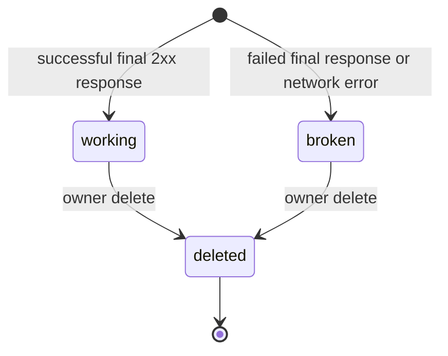
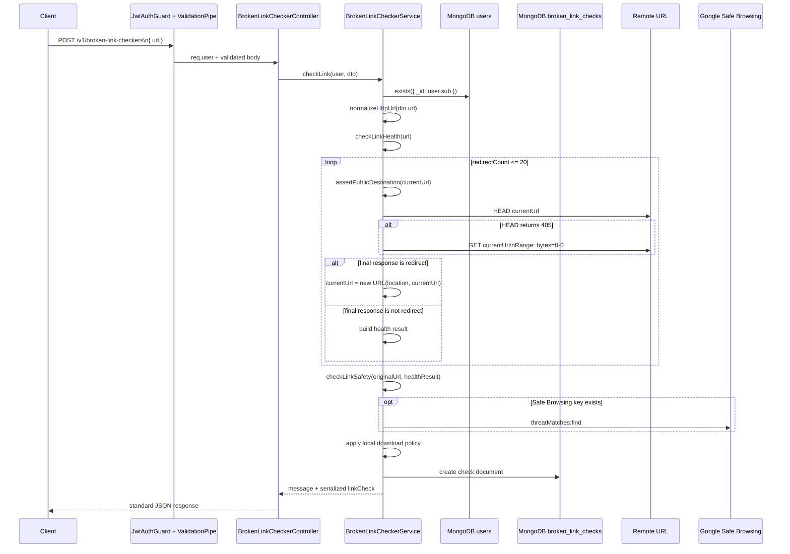
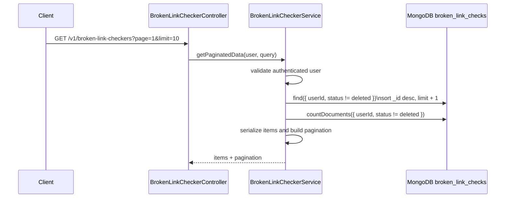
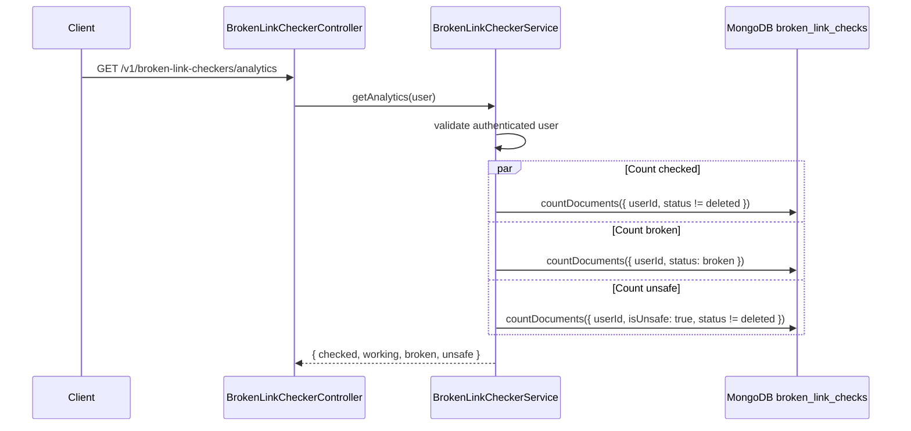
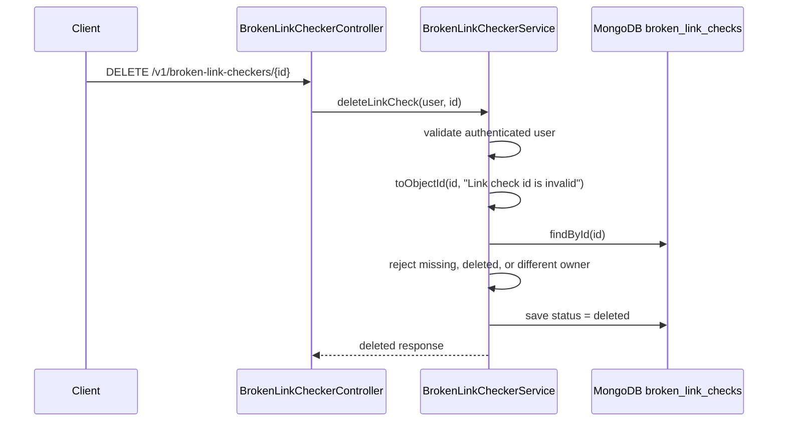

# Broken Link Checker

## What is a broken link checker?

A broken link checker tests whether a URL can be reached successfully. It sends
an HTTP request, follows redirects, records the final destination, captures the
final status code, and marks the link as working or broken.

A link is not only "working" because it exists. A useful checker also needs to
understand redirects, timeouts, unsafe destinations, private-network targets,
and risky content. In LinkLab, the broken link checker records both link health
and link safety:

- Health: whether the final HTTP response is successful.
- Destination: where the URL ends after redirects.
- Metadata: status code, redirect count, content type, content length, and
  content disposition.
- Safety: whether Google Safe Browsing or LinkLab's local policy flags the URL.

## Why this feature exists

Links are fragile. A URL can work when it is added to a dashboard, campaign,
document, or message, then fail later because the target page moved, the domain
expired, the server changed its redirect rules, or the destination started
serving unexpected downloadable content.

Broken link checkers solve these problems:

- Users do not need to open every URL manually.
- Teams can find links returning `404`, `410`, `500`, or timeout errors.
- Redirect chains can be inspected before the user trusts the destination.
- Short links and tracking links can be verified without using a browser.
- Risky downloads can be flagged before the user opens the link.
- Users can keep a history of checked links and track how many are broken,
  working, or unsafe.

## Who should use it?

Broken link checking is useful for:

- Marketing teams validating campaign, ad, and social links.
- Product teams checking docs, changelogs, release notes, and support links.
- Support teams verifying URLs before sending them to customers.
- Content teams auditing blogs, landing pages, newsletters, and resources.
- Operations teams checking internal runbooks or external vendor links.
- Security-conscious users who want a quick safety signal before opening a URL.

## Where it is used

Use broken link checking anywhere links are shared, published, or reused:

- Emails and newsletters.
- Social posts and campaign dashboards.
- QR code destinations.
- Product docs and help centers.
- Support replies and saved macros.
- Internal documents, wikis, and runbooks.
- Link-management tools such as URL shorteners and one-time links.

## How a broken link check works

At a high level, checking a URL follows this path:

1. Validate that the input is a URL with a protocol.
2. Normalize the URL so equivalent input is stored consistently.
3. Verify that the host is public and not localhost or a private network.
4. Send a lightweight request to the URL.
5. If the server redirects, read the `Location` header and repeat the check.
6. Stop after a configured redirect limit.
7. Record the final URL, status code, redirect count, and response headers.
8. Treat non-2xx final responses and request failures as broken.
9. Check the original and final URLs against safety providers.
10. Store the result for history, listing, and analytics.

LinkLab performs this work in `BrokenLinkCheckerService`.

## How to build a broken link checker from scratch

A simple checker can be built with `fetch`, but a production checker needs more
than one request. It should control redirects manually, avoid downloading large
files, apply timeouts, block SSRF targets, and store useful details.

### From-scratch architecture

A clean implementation can be split into these pieces:

1. `validateUrl(input)` checks required fields and protocol.
2. `normalizeUrl(input)` trims and serializes the URL using the platform URL
   parser.
3. `assertPublicDestination(url)` rejects localhost, private IPs, and hostnames
   that resolve to private IPs.
4. `probe(url, method)` sends `HEAD` first, then `GET` only when the server does
   not support `HEAD`.
5. `followRedirects(url)` loops through redirect responses and resolves
   relative `Location` headers.
6. `classifyHealth(response)` turns status and errors into working or broken
   state.
7. `checkSafety(originalUrl, finalUrl, headers)` combines reputation providers
   and local static rules.
8. `persistResult(userId, result)` stores the check document.
9. `serializeResult(document)` returns a frontend-friendly object.

The core types can stay small:

```ts
type LinkProbeResponse = {
  status: number;
  ok: boolean;
  location: string | null;
  contentType: string | null;
  contentLength: number | null;
  contentDisposition: string | null;
};

type LinkHealthResult = {
  finalUrl: string;
  statusCode: number | null;
  isBroken: boolean;
  errorMessage: string | null;
  redirectCount: number;
  contentType: string | null;
  contentLength: number | null;
  contentDisposition: string | null;
};
```

### Why redirects must be manual

Most HTTP clients can follow redirects automatically. That is convenient, but it
hides important details:

- The checker cannot count redirects accurately.
- The checker cannot inspect each intermediate URL.
- A public URL could redirect to a private address.
- The final URL may be visible, but the redirect chain is not controlled.
- Too many redirects may fail in a client-specific way.

LinkLab uses `redirect: 'manual'` so the service owns every redirect hop.

### How to avoid large downloads

The checker only needs status and headers. It should not download the full page,
image, archive, or installer.

LinkLab uses this strategy:

1. Try `HEAD`.
2. If the server returns `405 Method Not Allowed`, try `GET`.
3. For `GET`, send `Range: bytes=0-0`.
4. Cancel the response body after reading headers.

This keeps the check lightweight while still supporting servers that do not
implement `HEAD`.

### HTTP status classification

In Node's `fetch`, `response.ok` is true for status codes from `200` to `299`.
LinkLab uses that behavior:

| Final response | LinkLab result |
| --- | --- |
| `2xx` | Working |
| `3xx` with supported `Location` | Continue following redirects |
| `3xx` without `Location` | Broken |
| `4xx` | Broken |
| `5xx` | Broken |
| Timeout or network error | Broken |
| Too many redirects | Broken with status `508` |

### Safety checking from scratch

A health check answers "does it respond?" A safety check asks "is it risky to
open?" A practical safety layer can combine:

- Reputation APIs such as Google Safe Browsing.
- Local content-type checks.
- Local file-extension checks.
- Download-header checks.

LinkLab implements all four.

### Testing checklist

A broken link checker should be tested against:

- A normal `200` page.
- A `404` page.
- A `500` page.
- A redirect from HTTP to HTTPS.
- Multiple redirects.
- A redirect with a relative `Location`.
- A redirect loop or chain longer than the limit.
- A server that rejects `HEAD` with `405`.
- A timeout or unreachable host.
- `localhost` and private IP inputs.
- A public hostname that resolves to a private IP.
- A downloadable `.exe`, `.zip`, or `.apk` URL.
- A Safe Browsing match when the API key is configured.
- Missing Safe Browsing configuration.

## External provider used by LinkLab

LinkLab can use Google Safe Browsing. The provider is optional and controlled by
the `GOOGLE_SAFE_BROWSING_API_KEY` environment variable.

When the key is missing, the feature still checks health and still applies local
download policy. The safety status remains `unchecked` unless local policy finds
a threat.

Threat types requested from Google Safe Browsing:

- `MALWARE`
- `SOCIAL_ENGINEERING`
- `UNWANTED_SOFTWARE`
- `POTENTIALLY_HARMFUL_APPLICATION`

The Safe Browsing request checks both the original submitted URL and the final
URL reached after redirects.

## Alternatives

Alternative approaches for link checking include:

| Approach | Tradeoff |
| --- | --- |
| Browser automation | More realistic, but heavier and slower than HTTP probes. |
| Automatic redirect following | Simple, but hides intermediate redirect targets and SSRF risks. |
| Full-body GET requests | Works on most servers, but may download large or unsafe files. |
| Queue-based background checks | Better for large audits, but slower for a single immediate result. |
| Third-party link-check APIs | Less code to maintain, but introduces cost, latency, and data sharing. |

LinkLab uses direct HTTP probes because this feature checks one user-submitted
URL at a time and returns an immediate saved result.

## Main files

| File | Responsibility |
| --- | --- |
| `broken-link-checker.module.ts` | Registers the Mongoose models, controller, and service. |
| `broken-link-checker.controller.ts` | Defines authenticated routes under `/v1/broken-link-checkers`. |
| `broken-link-checker.service.ts` | Owns URL normalization, health checks, safety checks, persistence, list, analytics, access control, and soft delete. |
| `dto/broken-link-checker.dto.ts` | Validates create and pagination inputs. |
| `broken-link-checker.constants.ts` | Stores pagination, timeout, and redirect limits. |
| `src/models/broken-link-checker.schema.ts` | Defines the MongoDB document shape and indexes. |
| `src/exceptions/broken-link-checker.exception.ts` | Defines not-found and access-denied exceptions. |
| `src/modules/features/utils/common.utils.ts` | Provides `normalizeHttpUrl` and `toObjectId`. |

MongoDB collection `broken_link_checks` stores one document per check. Every
protected operation verifies that the JWT user still exists, then scopes data by
that user's MongoDB id.

## Internal request pipeline

```text
POST /v1/broken-link-checkers
  -> ValidationPipe validates CheckBrokenLinkDto
  -> controller reads req.user
  -> service validates authenticated user still exists
  -> service normalizes URL
  -> service follows redirects and checks health
  -> service checks reputation and local safety policy
  -> service creates broken_link_checks document
  -> service serializes document
  -> controller returns standard API response
```

## Constants

| Constant | Value | Purpose |
| --- | --- | --- |
| `DEFAULT_BROKEN_LINK_CHECKER_PAGE_LIMIT` | `10` | Default number of checks returned by list API. |
| `MAX_BROKEN_LINK_CHECKER_PAGE_LIMIT` | `50` | Maximum allowed list page size. |
| `BROKEN_LINK_CHECKER_TIMEOUT_MS` | `8000` | Per-request timeout for each `HEAD` or `GET`. |
| `BROKEN_LINK_CHECKER_MAX_REDIRECTS` | `20` | Maximum redirect hops before returning status `508`. |

## MongoDB document

The `broken_link_checks` collection stores one document per check.

| Field | Type | Purpose |
| --- | --- | --- |
| `userId` | `ObjectId` | Owner reference. Used for protected access control. |
| `url` | `string` | Normalized original URL submitted by the user. |
| `finalUrl` | `string` | Last URL reached after redirects. |
| `statusCode` | `number \| null` | Final HTTP status code, or `null` when no response was received. |
| `status` | `working \| broken \| deleted` | Health/status lifecycle value. |
| `isBroken` | `boolean` | Shortcut flag used by responses and UI. |
| `isUnsafe` | `boolean` | Shortcut flag used by responses and UI. |
| `safetyStatus` | `no_known_threat \| unsafe \| unchecked` | Safety classification. |
| `safetyProvider` | `string \| null` | Provider names that contributed to the safety result. |
| `threatTypes` | `string[]` | Safe Browsing and local policy threat labels. |
| `contentType` | `string \| null` | Final response `content-type`. |
| `contentLength` | `number \| null` | Parsed final response `content-length`. |
| `contentDisposition` | `string \| null` | Final response `content-disposition`. |
| `errorMessage` | `string \| null` | Failure reason for broken checks. |
| `redirectCount` | `number` | Number of redirects followed. |
| `createdAt` | `Date` | Mongoose creation timestamp. |
| `updatedAt` | `Date` | Mongoose update timestamp. |

Important indexes:

- `(userId, status, _id desc)` for owner-scoped listing.
- `(userId, safetyStatus, _id desc)` for safety-focused queries.
- `(userId, createdAt desc)` for user history.

## Shared authentication and ownership steps

Protected routes call `getUser(req)` in the controller before calling the
service.

Step 1: Read `req.user`.

Why this is used:

The authentication layer places the JWT payload on the request. If `req.user` is
missing, the controller throws `AccessTokenExpired`.

Step 2: Convert `user.sub` into a MongoDB ObjectId.

Why this is used:

MongoDB queries need an ObjectId. `toObjectId` also rejects malformed ids early
with a clear message.

Step 3: Confirm the user still exists.

Why this is used:

A token can still be structurally valid after the user record is deleted. The
service checks `users.exists({ _id: userId })` so deleted users cannot continue
using old tokens.

Step 4: For id-based routes, fetch the saved check and compare owner ids.

Why this is used:

Users must not delete another user's link checks. The service loads the document,
rejects missing or deleted records, and compares `linkCheck.userId` with the
authenticated user id.

## Status lifecycle



Status behavior:

- `working`: the final destination responded with `response.ok`.
- `broken`: the final destination did not respond successfully, redirect
  resolution failed, or the network request failed.
- `deleted`: the owner soft-deleted the saved check.

Safety is separate from health. A link can be reachable and still unsafe.

## Request validation

`CheckBrokenLinkDto` validates the create body:

| Field | Rule | Reason |
| --- | --- | --- |
| `url` | Required | The checker needs a target URL. |
| `url` | Must be a string | Prevents non-string payloads from reaching URL parsing. |
| `url` | Maximum 2048 characters | Keeps stored URLs and request processing bounded. |
| `url` | Must be a URL with protocol | Blocks ambiguous values such as `example.com`. |

`GetPaginatedBrokenLinkChecksDto` validates list query values:

| Field | Rule | Reason |
| --- | --- | --- |
| `page` | Optional integer, minimum `1`, default `1` | Supports page pagination. |
| `cursor` | Optional Mongo id string | Supports cursor pagination. |
| `limit` | Optional integer, `1` to `50`, default `10` | Keeps list responses bounded. |

The service also calls `normalizeHttpUrl`:

```ts
const url = normalizeHttpUrl({
  value: dto.url,
  fieldName: 'URL',
});
```

`normalizeHttpUrl` trims input, parses it with `new URL`, requires `http:` or
`https:`, and returns `parsed.toString()`.

## Endpoint summary

| Method | Route | Purpose |
| --- | --- | --- |
| `POST` | `/v1/broken-link-checkers` | Check one URL and save the result. |
| `GET` | `/v1/broken-link-checkers` | List the authenticated user's non-deleted checks. |
| `GET` | `/v1/broken-link-checkers/analytics` | Return checked, working, broken, and unsafe totals. |
| `DELETE` | `/v1/broken-link-checkers/:id` | Soft-delete one owned check. |

## API request flows

### `POST /v1/broken-link-checkers`



### `GET /v1/broken-link-checkers`



### `GET /v1/broken-link-checkers/analytics`



### `DELETE /v1/broken-link-checkers/:id`



## End-to-end map

```text
Client
  sends URL
Controller
  extracts authenticated user
Service
  validates user still exists
  normalizes URL
  checks public destination
  sends HEAD request
  falls back to ranged GET when needed
  follows redirects manually
  classifies health
  checks Google Safe Browsing when configured
  applies local risky-download policy
MongoDB
  stores broken_link_checks document
Response
  returns message and serialized linkCheck
```

## POST `/v1/broken-link-checkers`

This route creates one saved link check.

```ts
@Post()
checkLink(@Body() dto: CheckBrokenLinkDto, @Req() req: AuthenticatedRequest) {
  return this.brokenLinkCheckerService.checkLink(this.getUser(req), dto);
}
```

Controller to service flow:

```text
POST /v1/broken-link-checkers
  -> controller checkLink()
  -> controller getUser(req)
  -> service checkLink(user, dto)
  -> service getAuthenticatedUserId(user)
  -> normalizeHttpUrl(dto.url)
  -> service checkLinkHealth(url)
      -> followRedirects(url)
          -> assertPublicDestination(currentUrl)
              -> isBlockedHost(host)
          -> fetchWithoutRedirect(currentUrl, 'HEAD')
          -> fetchWithoutRedirect(currentUrl, 'GET') only when HEAD returns 405
          -> isRedirectStatus(status)
  -> service checkLinkSafety(url, healthResult)
      -> checkGoogleSafeBrowsing([originalUrl, finalUrl])
      -> getLocalThreatTypes(healthResult)
  -> brokenLinkCheckerModel.create(...)
  -> getLinkCheckMessage(isBroken, isUnsafe)
  -> serializeLinkCheck(linkCheck)
```

### Step 1: DTO validates the request body

The request body must look like this:

```json
{
  "url": "https://example.com/path"
}
```

Validation rejects:

- Missing `url`.
- Empty `url`.
- Non-string `url`.
- URL longer than 2048 characters.
- URL without protocol.
- Invalid URL syntax.

### Step 2: Controller gets the authenticated user

The controller reads `req.user`. If the request has no authenticated user, it
throws `AccessTokenExpired`.

```ts
private getUser(req: AuthenticatedRequest): JwtPayload {
  if (!req.user) {
    throw new AccessTokenExpired();
  }

  return req.user;
}
```

### Step 3: Service verifies the user still exists

The service converts `user.sub` to a MongoDB ObjectId and verifies the user
document still exists.

```ts
const userId = toObjectId(user.sub, 'Authenticated user id is invalid');
const userExists = await this.userModel.exists({ _id: userId });
```

If the id is invalid, the API returns `Authenticated user id is invalid`. If the
user no longer exists, it throws `AccessTokenExpired`.

### Step 4: Service normalizes the URL

The service passes the DTO value through `normalizeHttpUrl`.

This does three important things:

1. Trims surrounding whitespace.
2. Parses the value using `new URL`.
3. Allows only `http:` and `https:`.

The returned URL is serialized with `parsed.toString()`, so stored values are
consistent.

### Step 5: Core service calls

These two lines are the heart of the API:

```ts
const healthResult = await this.checkLinkHealth(url);
const safetyResult = await this.checkLinkSafety(url, healthResult);
```

They run in this order because safety depends on health output. The health
function finds the final URL and response headers. The safety function then uses
that final URL and those headers to decide whether the link is risky.

### Health check: `checkLinkHealth`

#### High-level explanation

`checkLinkHealth` answers one question: does this URL work?

It does not directly call Google Safe Browsing and it does not decide whether a
file is risky. Its job is only link health:

1. Follow redirects until the final URL is reached.
2. Get the final HTTP status code.
3. Decide whether the final response is broken.
4. Capture response headers needed later.
5. Return a `LinkHealthResult`.

If the request fails because of a normal network problem, the function returns a
broken result instead of crashing the API. If the request fails because the URL
points to a private/internal host, it rethrows the bad request error.

#### Line in `checkLink`

```ts
const healthResult = await this.checkLinkHealth(url);
```

What this line means:

- `url` is already normalized.
- `await` pauses `checkLink` until the health check is complete.
- `this.checkLinkHealth(url)` calls the private helper that finds out whether
  the link works.
- The returned value is stored in `healthResult`.

#### What `checkLinkHealth` returns

```ts
{
  finalUrl: string;
  statusCode: number | null;
  isBroken: boolean;
  errorMessage: string | null;
  redirectCount: number;
  contentType: string | null;
  contentLength: number | null;
  contentDisposition: string | null;
}
```

#### Function chain inside `checkLinkHealth`

```text
checkLinkHealth(url)
  -> followRedirects(url)
      -> assertPublicDestination(currentUrl)
      -> fetchWithoutRedirect(currentUrl, 'HEAD')
      -> maybe fetchWithoutRedirect(currentUrl, 'GET')
      -> isRedirectStatus(status)
      -> repeat until final URL or redirect limit
  -> isBroken = !response.ok
  -> build LinkHealthResult
```

#### Code of `checkLinkHealth`

```ts
private async checkLinkHealth(url: string): Promise<LinkHealthResult> {
  try {
    const response = await this.followRedirects(url);
    const isBroken = !response.ok;

    return {
      finalUrl: response.finalUrl,
      statusCode: response.status,
      isBroken,
      errorMessage: isBroken
        ? `Destination responded with HTTP ${response.status}`
        : null,
      redirectCount: response.redirectCount,
      contentType: response.contentType,
      contentLength: response.contentLength,
      contentDisposition: response.contentDisposition,
    };
  } catch (error) {
    if (error instanceof BadRequestException) {
      throw error;
    }

    return {
      finalUrl: url,
      statusCode: null,
      isBroken: true,
      errorMessage:
        error instanceof Error ? error.message : 'Unable to check this link',
      redirectCount: 0,
      contentType: null,
      contentLength: null,
      contentDisposition: null,
    };
  }
}
```

#### `checkLinkHealth` code line-by-line

```ts
private async checkLinkHealth(url: string): Promise<LinkHealthResult> {
```

Defines a private async function. It receives the normalized URL and promises to
return a `LinkHealthResult`.

```ts
try {
```

Starts a protected block because network requests can fail.

```ts
const response = await this.followRedirects(url);
```

Calls `followRedirects`. This is where the service actually sends HTTP requests
and follows redirect URLs. `await` waits until the final response is known.

```ts
const isBroken = !response.ok;
```

Converts the final HTTP result into a boolean. `response.ok` is true for `2xx`
status codes, so `!response.ok` means the link is broken.

```ts
return { ... };
```

Builds the health result used later by MongoDB and safety checks.

```ts
finalUrl: response.finalUrl,
```

Stores the final destination after all redirects.

```ts
statusCode: response.status,
```

Stores the final HTTP status code.

```ts
isBroken,
```

Stores whether the final response is not OK.

```ts
errorMessage: isBroken
  ? `Destination responded with HTTP ${response.status}`
  : null,
```

Adds an error message only when the link is broken. Working links get `null`.

```ts
redirectCount: response.redirectCount,
contentType: response.contentType,
contentLength: response.contentLength,
contentDisposition: response.contentDisposition,
```

Copies redirect count and final response headers from `followRedirects`.

```ts
} catch (error) {
```

Handles errors from `followRedirects`, `fetch`, URL parsing, timeout aborts, or
other runtime failures.

```ts
if (error instanceof BadRequestException) {
  throw error;
}
```

If the error is a deliberate bad request, such as private-host blocking, rethrow
it. The API should fail clearly instead of saving it as a normal broken link.

```ts
return {
  finalUrl: url,
  statusCode: null,
  isBroken: true,
  errorMessage:
    error instanceof Error ? error.message : 'Unable to check this link',
  redirectCount: 0,
  contentType: null,
  contentLength: null,
  contentDisposition: null,
};
```

For normal network failures, return a broken result. There is no status code or
headers because the service did not receive a usable response.

#### Function inside health: `followRedirects`

##### High-level explanation

`followRedirects` is the function that actually walks through the redirect
chain.

It starts from the normalized URL, checks that each URL is public, sends a
request without automatic redirects, and decides what to do next:

1. If the response is not a redirect, return it as the final result.
2. If the response is a redirect with `Location`, move to the next URL.
3. If the response is a redirect without `Location`, return a failed result.
4. If redirects exceed the limit, return a failed `508` result.

This function is why the service can store `finalUrl` and `redirectCount`.

```ts
private async followRedirects(url: string): Promise<{
  finalUrl: string;
  redirectCount: number;
  ok: boolean;
  status: number;
  contentType: string | null;
  contentLength: number | null;
  contentDisposition: string | null;
}> {
  let currentUrl = url;

  for (
    let redirectCount = 0;
    redirectCount <= BROKEN_LINK_CHECKER_MAX_REDIRECTS;
    redirectCount += 1
  ) {
    await this.assertPublicDestination(currentUrl);

    const response = await this.fetchWithoutRedirect(currentUrl, 'HEAD');
    const finalResponse =
      response.status === 405
        ? await this.fetchWithoutRedirect(currentUrl, 'GET')
        : response;

    if (!this.isRedirectStatus(finalResponse.status)) {
      return {
        finalUrl: currentUrl,
        redirectCount,
        ok: finalResponse.ok,
        status: finalResponse.status,
        contentType: finalResponse.contentType,
        contentLength: finalResponse.contentLength,
        contentDisposition: finalResponse.contentDisposition,
      };
    }

    if (!finalResponse.location) {
      return {
        finalUrl: currentUrl,
        redirectCount,
        ok: false,
        status: finalResponse.status,
        contentType: finalResponse.contentType,
        contentLength: finalResponse.contentLength,
        contentDisposition: finalResponse.contentDisposition,
      };
    }

    currentUrl = new URL(finalResponse.location, currentUrl).toString();
  }

  return {
    finalUrl: currentUrl,
    redirectCount: BROKEN_LINK_CHECKER_MAX_REDIRECTS,
    ok: false,
    status: 508,
    contentType: null,
    contentLength: null,
    contentDisposition: null,
  };
}
```

##### `followRedirects` code line-by-line

- `let currentUrl = url;` starts redirect tracking from the submitted URL.
- The `for` loop counts redirects from `0` up to
  `BROKEN_LINK_CHECKER_MAX_REDIRECTS`.
- `await this.assertPublicDestination(currentUrl);` blocks private/internal
  destinations before making any request.
- `fetchWithoutRedirect(currentUrl, 'HEAD')` sends a lightweight request.
- If the response status is `405`, the server does not allow `HEAD`, so the
  service retries with `GET`.
- `finalResponse` is either the `HEAD` response or the fallback `GET` response.
- `if (!this.isRedirectStatus(finalResponse.status))` means the service reached
  the final destination.
- The first `return` sends final URL, redirect count, status, OK flag, and
  headers back to `checkLinkHealth`.
- `if (!finalResponse.location)` handles a broken redirect response with no
  `Location` header.
- That second `return` marks the response as not OK because a redirect without
  destination cannot be followed.
- `currentUrl = new URL(finalResponse.location, currentUrl).toString();`
  resolves the next URL. It supports both absolute and relative redirects.
- The final `return` happens only when the redirect limit is exceeded. It uses
  status `508` to represent a redirect loop or too many redirects.

#### Function inside `followRedirects`: `assertPublicDestination`

##### High-level explanation

`assertPublicDestination` protects the server before every outbound request.

Users control the URL, so the backend must not blindly fetch anything. This
function blocks localhost, private IP ranges, and public-looking domains that
resolve to private IPs. If the destination is unsafe for the server to request,
it throws `BadRequestException`.

Before every HTTP request, the service calls:

```ts
await this.assertPublicDestination(currentUrl);
```

This prevents the server from fetching private/internal URLs.

```ts
private async assertPublicDestination(url: string) {
  const parsedUrl = new URL(url);
  const host = parsedUrl.hostname.toLowerCase();

  if (this.isBlockedHost(host)) {
    throw new BadRequestException({
      message: 'URL must point to a public internet host',
      error: 'Bad Request',
    });
  }

  if (isIP(host)) {
    return;
  }

  try {
    const addresses = await lookup(host, { all: true });

    if (addresses.some((address) => this.isBlockedHost(address.address))) {
      throw new BadRequestException({
        message: 'URL must point to a public internet host',
        error: 'Bad Request',
      });
    }
  } catch (error) {
    if (error instanceof BadRequestException) {
      throw error;
    }
  }
}
```

##### `assertPublicDestination` code line-by-line

- `new URL(url)` parses the current URL.
- `parsedUrl.hostname.toLowerCase()` extracts the host in lowercase.
- `this.isBlockedHost(host)` checks direct blocked values like `localhost`,
  `127.0.0.1`, and private IP ranges.
- If blocked, the function throws `BadRequestException`.
- `isIP(host)` checks whether the host is already an IP address.
- If it is an IP and was not blocked, the function returns because no DNS lookup
  is needed.
- `lookup(host, { all: true })` resolves all DNS addresses for a domain.
- `addresses.some(...)` checks whether any resolved IP is blocked.
- If a resolved address is blocked, the function throws `BadRequestException`.
- The `catch` rethrows deliberate bad requests and ignores ordinary DNS lookup
  failures.

#### Function inside `assertPublicDestination`: `isBlockedHost`

##### High-level explanation

`isBlockedHost` is the low-level checker used by `assertPublicDestination`.

It receives a hostname or IP address and returns:

- `true` when the host is localhost, loopback, private network, or link-local.
- `false` when the host is not blocked.

It does not throw errors. It only answers yes/no.

`assertPublicDestination` uses `isBlockedHost` for both direct hostnames and
resolved DNS addresses.

```ts
private isBlockedHost(host: string) {
  if (
    host === 'localhost' ||
    host.endsWith('.localhost') ||
    host === '0.0.0.0' ||
    host === '::' ||
    host === '::1'
  ) {
    return true;
  }

  const ipVersion = isIP(host);

  if (ipVersion === 4) {
    const parts = host.split('.').map((part) => Number(part));
    const [first, second] = parts;

    return (
      first === 10 ||
      first === 127 ||
      (first === 169 && second === 254) ||
      (first === 172 && second >= 16 && second <= 31) ||
      (first === 192 && second === 168)
    );
  }

  if (ipVersion === 6) {
    return (
      host.startsWith('fc') ||
      host.startsWith('fd') ||
      host.startsWith('fe80:') ||
      host === '::ffff:127.0.0.1'
    );
  }

  return false;
}
```

##### `isBlockedHost` code line-by-line

- The first `if` blocks localhost names, wildcard addresses, and loopback IPv6.
- `const ipVersion = isIP(host);` asks Node whether the host is IPv4, IPv6, or
  not an IP.
- For IPv4, the service splits the address into numeric parts.
- It blocks `10.x.x.x`, `127.x.x.x`, `169.254.x.x`, `172.16-31.x.x`, and
  `192.168.x.x`.
- For IPv6, it blocks private/link-local prefixes `fc`, `fd`, `fe80:`, and the
  IPv4-mapped loopback address.
- `return false` means the host is not blocked.

#### Function inside `followRedirects`: `fetchWithoutRedirect`

##### High-level explanation

`fetchWithoutRedirect` performs one HTTP request and returns only the fields the
checker needs.

It deliberately does not follow redirects automatically. That lets
`followRedirects` inspect the status code and `Location` header itself. It also
uses a timeout, avoids downloading full response bodies, and returns normalized
header values.

`followRedirects` calls this function to make one HTTP request:

```ts
const response = await this.fetchWithoutRedirect(currentUrl, 'HEAD');
```

and sometimes:

```ts
await this.fetchWithoutRedirect(currentUrl, 'GET')
```

Code:

```ts
private async fetchWithoutRedirect(
  url: string,
  method: 'GET' | 'HEAD',
): Promise<LinkProbeResponse> {
  const controller = new AbortController();
  const timeout = setTimeout(
    () => controller.abort(),
    BROKEN_LINK_CHECKER_TIMEOUT_MS,
  );

  try {
    const headers = new Headers();

    if (method === 'GET') {
      headers.set('range', 'bytes=0-0');
    }

    const response = await fetch(url, {
      method,
      headers,
      redirect: 'manual',
      signal: controller.signal,
    });

    const contentLengthHeader = response.headers.get('content-length');
    const parsedContentLength = contentLengthHeader
      ? Number(contentLengthHeader)
      : null;

    await response.body?.cancel();

    return {
      status: response.status,
      ok: response.ok,
      location: response.headers.get('location'),
      contentType: response.headers.get('content-type'),
      contentLength:
        parsedContentLength !== null && Number.isFinite(parsedContentLength)
          ? parsedContentLength
          : null,
      contentDisposition: response.headers.get('content-disposition'),
    };
  } finally {
    clearTimeout(timeout);
  }
}
```

##### `fetchWithoutRedirect` code line-by-line

- `new AbortController()` creates a controller that can cancel the request.
- `setTimeout(...BROKEN_LINK_CHECKER_TIMEOUT_MS)` schedules cancellation after
  `8000ms`.
- `const headers = new Headers();` creates request headers.
- If method is `GET`, `Range: bytes=0-0` asks for only the first byte.
- `fetch(url, { method, headers, redirect: 'manual', signal })` sends the
  request without auto-following redirects.
- `redirect: 'manual'` is required so the service can inspect redirect status
  and `Location`.
- `response.headers.get('content-length')` reads the header as a string.
- `Number(contentLengthHeader)` converts it to a number when present.
- `response.body?.cancel()` closes the body stream because only headers are
  needed.
- The returned object keeps only fields the service needs.
- `contentLength` is returned only when it is a finite number.
- `finally` always clears the timeout, whether the request succeeds or fails.

#### Function inside `followRedirects`: `isRedirectStatus`

##### High-level explanation

`isRedirectStatus` is a tiny helper that decides whether an HTTP status code is
a redirect that LinkLab should follow.

It keeps redirect-status logic in one place so `followRedirects` stays readable.

```ts
private isRedirectStatus(status: number) {
  return [301, 302, 303, 307, 308].includes(status);
}
```

##### `isRedirectStatus` code line-by-line

- The function receives an HTTP status code.
- It checks whether the status is one of the redirect statuses LinkLab follows.
- It returns `true` for redirects and `false` for final responses.

#### Health result example

```text
Input URL: https://short.example/a
Redirects to: https://example.com/final
Final status: 200

healthResult = {
  finalUrl: 'https://example.com/final',
  statusCode: 200,
  isBroken: false,
  errorMessage: null,
  redirectCount: 1,
  contentType: 'text/html',
  contentLength: 1200,
  contentDisposition: null
}
```

### Safety check: `checkLinkSafety`

#### High-level explanation

`checkLinkSafety` answers a different question from `checkLinkHealth`: is this
link risky?

It receives both the original URL and the health result. That matters because a
short link may redirect somewhere else. Safety checks should consider both:

1. The original URL the user submitted.
2. The final URL after redirects.
3. The final response headers.

This function combines two safety sources:

- Google Safe Browsing, when the API key is configured.
- LinkLab's local risky-download policy.

#### Line in `checkLink`

```ts
const safetyResult = await this.checkLinkSafety(url, healthResult);
```

What this line means:

- `url` is the original normalized URL.
- `healthResult` contains the final URL and response headers.
- `await` pauses `checkLink` until safety checks finish.
- The returned value is stored in `safetyResult`.

#### What `checkLinkSafety` returns

```ts
{
  isUnsafe: boolean;
  safetyStatus: BrokenLinkSafetyStatus;
  safetyProvider: string | null;
  threatTypes: string[];
}
```

#### Function chain inside `checkLinkSafety`

```text
checkLinkSafety(originalUrl, healthResult)
  -> checkGoogleSafeBrowsing([originalUrl, healthResult.finalUrl])
  -> getLocalThreatTypes(healthResult)
  -> merge Google threat types and local threat types
  -> isUnsafe = reputation.isUnsafe || localThreatTypes.length > 0
  -> safetyStatus = unsafe ? unsafe : reputation.status
  -> safetyProvider = provider names joined together
```

#### Code of `checkLinkSafety`

```ts
private async checkLinkSafety(
  originalUrl: string,
  healthResult: LinkHealthResult,
): Promise<SafetyResult> {
  const reputation = await this.checkGoogleSafeBrowsing([
    originalUrl,
    healthResult.finalUrl,
  ]);

  const localThreatTypes = this.getLocalThreatTypes(healthResult);
  const threatTypes = [
    ...new Set([...reputation.threatTypes, ...localThreatTypes]),
  ];

  const isUnsafe = reputation.isUnsafe || localThreatTypes.length > 0;
  const safetyStatus = isUnsafe
    ? BrokenLinkSafetyStatus.UNSAFE
    : reputation.status;

  const providers = [
    reputation.provider,
    localThreatTypes.length > 0 ? 'linklab-static-download-policy' : null,
  ].filter((provider): provider is string => Boolean(provider));

  return {
    isUnsafe,
    safetyStatus,
    safetyProvider:
      providers.length > 0 ? [...new Set(providers)].join(',') : null,
    threatTypes,
  };
}
```

#### `checkLinkSafety` code line-by-line

```ts
private async checkLinkSafety(
  originalUrl: string,
  healthResult: LinkHealthResult,
): Promise<SafetyResult> {
```

Defines a private async function. It receives the original normalized URL and
the health result created by `checkLinkHealth`.

```ts
const reputation = await this.checkGoogleSafeBrowsing([
  originalUrl,
  healthResult.finalUrl,
]);
```

Calls Google Safe Browsing helper with both URLs. The original URL may be a
short link, while `healthResult.finalUrl` is the destination after redirects.

```ts
const localThreatTypes = this.getLocalThreatTypes(healthResult);
```

Runs local safety checks using the final URL and response headers.

```ts
const threatTypes = [
  ...new Set([...reputation.threatTypes, ...localThreatTypes]),
];
```

Combines Google threat labels and local threat labels. `Set` removes duplicate
strings.

```ts
const isUnsafe = reputation.isUnsafe || localThreatTypes.length > 0;
```

Marks the link unsafe if Google flags it or local policy finds any threat.

```ts
const safetyStatus = isUnsafe
  ? BrokenLinkSafetyStatus.UNSAFE
  : reputation.status;
```

If unsafe, final safety status is `unsafe`. Otherwise, the status comes from
Google Safe Browsing, such as `no_known_threat` or `unchecked`.

```ts
const providers = [
  reputation.provider,
  localThreatTypes.length > 0 ? 'linklab-static-download-policy' : null,
].filter((provider): provider is string => Boolean(provider));
```

Builds the list of providers that contributed to the safety result. The filter
removes `null` values and tells TypeScript the final array contains strings.

```ts
return {
  isUnsafe,
  safetyStatus,
  safetyProvider:
    providers.length > 0 ? [...new Set(providers)].join(',') : null,
  threatTypes,
};
```

Returns the safety result. Provider names are deduplicated and joined with a
comma. If there are no providers, `safetyProvider` is `null`.

#### Why `healthResult` is passed into safety

- Safe Browsing checks both the original URL and `healthResult.finalUrl`.
- Local policy checks `healthResult.contentType`.
- Local policy checks `healthResult.contentDisposition`.
- Local policy checks the file extension from `healthResult.finalUrl`.

#### Function inside safety: `checkGoogleSafeBrowsing`

##### High-level explanation

`checkGoogleSafeBrowsing` checks URLs against Google Safe Browsing.

It is intentionally best-effort:

1. If the API key is missing, return `unchecked`.
2. If Google returns an error, return `unchecked`.
3. If the network request fails, return `unchecked`.
4. If Google returns matches, return `unsafe`.
5. If Google returns no matches, return `no_known_threat`.

The broken link check should still work even when Google Safe Browsing is not
available.

`checkLinkSafety` calls:

```ts
const reputation = await this.checkGoogleSafeBrowsing([
  originalUrl,
  healthResult.finalUrl,
]);
```

Code:

```ts
private async checkGoogleSafeBrowsing(urls: string[]): Promise<{
  isUnsafe: boolean;
  status: BrokenLinkSafetyStatus;
  provider: string | null;
  threatTypes: string[];
}> {
  const apiKey = this.configService.get<string>(
    'GOOGLE_SAFE_BROWSING_API_KEY',
  );

  if (!apiKey) {
    return {
      isUnsafe: false,
      status: BrokenLinkSafetyStatus.UNCHECKED,
      provider: null,
      threatTypes: [],
    };
  }

  try {
    const threatEntries = [...new Set(urls)].map((url) => ({ url }));

    const response = await fetch(
      `https://safebrowsing.googleapis.com/v4/threatMatches:find?key=${apiKey}`,
      {
        method: 'POST',
        headers: {
          'Content-Type': 'application/json',
        },
        body: JSON.stringify({
          client: {
            clientId: 'linklab',
            clientVersion: '1.0.0',
          },
          threatInfo: {
            threatTypes: [
              'MALWARE',
              'SOCIAL_ENGINEERING',
              'UNWANTED_SOFTWARE',
              'POTENTIALLY_HARMFUL_APPLICATION',
            ],
            platformTypes: ['ANY_PLATFORM'],
            threatEntryTypes: ['URL'],
            threatEntries,
          },
        }),
      },
    );

    if (!response.ok) {
      return {
        isUnsafe: false,
        status: BrokenLinkSafetyStatus.UNCHECKED,
        provider: 'google-safe-browsing',
        threatTypes: [],
      };
    }

    const result = (await response.json()) as SafeBrowsingResponse;
    const threatTypes = [
      ...new Set(
        (result.matches ?? [])
          .map((match) => match.threatType)
          .filter((threatType): threatType is string => Boolean(threatType)),
      ),
    ];

    return {
      isUnsafe: threatTypes.length > 0,
      status:
        threatTypes.length > 0
          ? BrokenLinkSafetyStatus.UNSAFE
          : BrokenLinkSafetyStatus.NO_KNOWN_THREAT,
      provider: 'google-safe-browsing',
      threatTypes,
    };
  } catch {
    return {
      isUnsafe: false,
      status: BrokenLinkSafetyStatus.UNCHECKED,
      provider: 'google-safe-browsing',
      threatTypes: [],
    };
  }
}
```

##### `checkGoogleSafeBrowsing` code line-by-line

- The function receives an array of URLs.
- It reads `GOOGLE_SAFE_BROWSING_API_KEY` from config.
- If the key is missing, it returns `unchecked` and does not call Google.
- `try` starts a safe block because external API calls can fail.
- `const threatEntries = [...new Set(urls)].map((url) => ({ url }));`
  removes duplicate URLs and converts each one to Google API format.
- `fetch(...)` sends a POST request to the Safe Browsing API.
- `Content-Type: application/json` tells Google the body is JSON.
- `JSON.stringify(...)` builds the request body.
- `clientId` and `clientVersion` identify this application.
- `threatTypes` lists the categories LinkLab wants checked.
- `platformTypes: ['ANY_PLATFORM']` checks all platforms.
- `threatEntryTypes: ['URL']` says each entry is a URL.
- If `response.ok` is false, Google did not return a successful result, so the
  service returns `unchecked`.
- `response.json()` parses the Google response.
- `(result.matches ?? [])` uses an empty array when there are no matches.
- `.map((match) => match.threatType)` extracts threat names.
- `.filter(...)` removes missing threat names and narrows the TypeScript type.
- `new Set(...)` removes duplicate threat names.
- `isUnsafe` is true when at least one threat type exists.
- `status` is `unsafe` if threats exist, otherwise `no_known_threat`.
- In `catch`, the service returns `unchecked` instead of failing the whole link
  check.

#### Function inside safety: `getLocalThreatTypes`

##### High-level explanation

`getLocalThreatTypes` checks for risky download signals without calling any
external service.

It looks at:

1. The final URL path.
2. The final response `content-type`.
3. The final response `content-disposition`.

It returns threat labels such as `downloadable_content`,
`risky_content_type`, and `risky_file_extension`.

`checkLinkSafety` also calls:

```ts
const localThreatTypes = this.getLocalThreatTypes(healthResult);
```

Code:

```ts
private getLocalThreatTypes(result: {
  finalUrl: string;
  contentType: string | null;
  contentDisposition: string | null;
}) {
  const threatTypes = new Set<string>();
  const contentType = result.contentType?.toLowerCase() ?? '';
  const contentDisposition = result.contentDisposition?.toLowerCase() ?? '';
  const pathname = new URL(result.finalUrl).pathname.toLowerCase();

  const riskyContentTypes = [
    'application/octet-stream',
    'application/x-msdownload',
    'application/vnd.microsoft.portable-executable',
    'application/x-msdos-program',
    'application/x-executable',
    'application/x-dosexec',
    'application/java-archive',
    'application/x-sh',
    'application/x-bat',
    'application/x-msi',
    'application/vnd.android.package-archive',
    'application/x-apple-diskimage',
    'application/zip',
    'application/x-7z-compressed',
    'application/vnd.rar',
    'application/x-rar-compressed',
  ];

  const riskyExtensions = [
    '.apk',
    '.app',
    '.bat',
    '.cmd',
    '.com',
    '.dmg',
    '.exe',
    '.iso',
    '.jar',
    '.js',
    '.msi',
    '.pkg',
    '.ps1',
    '.rar',
    '.scr',
    '.sh',
    '.vbs',
    '.wsf',
    '.zip',
    '.7z',
  ];

  if (contentDisposition.includes('attachment')) {
    threatTypes.add('downloadable_content');
  }

  if (riskyContentTypes.some((type) => contentType.includes(type))) {
    threatTypes.add('risky_content_type');
  }

  if (riskyExtensions.some((extension) => pathname.endsWith(extension))) {
    threatTypes.add('risky_file_extension');
  }

  return [...threatTypes];
}
```

##### `getLocalThreatTypes` code line-by-line

- The function receives the health result shape needed for local policy.
- `new Set<string>()` stores unique local threat labels.
- `result.contentType?.toLowerCase() ?? ''` lowercases content type or uses an
  empty string if missing.
- `result.contentDisposition?.toLowerCase() ?? ''` does the same for content
  disposition.
- `new URL(result.finalUrl).pathname.toLowerCase()` extracts the final URL path.
- `riskyContentTypes` lists content types commonly used for downloads,
  executables, archives, installers, scripts, packages, and disk images.
- `riskyExtensions` lists risky final URL extensions.
- If content disposition contains `attachment`, the link is labeled
  `downloadable_content`.
- If any risky content type appears inside the response content type, the link
  is labeled `risky_content_type`.
- If final path ends with a risky extension, the link is labeled
  `risky_file_extension`.
- `return [...threatTypes]` converts the Set to an array.

#### Safety result example

```text
healthResult.finalUrl = https://example.com/file.zip
healthResult.contentType = application/zip

safetyResult = {
  isUnsafe: true,
  safetyStatus: 'unsafe',
  safetyProvider: 'linklab-static-download-policy',
  threatTypes: ['risky_content_type', 'risky_file_extension']
}
```

### Final save after health and safety

The saved MongoDB document is created by combining both objects:

```text
healthResult decides:
  finalUrl
  statusCode
  status working/broken
  content headers
  errorMessage
  redirectCount

safetyResult decides:
  isUnsafe
  safetyStatus
  safetyProvider
  threatTypes
```

### Step 12: Service saves the MongoDB document

The saved document includes owner, URL health, safety details, response headers,
and redirect count.

```ts
const linkCheck = await this.brokenLinkCheckerModel.create({
  userId,
  url,
  finalUrl: healthResult.finalUrl,
  statusCode: healthResult.statusCode,
  status: healthResult.isBroken
    ? BrokenLinkCheckStatus.BROKEN
    : BrokenLinkCheckStatus.WORKING,
  isBroken: healthResult.isBroken,
  isUnsafe: safetyResult.isUnsafe,
  safetyStatus: safetyResult.safetyStatus,
  safetyProvider: safetyResult.safetyProvider,
  threatTypes: safetyResult.threatTypes,
  contentType: healthResult.contentType,
  contentLength: healthResult.contentLength,
  contentDisposition: healthResult.contentDisposition,
  errorMessage: healthResult.errorMessage,
  redirectCount: healthResult.redirectCount,
});
```

### Step 13: Service returns a user-facing message

The message depends on the result:

| Condition | Message |
| --- | --- |
| Unsafe | `Link check completed. This link is flagged as unsafe.` |
| Broken | `Link check completed. This link appears broken.` |
| Working | `Link check completed. This link is working.` |

Unsafe has priority over broken in the message selection.

### Step 14: Service serializes the response

The response shape is:

```ts
{
  message: string;
  linkCheck: {
    id: string;
    url: string;
    finalUrl: string;
    statusCode: number | null;
    status: 'working' | 'broken' | 'deleted';
    isBroken: boolean;
    isUnsafe: boolean;
    safetyStatus: 'no_known_threat' | 'unsafe' | 'unchecked';
    safetyProvider: string | null;
    threatTypes: string[];
    contentType: string | null;
    contentLength: number | null;
    contentDisposition: string | null;
    errorMessage: string | null;
    redirectCount: number;
    createdAt: Date | null;
    updatedAt: Date | null;
  };
}
```

## GET `/v1/broken-link-checkers`

This route lists the authenticated user's saved checks.

```ts
@Get()
getPaginatedData(
  @Query() query: GetPaginatedBrokenLinkChecksDto,
  @Req() req: AuthenticatedRequest,
) {
  return this.brokenLinkCheckerService.getPaginatedData(
    this.getUser(req),
    query,
  );
}
```

Controller to service flow:

```text
GET /v1/broken-link-checkers
  -> controller getPaginatedData()
  -> controller getUser(req)
  -> service getPaginatedData(user, query)
  -> service getAuthenticatedUserId(user)
  -> toObjectId(query.cursor) only when cursor is present
  -> build baseFilter with userId and status != deleted
  -> Promise.all(...)
      -> brokenLinkCheckerModel.find(...).sort(...).skip(...).limit(...).exec()
      -> brokenLinkCheckerModel.countDocuments(baseFilter).exec()
  -> calculate hasMore
  -> serializeLinkCheck(linkCheck) for each item
  -> return items and pagination
```

### Page pagination

Example:

```text
GET /v1/broken-link-checkers?page=2&limit=10
```

When no cursor is provided, skip is calculated as:

```ts
const skip = (currentPage - 1) * limit;
```

The query sorts by newest first:

```ts
.sort({ _id: -1 })
```

### Cursor pagination

Example:

```text
GET /v1/broken-link-checkers?cursor=64f...abc&limit=10
```

When a cursor is provided:

- The cursor is converted to ObjectId.
- The query adds `_id: { $lt: cursorId }`.
- `skip` becomes `0`.
- The response still includes `page`, but cursor controls the slice.

### Why the service fetches `limit + 1`

The service requests one extra item:

```ts
.limit(limit + 1)
```

If more than `limit` items return, the API knows another page exists. It removes
the extra item before serializing the response.

### List response

The response includes:

```ts
{
  items: SerializedBrokenLinkCheck[];
  pagination: {
    totalItems: number;
    totalPages: number;
    hasMore: boolean;
    page: number;
    limit: number;
    cursor: string | null;
  };
}
```

`cursor` is the id of the last returned item. The frontend can pass it into the
next request.

## GET `/v1/broken-link-checkers/analytics`

This route returns high-level totals for the authenticated user.

```ts
@Get('analytics')
getAnalytics(@Req() req: AuthenticatedRequest) {
  return this.brokenLinkCheckerService.getAnalytics(this.getUser(req));
}
```

Controller to service flow:

```text
GET /v1/broken-link-checkers/analytics
  -> controller getAnalytics()
  -> controller getUser(req)
  -> service getAnalytics(user)
  -> service getAuthenticatedUserId(user)
  -> Promise.all(...)
      -> count non-deleted checks
      -> count broken checks
      -> count unsafe non-deleted checks
  -> working = checked - broken
  -> return checked, working, broken, unsafe
```

The service performs three counts in parallel:

```ts
const [checked, broken, unsafe] = await Promise.all([
  this.brokenLinkCheckerModel.countDocuments({
    userId,
    status: { $ne: BrokenLinkCheckStatus.DELETED },
  }),
  this.brokenLinkCheckerModel.countDocuments({
    userId,
    status: BrokenLinkCheckStatus.BROKEN,
  }),
  this.brokenLinkCheckerModel.countDocuments({
    userId,
    isUnsafe: true,
    status: { $ne: BrokenLinkCheckStatus.DELETED },
  }),
]);
```

The returned object is:

```ts
{
  checked,
  working: checked - broken,
  broken,
  unsafe,
}
```

`working` is derived instead of counted separately.

## DELETE `/v1/broken-link-checkers/:id`

This route soft-deletes one saved check.

```ts
@Delete(':id')
deleteLinkCheck(@Param('id') id: string, @Req() req: AuthenticatedRequest) {
  return this.brokenLinkCheckerService.deleteLinkCheck(this.getUser(req), id);
}
```

Controller to service flow:

```text
DELETE /v1/broken-link-checkers/:id
  -> controller deleteLinkCheck()
  -> controller getUser(req)
  -> service deleteLinkCheck(user, id)
  -> service getAuthenticatedUserId(user)
  -> service getOwnedLinkCheck(userId, id)
      -> toObjectId(id, 'Link check id is invalid')
      -> brokenLinkCheckerModel.findById(id).exec()
      -> reject missing or deleted check
      -> reject check owned by another user
  -> linkCheck.status = deleted
  -> linkCheck.save()
  -> serializeLinkCheck(linkCheck)
  -> return deleted response
```

The service:

1. Validates the authenticated user.
2. Converts `id` using `toObjectId(id, 'Link check id is invalid')`.
3. Loads the document with `findById`.
4. Throws `Link check not found` if the record is missing or already deleted.
5. Throws `You do not have access to this link check` if the owner differs.
6. Sets `status` to `deleted`.
7. Saves the document.
8. Returns the serialized deleted record.

The response includes:

```ts
{
  message: 'Link check deleted successfully',
  deleted: true,
  linkCheck: SerializedBrokenLinkCheck,
}
```

Soft delete is used so records are not physically removed from MongoDB.

## Detailed working of health checking internals

### `checkLinkHealth`

This method converts redirect-following output into a saved health result.

If `followRedirects` succeeds:

- `finalUrl` is the last URL.
- `statusCode` is the final HTTP status.
- `isBroken` is `!response.ok`.
- `errorMessage` is set only when broken.
- response headers are copied into the result.

If `followRedirects` throws a normal runtime error:

- `finalUrl` stays as the original URL.
- `statusCode` is `null`.
- `isBroken` is `true`.
- `redirectCount` is `0`.
- content headers are `null`.

If the error is a `BadRequestException`, the service rethrows it. That matters
for private-host rejection because the request itself should fail clearly.

### `followRedirects`

The redirect loop runs from `0` through `BROKEN_LINK_CHECKER_MAX_REDIRECTS`.
Because the current redirect count is returned with the final response, a URL
with no redirects returns `redirectCount: 0`.

Each iteration:

1. Blocks private destinations.
2. Fetches with `HEAD`.
3. Falls back to ranged `GET` on `405`.
4. Checks whether the status is a redirect.
5. Resolves the next URL from the `Location` header.
6. Returns the final response when the status is not a redirect.

If the loop exhausts, the method returns:

```ts
{
  finalUrl: currentUrl,
  redirectCount: BROKEN_LINK_CHECKER_MAX_REDIRECTS,
  ok: false,
  status: 508,
  contentType: null,
  contentLength: null,
  contentDisposition: null,
}
```

### `fetchWithoutRedirect`

This method wraps `fetch` with:

- `AbortController`.
- `setTimeout`.
- `redirect: 'manual'`.
- optional `Range: bytes=0-0` header for `GET`.
- response body cancellation after headers are read.

The returned object is intentionally smaller than the native `Response`:

```ts
{
  status,
  ok,
  location,
  contentType,
  contentLength,
  contentDisposition,
}
```

## Detailed working of safety internals

### `checkLinkSafety`

This method combines provider reputation and local policy.

```text
originalUrl + finalUrl
  -> Google Safe Browsing
  -> local risky-download policy
  -> merge threatTypes
  -> compute isUnsafe
  -> compute safetyStatus
  -> compute safetyProvider
```

If local policy flags a threat while Safe Browsing is unchecked, the final
safety status is still `unsafe`.

### `checkGoogleSafeBrowsing`

This method is best-effort:

- Missing API key returns `unchecked`.
- Failed HTTP response returns `unchecked`.
- Network or parsing errors return `unchecked`.
- A successful response with matches returns `unsafe`.
- A successful response without matches returns `no_known_threat`.

The provider is `google-safe-browsing` only when the key exists and a request is
attempted.

### `getLocalThreatTypes`

This method is deterministic and does not call external services.

It reads:

- Lowercased `content-type`.
- Lowercased `content-disposition`.
- Lowercased final URL pathname.

It flags risky executable, script, installer, archive, Android package, disk
image, and generic binary content.

## Public-destination guard

The checker makes outbound network requests on behalf of a user. That means it
must prevent server-side request forgery.

`assertPublicDestination` blocks:

| Category | Examples |
| --- | --- |
| Localhost names | `localhost`, `api.localhost` |
| Wildcard addresses | `0.0.0.0`, `::` |
| Loopback | `127.0.0.1`, `::1`, `::ffff:127.0.0.1` |
| IPv4 private networks | `10.x.x.x`, `172.16.x.x` through `172.31.x.x`, `192.168.x.x` |
| IPv4 link-local | `169.254.x.x` |
| IPv6 private or link-local | values starting with `fc`, `fd`, or `fe80:` |

For non-IP hosts, DNS lookup is performed:

```ts
const addresses = await lookup(host, { all: true });
```

If any resolved address is blocked, the request is rejected.

## MongoDB queries used in Broken Link Checker

### Create

```ts
this.brokenLinkCheckerModel.create({
  userId,
  url,
  finalUrl,
  statusCode,
  status,
  isBroken,
  isUnsafe,
  safetyStatus,
  safetyProvider,
  threatTypes,
  contentType,
  contentLength,
  contentDisposition,
  errorMessage,
  redirectCount,
});
```

One document is inserted per check. The feature does not deduplicate repeated
checks, because a URL's health can change over time.

### List

```ts
this.brokenLinkCheckerModel
  .find({
    userId,
    status: { $ne: BrokenLinkCheckStatus.DELETED },
    ...(cursorId ? { _id: { $lt: cursorId } } : {}),
  })
  .sort({ _id: -1 })
  .skip(skip)
  .limit(limit + 1);
```

The list query never returns soft-deleted checks.

### Count for pagination

```ts
this.brokenLinkCheckerModel.countDocuments({
  userId,
  status: { $ne: BrokenLinkCheckStatus.DELETED },
});
```

This produces `totalItems` and `totalPages`.

### Count for analytics

Analytics uses `countDocuments` instead of aggregation because the metrics are
simple independent counts.

```ts
checked = count user non-deleted checks
broken = count user checks with status broken
unsafe = count user non-deleted checks where isUnsafe true
working = checked - broken
```

## Why `Promise.all` is used

List and analytics methods run independent database operations in parallel.

For list:

- Fetch page items.
- Count total matching documents.

For analytics:

- Count checked.
- Count broken.
- Count unsafe.

These operations do not depend on each other, so `Promise.all` reduces total
latency.

## Error behavior

| Case | Error or message |
| --- | --- |
| Missing authenticated user | `AccessTokenExpired` |
| Authenticated user id is invalid | `Authenticated user id is invalid` |
| Authenticated user no longer exists | `AccessTokenExpired` |
| URL missing protocol or invalid | DTO validation error or `URL is invalid` |
| URL uses unsupported protocol | `URL must use http or https` |
| URL points to blocked/private host | `URL must point to a public internet host` |
| Cursor is invalid | `Cursor id is invalid` |
| Link check id is invalid | `Link check id is invalid` |
| Link check is missing or deleted | `Link check not found` |
| Link check belongs to another user | `You do not have access to this link check` |
| Final destination returns non-2xx | Saved as broken with `Destination responded with HTTP {status}` |
| Redirect chain is too long | Saved as broken with status code `508` |
| Safe Browsing unavailable | Safety saved as `unchecked` unless local policy flags a threat |

## Design choices

| Choice | Reason |
| --- | --- |
| Store every check | Link health changes over time, so repeated checks are meaningful history. |
| Manual redirect handling | The service can count redirects and validate every next destination. |
| Public-host validation on every hop | A safe-looking public URL cannot redirect the server to private infrastructure. |
| HEAD before GET | Most checks only need status and headers. |
| Ranged GET fallback | Servers that reject HEAD can still be checked without downloading full content. |
| Response body cancellation | Prevents the checker from holding unnecessary response streams. |
| Optional Safe Browsing | The feature still works in local/dev environments without an external API key. |
| Local risky-download policy | Provides a safety signal even when Safe Browsing is unavailable. |
| Soft delete | Normal views hide deleted checks without physically removing history. |
| `working = checked - broken` | Avoids a fourth analytics query because non-deleted checks are either working or broken. |

## Example responses

### Working link

```json
{
  "message": "Link check completed. This link is working.",
  "linkCheck": {
    "id": "665f1f8d1e4a6a0012c34567",
    "url": "https://example.com/",
    "finalUrl": "https://example.com/",
    "statusCode": 200,
    "status": "working",
    "isBroken": false,
    "isUnsafe": false,
    "safetyStatus": "no_known_threat",
    "safetyProvider": "google-safe-browsing",
    "threatTypes": [],
    "contentType": "text/html",
    "contentLength": 1256,
    "contentDisposition": null,
    "errorMessage": null,
    "redirectCount": 0,
    "createdAt": "2026-07-03T10:00:00.000Z",
    "updatedAt": "2026-07-03T10:00:00.000Z"
  }
}
```

### Broken link

```json
{
  "message": "Link check completed. This link appears broken.",
  "linkCheck": {
    "url": "https://example.com/missing",
    "finalUrl": "https://example.com/missing",
    "statusCode": 404,
    "status": "broken",
    "isBroken": true,
    "isUnsafe": false,
    "errorMessage": "Destination responded with HTTP 404",
    "redirectCount": 0
  }
}
```

### Unsafe link

```json
{
  "message": "Link check completed. This link is flagged as unsafe.",
  "linkCheck": {
    "url": "https://example.com/download/app.exe",
    "finalUrl": "https://example.com/download/app.exe",
    "statusCode": 200,
    "status": "working",
    "isBroken": false,
    "isUnsafe": true,
    "safetyStatus": "unsafe",
    "safetyProvider": "linklab-static-download-policy",
    "threatTypes": ["risky_file_extension"]
  }
}
```

## Maintenance notes

When changing this feature, keep these behavior contracts in sync:

- If redirect limits change, update `BROKEN_LINK_CHECKER_MAX_REDIRECTS` and this
  documentation.
- If timeout behavior changes, update `BROKEN_LINK_CHECKER_TIMEOUT_MS`.
- If new safety providers are added, update `safetyProvider` and
  `threatTypes` documentation.
- If risky file extensions or content types change, update local policy docs.
- If list filtering changes, update pagination and analytics explanations.
- If a new status is added, update the schema table and status lifecycle.
