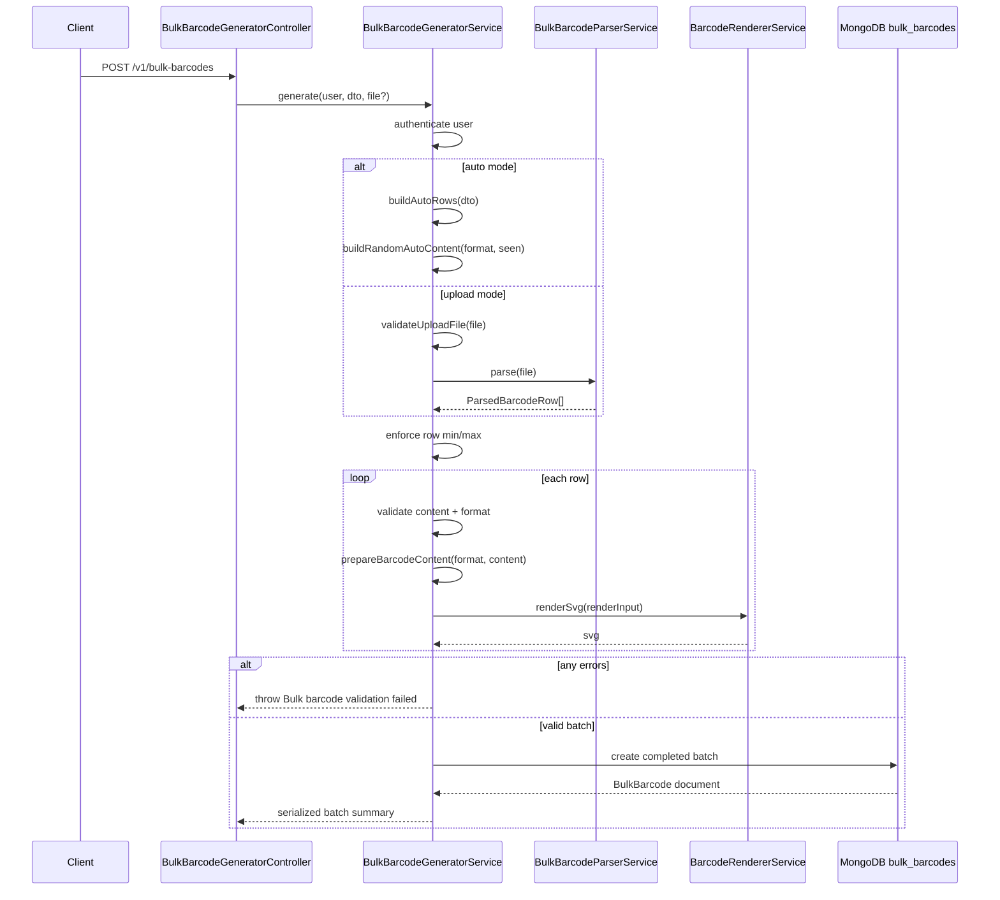
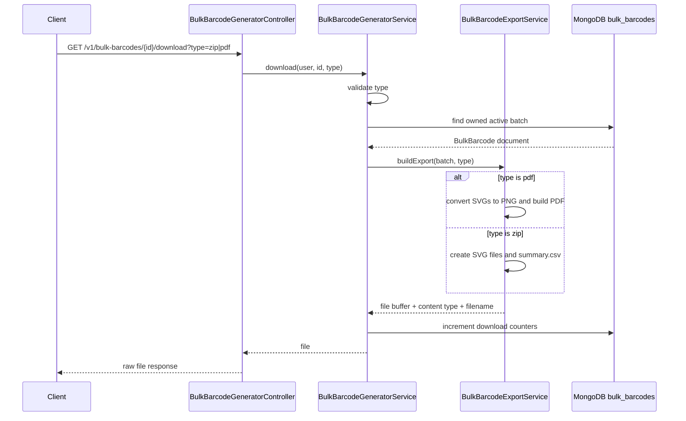

# Bulk Barcode Generator

## What is the bulk barcode generator?

The bulk barcode generator creates many barcode images in one request. A user
can either upload a file that already contains barcode rows, or ask the server
to generate random unique barcode content automatically.

Each generated batch is stored as one `bulk_barcodes` document. The document
keeps the original file name, row counts, generated SVG strings, download
counts, status, and timestamps. The user can later list batches, download a
batch as `zip` or `pdf`, view analytics, or soft-delete the batch.

## Why this feature exists

Generating barcodes one by one is too slow when a user needs labels for many
products, boxes, samples, shelves, shipments, or assets. Bulk generation lets
the user prepare rows once, validate all rows together, render the barcode SVGs,
and download a printable/exportable package.

This feature solves these problems:

- Users can create hundreds or thousands of barcode labels in one request.
- Uploaded spreadsheets can be validated before any batch is saved.
- Auto mode can create unique content without requiring a file.
- The server stores a durable record of generated batches and download history.
- Downloads can be produced in formats that match different workflows:
  individual SVG files in a ZIP, or a printable PDF sheet.

## Main files

| File | Responsibility |
| --- | --- |
| `bulk-barcode-generator.controller.ts` | Defines the `/v1/bulk-barcodes` routes and sends validated requests to services. |
| `bulk-barcode-generator.service.ts` | Owns generation, validation, listing, analytics, download accounting, ownership checks, and deletion. |
| `bulk-barcode-parser.service.ts` | Parses uploaded `.csv`, `.xlsx`, and `.json` files into normalized row objects. |
| `bulk-barcode-export.service.ts` | Builds downloadable `zip` and `pdf` files from stored barcode SVGs. |
| `bulk-barcode-template.service.ts` | Builds sample templates in `csv`, `xlsx`, and `json` formats. |
| `bulk-barcode-generator.dto.ts` | Validates request body and pagination query values. |
| `bulk-barcode.schema.ts` | Defines the MongoDB `bulk_barcodes` document shape. |

## Endpoint summary

| Method | Route | Purpose |
| --- | --- | --- |
| `POST` | `/v1/bulk-barcodes` | Generate a new bulk barcode batch from upload mode or auto mode. |
| `GET` | `/v1/bulk-barcodes` | List the authenticated user's active bulk barcode batches. |
| `GET` | `/v1/bulk-barcodes/analytics` | Return total batches, generated barcodes, rows, and downloads. |
| `GET` | `/v1/bulk-barcodes/analytics/activity/:period/:date` | Return batch creation activity points for a week, month, or year. |
| `GET` | `/v1/bulk-barcodes/analytics/export-mix` | Return ZIP/PDF download distribution. |
| `GET` | `/v1/bulk-barcodes/templates/:type` | Download a sample upload template as `csv`, `xlsx`, or `json`. |
| `GET` | `/v1/bulk-barcodes/:id/download?type=zip\|pdf` | Export one owned batch as ZIP or PDF. |
| `DELETE` | `/v1/bulk-barcodes/:id` | Soft-delete one owned batch. |

## Request validation

`GenerateBulkBarcodeDto` validates shared rendering options and auto-generation
options.

| Field | Rule | Why it is used |
| --- | --- | --- |
| `generationMode` | Optional; must be `upload` or `auto`. | Lets the server know whether to parse a file or generate rows itself. |
| `autoFormat` | Optional; must be a supported `BarcodeFormat`. | Prevents random content from being generated for an unsupported barcode type. |
| `autoCount` | Optional integer, minimum `5`, maximum `10000`. | Stops empty/small batches and protects the server from overly large requests. |
| `barWidth` | Integer from `1` to `5`. | Keeps rendered barcodes readable and prevents extreme SVG sizes. |
| `height` | Integer from `40` to `300`. | Keeps barcode images in a practical scan/print range. |
| `margin` | Integer from `0` to `100`. | Controls quiet-zone spacing without allowing excessive layout size. |
| `barColor` | Six-digit hex color. | Ensures the renderer receives a safe, predictable color string. |
| `backgroundColor` | Six-digit hex color. | Ensures the SVG background color is valid. |
| `showValue` | Boolean or string `"true"`. | Allows multipart form-data values to be converted into a real boolean. |

`GetPaginatedBulkBarcodesDto` validates list query values.

| Field | Rule | Why it is used |
| --- | --- | --- |
| `page` | Optional integer, minimum `1`, default `1`. | Controls which page of batches to return. |
| `limit` | Optional integer, minimum `1`, maximum `100`, default `10`. | Prevents very large list responses. |

## MongoDB document

The `bulk_barcodes` collection stores one document per generated batch.

| Field | Purpose |
| --- | --- |
| `userId` | Owner of the batch. Every protected read/download/delete verifies this. |
| `fileName` | Original upload file name, or `auto-generated-barcodes` for auto mode. |
| `totalRows` | Number of parsed or auto-created input rows. |
| `generatedCount` | Number of successfully rendered barcode items. |
| `failedCount` | Number of failed rows. Current behavior rejects the whole batch on validation errors, so successful saves use `0`. |
| `downloadCounts.zip` | Number of ZIP downloads for this batch. |
| `downloadCounts.pdf` | Number of PDF downloads for this batch. |
| `totalDownloads` | Combined download count across all export types. |
| `lastDownloadType` | Last export format used: `zip` or `pdf`. |
| `lastDownloadedAt` | Timestamp of the latest download. |
| `status` | `completed` or `deleted`. Delete is a soft delete. |
| `items` | Array of generated barcode rows with `row`, `content`, `format`, optional `label`, and rendered `svg`. |
| `deletedAt` | Timestamp set when the batch is soft-deleted. |

Important index:

- `{ userId: 1, status: 1, createdAt: -1 }` supports listing active batches for
  one user in newest-first order.

## Shared authentication and ownership steps

Most routes call `getUser(req)` in the controller before calling the service.

Step 1: Read `req.user`.

Why this is used:

The controller depends on the authentication layer to place the JWT payload on
the request. If `req.user` is missing, the route throws `AccessTokenExpired`.

Step 2: Convert `user.sub` into a MongoDB ObjectId.

Why this is used:

MongoDB queries need an ObjectId. `toObjectId` also rejects invalid ids early
with a clear error message.

Step 3: Confirm the user still exists.

Why this is used:

A token can be structurally valid even if the user was deleted. The service
checks `users.exists({ _id: userId })` so deleted users cannot continue using
old tokens.

Step 4: For id-based routes, fetch the batch and compare owner ids.

Why this is used:

Users must not access another user's generated barcode batches. The service
loads the document, rejects deleted or missing records, and then checks
`bulkBarcode.userId` against the authenticated user id.

## POST `/v1/bulk-barcodes`

This route creates a new bulk barcode batch.

Controller flow:

1. `FileInterceptor('bulkFile')` accepts an optional upload file.
2. The interceptor limits file size to `5 MB`.
3. The controller receives the file, `GenerateBulkBarcodeDto`, and request.
4. `getUser(req)` extracts the authenticated user.
5. The controller calls `bulkBarcodeService.generate(user, dto, file)`.

Why the interceptor is used:

Upload requests are multipart form-data. The interceptor extracts the
`bulkFile` field and prevents oversized files before the service parses them.

Service flow:

1. Authenticate and confirm the user exists.
2. Decide generation mode.
3. Build rows from auto generation or parse uploaded rows.
4. Enforce the global row count range.
5. Validate and render each row.
6. Reject the whole batch if any row has validation errors.
7. Save the completed batch in MongoDB.
8. Return a serialized batch summary.

### Generation mode decision

```ts
const isAutoGenerate =
  (dto.generationMode ?? (file ? 'upload' : 'auto')) === 'auto';
```

This means:

- If `generationMode` is provided, the provided value wins.
- If no mode is provided and a file exists, the service uses upload mode.
- If no mode is provided and no file exists, the service uses auto mode.

Why this is used:

It supports explicit client behavior while still making the common cases easy.
A form upload does not need to send `generationMode=upload`, and an auto
request does not need to attach an empty file.

### Upload mode steps

Step 1: Validate that a file exists.

Why this is used:

Upload mode cannot run without an uploaded file. The service returns
`Barcode upload file is required` instead of trying to parse `undefined`.

Step 2: Validate the file is at most `5 MB`.

Why this is used:

The controller already applies a size limit, but the service repeats the check
so generation rules stay correct even if the service is called from another
place in the future.

Step 3: Validate the filename extension.

The service accepts exactly one extension and only these values:

- `.csv`
- `.xlsx`
- `.json`

It also rejects names with extra dots.

Why this is used:

The parser chooses behavior from the extension. Rejecting unsupported or
double-extension names avoids ambiguous files such as `barcodes.csv.exe` or
`barcodes.backup.csv`.

Step 4: Parse the file into rows.

The parser returns objects shaped like this:

```ts
type ParsedBarcodeRow = {
  row: number;
  content: string;
  format: string;
  label?: string;
};
```

Why this is used:

The rest of the generator should not care whether the user uploaded CSV, JSON,
or XLSX. Everything becomes one simple internal row format.

### CSV parsing

The CSV parser:

1. Removes a UTF-8 BOM if present.
2. Splits contents by line.
3. Removes empty lines.
4. Parses quoted CSV cells.
5. Reads the first row as headers.
6. Requires `content` and `format` columns.
7. Treats `label` as optional.
8. Converts `format` to uppercase.

Why these steps are used:

- BOM removal prevents invisible characters from breaking the first header.
- Empty-line filtering allows files with trailing blank lines.
- Quoted-cell parsing supports labels or content that contain commas.
- Header mapping lets column order vary.
- Uppercasing format allows user files to contain `code128` or `Code128`.

### JSON parsing

The JSON parser accepts either:

```json
[
  { "content": "123456789012", "format": "CODE128", "label": "Product 1" }
]
```

or:

```json
{
  "items": [
    { "content": "123456789012", "format": "CODE128", "label": "Product 1" }
  ]
}
```

Why both shapes are supported:

An array is simple for users, while an object with `items` is useful if the
client later needs metadata around the rows.

Each JSON row is normalized:

- String and number values are accepted for `content`, `format`, and `label`.
- Values are converted to strings.
- `content` and `label` are trimmed.
- `format` is trimmed and uppercased.
- Invalid or missing values become empty strings so row validation can report
  precise errors.

### XLSX parsing

The XLSX parser:

1. Reads the workbook ZIP structure.
2. Finds `xl/worksheets/sheet1.xml`.
3. Reads shared strings from `xl/sharedStrings.xml` if present.
4. Reads worksheet rows and cells.
5. Converts cell references like `A1` and `C2` into column positions.
6. Decodes XML entities.
7. Maps the first row as headers.

Why this is used:

XLSX files are ZIP archives containing XML files. The parser extracts only the
minimal workbook pieces needed for the template format instead of depending on
a large spreadsheet library.

### Auto mode steps

Auto mode creates rows without an uploaded file.

Step 1: Choose format.

```ts
const format = dto.autoFormat ?? BarcodeFormat.CODE128;
```

Why this is used:

`CODE128` is the default because it supports flexible alphanumeric content and
is a practical general-purpose barcode format.

Step 2: Choose count.

```ts
const count = dto.autoCount ?? BULK_BARCODE_MIN_ROWS;
```

Why this is used:

The feature has a minimum batch size of `5`, so auto mode defaults to that
minimum when the client does not provide a count.

Step 3: Enforce count range.

Auto generation must be between `5` and `10000` rows.

Why this is used:

It avoids batches that are too small for the bulk workflow and protects memory,
CPU, MongoDB document size, and export generation work from unreasonable input.

Step 4: Keep a `seen` set.

```ts
const seen = new Set<string>();
```

Why this is used:

Random generation can accidentally produce the same content twice. The set
prevents duplicates inside the same batch.

Step 5: Build one row per requested item.

Each row gets:

- `row`: the 1-based row number.
- `content`: generated unique barcode content.
- `format`: selected auto format.
- `label`: `Auto {rowNumber}`.

Why this is used:

The generated rows match the same `ParsedBarcodeRow` shape as upload mode. This
allows auto and upload generation to share validation, rendering, saving, and
export logic.

### Random content generation

Auto mode uses this flow:

```text
buildRandomAutoContent()
  -> generateRandomRawContent()
  -> prepareBarcodeContent()
  -> add or validate check digit when needed
  -> reject duplicate content
  -> return final unique barcode content
```

#### `buildRandomAutoContent`

This function generates one valid, unique barcode content value for the
selected format.

Step 1: Set a retry limit.

```ts
const maxAttempts = 100;
```

Why this is used:

Random generation can fail if it creates invalid content or a duplicate. The
retry limit prevents an infinite loop.

Step 2: Generate raw content and prepare it.

```ts
const preparedContent = prepareBarcodeContent(
  format,
  this.generateRandomRawContent(format),
);
```

Why this is used:

`generateRandomRawContent` creates a format-shaped random value.
`prepareBarcodeContent` applies the same barcode rules used everywhere else:
trimming, allowed character validation, length checks, and check digit handling.

Step 3: Skip invalid or duplicate content.

```ts
if (!preparedContent.success || seen.has(preparedContent.content)) {
  continue;
}
```

Why this is used:

The function only returns content that can actually be rendered and has not
already been generated in the same batch.

Step 4: Return the prepared content.

Why this is used:

The prepared value is the final scannable content, not just the raw random
input. For numeric formats, this may include an added check digit.

Step 5: Throw after 100 failed attempts.

Why this is used:

If the function cannot find a unique valid value after many attempts, the
request should fail clearly with `Failed to generate unique barcode content.
Try reducing the count.`

#### `generateRandomRawContent`

This function creates raw random content before final validation.

Step 1: Create a random hex token.

```ts
const randomToken = randomBytes(8).toString('hex').toUpperCase();
```

Why this is used:

Eight random bytes become sixteen hex characters. This gives `CODE128` and
`CODE39` a compact alphanumeric token with a very low collision chance.

Step 2: Return alphanumeric content for `CODE128` and `CODE39`.

```ts
return `AUTO-${randomToken}`;
```

Why this is used:

These formats support alphanumeric content, so a readable `AUTO-...` prefix is
valid and useful for identifying generated values.

Step 3: Return 12 raw digits for `EAN13`.

```ts
return `200${this.randomDigits(9)}`;
```

Why this is used:

`EAN13` needs 13 digits. The generator provides 12 digits and lets
`prepareBarcodeContent` add or validate the 13th check digit.

Step 4: Return 11 raw digits for `UPCA`.

```ts
return `100${this.randomDigits(8)}`;
```

Why this is used:

`UPCA` needs 12 digits. The generator provides 11 digits and lets the shared
barcode utility add the final check digit.

Step 5: Return 13 raw digits for the fallback format.

```ts
return `10${this.randomDigits(11)}`;
```

Why this is used:

The remaining supported format is `ITF14`, which needs 14 digits. The generator
provides 13 digits so the shared utility can add the final check digit.

### Row validation and rendering

After rows are built or parsed, `buildBulkItems(rows, dto)` validates and
renders each row.

Step 1: Prepare an `errors` array.

Why this is used:

The service collects row-specific validation errors and returns them together,
so the user can fix the whole upload instead of discovering one problem at a
time.

Step 2: Prepare a `seen` map.

Why this is used:

The map stores `format:content -> first row number`. If the same barcode appears
again, the error can say exactly where it first appeared.

Step 3: Validate required `content`.

Why this is used:

Barcode renderers need actual content. Empty content cannot produce a useful
barcode.

Step 4: Validate required and supported `format`.

Why this is used:

Each barcode standard has different content rules. The service must know the
format before it can validate content or render SVG.

Step 5: Call `prepareBarcodeContent(format, row.content)`.

Why this is used:

This reuses the single-barcode validation rules. It keeps bulk behavior
consistent with normal barcode generation and handles format-specific check
digits.

Step 6: Build `renderInput`.

```ts
const renderInput = {
  format,
  content: preparedContent.content.trim(),
  barWidth: dto.barWidth,
  height: dto.height,
  margin: dto.margin,
  barColor: dto.barColor.toLowerCase(),
  backgroundColor: dto.backgroundColor.toLowerCase(),
  showValue: dto.showValue,
};
```

Why this is used:

The renderer needs normalized content and display settings. Colors are lowered
so the stored style is consistent even if the client sends uppercase hex.

Step 7: Reject duplicate barcode values.

The duplicate key is:

```ts
`${renderInput.format}:${renderInput.content}`
```

Why this is used:

The same text could be valid in different formats. The duplicate check includes
format so `CODE128:12345` and `CODE39:12345` are treated as different barcode
definitions.

Step 8: Render SVG.

```ts
svg: this.renderer.renderSvg(renderInput)
```

Why this is used:

The batch stores finished SVG strings. Later downloads can be built from the
saved batch without rerunning barcode validation or rendering.

Step 9: Reject the whole request if any errors exist.

Why this is used:

Bulk generation should not silently save a partial batch when the uploaded file
has bad rows. The user receives `Bulk barcode validation failed` with row-level
details.

Step 10: Save the batch.

The saved document includes:

- `userId`
- `fileName`
- `totalRows`
- `generatedCount`
- `failedCount: 0`
- `status: completed`
- `items`

Why this is used:

MongoDB becomes the durable source of truth for future list, analytics, export,
and delete operations.

## GET `/v1/bulk-barcodes`

This route lists active batches for the authenticated user.

Flow:

1. Authenticate and confirm the user exists.
2. Read `page` and `limit`.
3. Calculate `skip = (page - 1) * limit`.
4. Build the active-user filter:

```ts
{
  userId,
  status: { $ne: BulkBarcodeStatus.DELETED },
}
```

5. Run two MongoDB queries in parallel:
   - `find(filter).sort({ createdAt: -1, _id: -1 }).skip(skip).limit(limit)`
   - `countDocuments(filter)`
6. Serialize every document.
7. Return items plus pagination metadata.

Why these steps are used:

- The active-user filter prevents deleted or other-user records from appearing.
- Newest-first sorting matches dashboard expectations.
- Sorting by `_id` after `createdAt` gives a stable order when timestamps tie.
- Count and list queries run in parallel to reduce response time.
- Serialization hides internal MongoDB fields and returns a frontend-friendly
  shape.

Pagination response:

| Field | Meaning |
| --- | --- |
| `totalItems` | Total active batches for this user. |
| `totalPages` | `Math.ceil(total / limit)`. |
| `hasMore` | Whether another page exists after the current page. |
| `page` | Current page number. |
| `limit` | Page size. |
| `cursor` | Id of the last returned item, useful as a lightweight continuation marker. |

## GET `/v1/bulk-barcodes/analytics`

This route returns high-level totals for the user's active bulk barcode
batches.

Flow:

1. Authenticate and confirm the user exists.
2. Build the active-user filter.
3. Count active batch documents.
4. Aggregate totals for:
   - `generatedCount`
   - `totalRows`
   - `totalDownloads`
5. Return zeroes when no aggregation row exists.

Why aggregation is used:

MongoDB can sum the totals in the database without loading every batch document
into application memory.

Response shape:

```ts
{
  batches: number;
  generated: number;
  rows: number;
  downloads: number;
}
```

## GET `/v1/bulk-barcodes/analytics/activity/:period/:date`

This route returns batch creation activity for a selected period.

Accepted period values:

- `week`
- `month`
- `year`

Flow:

1. Authenticate and confirm the user exists.
2. Call `getActivityRange(period, date)`.
3. Build the current date filter with `start` and `end`.
4. Aggregate current-period batches grouped by a formatted date label.
5. Count current-period total.
6. Count previous-period total.
7. Calculate growth percentage.
8. Fill missing labels with count `0`.

Why `getActivityRange` is used:

The activity route needs consistent start/end dates, previous-period dates, date
labels, and MongoDB date formats. Keeping that logic in a shared utility avoids
repeating date math in each feature module.

Why missing labels are filled:

Charts usually need a fixed set of points. Returning `0` for dates with no
batches keeps the frontend chart aligned.

Growth calculation:

```text
if previousTotal is 0 and currentTotal is greater than 0: 100
if previousTotal is 0 and currentTotal is 0: 0
otherwise: ((currentTotal - previousTotal) / previousTotal) * 100
```

## GET `/v1/bulk-barcodes/analytics/export-mix`

This route returns the distribution of ZIP and PDF downloads.

Flow:

1. Authenticate and confirm the user exists.
2. Aggregate the sum of `downloadCounts.zip`.
3. Aggregate the sum of `downloadCounts.pdf`.
4. Calculate `total = zip + pdf`.
5. Calculate each percentage to one decimal place.
6. Return both chart-friendly and raw-count shapes.

Why this is used:

The dashboard can show which export format users prefer, while raw counts stay
available for labels, tables, or summaries.

Response shape:

```ts
{
  exportTypeDistribution: [
    { format: 'ZIP', count: number, percentage: number },
    { format: 'PDF', count: number, percentage: number },
  ],
  downloadFormatDistribution: { zip: number, pdf: number },
}
```

## GET `/v1/bulk-barcodes/templates/:type`

This route downloads an empty/example template for users who want upload mode.

Supported values:

- `csv`
- `xlsx`
- `json`

Controller flow:

1. Call `templateService.getTemplate(type)`.
2. Set `Content-Type`.
3. Set `Cache-Control: private, no-store`.
4. Set `Content-Disposition` with the template filename.
5. Send the raw file buffer.

Why `SkipResponseInterceptor` is used:

Template downloads must return the file bytes directly. They should not be
wrapped in the normal JSON success envelope.

Template rows:

```text
content,format,label
123456789012,CODE128,Product 1
987654321098,CODE128,Product 2
ABC-2026-001,CODE128,Box A
PRODUCT-004,CODE39,Item 4
12345678901231,ITF14,Case 5
```

Why sample rows are included:

They show the required columns, optional label column, supported format values,
and realistic content examples.

### Template CSV

The CSV template writes the header row and sample rows, escaping cells when
needed.

Why escaping is used:

CSV cells that contain quotes, commas, or new lines must be wrapped in quotes
and internal quotes must be doubled.

### Template JSON

The JSON template returns an array of row objects.

Why this is used:

It is simple to read, simple to edit, and matches the JSON parser's accepted
array shape.

### Template XLSX

The XLSX template builds a minimal workbook ZIP with:

- `[Content_Types].xml`
- `_rels/.rels`
- `xl/workbook.xml`
- `xl/_rels/workbook.xml.rels`
- `xl/worksheets/sheet1.xml`

Why this is used:

The feature only needs a simple first worksheet. Generating a minimal workbook
keeps the server-side template builder small and dependency-light.

## GET `/v1/bulk-barcodes/:id/download?type=zip|pdf`

This route exports one owned batch.

Controller flow:

1. Read `id` from the route.
2. Read `type` from the query string.
3. Extract authenticated user.
4. Call `bulkBarcodeService.download(user, id, type)`.
5. Set file response headers.
6. Send the raw file buffer.

Why `SkipResponseInterceptor` is used:

Downloads must return binary file bytes directly, not a JSON wrapper.

Service flow:

1. Validate `type` is `zip` or `pdf`.
2. Load the owned, non-deleted batch.
3. Call `exporter.buildExport(bulkBarcode, type)`.
4. Increment download counters.
5. Set `lastDownloadType` and `lastDownloadedAt`.
6. Return the generated file.

Why counters are updated after export:

The download count should represent successful export creation. If PDF or ZIP
building fails, the service should not record a download.

### ZIP export

ZIP export builds:

- One SVG file per barcode under `barcodes/`.
- A `summary.csv` file with `row`, `content`, `format`, `label`, `fileName`,
  and `status`.

Each item filename is built from row number and a safe label/content slug:

```text
row-{row}-{safe-name}.svg
```

Why this is used:

The ZIP gives users editable individual SVG files and a summary spreadsheet that
maps rows to generated filenames.

Why filenames are sanitized:

Labels and content can contain spaces or special characters. Sanitizing keeps
filenames portable across operating systems and ZIP tools.

### PDF export

PDF export:

1. Creates a PDF document.
2. Embeds Helvetica.
3. Creates letter-sized pages.
4. Converts each SVG to PNG with `sharp`.
5. Embeds each PNG in the PDF.
6. Draws a card border.
7. Prints the label or content.
8. Prints `{format} - {content}`.
9. Adds a new page when the current page is full.

Why SVG is converted to PNG:

`pdf-lib` embeds raster images directly. `sharp` converts the stored SVG into a
PNG buffer that can be placed on the PDF page.

Why cards are used:

Each barcode needs enough space for the image, label, format, and content. A
fixed card height makes the PDF predictable and printable.

### Manual ZIP creation

The export service writes ZIP headers directly and calculates CRC32 for each
file.

Why this is used:

The current implementation avoids an extra ZIP dependency and only needs simple
stored files. The ZIP includes local file headers, central directory headers,
and the end-of-central-directory record.

## DELETE `/v1/bulk-barcodes/:id`

This route soft-deletes one owned batch.

Flow:

1. Authenticate and confirm the user exists.
2. Convert `id` to ObjectId.
3. Load the batch.
4. Reject missing or already deleted batches.
5. Reject batches owned by another user.
6. Set `status = deleted`.
7. Set `deletedAt = new Date()`.
8. Save the document.
9. Return `Bulk barcode upload deleted successfully`.

Why soft delete is used:

Soft deletion removes the batch from normal list, analytics, and download
queries while keeping the record available for audit/history if needed.

## Error behavior

| Situation | Error |
| --- | --- |
| Missing `req.user` | `AccessTokenExpired` |
| Authenticated user id is invalid | `Authenticated user id is invalid` |
| User no longer exists | `AccessTokenExpired` |
| Upload mode has no file | `Barcode upload file is required` |
| File is larger than `5 MB` | `Barcode upload file must be 5 MB or smaller` |
| File extension is unsupported or ambiguous | `Upload exactly one .csv, .xlsx, or .json file with no extra extensions` |
| CSV/XLSX missing required headers | `Upload must include content and format columns` |
| JSON is invalid | `JSON template must be valid JSON` |
| JSON shape is invalid | `JSON template must be an array or an object with an items array` |
| Row count is below `5` | `Bulk barcode generation requires at least 5 items.` |
| Row count is above `10000` | `Maximum 10000 barcode items allowed per upload.` |
| Row content is empty | Row-level `Content is required` |
| Row format is empty | Row-level `Format is required` |
| Row format is unsupported | Row-level `Unsupported barcode format` |
| Row content breaks format rules | Row-level message from `prepareBarcodeContent` |
| Duplicate row content and format | Row-level `Duplicate barcode in upload. First seen on row {row}.` |
| Invalid download type | `Download type must be pdf or zip` |
| Batch id is invalid | `Bulk barcode id is invalid` |
| Batch is missing or deleted | `Bulk barcode upload not found` |
| User does not own batch | `You do not have access to this bulk barcode upload` |
| Template type is invalid | `Template type must be csv, xlsx, or json` |

## End-to-end generation flow



## End-to-end download flow



## Design choices

| Choice | Why it exists |
| --- | --- |
| Shared `prepareBarcodeContent` | Bulk and single barcode generation must enforce the same barcode rules. |
| Store rendered SVGs | Downloads can be rebuilt without revalidating or rerendering every barcode. |
| Reject whole batch on row errors | Prevents users from accidentally saving incomplete uploads. |
| Track duplicate row number | Makes upload fixes easier because the error points to the original duplicate. |
| Soft delete | Keeps deleted batches out of normal use while preserving history. |
| Manual XLSX parsing/template creation | Supports the simple template shape without pulling in a large spreadsheet dependency. |
| `SkipResponseInterceptor` on downloads | Binary responses must not be wrapped in JSON. |
| Download counters on batch document | Analytics can be calculated with simple MongoDB aggregation. |

## Code-order API explanation

This section explains each route in the same order the code runs:

```txt
code line
explanation
if the line calls a helper function, explain that helper immediately
then continue to the next line
```

## `POST /v1/bulk-barcodes`

Controller code:

```ts
@Post()
@UseInterceptors(
  FileInterceptor('bulkFile', {
    limits: { fileSize: BULK_BARCODE_MAX_FILE_SIZE_BYTES },
  }),
)
generate(
  @UploadedFile() file: UploadedBarcodeFile | undefined,
  @Body() dto: GenerateBulkBarcodeDto,
  @Req() req: AuthenticatedRequest,
) {
  return this.bulkBarcodeService.generate(this.getUser(req), dto, file);
}
```

Explanation:

```txt
@Post()
This creates POST /v1/bulk-barcodes because the controller base path is
v1/bulk-barcodes.

@UseInterceptors(FileInterceptor('bulkFile', ...))
This tells NestJS to read a multipart file from the form-data field named
bulkFile.

limits: { fileSize: BULK_BARCODE_MAX_FILE_SIZE_BYTES }
This limits the uploaded file to 5 MB.

@UploadedFile() file
This receives the uploaded file. It can be undefined in auto mode.

@Body() dto
This receives GenerateBulkBarcodeDto. It contains generationMode, autoFormat,
autoCount, barWidth, height, margin, barColor, backgroundColor, and showValue.

@Req() req
This gives access to req.user.

this.getUser(req)
This checks authentication. If req.user is missing, it throws AccessTokenExpired.

bulkBarcodeService.generate(...)
This sends the authenticated user, DTO, and optional file into the service.
```

Service code:

```ts
async generate(
  user: JwtPayload,
  dto: GenerateBulkBarcodeDto,
  file?: UploadedBarcodeFile,
) {
  const userId = await this.getAuthenticatedUserId(user);
  const isAutoGenerate =
    (dto.generationMode ?? (file ? 'upload' : 'auto')) === 'auto';
  let fileName = 'auto-generated-barcodes';
  let rows: ParsedBarcodeRow[];

  if (isAutoGenerate) {
    rows = this.buildAutoRows(dto);
  } else {
    this.validateUploadFile(file);
    fileName = file.originalname;
    rows = this.parser.parse(file);
  }

  if (rows.length < BULK_BARCODE_MIN_ROWS) {
    throw new BadRequestException(...);
  }

  if (rows.length > BULK_BARCODE_MAX_ROWS) {
    throw new BadRequestException(...);
  }

  const { items, errors } = this.buildBulkItems(rows, dto);
  if (errors.length > 0) {
    throw new BadRequestException(...);
  }

  const bulkBarcode = await this.bulkBarcodeModel.create({
    userId,
    fileName,
    totalRows: rows.length,
    generatedCount: items.length,
    failedCount: 0,
    status: BulkBarcodeStatus.COMPLETED,
    items,
  });

  return {
    message: 'Bulk barcodes generated successfully',
    bulkBarcode: this.serializeBulkBarcode(bulkBarcode),
    generated: items.length,
    failed: 0,
  };
}
```

Line:

```ts
const userId = await this.getAuthenticatedUserId(user);
```

Explanation:

```txt
This verifies the JWT user and returns the MongoDB user id.
```

Helper function:

```ts
private async getAuthenticatedUserId(user: JwtPayload): Promise<Types.ObjectId> {
  const userId = toObjectId(user.sub, 'Authenticated user id is invalid');
  const userExists = await this.userModel.exists({ _id: userId });

  if (!userExists) {
    throw new AccessTokenExpired();
  }

  return userId;
}
```

Helper explanation:

```txt
toObjectId(user.sub)
Converts JWT subject into MongoDB ObjectId. If invalid, request fails.

userModel.exists({ _id: userId })
Checks the user still exists in MongoDB.

if (!userExists)
If the token points to a deleted/non-existing user, throw AccessTokenExpired.

return userId
The rest of the service uses this id as owner id.
```

Line:

```ts
const isAutoGenerate =
  (dto.generationMode ?? (file ? 'upload' : 'auto')) === 'auto';
```

Explanation:

```txt
This decides whether the request is auto mode or upload mode.

If dto.generationMode exists:
use dto.generationMode.

If dto.generationMode is missing and file exists:
use upload mode.

If dto.generationMode is missing and file does not exist:
use auto mode.

Finally compare selected mode with 'auto'.
If selected mode is auto, isAutoGenerate is true.
```

Examples:

```txt
generationMode = auto, file missing  -> auto mode
generationMode = upload, file exists -> upload mode
generationMode missing, file exists  -> upload mode
generationMode missing, no file      -> auto mode
```

Line:

```ts
let fileName = 'auto-generated-barcodes';
```

Explanation:

```txt
This is the default filename used for auto-generated batches.
If upload mode is used, this will be replaced with file.originalname.
```

Line:

```ts
let rows: ParsedBarcodeRow[];
```

Explanation:

```txt
This variable will store normalized rows.
In upload mode, rows come from parser.parse(file).
In auto mode, rows come from buildAutoRows(dto).
```

Line:

```ts
if (isAutoGenerate) {
  rows = this.buildAutoRows(dto);
}
```

Explanation:

```txt
If request is auto mode, server generates barcode rows itself.
```

Helper function:

```ts
private buildAutoRows(dto: GenerateBulkBarcodeDto): ParsedBarcodeRow[] {
  const format = dto.autoFormat ?? BarcodeFormat.CODE128;
  const count = dto.autoCount ?? BULK_BARCODE_MIN_ROWS;

  if (count < BULK_BARCODE_MIN_ROWS || count > BULK_BARCODE_MAX_ROWS) {
    throw new BadRequestException(...);
  }

  const seen = new Set<string>();

  return Array.from({ length: count }, (_, index) => {
    const rowNumber = index + 1;
    const content = this.buildRandomAutoContent(format, seen);
    seen.add(content);

    return {
      row: rowNumber,
      content,
      format,
      label: `Auto ${rowNumber}`,
    };
  });
}
```

Helper explanation:

```txt
const format = dto.autoFormat ?? CODE128
If user gives autoFormat, use it. Otherwise default to CODE128.

const count = dto.autoCount ?? BULK_BARCODE_MIN_ROWS
If user gives autoCount, use it. Otherwise generate 5 rows.

count validation
Auto count must be between 5 and 10,000.

const seen = new Set<string>()
Keeps already generated contents so auto rows are unique.

Array.from({ length: count })
Creates exactly count rows.

rowNumber = index + 1
Makes rows start from 1.

buildRandomAutoContent(format, seen)
Generates one valid unique barcode content value.

seen.add(content)
Stores generated content so next rows cannot duplicate it.

return row object
Returns ParsedBarcodeRow shape: row, content, format, label.
```

Nested helper:

```ts
private buildRandomAutoContent(format: BarcodeFormat, seen: Set<string>): string {
  const maxAttempts = 100;

  for (let attempt = 0; attempt < maxAttempts; attempt++) {
    const preparedContent = prepareBarcodeContent(
      format,
      this.generateRandomRawContent(format),
    );

    if (!preparedContent.success || seen.has(preparedContent.content)) {
      continue;
    }

    return preparedContent.content;
  }

  throw new BadRequestException(...);
}
```

Nested helper explanation:

```txt
maxAttempts = 100
For one row, try up to 100 random values.

generateRandomRawContent(format)
Creates raw random content for selected barcode format.

prepareBarcodeContent(format, rawContent)
Validates content and adds check digit if needed.

if invalid or already seen
continue means try another random value.

return preparedContent.content
Return first valid unique content.

throw BadRequest
If 100 attempts fail, tell user to reduce count.
```

Nested helper:

```ts
private generateRandomRawContent(format: BarcodeFormat): string {
  const randomToken = randomBytes(8).toString('hex').toUpperCase();

  if (format === BarcodeFormat.CODE128 || format === BarcodeFormat.CODE39) {
    return `AUTO-${randomToken}`;
  }

  if (format === BarcodeFormat.EAN13) {
    return `200${this.randomDigits(9)}`;
  }

  if (format === BarcodeFormat.UPCA) {
    return `100${this.randomDigits(8)}`;
  }

  return `10${this.randomDigits(11)}`;
}
```

Nested helper explanation:

```txt
randomToken
Creates uppercase random hex text.

CODE128 or CODE39
Returns AUTO-{random token}.

EAN13
Returns 12 digits starting with 200. prepareBarcodeContent adds the 13th digit.

UPCA
Returns 11 digits starting with 100. prepareBarcodeContent adds the 12th digit.

ITF14
Returns 13 digits starting with 10. prepareBarcodeContent adds the 14th digit.
```

Line:

```ts
} else {
  this.validateUploadFile(file);
  fileName = file.originalname;
  rows = this.parser.parse(file);
}
```

Explanation:

```txt
This branch runs when request is upload mode.
It validates file, stores original filename, and parses file into rows.
```

Helper function:

```ts
private validateUploadFile(file?: UploadedBarcodeFile): asserts file is UploadedBarcodeFile {
  if (!file) throw new BadRequestException(...);
  if (file.size > BULK_BARCODE_MAX_FILE_SIZE_BYTES) throw new BadRequestException(...);

  const name = file.originalname.trim().toLowerCase();
  const dotCount = (name.match(/\./g) ?? []).length;
  const hasAllowedExtension = BULK_BARCODE_ALLOWED_EXTENSIONS.some(
    (extension) => name.endsWith(extension),
  );

  if (dotCount !== 1 || !hasAllowedExtension) throw new BadRequestException(...);
}
```

Helper explanation:

```txt
if (!file)
Upload mode requires a file.

file.size check
File must be 5 MB or smaller.

name
Normalize filename for extension checks.

dotCount
Must be exactly 1. This blocks tricky names like barcodes.csv.exe.

hasAllowedExtension
Must end with .csv, .xlsx, or .json.

asserts file is UploadedBarcodeFile
After this function succeeds, TypeScript knows file is not undefined.
```

Line:

```ts
fileName = file.originalname;
```

Explanation:

```txt
In upload mode, save the user's original uploaded filename on the batch.
```

Line:

```ts
rows = this.parser.parse(file);
```

Explanation:

```txt
Parse uploaded CSV/XLSX/JSON file into ParsedBarcodeRow[].
```

Helper function:

```ts
parse(file: UploadedBarcodeFile): ParsedBarcodeRow[] {
  const extension = this.getExtension(file.originalname);

  if (extension === '.csv') return this.parseCsv(file.buffer.toString('utf8'));
  if (extension === '.json') return this.parseJson(file.buffer.toString('utf8'));
  if (extension === '.xlsx') return this.parseXlsx(file.buffer);

  throw new BadRequestException(...);
}
```

Helper explanation:

```txt
getExtension
Reads extension from original filename.

.csv
Parse text CSV.

.json
Parse JSON body.

.xlsx
Parse workbook buffer.

other
Reject file.
```

Parser sub-functions:

```txt
parseCsv
Removes BOM, splits lines, ignores empty lines, parses CSV cells, maps headers.

parseJson
JSON.parse. Accepts array or { items: [...] }. Reads content, format, label.

parseXlsx
Reads XLSX zip entries, worksheet XML, shared strings, and maps rows.

mapTableRows
Requires content and format columns. Optional label column.
```

Line:

```ts
if (rows.length < BULK_BARCODE_MIN_ROWS) throw new BadRequestException(...);
if (rows.length > BULK_BARCODE_MAX_ROWS) throw new BadRequestException(...);
```

Explanation:

```txt
After rows are ready, enforce global row count.
Minimum is 5.
Maximum is 10,000.
This applies to upload and auto mode.
```

Line:

```ts
const { items, errors } = this.buildBulkItems(rows, dto);
```

Explanation:

```txt
Convert parsed rows into rendered barcode items.
Also collect row-level validation errors.
```

Helper function:

```ts
private buildBulkItems(rows: ParsedBarcodeRow[], dto: GenerateBulkBarcodeDto) {
  const errors: BulkValidationError[] = [];
  const seen = new Map<string, number>();
  const items = rows
    .map((row) => {
      const format = row.format as BarcodeFormat;
      const hasSupportedFormat =
        row.format && Object.values(BarcodeFormat).includes(format);

      if (!row.content) errors.push(...);
      if (!row.format) errors.push(...);
      else if (!hasSupportedFormat) errors.push(...);

      if (!row.content || !hasSupportedFormat) return null;

      const preparedContent = prepareBarcodeContent(format, row.content);
      if (!preparedContent.success) {
        errors.push(...);
        return null;
      }

      const renderInput = {
        format,
        content: preparedContent.content.trim(),
        barWidth: dto.barWidth,
        height: dto.height,
        margin: dto.margin,
        barColor: dto.barColor.toLowerCase(),
        backgroundColor: dto.backgroundColor.toLowerCase(),
        showValue: dto.showValue,
      };

      const duplicateKey = `${renderInput.format}:${renderInput.content}`;
      const firstRow = seen.get(duplicateKey);

      if (firstRow) {
        errors.push(...);
        return null;
      }

      seen.set(duplicateKey, row.row);

      return {
        row: row.row,
        content: renderInput.content,
        format: renderInput.format,
        label: row.label || null,
        svg: this.renderer.renderSvg(renderInput),
      };
    })
    .filter((item): item is NonNullable<typeof item> => item !== null);

  return { items, errors };
}
```

Helper explanation:

```txt
errors
Stores validation errors with row number, field, and message.

seen
Stores barcode keys already found in this batch.

format
Treat row format as BarcodeFormat.

hasSupportedFormat
Checks format is supported.

missing content/format checks
Push row-level errors.

return null
Skip invalid row from item creation.

prepareBarcodeContent
Runs same rules as single barcode generator.

renderInput
Final object sent to renderer. It includes normalized content and visual options.

duplicateKey
Uses format:content so same content in different formats is allowed.

seen.get
Finds first row where duplicate appeared.

renderer.renderSvg
Creates the SVG.

filter
Removes null skipped rows.
```

Line:

```ts
if (errors.length > 0) throw new BadRequestException(...);
```

Explanation:

```txt
If any row has an error, reject the entire batch.
The API does not save partial success.
```

Line:

```ts
const bulkBarcode = await this.bulkBarcodeModel.create({
  userId,
  fileName,
  totalRows: rows.length,
  generatedCount: items.length,
  failedCount: 0,
  status: BulkBarcodeStatus.COMPLETED,
  items,
});
```

Explanation:

```txt
Create one MongoDB bulk_barcodes document.

userId
Owner.

fileName
Upload original name or auto-generated-barcodes.

totalRows
Number of parsed/generated rows.

generatedCount
Number of rendered barcode SVG items.

failedCount
Always 0 for saved batch because errors reject the request before save.

status
completed.

items
All generated barcode rows with SVG.
```

Line:

```ts
return {
  message: 'Bulk barcodes generated successfully',
  bulkBarcode: this.serializeBulkBarcode(bulkBarcode),
  generated: items.length,
  failed: 0,
};
```

Explanation:

```txt
Return success message.
Return serialized batch summary.
Return generated count.
Return failed 0.
```

Helper function:

```ts
private serializeBulkBarcode(bulkBarcode: BulkBarcodeDocument): SerializedBulkBarcode {
  return {
    id: String(bulkBarcode._id),
    fileName: bulkBarcode.fileName,
    totalRows: bulkBarcode.totalRows,
    generatedCount: bulkBarcode.generatedCount,
    failedCount: bulkBarcode.failedCount,
    downloadCounts: bulkBarcode.downloadCounts ?? { zip: 0, pdf: 0 },
    totalDownloads: bulkBarcode.totalDownloads ?? 0,
    lastDownloadType: bulkBarcode.lastDownloadType ?? null,
    lastDownloadedAt: bulkBarcode.lastDownloadedAt ?? null,
    status: bulkBarcode.status,
    createdAt: bulkBarcode.createdAt ?? null,
    updatedAt: bulkBarcode.updatedAt ?? null,
  };
}
```

Helper explanation:

```txt
Converts MongoDB document into API response shape.
Does not include full items array.
Adds safe defaults for download counters and nullable fields.
```

## `GET /v1/bulk-barcodes`

Code:

```ts
async getPaginatedData(user: JwtPayload, query: GetPaginatedBulkBarcodesDto) {
  const userId = await this.getAuthenticatedUserId(user);
  const { page, limit } = query;
  const skip = (page - 1) * limit;
  const filter = activeBulkBarcodeFilter(userId);

  const [bulkBarcodes, total] = await Promise.all([
    this.bulkBarcodeModel
      .find(filter)
      .sort({ createdAt: -1, _id: -1 })
      .skip(skip)
      .limit(limit)
      .exec(),
    this.bulkBarcodeModel.countDocuments(filter).exec(),
  ]);

  const items = bulkBarcodes.map((item) => this.serializeBulkBarcode(item));

  return {
    items,
    pagination: {
      totalItems: total,
      totalPages: Math.ceil(total / limit),
      hasMore: page * limit < total,
      page,
      limit,
      cursor: items.length > 0 ? items[items.length - 1].id : null,
    },
  };
}
```

Explanation:

```txt
getAuthenticatedUserId
Verify user.

page, limit
Use validated pagination values.

skip
Calculate page offset.

activeBulkBarcodeFilter
Build { userId, status: { $ne: deleted } }.

find/filter/sort/skip/limit
Fetch one page of non-deleted batches, newest first.

countDocuments
Count total matching batches.

serializeBulkBarcode
Convert each document to summary.

pagination
Return total, totalPages, hasMore, page, limit, and cursor.
```

## `GET /v1/bulk-barcodes/analytics`

Code:

```ts
async getAnalytics(user: JwtPayload) {
  const userId = await this.getAuthenticatedUserId(user);
  const filter = activeBulkBarcodeFilter(userId);

  const [batches, totals] = await Promise.all([
    this.bulkBarcodeModel.countDocuments(filter).exec(),
    this.bulkBarcodeModel
      .aggregate([
        { $match: filter },
        {
          $group: {
            _id: null,
            generated: { $sum: '$generatedCount' },
            rows: { $sum: '$totalRows' },
            downloads: { $sum: '$totalDownloads' },
          },
        },
      ])
      .exec(),
  ]);

  return {
    batches,
    generated: totals[0]?.generated ?? 0,
    rows: totals[0]?.rows ?? 0,
    downloads: totals[0]?.downloads ?? 0,
  };
}
```

Explanation:

```txt
getAuthenticatedUserId
Verify user.

activeBulkBarcodeFilter
Only this user's non-deleted batches.

countDocuments
Count total batches.

$match
Filter documents before aggregation.

$group _id null
Combine all matching docs into one totals row.

$sum generatedCount
Total generated barcodes.

$sum totalRows
Total source rows.

$sum totalDownloads
Total downloads.

?? 0
Default missing aggregation values to zero.
```

## `GET /v1/bulk-barcodes/analytics/activity/:period/:date`

Code:

```ts
async getActivity(user: JwtPayload, query: { period: ActivityPeriod; date: string }) {
  const userId = await this.getAuthenticatedUserId(user);
  const range = getActivityRange(query.period, query.date);
  const filter = activeBulkBarcodeFilter(userId);
  const createdAtFilter = { $gte: range.start, $lt: range.end };
  ...
}
```

Explanation:

```txt
getAuthenticatedUserId
Verify user.

getActivityRange
Validate period/date and create start, end, previousStart, previousEnd, labels,
and mongoDateFormat.

activeBulkBarcodeFilter
Filter user's non-deleted batches.

createdAtFilter
Only documents created inside selected range.
```

Aggregation:

```ts
this.bulkBarcodeModel.aggregate([
  { $match: { ...filter, createdAt: createdAtFilter } },
  {
    $group: {
      _id: {
        $dateToString: {
          format: range.mongoDateFormat,
          date: '$createdAt',
          timezone: 'UTC',
        },
      },
      count: { $sum: 1 },
    },
  },
  { $sort: { _id: 1 } },
])
```

Explanation:

```txt
$match
Keep user's non-deleted batches in date range.

$dateToString
Convert createdAt to chart label.

$group
Group by date label.

count $sum 1
Count batches for each label.

$sort
Sort labels oldest to newest.
```

Counts and response:

```txt
currentTotal
Count selected period.

previousTotal
Count previous period.

growth
Calculate percentage change.

counts Map
Convert aggregation rows into lookup map.

range.labels.map
Return all labels with count or 0.
```

## `GET /v1/bulk-barcodes/analytics/export-mix`

Code:

```ts
async getDownloadMix(user: JwtPayload) {
  const userId = await this.getAuthenticatedUserId(user);
  const [totals] = await this.bulkBarcodeModel
    .aggregate([
      { $match: activeBulkBarcodeFilter(userId) },
      {
        $group: {
          _id: null,
          zip: { $sum: '$downloadCounts.zip' },
          pdf: { $sum: '$downloadCounts.pdf' },
        },
      },
      { $project: { _id: 0, zip: 1, pdf: 1 } },
    ])
    .exec();
  ...
}
```

Explanation:

```txt
getAuthenticatedUserId
Verify user.

$match activeBulkBarcodeFilter
Only user's non-deleted batches.

$group
Combine all docs into one row.

$sum downloadCounts.zip
Total ZIP downloads.

$sum downloadCounts.pdf
Total PDF downloads.

$project
Remove _id and return zip/pdf.
```

Percentage code:

```ts
const zip = totals?.zip ?? 0;
const pdf = totals?.pdf ?? 0;
const total = zip + pdf;
const toPercentage = (count: number) =>
  total > 0 ? Number(((count / total) * 100).toFixed(1)) : 0;
```

Explanation:

```txt
Default missing totals to zero.
Calculate total downloads.
If total is greater than zero, calculate percentage.
If total is zero, percentage is zero.
```

## `GET /v1/bulk-barcodes/templates/:type`

Controller code:

```ts
@Get('templates/:type')
@SkipResponseInterceptor()
downloadTemplate(@Param('type') type: string, @Res() res: Response) {
  const file = this.templateService.getTemplate(type);

  res.setHeader('Content-Type', file.contentType);
  res.setHeader('Cache-Control', 'private, no-store');
  res.setHeader(
    'Content-Disposition',
    `attachment; filename="${file.filename}"`,
  );
  return res.send(file.body);
}
```

Explanation:

```txt
@SkipResponseInterceptor
Return raw file, not JSON wrapper.

getTemplate(type)
Build csv, json, or xlsx template.

setHeader
Set file content type, cache behavior, and attachment filename.

res.send(file.body)
Send file buffer.
```

Helper:

```txt
getTemplate('csv') -> buildCsv -> CSV buffer.
getTemplate('json') -> buildJson -> JSON buffer.
getTemplate('xlsx') -> buildXlsx -> XLSX buffer.
invalid type -> BadRequest.
```

## `GET /v1/bulk-barcodes/:id/download?type=zip|pdf`

Service code:

```ts
async download(user: JwtPayload, bulkBarcodeId: string, type: BulkBarcodeDownloadType) {
  if (!Object.values(BulkBarcodeDownloadType).includes(type)) {
    throw new BadRequestException(...);
  }

  const bulkBarcode = await this.getOwnedBulkBarcode(user, bulkBarcodeId);
  const file = await this.exporter.buildExport(bulkBarcode, type);

  await this.bulkBarcodeModel.updateOne(...).exec();

  return file;
}
```

Explanation:

```txt
type validation
Only zip and pdf allowed.

getOwnedBulkBarcode
Verify user, id, ownership, and not-deleted status.

exporter.buildExport
Build file buffer.

updateOne
Increment download analytics.

return file
Controller sends file as raw response.
```

Helper:

```txt
buildExport
If type is pdf, call buildPdf.
If type is zip, call buildZip.

buildPdf
Convert SVGs to PNG with sharp and place them in PDF.

buildZip
Create SVG files and summary.csv, then create ZIP buffer.
```

## `DELETE /v1/bulk-barcodes/:id`

Code:

```ts
async delete(user: JwtPayload, bulkBarcodeId: string) {
  const bulkBarcode = await this.getOwnedBulkBarcode(user, bulkBarcodeId);
  bulkBarcode.status = BulkBarcodeStatus.DELETED;
  bulkBarcode.deletedAt = new Date();
  await bulkBarcode.save();

  return { message: 'Bulk barcode upload deleted successfully' };
}
```

Explanation:

```txt
getOwnedBulkBarcode
Load owned non-deleted batch.

status = deleted
Soft delete the batch.

deletedAt
Store deletion timestamp.

save
Persist changes.

return message
Tell client delete succeeded.
```

## Line-by-line explanation for every Bulk Barcode API

This section explains each API independently and repeats shared helper functions
where they are used.

## Line-by-line: `POST /v1/bulk-barcodes`

This API creates one bulk barcode batch from either an uploaded file or automatic
server-generated rows.

Controller:

```ts
@Post()
@UseInterceptors(
  FileInterceptor('bulkFile', {
    limits: { fileSize: BULK_BARCODE_MAX_FILE_SIZE_BYTES },
  }),
)
generate(
  @UploadedFile() file: UploadedBarcodeFile | undefined,
  @Body() dto: GenerateBulkBarcodeDto,
  @Req() req: AuthenticatedRequest,
) {
  return this.bulkBarcodeService.generate(this.getUser(req), dto, file);
}
```

Line by line:

```txt
@Post()
Maps this method to POST /v1/bulk-barcodes.

FileInterceptor('bulkFile')
Reads multipart file field named bulkFile.

limits.fileSize
Rejects files larger than 5 MB.

@UploadedFile() file
Receives uploaded CSV/XLSX/JSON file when upload mode is used.

@Body() dto
Receives style settings and auto-generation options.

@Req() req
Allows controller to read req.user.

getUser(req)
Throws AccessTokenExpired if req.user is missing.

bulkBarcodeService.generate(user, dto, file)
Runs the main generation logic.
```

Service start:

```ts
const userId = await this.getAuthenticatedUserId(user);
```

Function used: `getAuthenticatedUserId`.

```txt
Converts user.sub to MongoDB ObjectId using toObjectId.
Checks users collection with exists({ _id: userId }).
Throws AccessTokenExpired when user no longer exists.
Returns userId.
```

Mode decision:

```ts
const isAutoGenerate =
  (dto.generationMode ?? (file ? 'upload' : 'auto')) === 'auto';
let fileName = 'auto-generated-barcodes';
let rows: ParsedBarcodeRow[];
```

Meaning:

```txt
If generationMode is provided, use it.
If generationMode is missing and file exists, use upload mode.
If generationMode is missing and no file exists, use auto mode.
Default filename for auto mode is auto-generated-barcodes.
rows will store normalized row objects.
```

Mode branch:

```ts
if (isAutoGenerate) {
  rows = this.buildAutoRows(dto);
} else {
  this.validateUploadFile(file);
  fileName = file.originalname;
  rows = this.parser.parse(file);
}
```

Auto mode calls `buildAutoRows`. Upload mode calls `validateUploadFile` and
`parser.parse`.

Function used in upload mode: `validateUploadFile`.

```txt
Checks file exists.
Checks file size is not greater than 5 MB.
Trims and lowercases original filename.
Counts dots in filename.
Allows exactly one dot.
Allows only .csv, .xlsx, or .json.
Rejects names like barcodes.csv.exe or barcodes.backup.csv.
```

Function used in upload mode: `parser.parse(file)`.

```txt
Reads extension from original filename.
.csv  -> parseCsv
.json -> parseJson
.xlsx -> parseXlsx
other -> BadRequest
```

CSV parser functions:

```txt
parseCsv
Removes BOM, splits non-empty lines, parses each CSV line, maps table rows.

parseCsvLine
Handles commas, quoted cells, and escaped quotes.

mapTableRows
Requires content and format headers.
Optional label header.
Returns row number, content, uppercase format, and optional label.
```

JSON parser functions:

```txt
parseJson
JSON.parse contents.
Accepts array or object with items array.
Reads content, format, label.
Converts content/format numbers to strings.
Uppercases format.
```

XLSX parser functions:

```txt
parseXlsx
Reads XLSX zip entries.
Requires xl/worksheets/sheet1.xml.
Reads shared strings.
Parses worksheet XML rows/cells.
Maps content, format, label columns.
```

Function used in auto mode: `buildAutoRows`.

```txt
Uses dto.autoFormat or CODE128.
Uses dto.autoCount or minimum row count, which is 5.
Rejects count below 5 or above 10,000.
Creates a seen Set to avoid duplicates.
Builds each row with row number, generated content, format, and label Auto N.
```

Function used by auto mode: `buildRandomAutoContent`.

```txt
Tries up to 100 times for one row.
Calls generateRandomRawContent(format).
Calls prepareBarcodeContent(format, rawContent).
If invalid or duplicate in seen Set, tries again.
Returns first valid unique prepared content.
Throws BadRequest if 100 attempts fail.
```

Function used by auto mode: `generateRandomRawContent`.

```txt
CODE128/CODE39 -> AUTO-{random hex}
EAN13 -> 12-digit payload starting with 200; check digit added by prepareBarcodeContent.
UPCA -> 11-digit payload starting with 100; check digit added by prepareBarcodeContent.
ITF14 -> 13-digit payload starting with 10; check digit added by prepareBarcodeContent.
```

Function used by auto mode: `randomDigits`.

```txt
Uses randomInt(0, 10) repeatedly.
Joins digits into a numeric string.
```

Row count checks:

```ts
if (rows.length < BULK_BARCODE_MIN_ROWS) throw BadRequest;
if (rows.length > BULK_BARCODE_MAX_ROWS) throw BadRequest;
```

Meaning:

```txt
Minimum rows: 5.
Maximum rows: 10,000.
Applies to both upload and auto mode.
```

Function used: `buildBulkItems(rows, dto)`.

```txt
Creates errors array.
Creates seen Map with key format:content.
Loops through every row.
Checks content exists.
Checks format exists.
Checks format is one of supported BarcodeFormat values.
Calls prepareBarcodeContent(format, row.content).
Builds renderInput using DTO style settings.
Lowercases colors.
Checks duplicates inside batch.
Calls renderer.renderSvg(renderInput).
Returns { items, errors }.
```

Function used inside `buildBulkItems`: `prepareBarcodeContent`.

```txt
Trims content.
Checks barcode-format rules.
Adds missing check digit for EAN13, UPCA, ITF14.
Validates supplied check digit when full content is given.
Returns success content or error message.
```

Function used inside `buildBulkItems`: `renderer.renderSvg`.

```txt
Uses @bwip-js/node barcode renderer.
Receives format, content, barWidth, height, margin, colors, showValue.
Returns SVG string.
```

Validation error handling:

```ts
if (errors.length > 0) {
  throw new BadRequestException({
    message: 'Bulk barcode validation failed',
    error: 'Bad Request',
    errors,
  });
}
```

Meaning:

```txt
Any row error rejects the whole batch.
No partial batch is saved.
Response includes row-level errors.
```

MongoDB create:

```ts
const bulkBarcode = await this.bulkBarcodeModel.create({
  userId,
  fileName,
  totalRows: rows.length,
  generatedCount: items.length,
  failedCount: 0,
  status: BulkBarcodeStatus.COMPLETED,
  items,
});
```

Saved fields:

```txt
userId -> owner
fileName -> uploaded filename or auto-generated-barcodes
totalRows -> all parsed/generated rows
generatedCount -> rendered item count
failedCount -> 0 because validation errors stop the request
status -> completed
items -> row, content, format, label, svg
```

Response:

```txt
message -> Bulk barcodes generated successfully
bulkBarcode -> serialized batch summary
generated -> item count
failed -> 0
```

Function used: `serializeBulkBarcode`.

```txt
Converts _id to id.
Returns fileName, counts, download counters, status, timestamps.
Does not return every SVG item in summary response.
```

## Line-by-line: `GET /v1/bulk-barcodes`

This API lists non-deleted bulk barcode batches for the authenticated user.

Controller:

```txt
@Get()
@Query() query reads page/limit.
getUser(req) requires authentication.
bulkBarcodeService.getPaginatedData(user, query) runs list logic.
```

Service:

```txt
getAuthenticatedUserId(user)
Verifies authenticated user and returns userId.

const { page, limit } = query
Uses DTO defaults when query values are missing.

skip = (page - 1) * limit
Calculates page offset.

activeBulkBarcodeFilter(userId)
Builds { userId, status: { $ne: deleted } }.
```

MongoDB:

```ts
this.bulkBarcodeModel
  .find(filter)
  .sort({ createdAt: -1, _id: -1 })
  .skip(skip)
  .limit(limit)
  .exec()
```

Line by line:

```txt
find(filter) -> only user's non-deleted batches.
sort -> newest first.
skip -> skip previous pages.
limit -> return page size.
```

Count query:

```txt
countDocuments(filter)
Counts all matching non-deleted batches for pagination.
```

Response:

```txt
items -> serializeBulkBarcode for each batch
totalItems -> count
totalPages -> Math.ceil(total / limit)
hasMore -> page * limit < total
cursor -> last returned item id or null
```

No aggregation is used in this route.

## Line-by-line: `GET /v1/bulk-barcodes/analytics`

This API returns batch and generation totals.

Controller:

```txt
@Get('analytics')
getUser(req)
bulkBarcodeService.getAnalytics(user)
```

Service functions:

```txt
getAuthenticatedUserId(user)
Verify user.

activeBulkBarcodeFilter(userId)
Filter user's non-deleted batches.
```

MongoDB operations:

```txt
countDocuments(filter)
Counts number of non-deleted batches.
```

Aggregation:

```txt
$match filter
Keep only this user's non-deleted batches.

$group _id: null
Combine all matched documents into one totals row.

generated: { $sum: '$generatedCount' }
Total generated barcode count.

rows: { $sum: '$totalRows' }
Total source row count.

downloads: { $sum: '$totalDownloads' }
Total ZIP/PDF downloads.
```

Response defaults:

```txt
If aggregation returns no row:
generated = 0
rows = 0
downloads = 0
```

## Line-by-line: `GET /v1/bulk-barcodes/analytics/activity/:period/:date`

This API returns chart data for batch creation activity.

Controller:

```txt
Reads period param: week, month, or year.
Reads date param.
Requires getUser(req).
Calls getActivity(user, { period, date }).
```

Service functions:

```txt
getAuthenticatedUserId(user)
Verify user.

getActivityRange(period, date)
Validate period/date and build current/previous ranges, labels, and Mongo date format.

activeBulkBarcodeFilter(userId)
Filter user's non-deleted batches.
```

Aggregation:

```txt
$match
Filter by user, not deleted, and createdAt between range.start/range.end.

$dateToString
Convert createdAt to label using range.mongoDateFormat.

$group
Group batches by date label.

count: { $sum: 1 }
Count batches per label.

$sort
Sort labels ascending.
```

Extra counts:

```txt
countDocuments current period -> currentTotal.
countDocuments previous period -> previousTotal.
```

Growth:

```txt
previousTotal 0 and currentTotal > 0 -> growth 100.
previousTotal 0 and currentTotal 0 -> growth 0.
Otherwise -> percentage change rounded to 1 decimal.
```

Points:

```txt
Create Map from aggregation rows.
Return every expected label from range.labels.
If label missing in MongoDB rows, count is 0.
```

## Line-by-line: `GET /v1/bulk-barcodes/analytics/export-mix`

This API returns ZIP/PDF download distribution.

Controller:

```txt
@Get('analytics/export-mix')
getUser(req)
bulkBarcodeService.getDownloadMix(user)
```

Aggregation:

```txt
$match activeBulkBarcodeFilter(userId)
Only user's non-deleted batches.

$group _id: null
Combine all matched docs.

zip: { $sum: '$downloadCounts.zip' }
Total ZIP downloads.

pdf: { $sum: '$downloadCounts.pdf' }
Total PDF downloads.

$project
Remove _id and return zip/pdf only.
```

Percentage:

```txt
total = zip + pdf
percentage = count / total * 100 rounded to 1 decimal
if total is 0, percentage is 0
```

## Line-by-line: `GET /v1/bulk-barcodes/templates/:type`

This API downloads a sample template file.

Controller:

```txt
@Get('templates/:type')
@SkipResponseInterceptor sends raw file, not JSON wrapper.
type param is csv, json, or xlsx.
templateService.getTemplate(type) builds file.
Controller sets Content-Type, Cache-Control, Content-Disposition.
Controller sends file body.
```

Template service:

```txt
getTemplate('csv') -> buildCsv -> text/csv -> bulk-barcode-template.csv
getTemplate('json') -> buildJson -> application/json -> bulk-barcode-template.json
getTemplate('xlsx') -> buildXlsx -> XLSX MIME type -> bulk-barcode-template.xlsx
other type -> BadRequest
```

Template helper functions:

```txt
buildCsv
Joins headers and sample rows with commas and newlines.

buildJson
Creates JSON array of content/format/label objects.

buildXlsx
Creates minimal XLSX zip files.

buildWorksheetXml
Builds spreadsheet row/cell XML.

escapeCsvCell
Quotes CSV cells that contain comma, quote, or newline.

escapeXml
Escapes XML special characters.

createZip
Manually writes local file headers, central directory, and end record.
```

This route does not use MongoDB.

## Line-by-line: `GET /v1/bulk-barcodes/:id/download?type=zip|pdf`

This API exports one owned batch as ZIP or PDF.

Controller:

```txt
@Get(':id/download')
@SkipResponseInterceptor sends binary file.
Reads id param.
Reads type query.
Requires getUser(req).
Calls bulkBarcodeService.download(user, id, type).
Sets file headers and sends body.
```

Service:

```txt
Validate type is zip or pdf.
getOwnedBulkBarcode(user, id) loads owned non-deleted batch.
exporter.buildExport(batch, type) builds file.
updateOne increments download analytics.
Return file to controller.
```

Function used: `getOwnedBulkBarcode`.

```txt
getAuthenticatedUserId(user)
toObjectId(bulkBarcodeId)
findById(id)
Reject missing/deleted batch.
Reject batch owned by another user.
Return document.
```

Function used: `buildExport`.

```txt
If type is pdf:
buildPdf(items), contentType application/pdf.

If type is zip:
buildZip(items), contentType application/zip.

Filename:
bulk-barcodes-{id}.{type}
```

ZIP helpers:

```txt
buildZip
Creates barcodes/{filename}.svg files for each item.
Creates summary.csv.
Calls createZip.

buildItemFilename
Uses label/content/row to create safe filename.

escapeCsvCell
Escapes CSV values.

createZip
Writes ZIP binary structure manually.
crc32
Calculates file checksum for ZIP entries.
```

PDF helpers:

```txt
buildPdf
Creates PDF document.
Embeds Helvetica.
Loops through items.
Converts SVG to PNG using sharp.
Embeds PNG into PDF.
Draws card border, image, label, and format/content text.
Adds new page when y position is too low.
Returns PDF buffer.
```

Download analytics update:

```txt
Filter by _id, userId, and not deleted.
$inc totalDownloads by 1.
$inc downloadCounts.zip or downloadCounts.pdf by 1.
$set lastDownloadType.
$set lastDownloadedAt.
```

## Line-by-line: `DELETE /v1/bulk-barcodes/:id`

This API soft-deletes one bulk barcode batch.

Controller:

```txt
@Delete(':id')
Reads id param.
Requires getUser(req).
Calls bulkBarcodeService.delete(user, id).
```

Service:

```ts
const bulkBarcode = await this.getOwnedBulkBarcode(user, bulkBarcodeId);
bulkBarcode.status = BulkBarcodeStatus.DELETED;
bulkBarcode.deletedAt = new Date();
await bulkBarcode.save();
return { message: 'Bulk barcode upload deleted successfully' };
```

Line by line:

```txt
getOwnedBulkBarcode
Verifies user, id, not-deleted status, and ownership.

status = deleted
Marks the batch deleted.

deletedAt = new Date()
Stores deletion timestamp.

save()
Writes changes to MongoDB.

return message
Returns success response.
```

Soft delete behavior:

```txt
Document remains in MongoDB.
List, analytics, activity, download, and ownership helpers exclude deleted batches.
```
