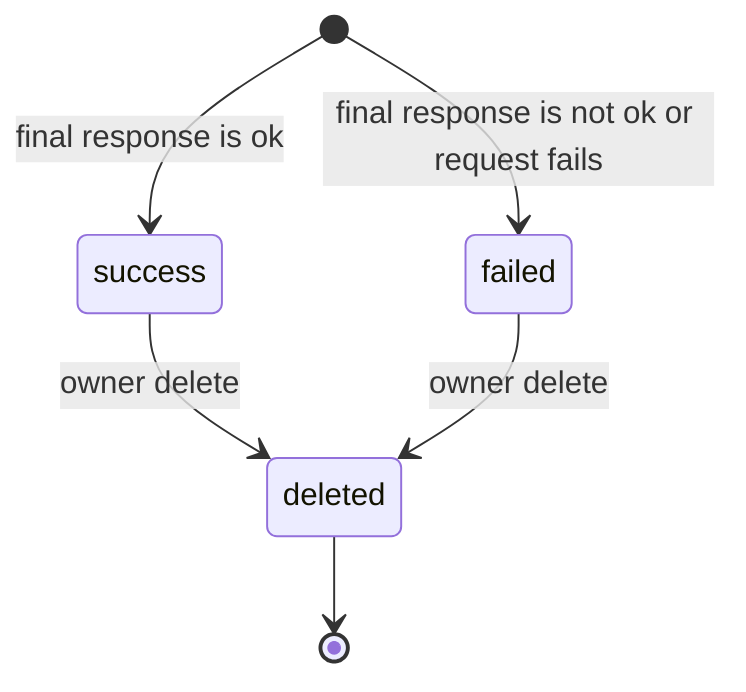

# Link Expander

## What is a link expander?

A link expander resolves a shortened or redirected URL to the final destination
URL. A user submits a URL, the server follows redirects manually, and LinkLab
saves the original URL, destination URL, redirect count, lookup status, failure
message, and timestamps.

This feature is useful when a user wants to know where a short link or tracking
link goes before opening it in a browser.

## Why this feature exists

Short links hide the destination. That is useful for sharing, analytics, and
clean URLs, but it also creates uncertainty. A user may not know whether a short
link points to a real page, a failed redirect, a long tracking chain, or an
unexpected destination.

This feature solves these problems:

- Users can reveal the final URL behind a short link.
- Redirect failures are detected before the user opens the link manually.
- The server records how many redirects were followed.
- The user gets a saved history of expanded links.
- Duplicate active expansions for the same user and URL are blocked.
- Failed expansions are saved so analytics and history still show what happened.

## Who should use it?

Link expansion is useful for:

- Support teams checking URLs before sending them to customers.
- Marketing teams validating campaign or tracking links.
- Product teams reviewing docs, release notes, surveys, or invite URLs.
- Security-conscious users who want to inspect a short link destination.
- Any user who wants a durable history of expanded links.

## Where it is used

Use link expansion for short URLs, campaign links, redirect links, affiliate
links, QR-code destinations, email links, social links, support macros, and any
URL where the final destination is not obvious.

## How a link expansion works

At a high level, link expansion follows this path:

1. Validate that the input is a URL with protocol.
2. Normalize the URL.
3. Check whether the same user already has this URL expanded.
4. Verify that the URL points to a public internet host.
5. Send a request without automatically following redirects.
6. If the response redirects, read `Location` and repeat.
7. Stop when a non-redirect response is reached.
8. Save the destination URL, status, redirect count, and error message.
9. Return the saved expanded link when successful.
10. Save failed expansions too, then throw a service-unavailable error.

## Main files

| File | Responsibility |
| --- | --- |
| `link-expander.module.ts` | Registers the Mongoose models, controller, and service. |
| `link-expander.controller.ts` | Defines authenticated routes under `/v1/link-expanders`. |
| `link-expander.service.ts` | Owns URL normalization, duplicate prevention, redirect resolution, listing, analytics, ownership checks, and soft delete. |
| `dto/link-expander.dto.ts` | Validates create and pagination query values. |
| `link-expander.constants.ts` | Stores pagination, timeout, and redirect limits. |
| `src/models/link-expander.schema.ts` | Defines the MongoDB `link_expanders` document shape and indexes. |
| `src/exceptions/link-expander.exception.ts` | Defines duplicate, not-found, access-denied, already-exists, and expansion-failed exceptions. |
| `src/modules/features/utils/common.utils.ts` | Provides `normalizeHttpUrl`, `toObjectId`, and `isDuplicateKeyError`. |

MongoDB collection `link_expanders` stores one document per expansion result.
Every protected operation verifies the JWT user still exists, then scopes data
by that user's MongoDB id.

## Constants

| Constant | Value | Purpose |
| --- | --- | --- |
| `DEFAULT_LINK_EXPANDER_PAGE_LIMIT` | `10` | Default number of expanded links returned by list API. |
| `MAX_LINK_EXPANDER_PAGE_LIMIT` | `50` | Maximum allowed list page size. |
| `LINK_EXPANDER_TIMEOUT_MS` | `8000` | Per-request timeout for each `HEAD` or `GET`. |
| `LINK_EXPANDER_MAX_REDIRECTS` | `10` | Maximum redirect hops before returning status `508`. |

## MongoDB document

The `link_expanders` collection stores one document per expanded URL.

| Field | Purpose |
| --- | --- |
| `userId` | Owner of the expanded link. Every protected list/delete operation scopes by this user. |
| `url` | Normalized original URL submitted by the user. |
| `destinationUrl` | Final URL after redirect resolution, or the original URL when resolution fails before a destination is found. |
| `status` | `success`, `failed`, or `deleted`. Delete is a soft delete. |
| `redirectCount` | Number of redirects followed. |
| `errorMessage` | Failure reason for failed lookups, otherwise `null`. |
| `createdAt`, `updatedAt` | Mongoose timestamps. |

Important indexes:

- `{ userId: 1, status: 1, _id: -1 }` supports listing active expanded links
  for one user in newest-first order.
- Unique partial index on `{ userId: 1, url: 1 }` while status is `success` or
  `failed`. This blocks duplicate active expansions for the same user and URL,
  while allowing the URL to be expanded again after soft delete.

## Shared authentication and ownership steps

Protected routes call `getUser(req)` in the controller before calling the
service.

Step 1: Read `req.user`.

Why this is used:

The authentication layer places the JWT payload on the request. If `req.user` is
missing, the controller throws `AccessTokenExpired`.

Step 2: Convert `user.sub` into a MongoDB ObjectId.

Why this is used:

MongoDB queries need an ObjectId. `toObjectId` also rejects malformed ids early
with a clear message.

Step 3: Confirm the user still exists.

Why this is used:

A token can still be structurally valid after the user record is deleted. The
service checks `users.exists({ _id: userId })` so deleted users cannot continue
using old tokens.

Step 4: For id-based routes, fetch the expanded link and compare owner ids.

Why this is used:

Users must not delete another user's expanded links. The service loads the
document, rejects missing or deleted records, and compares `expandedLink.userId`
with the authenticated user id.

## Status lifecycle



Status behavior:

- `success`: the final destination responded with `response.ok`.
- `failed`: the destination returned a non-OK final status, redirect resolution
  failed, or the request failed.
- `deleted`: the owner soft-deleted the saved expansion.

## Request validation

`ExpandLinkDto` validates the create body.

| Field | Rule | Why it is used |
| --- | --- | --- |
| `url` | Required. | The expander needs a URL to resolve. |
| `url` | Must be a string. | Prevents non-string payloads from reaching URL parsing. |
| `url` | Maximum 2048 characters. | Keeps stored URLs and request processing bounded. |
| `url` | Must be a URL with protocol. | Blocks ambiguous values such as `example.com`. |

`GetPaginatedExpandedLinksDto` validates list query values.

| Field | Rule | Why it is used |
| --- | --- | --- |
| `page` | Optional integer, minimum `1`, default `1`. | Controls which page of expanded links to return. |
| `cursor` | Optional Mongo id string. | Supports cursor pagination for infinite scroll. |
| `limit` | Optional integer, minimum `1`, maximum `50`, default `10`. | Prevents very large list responses. |

The service also calls `normalizeHttpUrl` before duplicate checks and
persistence.

```ts
const url = normalizeHttpUrl({
  value: dto.url,
  fieldName: 'URL',
});
```

`normalizeHttpUrl` trims input, parses it with `new URL`, requires `http:` or
`https:`, and returns `parsed.toString()`.

## Endpoint summary

| Method | Route | Purpose |
| --- | --- | --- |
| `POST` | `/v1/link-expanders` | Expand one URL and save the result. |
| `GET` | `/v1/link-expanders` | List the authenticated user's non-deleted expanded links. |
| `GET` | `/v1/link-expanders/analytics` | Return total expansions, total redirects, and failed lookup count. |
| `DELETE` | `/v1/link-expanders/:id` | Soft-delete one owned expanded link. |

## API request flows

### `POST /v1/link-expanders`

```mermaid
sequenceDiagram
    participant Client
    participant Guard as JwtAuthGuard + ValidationPipe
    participant Ctrl as LinkExpanderController
    participant Service as LinkExpanderService
    participant Users as MongoDB users
    participant Links as MongoDB link_expanders
    participant Web as Remote URL

    Client->>Guard: POST /v1/link-expanders\n{ url }
    Guard->>Ctrl: req.user + validated body
    Ctrl->>Service: expandLink(user, dto)
    Service->>Users: exists({ _id: user.sub })
    Service->>Service: normalizeHttpUrl(dto.url)
    Service->>Links: exists({ userId, url, status != deleted })
    alt duplicate exists
        Service-->>Ctrl: throw LinkExpanderDuplicateRequestException
    end
    Service->>Service: resolveDestination(url)
    loop redirectCount <= 10
        Service->>Service: assertPublicDestination(currentUrl)
        Service->>Web: HEAD currentUrl
        alt HEAD returns 405
            Service->>Web: GET currentUrl
        end
        alt final response is redirect
            Service->>Service: currentUrl = new URL(location, currentUrl)
        else final response is not redirect
            Service->>Service: build expansion result
        end
    end
    Service->>Links: create expanded link document
    alt expansion failed
        Service-->>Ctrl: throw LinkExpansionFailedException
    else expansion succeeded
        Service-->>Ctrl: Link expanded successfully + serialized expandedLink
    end
```

### `GET /v1/link-expanders`

```mermaid
sequenceDiagram
    participant Client
    participant Ctrl as LinkExpanderController
    participant Service as LinkExpanderService
    participant Links as MongoDB link_expanders

    Client->>Ctrl: GET /v1/link-expanders?page=1&limit=10
    Ctrl->>Service: getPaginatedData(user, query)
    Service->>Service: validate authenticated user
    Service->>Links: find({ userId, status != deleted })\nsort _id desc, limit + 1
    Service->>Links: countDocuments({ userId, status != deleted })
    Service->>Service: serialize items and build pagination
    Service-->>Ctrl: items + pagination
```

### `GET /v1/link-expanders/analytics`

```mermaid
sequenceDiagram
    participant Client
    participant Ctrl as LinkExpanderController
    participant Service as LinkExpanderService
    participant Links as MongoDB link_expanders

    Client->>Ctrl: GET /v1/link-expanders/analytics
    Ctrl->>Service: getAnalytics(user)
    Service->>Service: validate authenticated user
    par Count total
        Service->>Links: countDocuments({ userId, status != deleted })
    and Sum redirects
        Service->>Links: aggregate $sum redirectCount
    and Count failed
        Service->>Links: countDocuments({ userId, status: failed })
    end
    Service-->>Ctrl: { total, redirects, failed }
```

### `DELETE /v1/link-expanders/:id`

```mermaid
sequenceDiagram
    participant Client
    participant Ctrl as LinkExpanderController
    participant Service as LinkExpanderService
    participant Links as MongoDB link_expanders

    Client->>Ctrl: DELETE /v1/link-expanders/{id}
    Ctrl->>Service: deleteExpandedLink(user, id)
    Service->>Service: validate authenticated user
    Service->>Service: getOwnedExpandedLink(userId, id)
    Service->>Links: findById(id)
    Service->>Service: reject missing, deleted, or different owner
    Service->>Links: save status = deleted
    Service-->>Ctrl: deleted response
```

## End-to-end expansion flow

```text
Client
  sends URL
Controller
  extracts authenticated user
Service
  validates user still exists
  normalizes URL
  checks duplicate active expansion
  resolves destination
  checks public destination on each hop
  sends HEAD request
  falls back to GET when needed
  follows redirects manually
MongoDB
  stores link_expanders document
Response
  returns serialized expanded link or saved failure error
```

## POST `/v1/link-expanders`

This route expands one URL and saves the result.

```ts
@Post()
expandLink(@Body() dto: ExpandLinkDto, @Req() req: AuthenticatedRequest) {
  return this.linkExpanderService.expandLink(this.getUser(req), dto);
}
```

Controller to service flow:

```text
POST /v1/link-expanders
  -> controller expandLink()
  -> controller getUser(req)
  -> service expandLink(user, dto)
  -> service getAuthenticatedUserId(user)
  -> normalizeHttpUrl(dto.url)
  -> linkExpanderModel.exists(...)
  -> resolveDestination(url)
      -> followRedirects(url)
          -> assertPublicDestination(currentUrl)
              -> isBlockedHost(host)
          -> fetchWithoutRedirect(currentUrl, 'HEAD')
          -> fetchWithoutRedirect(currentUrl, 'GET') only when HEAD returns 405
          -> isRedirectStatus(status)
  -> linkExpanderModel.create(...)
  -> isDuplicateKeyError(error) only on create failure
  -> serializeExpandedLink(expandedLink)
```

### Step 1: DTO validates the request body

The request body must look like this:

```json
{
  "url": "https://short.example/a"
}
```

Validation rejects:

- Missing `url`.
- Empty `url`.
- Non-string `url`.
- URL longer than 2048 characters.
- URL without protocol.
- Invalid URL syntax.

### Step 2: Controller gets the authenticated user

The controller reads `req.user`. If the request has no authenticated user, it
throws `AccessTokenExpired`.

```ts
private getUser(req: AuthenticatedRequest): JwtPayload {
  if (!req.user) {
    throw new AccessTokenExpired();
  }

  return req.user;
}
```

### Step 3: Service verifies the user still exists

The service converts `user.sub` to a MongoDB ObjectId and verifies the user
document still exists.

```ts
const userId = toObjectId(user.sub, 'Authenticated user id is invalid');
const userExists = await this.userModel.exists({ _id: userId });
```

If the id is invalid, the API returns `Authenticated user id is invalid`. If the
user no longer exists, it throws `AccessTokenExpired`.

### Step 4: Service normalizes the URL

The service passes the DTO value through `normalizeHttpUrl`.

This does three important things:

1. Trims surrounding whitespace.
2. Parses the value using `new URL`.
3. Allows only `http:` and `https:`.

The returned URL is serialized with `parsed.toString()`, so stored values are
consistent.

### Step 5: Service checks for duplicate active expansion

```ts
const existingExpandedLink = await this.linkExpanderModel
  .exists({
    userId,
    url,
    status: { $ne: LinkExpanderLookupStatus.DELETED },
  })
  .exec();

if (existingExpandedLink) {
  throw new LinkExpanderDuplicateRequestException();
}
```

High-level explanation:

The service blocks the same user from saving the same active expanded URL more
than once. It only ignores records that are already soft-deleted.

Code line-by-line:

- `this.linkExpanderModel.exists(...)` asks MongoDB whether a matching document
  exists.
- `userId` scopes the check to the current user.
- `url` uses the normalized URL.
- `status: { $ne: deleted }` ignores soft-deleted records.
- `.exec()` executes the query.
- If a record exists, the service throws
  `LinkExpanderDuplicateRequestException`.

### Step 6: Core service call

This line resolves the final destination:

```ts
const expansion = await this.resolveDestination(url);
```

The result contains:

```ts
{
  destinationUrl: string;
  status: LinkExpanderLookupStatus;
  redirectCount: number;
  errorMessage: string | null;
}
```

### Destination resolution: `resolveDestination`

#### High-level explanation

`resolveDestination` answers one question: where does this URL finally go?

It calls `followRedirects`, converts the final HTTP response into `success` or
`failed`, and returns a small expansion result. If a normal network error
happens, it returns a failed expansion. If the URL points to a private/internal
host, it rethrows the bad request error.

#### Code of `resolveDestination`

```ts
private async resolveDestination(url: string): Promise<{
  destinationUrl: string;
  status: LinkExpanderLookupStatus;
  redirectCount: number;
  errorMessage: string | null;
}> {
  try {
    const response = await this.followRedirects(url);

    return {
      destinationUrl: response.destinationUrl,
      status: response.ok
        ? LinkExpanderLookupStatus.SUCCESS
        : LinkExpanderLookupStatus.FAILED,
      redirectCount: response.redirectCount,
      errorMessage: response.ok
        ? null
        : `Destination responded with HTTP ${response.status}`,
    };
  } catch (error) {
    if (error instanceof BadRequestException) {
      throw error;
    }

    return {
      destinationUrl: url,
      status: LinkExpanderLookupStatus.FAILED,
      redirectCount: 0,
      errorMessage:
        error instanceof Error ? error.message : 'Unable to expand this link',
    };
  }
}
```

#### `resolveDestination` code line-by-line

- `private async resolveDestination(...)` defines a private async helper that
  returns the expansion result shape.
- `try` starts a protected block because network requests can fail.
- `const response = await this.followRedirects(url);` follows redirects and
  waits for the final HTTP result.
- `destinationUrl: response.destinationUrl` stores the final URL.
- `status: response.ok ? success : failed` marks the expansion successful only
  when the final response is OK.
- `redirectCount: response.redirectCount` stores how many redirects happened.
- `errorMessage: response.ok ? null : ...` saves a failure message only for
  failed final responses.
- `catch (error)` handles request/runtime failures.
- `if (error instanceof BadRequestException) throw error;` preserves clear
  validation errors such as private-host blocking.
- The final `return` creates a failed expansion when no usable response was
  received.

### Function inside destination resolution: `followRedirects`

#### High-level explanation

`followRedirects` manually walks through redirect responses.

It starts from the normalized URL, checks every URL is public, sends `HEAD`,
falls back to `GET` when needed, and stops when the response is not a redirect.

#### Code of `followRedirects`

```ts
private async followRedirects(url: string): Promise<{
  destinationUrl: string;
  redirectCount: number;
  ok: boolean;
  status: number;
}> {
  let currentUrl = url;

  for (
    let redirectCount = 0;
    redirectCount <= LINK_EXPANDER_MAX_REDIRECTS;
    redirectCount += 1
  ) {
    await this.assertPublicDestination(currentUrl);

    const response = await this.fetchWithoutRedirect(currentUrl, 'HEAD');
    const fallbackResponse =
      response.status === 405
        ? await this.fetchWithoutRedirect(currentUrl, 'GET')
        : response;

    if (!this.isRedirectStatus(fallbackResponse.status)) {
      return {
        destinationUrl: currentUrl,
        redirectCount,
        ok: fallbackResponse.ok,
        status: fallbackResponse.status,
      };
    }

    const location = fallbackResponse.headers.get('location');

    if (!location) {
      return {
        destinationUrl: currentUrl,
        redirectCount,
        ok: false,
        status: fallbackResponse.status,
      };
    }

    currentUrl = new URL(location, currentUrl).toString();
  }

  return {
    destinationUrl: currentUrl,
    redirectCount: LINK_EXPANDER_MAX_REDIRECTS,
    ok: false,
    status: 508,
  };
}
```

#### `followRedirects` code line-by-line

- `let currentUrl = url;` starts redirect tracking from the submitted URL.
- The `for` loop counts redirects from `0` up to
  `LINK_EXPANDER_MAX_REDIRECTS`.
- `await this.assertPublicDestination(currentUrl);` blocks private/internal
  destinations before making any request.
- `fetchWithoutRedirect(currentUrl, 'HEAD')` sends a lightweight request.
- If the status is `405`, the server does not allow `HEAD`, so the service
  retries with `GET`.
- `fallbackResponse` is either the `HEAD` response or the fallback `GET`
  response.
- `if (!this.isRedirectStatus(fallbackResponse.status))` means the service
  reached the final destination.
- The first `return` sends destination URL, redirect count, OK flag, and final
  status back to `resolveDestination`.
- `fallbackResponse.headers.get('location')` reads the redirect destination.
- If no `Location` header exists, the redirect cannot continue, so the method
  returns a failed result.
- `new URL(location, currentUrl).toString()` resolves absolute or relative
  redirect destinations.
- The final return happens only when the redirect limit is exceeded. Status
  `508` represents a redirect loop or too many redirects.

### Function inside `followRedirects`: `assertPublicDestination`

#### High-level explanation

`assertPublicDestination` protects the server before every outbound request.

Users control the URL, so the backend must not blindly fetch anything. This
function blocks localhost, private IP ranges, and public-looking domains that
resolve to private IPs.

#### Code of `assertPublicDestination`

```ts
private async assertPublicDestination(url: string) {
  const parsedUrl = new URL(url);
  const host = parsedUrl.hostname.toLowerCase();

  if (this.isBlockedHost(host)) {
    throw new BadRequestException({
      message: 'URL must point to a public internet host',
      error: 'Bad Request',
    });
  }

  if (isIP(host)) {
    return;
  }

  try {
    const addresses = await lookup(host, { all: true });

    if (addresses.some((address) => this.isBlockedHost(address.address))) {
      throw new BadRequestException({
        message: 'URL must point to a public internet host',
        error: 'Bad Request',
      });
    }
  } catch (error) {
    if (error instanceof BadRequestException) {
      throw error;
    }
  }
}
```

#### `assertPublicDestination` code line-by-line

- `new URL(url)` parses the current URL.
- `parsedUrl.hostname.toLowerCase()` extracts the host in lowercase.
- `this.isBlockedHost(host)` checks direct blocked values like `localhost`,
  `127.0.0.1`, and private IP ranges.
- If blocked, the function throws `BadRequestException`.
- `isIP(host)` checks whether the host is already an IP address.
- If it is an IP and was not blocked, the function returns because no DNS lookup
  is needed.
- `lookup(host, { all: true })` resolves all DNS addresses for a domain.
- `addresses.some(...)` checks whether any resolved IP is blocked.
- If a resolved address is blocked, the function throws `BadRequestException`.
- The `catch` rethrows deliberate bad requests and ignores ordinary DNS lookup
  failures.

### Function inside `assertPublicDestination`: `isBlockedHost`

#### High-level explanation

`isBlockedHost` is the low-level yes/no check for localhost and private network
targets. It does not throw errors. It returns `true` when a host is blocked and
`false` when it is allowed.

#### Code of `isBlockedHost`

```ts
private isBlockedHost(host: string) {
  if (
    host === 'localhost' ||
    host.endsWith('.localhost') ||
    host === '0.0.0.0' ||
    host === '::' ||
    host === '::1'
  ) {
    return true;
  }

  const ipVersion = isIP(host);

  if (ipVersion === 4) {
    const parts = host.split('.').map((part) => Number(part));
    const [first, second] = parts;

    return (
      first === 10 ||
      first === 127 ||
      (first === 169 && second === 254) ||
      (first === 172 && second >= 16 && second <= 31) ||
      (first === 192 && second === 168)
    );
  }

  if (ipVersion === 6) {
    return (
      host.startsWith('fc') ||
      host.startsWith('fd') ||
      host.startsWith('fe80:') ||
      host === '::ffff:127.0.0.1'
    );
  }

  return false;
}
```

#### `isBlockedHost` code line-by-line

- The first `if` blocks localhost names, wildcard addresses, and loopback IPv6.
- `const ipVersion = isIP(host);` asks Node whether the host is IPv4, IPv6, or
  not an IP.
- For IPv4, the service splits the address into numeric parts.
- It blocks `10.x.x.x`, `127.x.x.x`, `169.254.x.x`, `172.16-31.x.x`, and
  `192.168.x.x`.
- For IPv6, it blocks private/link-local prefixes `fc`, `fd`, `fe80:`, and the
  IPv4-mapped loopback address.
- `return false` means the host is not blocked.

### Function inside `followRedirects`: `fetchWithoutRedirect`

#### High-level explanation

`fetchWithoutRedirect` performs one HTTP request with a timeout and manual
redirect behavior. It returns the native `Response` object so
`followRedirects` can read status and headers.

#### Code of `fetchWithoutRedirect`

```ts
private async fetchWithoutRedirect(url: string, method: 'GET' | 'HEAD') {
  const controller = new AbortController();
  const timeout = setTimeout(
    () => controller.abort(),
    LINK_EXPANDER_TIMEOUT_MS,
  );

  try {
    return await fetch(url, {
      method,
      redirect: 'manual',
      signal: controller.signal,
    });
  } finally {
    clearTimeout(timeout);
  }
}
```

#### `fetchWithoutRedirect` code line-by-line

- The function receives a URL and HTTP method.
- `new AbortController()` creates a controller that can cancel the request.
- `setTimeout(...LINK_EXPANDER_TIMEOUT_MS)` schedules cancellation after
  `8000ms`.
- `fetch(url, { method, redirect: 'manual', signal })` sends the request.
- `redirect: 'manual'` stops `fetch` from following redirects automatically.
- `signal: controller.signal` connects the timeout abort to the request.
- `finally` runs whether the request succeeds or fails.
- `clearTimeout(timeout)` prevents the timeout from firing after the request
  already finished.

### Function inside `followRedirects`: `isRedirectStatus`

#### High-level explanation

`isRedirectStatus` checks whether a final HTTP status code is a redirect that
LinkLab should follow.

#### Code of `isRedirectStatus`

```ts
private isRedirectStatus(status: number) {
  return [301, 302, 303, 307, 308].includes(status);
}
```

#### `isRedirectStatus` code line-by-line

- The function receives an HTTP status code.
- It checks whether the status is one of the redirect statuses LinkLab follows.
- It returns `true` for redirects and `false` for final responses.

### Step 7: Service saves the MongoDB document

```ts
let expandedLink: LinkExpanderDocument;

try {
  expandedLink = await this.linkExpanderModel.create({
    userId,
    url,
    destinationUrl: expansion.destinationUrl,
    status: expansion.status,
    redirectCount: expansion.redirectCount,
    errorMessage: expansion.errorMessage,
  });
} catch (error) {
  if (isDuplicateKeyError(error)) {
    throw new LinkExpanderAlreadyExistsException();
  }

  throw error;
}
```

High-level explanation:

The service stores both successful and failed expansion results. The `try/catch`
exists because MongoDB also enforces duplicate prevention through a unique
partial index.

Code line-by-line:

- `let expandedLink` declares a variable that will hold the created document.
- `linkExpanderModel.create(...)` inserts the expansion result.
- `userId` stores ownership.
- `url` stores the original normalized URL.
- `destinationUrl` stores the resolved destination.
- `status` stores `success` or `failed`.
- `redirectCount` stores redirect hops.
- `errorMessage` stores failure reason or `null`.
- `catch (error)` handles insert failures.
- `isDuplicateKeyError(error)` checks Mongo duplicate key error code `11000`.
- Duplicate key errors become `LinkExpanderAlreadyExistsException`.
- Other errors are rethrown.

### Step 8: Service throws after saved failed expansion

```ts
if (expansion.status === LinkExpanderLookupStatus.FAILED) {
  throw new LinkExpansionFailedException(
    expansion.errorMessage ?? 'Unable to expand this link',
  );
}
```

Why this is used:

The failed result is saved first, then the API throws. That lets the frontend
show an error while the user's history and analytics still include the failed
attempt.

### Step 9: Service returns success response

```ts
return {
  message: 'Link expanded successfully',
  expandedLink: this.serializeExpandedLink(expandedLink),
};
```

Why this is used:

Successful expansions return a friendly message and a serialized document.

## GET `/v1/link-expanders`

This route lists the authenticated user's non-deleted expanded links.

```ts
@Get()
getPaginatedData(
  @Query() query: GetPaginatedExpandedLinksDto,
  @Req() req: AuthenticatedRequest,
) {
  return this.linkExpanderService.getPaginatedData(this.getUser(req), query);
}
```

Controller to service flow:

```text
GET /v1/link-expanders
  -> controller getPaginatedData()
  -> controller getUser(req)
  -> service getPaginatedData(user, query)
  -> service getAuthenticatedUserId(user)
  -> toObjectId(query.cursor) only when cursor is present
  -> build baseFilter with userId and status != deleted
  -> Promise.all(...)
      -> linkExpanderModel.find(...).sort(...).skip(...).limit(...).exec()
      -> linkExpanderModel.countDocuments(baseFilter).exec()
  -> calculate hasMore
  -> serializeExpandedLink(expandedLink) for each item
  -> return items and pagination
```

### Page pagination

Example:

```text
GET /v1/link-expanders?page=2&limit=10
```

When no cursor is provided, skip is calculated as:

```ts
const skip = (currentPage - 1) * limit;
```

The query sorts by newest first:

```ts
.sort({ _id: -1 })
```

### Cursor pagination

Example:

```text
GET /v1/link-expanders?cursor=64f...abc&limit=10
```

When a cursor is provided:

- The cursor is converted to ObjectId.
- The query adds `_id: { $lt: cursorId }`.
- `skip` becomes `0`.
- The response still includes `page`, but cursor controls the slice.

### Why the service fetches `limit + 1`

The service requests one extra item:

```ts
.limit(limit + 1)
```

If more than `limit` items return, the API knows another page exists. It removes
the extra item before serializing the response.

### List response

The response includes:

```ts
{
  items: SerializedExpandedLink[];
  pagination: {
    totalItems: number;
    totalPages: number;
    hasMore: boolean;
    page: number;
    limit: number;
    cursor: string | null;
  };
}
```

## GET `/v1/link-expanders/analytics`

This route returns high-level totals for the authenticated user.

```ts
@Get('analytics')
getAnalytics(@Req() req: AuthenticatedRequest) {
  return this.linkExpanderService.getAnalytics(this.getUser(req));
}
```

The service performs three operations in parallel:

```ts
const [total, redirects, failed] = await Promise.all([
  this.linkExpanderModel.countDocuments({
    userId,
    status: { $ne: LinkExpanderLookupStatus.DELETED },
  }),
  this.linkExpanderModel.aggregate<{ totalRedirects: number }>([
    {
      $match: {
        userId,
        status: { $ne: LinkExpanderLookupStatus.DELETED },
      },
    },
    {
      $group: {
        _id: null,
        totalRedirects: { $sum: '$redirectCount' },
      },
    },
  ]),
  this.linkExpanderModel.countDocuments({
    userId,
    status: LinkExpanderLookupStatus.FAILED,
  }),
]);
```

The returned object is:

```ts
{
  total,
  redirects: redirects[0]?.totalRedirects ?? 0,
  failed,
}
```

`redirects[0]?.totalRedirects ?? 0` returns `0` when the user has no expanded
links.

## DELETE `/v1/link-expanders/:id`

This route soft-deletes one saved expanded link.

```ts
@Delete(':id')
deleteExpandedLink(
  @Param('id') id: string,
  @Req() req: AuthenticatedRequest,
) {
  return this.linkExpanderService.deleteExpandedLink(this.getUser(req), id);
}
```

Controller to service flow:

```text
DELETE /v1/link-expanders/:id
  -> controller deleteExpandedLink()
  -> controller getUser(req)
  -> service deleteExpandedLink(user, id)
  -> service getAuthenticatedUserId(user)
  -> service getOwnedExpandedLink(userId, id)
      -> toObjectId(id, 'Expanded link id is invalid')
      -> linkExpanderModel.findById(id).exec()
      -> reject missing or deleted expanded link
      -> reject expanded link owned by another user
  -> expandedLink.status = deleted
  -> expandedLink.save()
  -> serializeExpandedLink(expandedLink)
  -> return deleted response
```

The service:

1. Validates the authenticated user.
2. Converts `id` using `toObjectId(id, 'Expanded link id is invalid')`.
3. Loads the document with `findById`.
4. Throws `Expanded link not found` if the record is missing or already deleted.
5. Throws `You do not have access to this expanded link` if the owner differs.
6. Sets `status` to `deleted`.
7. Saves the document.
8. Returns the serialized deleted record.

The response includes:

```ts
{
  message: 'Expanded link deleted successfully',
  deleted: true,
  expandedLink: SerializedExpandedLink,
}
```

Soft delete is used so records are not physically removed from MongoDB.

## MongoDB queries used in Link Expander

### Create

```ts
this.linkExpanderModel.create({
  userId,
  url,
  destinationUrl,
  status,
  redirectCount,
  errorMessage,
});
```

One document is inserted per expansion. Duplicate active expansions are blocked
before resolution and by MongoDB's unique partial index.

### List

```ts
this.linkExpanderModel
  .find({
    userId,
    status: { $ne: LinkExpanderLookupStatus.DELETED },
    ...(cursorId ? { _id: { $lt: cursorId } } : {}),
  })
  .sort({ _id: -1 })
  .skip(skip)
  .limit(limit + 1);
```

The list query never returns soft-deleted expanded links.

### Analytics aggregation

The redirects metric uses aggregation:

```ts
this.linkExpanderModel.aggregate([
  {
    $match: {
      userId,
      status: { $ne: LinkExpanderLookupStatus.DELETED },
    },
  },
  {
    $group: {
      _id: null,
      totalRedirects: { $sum: '$redirectCount' },
    },
  },
]);
```

Aggregation stages:

- `$match` keeps only non-deleted expanded links owned by the current user.
- `$group` combines all matched documents into one result.
- `$sum: '$redirectCount'` adds redirect counts from every matched document.

## Why `Promise.all` is used

List and analytics methods run independent database operations in parallel.

For list:

- Fetch page items.
- Count total matching documents.

For analytics:

- Count total non-deleted expanded links.
- Sum redirects.
- Count failed expanded links.

These operations do not depend on each other, so `Promise.all` reduces total
latency.

## Error behavior

| Case | Error or message |
| --- | --- |
| Missing authenticated user | `AccessTokenExpired` |
| Authenticated user id is invalid | `Authenticated user id is invalid` |
| Authenticated user no longer exists | `AccessTokenExpired` |
| URL missing protocol or invalid | DTO validation error or `URL is invalid` |
| URL uses unsupported protocol | `URL must use http or https` |
| URL points to blocked/private host | `URL must point to a public internet host` |
| User already has this active URL expanded | `Same link is already present in your expanded links` |
| Mongo unique index detects duplicate | `Expanded link already exists` |
| Expansion reaches a failed final response | `LinkExpansionFailedException` with saved result |
| Cursor is invalid | `Cursor id is invalid` |
| Expanded link id is invalid | `Expanded link id is invalid` |
| Expanded link is missing or deleted | `Expanded link not found` |
| Expanded link belongs to another user | `You do not have access to this expanded link` |

## Design choices

| Choice | Reason |
| --- | --- |
| Manual redirect handling | The service can count redirects, expose the exact destination, and inspect every hop before fetching. |
| Public-host validation on every hop | A public short link cannot redirect the server to localhost or private network addresses. |
| HEAD before GET | Destination lookup usually needs only status and redirect headers. |
| Save failed expansions | Users can see failed lookup history and analytics. |
| Throw after saved failure | The API communicates failure while still preserving the saved record. |
| Pre-check plus unique partial index | Duplicate active results are blocked even under race conditions. |
| Soft delete | Normal views hide deleted records while preserving history. |

## Example responses

### Successful expansion

```json
{
  "message": "Link expanded successfully",
  "expandedLink": {
    "id": "665f1f8d1e4a6a0012c34567",
    "url": "https://short.example/a",
    "destinationUrl": "https://example.com/final",
    "status": "success",
    "redirectCount": 1,
    "errorMessage": null,
    "createdAt": "2026-07-03T10:00:00.000Z",
    "updatedAt": "2026-07-03T10:00:00.000Z"
  }
}
```

### Failed expansion saved before error

```json
{
  "message": "Destination responded with HTTP 404",
  "error": "Service Unavailable",
  "saved": true
}
```

The saved document contains `status: failed`, the destination URL reached, the
redirect count, and the error message.

## Maintenance notes

When changing this feature, keep these behavior contracts in sync:

- If redirect limits change, update `LINK_EXPANDER_MAX_REDIRECTS` and this
  documentation.
- If timeout behavior changes, update `LINK_EXPANDER_TIMEOUT_MS`.
- If duplicate behavior changes, update the duplicate prevention section and
  unique partial index explanation.
- If list filtering changes, update pagination and analytics explanations.
- If a new status is added, update the schema table and status lifecycle.
