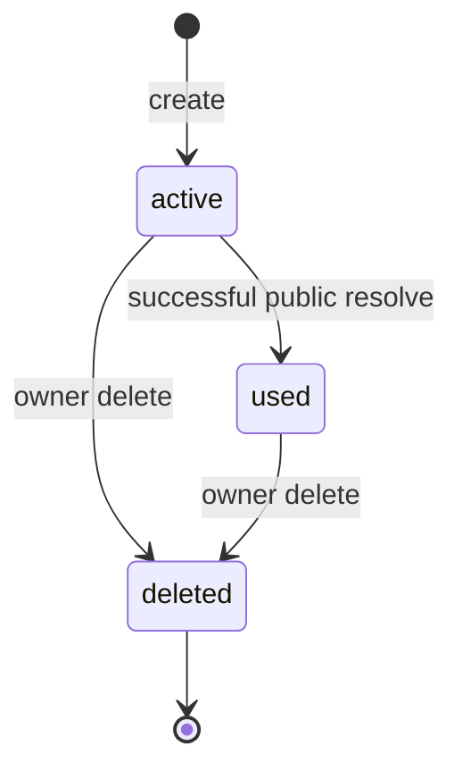
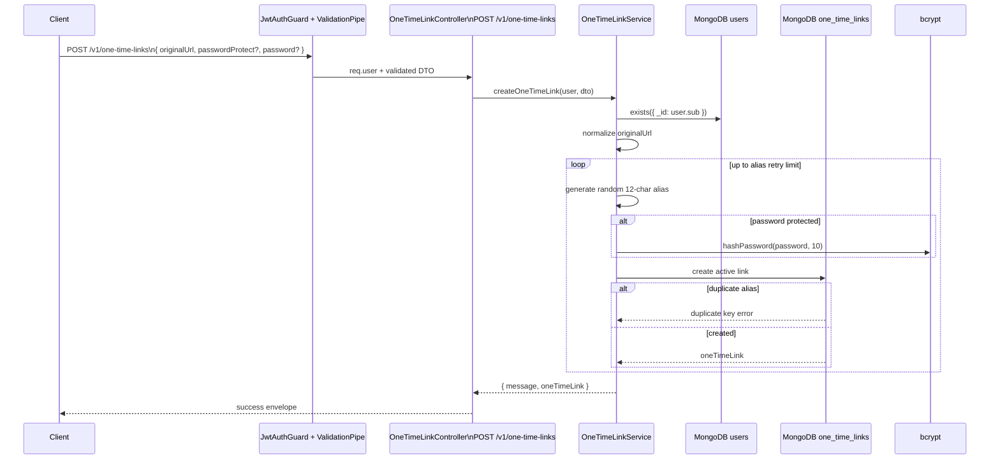
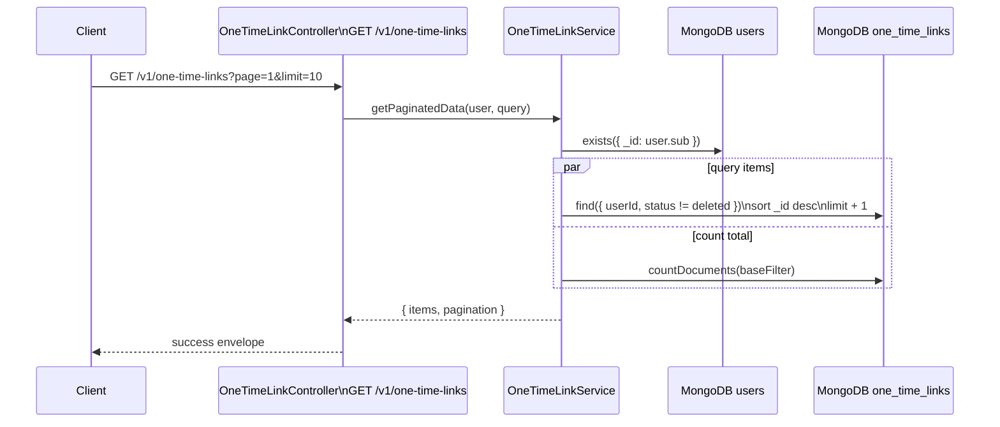
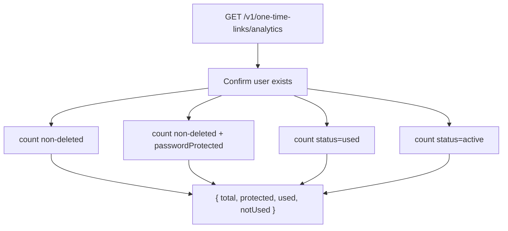
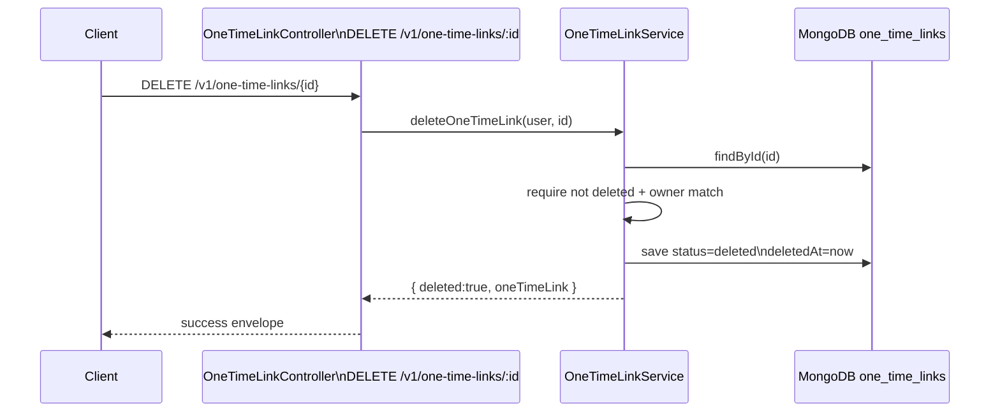
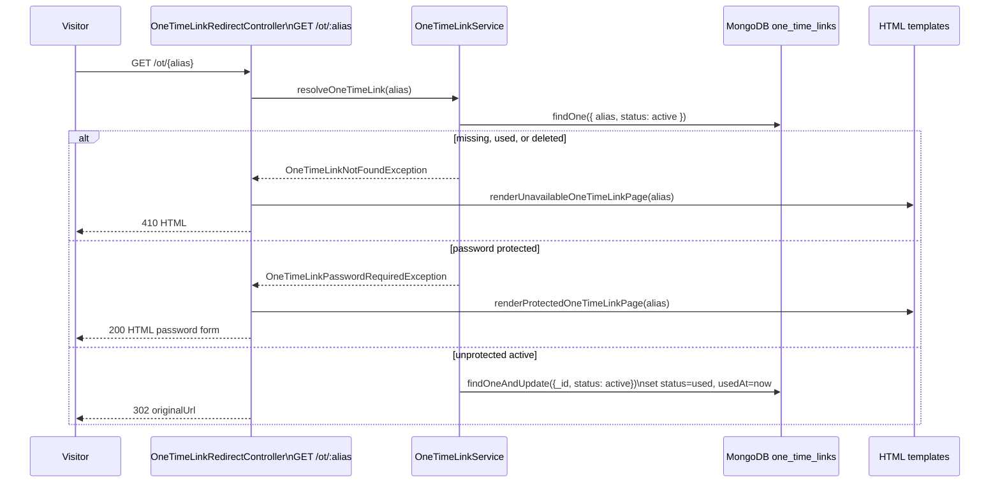
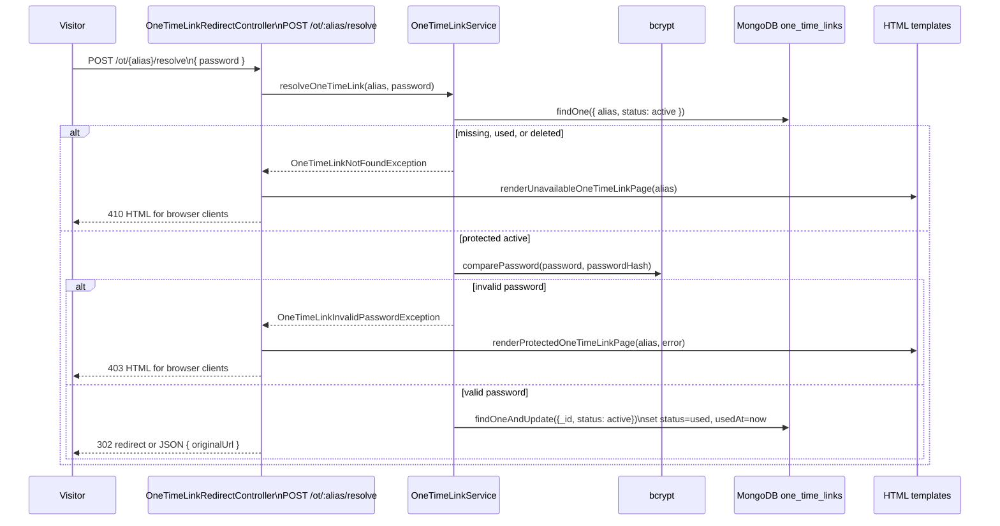
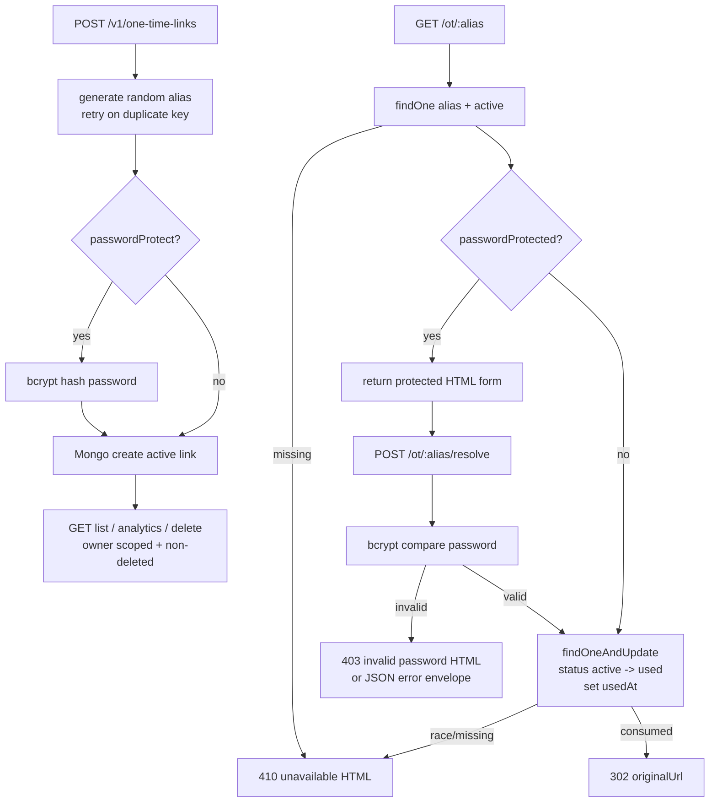

# One-Time Link

## What is a one-time link?

A one-time link is a shareable URL that can be opened successfully only once.
After the first successful visit, the link is marked as used and future visitors
see an unavailable page instead of being redirected to the original destination.

In LinkLab, one-time links can also be password protected. A protected link first
shows an HTML password form. If the password is correct, the link is consumed
and the visitor is redirected to the original URL.

## Why one-time links exist

Normal links are reusable. That is useful for public resources, but risky when a
link gives access to something temporary, private, or intended for one person.
One-time links were created to make link sharing more controlled without
requiring a full account login flow for the recipient.

They solve these problems:

- A link can be forwarded after the intended recipient uses it.
- A shared link can remain usable longer than intended.
- Teams need a simple way to send temporary access to a URL.
- The sender needs to know whether a link is still unused.
- Some links need lightweight password protection without building a full invite
  system.

## Who should use it?

One-time links are useful for:

- Support teams sending temporary troubleshooting links.
- Sales or onboarding teams sharing limited-access resources.
- Admin teams sending private documents, forms, or setup URLs.
- Product teams that need single-use invites or handoff links.
- Any user who wants a link to become unavailable after it is opened once.

## Where it is used

Use one-time links in emails, private chats, support replies, invite flows,
document handoffs, onboarding flows, temporary dashboards, and internal admin
workflows. They are best for low-friction controlled access, not for replacing a
full authentication or authorization system.

## How one-time links work conceptually

The feature has two sides:

- Management side: an authenticated user creates, lists, reviews analytics for,
  or deletes one-time links.
- Public side: a visitor opens the one-time URL and either gets redirected,
  sees a password form, or sees an unavailable page.

The important rule is that consumption must be atomic. If two visitors open the
same active link at the same time, only one should win. LinkLab enforces this by
updating MongoDB only when the current status is still `active`.

## How LinkLab implements One-Time Link

Primary files:

- `one-time-link.controller.ts`: authenticated management routes under
  `/v1/one-time-links`.
- `one-time-link-redirect.controller.ts`: public raw redirect/password routes
  under `/ot`.
- `one-time-link.service.ts`: create, list, analytics, delete, and resolve
  behavior.
- `dto/one-time-link.dto.ts`: request validation.
- `one-time-link.constants.ts`: alias length, retry limits, pagination limits,
  alias regex, and reserved aliases.
- `template/protected-link.template.ts`: HTML password-entry page.
- `template/unavailable-link.template.ts`: HTML unavailable/used page.
- `src/models/one-time-link.schema.ts`: MongoDB schema and indexes.

MongoDB collection `one_time_links` is the source of truth. The module does not
use Redis because each link is consumed once and the correctness boundary is the
atomic MongoDB status update.

## Data model

| Field | Purpose |
| --- | --- |
| `userId` | Owner reference for protected management APIs. |
| `originalUrl` | Normalized destination URL. |
| `alias` | Unique public slug used by `/ot/:alias`. |
| `status` | `active`, `used`, or `deleted`. |
| `passwordProtected` | Whether password verification is required before redirect. |
| `passwordHash` | Bcrypt hash for protected links, otherwise `null`. |
| `usedAt` | Timestamp set when the link is consumed. |
| `deletedAt` | Timestamp set when the owner soft-deletes the link. |
| `createdAt`, `updatedAt` | Mongoose timestamps. |

Important indexes:

- Unique index on `alias`.
- `(userId, createdAt desc)` for owner lists.
- `(userId, status, _id desc)` for status-scoped owner queries.
- `(alias, status)` for public active-link lookup.

## Status lifecycle



Status behavior:

- `active`: link can still be resolved.
- `used`: link was already consumed and should not redirect again.
- `deleted`: owner removed the link from active management views and public
  resolution.

## Validation and alias rules

Create DTO:

- `originalUrl` is required.
- `originalUrl` must be a valid URL with protocol.
- `originalUrl` must not exceed 2048 characters.
- `passwordProtect` is optional and must be boolean when provided.
- `password` is required only when `passwordProtect === true`.
- `password` must not exceed 128 characters.

Resolve DTO:

- `password` is required for `POST /ot/:alias/resolve`.
- `password` must be a non-empty string.

Pagination DTO:

- `page` defaults to `1`, minimum `1`.
- `limit` defaults to `10`, maximum `100`.
- `cursor` is optional and must be a Mongo id.

Alias behavior:

- Current create flow does not accept custom aliases.
- Aliases are generated randomly with length `12`.
- Generation retries up to `12` times on MongoDB duplicate-key collision.
- Stored aliases are lowercase and unique.
- Alias regex is `^[a-z0-9_-]+$`.
- Reserved aliases are defined in constants for route-safety, but because the
  current API only auto-generates aliases, there is no user-provided alias path
  using that reserved set today.

## Why these implementation choices exist

| Choice | Reason |
| --- | --- |
| MongoDB source of truth | A one-time link's status must be durable and exact. |
| Atomic `findOneAndUpdate` consume | Prevents two concurrent visitors from using the same active link. |
| Soft delete | Keeps historical owner records while removing public availability. |
| Bcrypt password hash | Stores password proof without storing the raw password. |
| Raw public redirect routes | Browser visitors need redirects and HTML pages, not JSON envelopes. |
| HTML protected/unavailable templates | Public visitors may not be using the LinkLab app UI. |
| `Accept` header handling on protected resolve | Browser form clients redirect, API clients can receive JSON. |
| No Redis cache | The feature is correctness-sensitive and low-cardinality per link; caching active state would make one-time consumption riskier. |

## API summary

| Endpoint | Auth | Response type | Purpose |
| --- | --- | --- | --- |
| `POST /v1/one-time-links` | Protected | Wrapped JSON | Create an active one-time link. |
| `GET /v1/one-time-links` | Protected | Wrapped JSON | List non-deleted owned links with page/cursor support. |
| `GET /v1/one-time-links/analytics` | Protected | Wrapped JSON | Count total, protected, used, and active unused links. |
| `DELETE /v1/one-time-links/:id` | Protected | Wrapped JSON | Soft-delete an owned one-time link. |
| `GET /ot/:alias` | Public | Raw redirect or HTML | Resolve unprotected link, show password form, or show unavailable page. |
| `POST /ot/:alias/resolve` | Public | Raw redirect or JSON | Resolve a password-protected link. |

## API request flows

### `POST /v1/one-time-links`

What it does:

- Creates a new active one-time link for the authenticated user.
- Normalizes the original destination URL.
- Generates a random alias.
- Optionally hashes a password before saving.
- Returns the public one-time URL.

Request body without password:

```json
{
  "originalUrl": "https://example.com/private-resource"
}
```

Request body with password:

```json
{
  "originalUrl": "https://example.com/private-resource",
  "passwordProtect": true,
  "password": "temporary-password"
}
```

Request flow:

1. Client sends `POST /v1/one-time-links`.
2. JWT guard attaches `req.user`.
3. `ValidationPipe` validates the body.
4. Controller checks `req.user`.
5. Service confirms the user still exists in MongoDB.
6. Service normalizes `originalUrl`.
7. Service generates a 12-character alias.
8. If `passwordProtect` is true, service hashes `password` with bcrypt.
9. Service creates an `active` MongoDB document.
10. If alias creation hits a duplicate key, service retries.
11. Service returns serialized link data including `oneTimeUrl`.



### `GET /v1/one-time-links`

What it does:

- Lists owned links except `deleted` records.
- Supports page-based and cursor-based pagination.
- Sorts newest first by `_id`.

Query parameters:

- `page`: optional, defaults to `1`.
- `limit`: optional, defaults to `10`, max `100`.
- `cursor`: optional Mongo id; when present, query loads records older than the
  cursor and does not apply page skip.

Request flow:

1. Controller validates query and authenticated user.
2. Service confirms the user exists.
3. Service builds `baseFilter = { userId, status: { $ne: deleted } }`.
4. If cursor exists, service adds `_id: { $lt: cursorId }`.
5. Service loads `limit + 1` records to detect `hasMore`.
6. Service counts total non-deleted records.
7. Service serializes results and returns pagination metadata.



### `GET /v1/one-time-links/analytics`

What it does:

- Returns owner dashboard counts.
- Counts all non-deleted links.
- Counts password-protected links.
- Counts used links.
- Counts currently active unused links.

Returned fields:

- `total`: all non-deleted links.
- `protected`: non-deleted links where `passwordProtected` is true.
- `used`: links with status `used`.
- `notUsed`: links with status `active`.

Request flow:

1. Controller extracts authenticated user.
2. Service confirms the user exists.
3. Service runs count queries in parallel.
4. Service returns the summary.



### `DELETE /v1/one-time-links/:id`

What it does:

- Soft-deletes an owned one-time link.
- Rejects missing, already deleted, or cross-user records.
- Sets `status=deleted`.
- Sets `deletedAt`.

Request flow:

1. Controller extracts `id` and authenticated user.
2. Service confirms the user exists.
3. Service converts `id` to Mongo ObjectId.
4. Service loads the link by id.
5. Service rejects missing or deleted records.
6. Service compares owner with authenticated user id.
7. Service marks the document deleted and saves.
8. Service returns delete result and serialized link.



### `GET /ot/:alias`

What it does:

- Public browser-facing route.
- Resolves an unprotected active link and redirects.
- Shows a password form for protected active links.
- Shows unavailable HTML for missing, used, or deleted links.
- Skips the success response interceptor.

Response behavior:

- Active unprotected link: redirect to `originalUrl`.
- Active protected link without password: `200 text/html` protected form.
- Missing/used/deleted link: `410 text/html` unavailable page.

Request flow:

1. Visitor opens `/ot/:alias`.
2. Public redirect controller calls `resolveOneTimeLink(alias)`.
3. Service trims and lowercases alias.
4. Service finds an active link by alias.
5. If not found, controller renders unavailable page.
6. If password is required, service throws password-required exception.
7. Controller renders protected password form.
8. If unprotected, service atomically changes status from `active` to `used`.
9. Controller redirects to `originalUrl`.



### `POST /ot/:alias/resolve`

What it does:

- Public route for password-protected links.
- Validates submitted password.
- Consumes the link if password is correct.
- Redirects browser form clients.
- Returns JSON for API clients that do not ask for HTML.

Request body:

```json
{
  "password": "temporary-password"
}
```

Response behavior:

- Valid password and `Accept` includes `text/html`: redirect to `originalUrl`.
- Valid password and non-HTML client: `{ "originalUrl": "..." }`.
- Invalid password and HTML client: `403 text/html` protected form with error.
- Invalid password and non-HTML client: exception flows to JSON error envelope.
- Missing/used/deleted and HTML client: `410 text/html` unavailable page.

Request flow:

1. Visitor submits password to `/ot/:alias/resolve`.
2. Controller receives `ResolveProtectedOneTimeLinkDto`.
3. Service finds active link by alias.
4. Service compares submitted password with stored bcrypt hash.
5. If invalid, controller renders HTML error for browser clients.
6. If valid, service atomically changes status from `active` to `used`.
7. Controller redirects or returns JSON depending on `Accept`.



## End-to-end map



## Detailed API explanation

This section explains each One-Time Link API in controller-to-service-to-MongoDB
order.

## Detailed working of POST `/v1/one-time-links`

This API creates one active one-time link for the logged-in user.

Example request without password:

```json
{
  "originalUrl": "https://example.com/private-resource"
}
```

Example request with password:

```json
{
  "originalUrl": "https://example.com/private-resource",
  "passwordProtect": true,
  "password": "temporary-password"
}
```

Controller:

```ts
@Post()
async createOneTimeLink(@Body() dto: CreateOneTimeLinkDto, @Req() req) {
  if (!req.user) {
    throw new AccessTokenExpired();
  }

  return this.oneTimeLinkService.createOneTimeLink(req.user, dto);
}
```

What happens:

1. `CreateOneTimeLinkDto` validates `originalUrl`, `passwordProtect`, and
   conditional `password`.
2. Controller confirms `req.user` exists.
3. Service verifies the user still exists in MongoDB.
4. Service normalizes `originalUrl`.
5. Service decides whether the link is password protected.
6. Service generates a random 12-character alias.
7. If password protected, service hashes the password with bcrypt.
8. Service creates an active `one_time_links` document.
9. If alias collision happens, service retries.
10. Service returns serialized one-time link data.

MongoDB explanation:

```ts
this.userModel.exists({ _id: userId })
```

Checks the authenticated user still exists.

```ts
this.oneTimeLinkModel.create({
  userId,
  originalUrl,
  alias,
  status: OneTimeLinkStatus.ACTIVE,
  passwordProtected,
  passwordHash: passwordProtected
    ? await hashPassword(dto.password as string, 10)
    : null,
})
```

Creates one MongoDB document in `one_time_links`.

This route does not use aggregation. It uses `exists` and `create`.

Example response:

```json
{
  "message": "One-time link created successfully",
  "oneTimeLink": {
    "id": "ONE_TIME_LINK_ID",
    "alias": "abc123xyz789",
    "originalUrl": "https://example.com/private-resource",
    "oneTimeUrl": "https://api.example.com/ot/abc123xyz789",
    "status": "active",
    "usedAt": null,
    "passwordProtected": true
  }
}
```

Console-style flow:

```txt
POST /v1/one-time-links
        |
        v
Validate DTO
        |
        v
Check req.user
        |
        v
Verify user exists in MongoDB
        |
        v
Normalize originalUrl
        |
        v
Generate alias
        |
        v
Hash password if passwordProtect is true
        |
        v
Create MongoDB one_time_links document
        |
        v
Return one-time link
```

## Detailed working of GET `/v1/one-time-links`

This API lists the logged-in user's one-time links except deleted records.

Example:

```txt
GET /v1/one-time-links?page=1&limit=10
GET /v1/one-time-links?cursor=ONE_TIME_LINK_ID&limit=10
```

What happens:

1. Query DTO validates `page`, `limit`, and optional `cursor`.
2. Controller confirms `req.user`.
3. Service verifies the user exists.
4. Service builds a filter for current user and status not deleted.
5. If cursor exists, service adds `_id: { $lt: cursorId }`.
6. Service fetches `limit + 1` records to detect `hasMore`.
7. Service counts all matching records for pagination totals.
8. Service serializes each link.
9. Service returns items and pagination metadata.

MongoDB explanation:

```ts
const baseFilter = {
  userId,
  status: { $ne: OneTimeLinkStatus.DELETED },
};
```

The base filter means:

```txt
Only current user's links.
Exclude soft-deleted links.
Include active and used links.
```

Find query:

```ts
this.oneTimeLinkModel
  .find({
    ...baseFilter,
    ...(cursorId ? { _id: { $lt: cursorId } } : {}),
  })
  .sort({ _id: -1 })
  .skip(skip)
  .limit(limit + 1)
  .exec()
```

Count query:

```ts
this.oneTimeLinkModel.countDocuments(baseFilter).exec()
```

This route does not use aggregation. It uses `find` and `countDocuments`.

Example response:

```json
{
  "items": [
    {
      "id": "ONE_TIME_LINK_ID",
      "alias": "abc123xyz789",
      "originalUrl": "https://example.com/private-resource",
      "oneTimeUrl": "https://api.example.com/ot/abc123xyz789",
      "status": "active",
      "usedAt": null,
      "passwordProtected": false
    }
  ],
  "pagination": {
    "totalItems": 1,
    "totalPages": 1,
    "hasMore": false,
    "page": 1,
    "limit": 10,
    "cursor": "ONE_TIME_LINK_ID"
  }
}
```

## Detailed working of GET `/v1/one-time-links/analytics`

This API returns summary counts for the logged-in user's one-time links.

What happens:

1. Controller confirms `req.user`.
2. Service verifies the user exists.
3. Service counts all non-deleted links.
4. Service counts non-deleted password-protected links.
5. Service counts used links.
6. Service counts active unused links.
7. Service returns the summary.

MongoDB explanation:

This route does not use aggregation. It runs four `countDocuments` queries in
parallel.

Total:

```ts
this.oneTimeLinkModel.countDocuments({
  userId,
  status: { $ne: OneTimeLinkStatus.DELETED },
})
```

Password protected:

```ts
this.oneTimeLinkModel.countDocuments({
  userId,
  status: { $ne: OneTimeLinkStatus.DELETED },
  passwordProtected: true,
})
```

Used:

```ts
this.oneTimeLinkModel.countDocuments({
  userId,
  status: OneTimeLinkStatus.USED,
})
```

Not used:

```ts
this.oneTimeLinkModel.countDocuments({
  userId,
  status: OneTimeLinkStatus.ACTIVE,
})
```

Example response:

```json
{
  "total": 10,
  "protected": 3,
  "used": 6,
  "notUsed": 4
}
```

Console-style flow:

```txt
GET /v1/one-time-links/analytics
        |
        v
Check req.user
        |
        v
Verify user exists
        |
        v
Count non-deleted links
        |
        v
Count password-protected links
        |
        v
Count used links
        |
        v
Count active unused links
        |
        v
Return analytics summary
```

## Detailed working of DELETE `/v1/one-time-links/:id`

This API soft-deletes one one-time link.

What happens:

1. Controller confirms `req.user`.
2. Service verifies user exists.
3. Service converts `:id` to MongoDB `ObjectId`.
4. Service loads the one-time link by id.
5. Service rejects missing or already deleted documents.
6. Service rejects documents owned by another user.
7. Service sets `status` to `deleted`.
8. Service sets `deletedAt`.
9. Service saves the document.
10. Service returns the deleted link.

MongoDB explanation:

```ts
const oneTimeLink = await this.oneTimeLinkModel.findById(id).exec();
```

Loads one document by `_id`.

Owner check:

```ts
if (String(oneTimeLink.userId) !== String(userId)) {
  throw new OneTimeLinkAccessDeniedException();
}
```

Soft delete:

```ts
oneTimeLink.status = OneTimeLinkStatus.DELETED;
oneTimeLink.deletedAt = new Date();
await oneTimeLink.save();
```

This route does not use aggregation. It uses `findById` and `save`.

Example response:

```json
{
  "message": "One-time link deleted successfully",
  "deleted": true,
  "oneTimeLink": {
    "id": "ONE_TIME_LINK_ID",
    "alias": "abc123xyz789",
    "originalUrl": "https://example.com/private-resource",
    "status": "deleted",
    "usedAt": null,
    "passwordProtected": false
  }
}
```

## Detailed working of GET `/ot/:alias`

This is the public route visitors open.

Example:

```txt
GET /ot/abc123xyz789
```

It can return one of three things:

- Redirect to `originalUrl` for an active unprotected link.
- HTML password form for an active protected link.
- HTML unavailable page for missing, used, or deleted links.

Controller:

```ts
@Get(':alias')
async resolveOneTimeLink(@Param('alias') alias: string, @Res() res) {
  try {
    const originalUrl = await this.oneTimeLinkService.resolveOneTimeLink(alias);

    return res.redirect(originalUrl);
  } catch (error) {
    if (error instanceof OneTimeLinkPasswordRequiredException) {
      return res.status(200).type('html').send(renderProtectedOneTimeLinkPage({ alias }));
    }

    if (error instanceof OneTimeLinkNotFoundException) {
      return res.status(410).type('html').send(renderUnavailableOneTimeLinkPage({ alias }));
    }

    throw error;
  }
}
```

Service behavior:

1. Service normalizes alias with `trim().toLowerCase()`.
2. Service finds an active document by alias.
3. If no active document exists, it throws `OneTimeLinkNotFoundException`.
4. If link is password protected and no password was provided, it throws
   `OneTimeLinkPasswordRequiredException`.
5. If unprotected, service atomically consumes the link.
6. Controller redirects to the original URL.

MongoDB explanation:

Lookup:

```ts
this.oneTimeLinkModel
  .findOne({
    alias,
    status: OneTimeLinkStatus.ACTIVE,
  })
  .exec()
```

This only returns active links. Used and deleted links are treated as not found.

Atomic consume:

```ts
this.oneTimeLinkModel.findOneAndUpdate(
  {
    _id: oneTimeLink._id,
    status: OneTimeLinkStatus.ACTIVE,
  },
  {
    $set: {
      status: OneTimeLinkStatus.USED,
      usedAt: consumedAt,
    },
  },
  { new: true },
)
```

Why this is important:

```txt
The filter includes status: active.
If two visitors open the same link at the same time, only the first update wins.
The second request finds that status is no longer active and fails.
```

This route does not use aggregation. It uses `findOne` and atomic
`findOneAndUpdate`.

## Detailed working of POST `/ot/:alias/resolve`

This public API resolves a password-protected one-time link.

Example request:

```json
{
  "password": "temporary-password"
}
```

What happens:

1. `ResolveProtectedOneTimeLinkDto` validates `password`.
2. Controller calls `resolveOneTimeLink(alias, dto.password)`.
3. Service finds active link by alias.
4. If link is password protected, service compares the password with bcrypt.
5. If password is invalid, service throws `OneTimeLinkInvalidPasswordException`.
6. If password is valid, service atomically marks the link as used.
7. If request accepts HTML, controller redirects.
8. Otherwise controller returns JSON `{ originalUrl }`.

MongoDB explanation:

This route uses the same MongoDB operations as `GET /ot/:alias`:

```txt
findOne({ alias, status: active })
findOneAndUpdate({ _id, status: active }, { status: used, usedAt })
```

Password check uses bcrypt:

```ts
comparePassword(password, oneTimeLink.passwordHash ?? '')
```

Response behavior:

```txt
HTML client with valid password:
302 redirect to originalUrl

API client with valid password:
{ "originalUrl": "https://example.com/private-resource" }

HTML client with invalid password:
403 HTML password form with error message

Missing or already used link:
410 unavailable HTML for HTML clients, exception response for API clients
```

This route does not use aggregation. The key database operation is the atomic
consume update that prevents double use.

## Line-by-line explanation for every One-Time Link route

Use this section when explaining the one-time-link server code route by route.

## Line-by-line: `POST /v1/one-time-links`

Controller:

```ts
@Post()
async createOneTimeLink(
  @Body() dto: CreateOneTimeLinkDto,
  @Req() req: AuthenticatedRequest,
) {
  if (!req.user) {
    throw new AccessTokenExpired();
  }

  return this.oneTimeLinkService.createOneTimeLink(req.user, dto);
}
```

Line by line:

```txt
@Post()
Maps this method to POST /v1/one-time-links.

@Body() dto
Reads validated request body.

@Req() req
Reads request so controller can access req.user.

if (!req.user)
Rejects unauthenticated requests.

createOneTimeLink(req.user, dto)
Passes authenticated user and DTO to service.
```

Service:

```ts
const userId = await this.getAuthenticatedUserId(user);
```

Function used: `getAuthenticatedUserId(user)`.

What it does internally:

```ts
const userId = toObjectId(user.sub, 'Authenticated user id is invalid');
const userExists = await this.userModel.exists({ _id: userId });

if (!userExists) {
  throw new AccessTokenExpired();
}

return userId;
```

Step by step:

```txt
Read user.sub from JWT payload.
Convert user.sub string into MongoDB ObjectId using toObjectId.
Check users collection with exists({ _id: userId }).
If user does not exist, throw AccessTokenExpired.
Return MongoDB ObjectId.
```

Function used: `toObjectId`.

```ts
export function toObjectId(id: string, message = 'Invalid ObjectId') {
  if (!Types.ObjectId.isValid(id)) {
    throw new BadRequestException({
      message,
      error: 'Bad Request',
    });
  }

  return new Types.ObjectId(id);
}
```

Purpose:

```txt
Prevents invalid MongoDB ids from reaching Mongoose queries.
```

```ts
const originalUrl = normalizeHttpUrl({
  value: dto.originalUrl,
  fieldName: 'URL',
});
```

Function used: `normalizeHttpUrl`.

What it does internally:

```ts
const input = value.trim();
const parsed = new URL(input);

if (!allowedProtocols.includes(parsed.protocol)) {
  throw new BadRequestException(...);
}

return parsed.toString();
```

Step by step:

```txt
Trim spaces from originalUrl.
Try to parse it with JavaScript URL.
Reject invalid URLs.
Allow only http: and https: protocols by default.
Return normalized URL string.
```

Example:

```txt
Input: " https://example.com/private "
Output: "https://example.com/private"
```

Invalid examples:

```txt
"example.com"       -> invalid because protocol is missing
"ftp://example.com" -> invalid because protocol is not http/https
```

```ts
const passwordProtected = dto.passwordProtect === true;
```

This converts the optional DTO value into a strict boolean.

```txt
passwordProtect === true  -> passwordProtected = true
passwordProtect missing   -> passwordProtected = false
passwordProtect false     -> passwordProtected = false
```

The DTO already enforces:

```txt
If passwordProtect is true, password is required.
password must be a non-empty string.
password max length is 128.
```

```ts
for (let i = 0; i < ONE_TIME_LINK_ALIAS_GENERATION_ATTEMPTS; i += 1) {
  const alias = generateRandomAlias(ONE_TIME_LINK_ALIAS_LENGTH);
  ...
}
```

This is the alias-generation retry loop.

Constants:

```ts
export const ONE_TIME_LINK_ALIAS_LENGTH = 12;
export const ONE_TIME_LINK_ALIAS_GENERATION_ATTEMPTS = 12;
```

What the loop means:

```txt
Start i at 0.
Run while i is less than 12.
After every failed duplicate-alias attempt, increase i by 1.
So the service gets at most 12 chances to create a unique alias.
```

Why a loop is needed:

```txt
One-time link aliases are generated randomly.
MongoDB has a unique index on alias.
Most generated aliases will be unique.
But if a generated alias already exists, MongoDB rejects the insert.
Instead of failing immediately, the service generates another alias and tries again.
```

Function used: `generateRandomAlias`.

```ts
export function generateRandomAlias(length = 8): string {
  return randomBytes(16).toString('hex').slice(0, length);
}
```

Step by step:

```txt
Generate 16 random bytes.
Convert bytes to hex string.
Take the first 12 characters for one-time links.
Use that as alias.
```

Example alias:

```txt
a8f31c90bd21
```

Full loop body:

```ts
for (let i = 0; i < ONE_TIME_LINK_ALIAS_GENERATION_ATTEMPTS; i += 1) {
  const alias = generateRandomAlias(ONE_TIME_LINK_ALIAS_LENGTH);

  try {
    const oneTimeLink = await this.oneTimeLinkModel.create({
      userId,
      originalUrl,
      alias,
      status: OneTimeLinkStatus.ACTIVE,
      passwordProtected,
      passwordHash: passwordProtected
        ? await hashPassword(dto.password as string, 10)
        : null,
    });

    return {
      message: 'One-time link created successfully',
      oneTimeLink: this.serializeOneTimeLink(oneTimeLink),
    };
  } catch (error) {
    if (isDuplicateKeyError(error)) {
      continue;
    }

    throw error;
  }
}
```

One iteration explained:

```txt
1. Generate a random alias.
2. Try to create the MongoDB document with that alias.
3. If create succeeds, immediately return the success response.
4. If create fails because alias is duplicate, continue to the next iteration.
5. If create fails for any other reason, throw the error.
```

Important:

```txt
The function returns inside the loop when create succeeds.
So the loop stops as soon as one alias works.
It only continues when MongoDB says the alias is already taken.
```

Example successful first attempt:

```txt
i = 0
generate alias: a8f31c90bd21
MongoDB create succeeds
return success response
loop ends immediately
```

Example duplicate then success:

```txt
i = 0
generate alias: a8f31c90bd21
MongoDB create fails with duplicate key
continue

i = 1
generate alias: 9c71be2044ad
MongoDB create succeeds
return success response
loop ends
```

Example all attempts fail:

```txt
i = 0  duplicate
i = 1  duplicate
i = 2  duplicate
...
i = 11 duplicate

Loop finishes with no successful return.
Service throws OneTimeLinkAliasGenerationFailedException.
```

```ts
const oneTimeLink = await this.oneTimeLinkModel.create({
  userId,
  originalUrl,
  alias,
  status: OneTimeLinkStatus.ACTIVE,
  passwordProtected,
  passwordHash: passwordProtected
    ? await hashPassword(dto.password as string, 10)
    : null,
});
```

This creates the one-time link MongoDB document.

Field by field:

```txt
userId
The authenticated user's MongoDB ObjectId.

originalUrl
The normalized destination URL.

alias
The random 12-character public alias.

status
Starts as active.

passwordProtected
true if passwordProtect was true in request body.

passwordHash
If passwordProtected is true, hash the raw password.
Otherwise store null.
```

Function used: `hashPassword`.

```ts
passwordProtected
  ? await hashPassword(dto.password as string, 10)
  : null
```

Meaning:

```txt
If password protection is enabled:
hash the password with bcrypt salt rounds 10.
Store only the hash, never the raw password.

If password protection is disabled:
passwordHash is null.
```

```ts
if (isDuplicateKeyError(error)) {
  continue;
}
```

Function used: `isDuplicateKeyError`.

```ts
export function isDuplicateKeyError(error: unknown): boolean {
  return (error as { code?: number } | null)?.code === 11000;
}
```

MongoDB duplicate key error code is `11000`.

In this API, duplicate key most likely means:

```txt
Generated alias already exists.
```

So the service does:

```txt
continue
```

That means:

```txt
Skip this failed attempt.
Go to the next loop iteration.
Generate a new alias.
Try create again.
```

Any other error is not swallowed:

```ts
throw error;
```

Meaning:

```txt
Database error, validation error, or unexpected error is thrown upward.
```

```ts
throw new OneTimeLinkAliasGenerationFailedException();
```

Thrown only after all 12 alias attempts fail because of duplicate key
collisions.

Successful create returns:

```ts
return {
  message: 'One-time link created successfully',
  oneTimeLink: this.serializeOneTimeLink(oneTimeLink),
};
```

Function used: `serializeOneTimeLink`.

```ts
private serializeOneTimeLink(
  oneTimeLink: OneTimeLinkDocument,
): SerializedOneTimeLink {
  return {
    id: String(oneTimeLink._id),
    alias: oneTimeLink.alias,
    originalUrl: oneTimeLink.originalUrl,
    oneTimeUrl: this.buildOneTimeUrl(oneTimeLink.alias),
    status: oneTimeLink.status,
    usedAt: oneTimeLink.usedAt ?? null,
    createdAt: oneTimeLink.createdAt ?? null,
    updatedAt: oneTimeLink.updatedAt ?? null,
    passwordProtected: oneTimeLink.passwordProtected,
  };
}
```

Why serialize:

```txt
Convert MongoDB _id to string id.
Build public one-time URL.
Hide internal fields like userId and passwordHash.
Return clean API response shape.
```

Function used: `buildOneTimeUrl`.

```ts
private buildOneTimeUrl(alias: string): string {
  const backendUrl = this.configService
    .getOrThrow<string>('BACKEND_URL')
    .replace(/\/+$/, '');
  const publicBaseUrl = backendUrl.replace(/\/v1$/, '');

  return `${publicBaseUrl}/ot/${alias}`;
}
```

Step by step:

```txt
Read BACKEND_URL from config.
Remove trailing slashes.
Remove trailing /v1 if present.
Append /ot/{alias}.
```

Full create flow:

```txt
POST /v1/one-time-links
        |
        v
DTO validates originalUrl, passwordProtect, password
        |
        v
Controller checks req.user
        |
        v
getAuthenticatedUserId(user)
        |
        v
normalizeHttpUrl(dto.originalUrl)
        |
        v
passwordProtected = dto.passwordProtect === true
        |
        v
Loop up to 12 times
        |
        v
generateRandomAlias(12)
        |
        v
If passwordProtected: hashPassword(password, 10)
        |
        v
oneTimeLinkModel.create(...)
        |
        +-- duplicate alias --> continue loop
        |
        +-- other error --> throw error
        |
        +-- success --> serializeOneTimeLink(oneTimeLink)
        |
        v
Return response
```

MongoDB behavior:

```txt
users.exists({ _id: userId })
one_time_links.create(...)
```

No Redis is used in one-time links.

## Line-by-line: `GET /v1/one-time-links`

Controller:

```ts
@Get()
async getPaginatedData(
  @Query() query: GetPaginatedOneTimeLinksDto,
  @Req() req: AuthenticatedRequest,
) {
  if (!req.user) {
    throw new AccessTokenExpired();
  }

  return this.oneTimeLinkService.getPaginatedData(req.user, query);
}
```

Service:

```ts
const userId = await this.getAuthenticatedUserId(user);
```

Verifies user.

```ts
const limit = query.limit;
const currentPage = query.page;
```

Uses DTO-provided values. DTO already supplies defaults.

```ts
const cursorId = query.cursor
  ? toObjectId(query.cursor, 'Cursor id is invalid')
  : null;
```

Converts cursor to MongoDB `ObjectId` if present.

```ts
const skip = cursorId ? 0 : (currentPage - 1) * limit;
```

Uses page skip only when cursor is not provided.

```ts
const baseFilter = {
  userId,
  status: { $ne: OneTimeLinkStatus.DELETED },
};
```

Lists links owned by the user, excluding deleted links.

```ts
const [oneTimeLinks, total] = await Promise.all([
  this.oneTimeLinkModel.find(...).exec(),
  this.oneTimeLinkModel.countDocuments(baseFilter).exec(),
]);
```

Runs page query and total count together.

```ts
.find({
  ...baseFilter,
  ...(cursorId ? { _id: { $lt: cursorId } } : {}),
})
```

If cursor exists, fetch records older than that cursor.

```ts
.sort({ _id: -1 })
```

Sort newest first.

```ts
.skip(skip)
.limit(limit + 1)
```

Uses one extra record to detect `hasMore`.

```ts
const hasMore = oneTimeLinks.length > limit;
const items = (hasMore ? oneTimeLinks.slice(0, limit) : oneTimeLinks).map(
  (oneTimeLink) => this.serializeOneTimeLink(oneTimeLink),
);
```

Removes the extra item if it exists and serializes each link.

```ts
const nextCursor = items.length > 0 ? items[items.length - 1].id : null;
```

Uses the last returned item id as next cursor.

MongoDB behavior:

```txt
find non-deleted links for user
count non-deleted links for user
No aggregation
No Redis
```

## Line-by-line: `GET /v1/one-time-links/analytics`

Controller:

```ts
@Get('analytics')
async getOneTimeLinkAnalytics(@Req() req: AuthenticatedRequest) {
  if (!req.user) {
    throw new AccessTokenExpired();
  }

  return this.oneTimeLinkService.getOneTimeLinkAnalytics(req.user);
}
```

Service:

```ts
const userId = await this.getAuthenticatedUserId(user);
```

Verifies user.

```ts
const [total, protectedCount, used, notUsed] = await Promise.all([...]);
```

Runs four MongoDB counts at the same time.

```ts
countDocuments({
  userId,
  status: { $ne: OneTimeLinkStatus.DELETED },
})
```

Counts all non-deleted links.

```ts
countDocuments({
  userId,
  status: { $ne: OneTimeLinkStatus.DELETED },
  passwordProtected: true,
})
```

Counts non-deleted password-protected links.

```ts
countDocuments({
  userId,
  status: OneTimeLinkStatus.USED,
})
```

Counts used links.

```ts
countDocuments({
  userId,
  status: OneTimeLinkStatus.ACTIVE,
})
```

Counts active unused links.

```ts
return {
  total,
  protected: protectedCount,
  used,
  notUsed,
};
```

Returns dashboard summary.

MongoDB behavior:

```txt
Uses countDocuments only.
No aggregation.
No Redis.
```

## Line-by-line: `DELETE /v1/one-time-links/:id`

Controller:

```ts
@Delete(':id')
async deleteOneTimeLink(
  @Param('id') id: string,
  @Req() req: AuthenticatedRequest,
) {
  if (!req.user) {
    throw new AccessTokenExpired();
  }

  return this.oneTimeLinkService.deleteOneTimeLink(req.user, id);
}
```

Service:

```ts
const userId = await this.getAuthenticatedUserId(user);
const oneTimeLink = await this.getOwnedOneTimeLink(userId, oneTimeLinkId);
```

Verifies user and loads owned non-deleted link.

`getOwnedOneTimeLink`:

```ts
const id = toObjectId(oneTimeLinkId, 'One-time link id is invalid');
const oneTimeLink = await this.oneTimeLinkModel.findById(id).exec();
```

Converts id and loads document.

```ts
if (!oneTimeLink || oneTimeLink.status === OneTimeLinkStatus.DELETED) {
  throw new OneTimeLinkNotFoundException();
}
```

Rejects missing or deleted links.

```ts
if (String(oneTimeLink.userId) !== String(userId)) {
  throw new OneTimeLinkAccessDeniedException();
}
```

Rejects links owned by another user.

Delete update:

```ts
oneTimeLink.status = OneTimeLinkStatus.DELETED;
oneTimeLink.deletedAt = new Date();
await oneTimeLink.save();
```

Soft deletes the document. It remains in MongoDB but is hidden from list and
cannot resolve publicly.

MongoDB behavior:

```txt
findById
owner check in TypeScript
save status=deleted and deletedAt
No aggregation
No Redis
```

## Line-by-line: `GET /ot/:alias`

This is the public route for opening one-time links.

Controller:

```ts
@Public()
@SkipResponseInterceptor()
@Controller('ot')
```

Public raw route. It returns redirects or HTML, not normal JSON envelopes.

```ts
@Get(':alias')
async resolveOneTimeLink(
  @Param('alias') alias: string,
  @Res() res: express.Response,
) {
  try {
    const originalUrl =
      await this.oneTimeLinkService.resolveOneTimeLink(alias);

    return res.redirect(originalUrl);
  } catch (error) {
    ...
  }
}
```

Attempts to resolve and consume the link. If successful, redirects.

Error handling:

```ts
if (error instanceof OneTimeLinkPasswordRequiredException) {
  return res
    .status(200)
    .type('html')
    .send(renderProtectedOneTimeLinkPage({ alias }));
}
```

If link is password protected, show password form instead of consuming.

```ts
if (error instanceof OneTimeLinkNotFoundException) {
  return res
    .status(410)
    .type('html')
    .send(renderUnavailableOneTimeLinkPage({ alias }));
}
```

If missing, used, or deleted, show unavailable page.

Service:

```ts
const alias = aliasParam.trim().toLowerCase();
```

Normalizes alias.

```ts
const oneTimeLink = await this.oneTimeLinkModel
  .findOne({
    alias,
    status: OneTimeLinkStatus.ACTIVE,
  })
  .exec();
```

Finds only active link by alias. Used and deleted links are treated as not
found.

```ts
if (!oneTimeLink) {
  throw new OneTimeLinkNotFoundException();
}
```

Stops if no active link exists.

```ts
if (oneTimeLink.passwordProtected) {
  if (!password) {
    throw new OneTimeLinkPasswordRequiredException();
  }
  ...
}
```

For `GET /ot/:alias`, no password is passed, so protected links trigger password
form response.

```ts
const consumedAt = new Date();
const consumedLink = await this.oneTimeLinkModel
  .findOneAndUpdate(
    {
      _id: oneTimeLink._id,
      status: OneTimeLinkStatus.ACTIVE,
    },
    {
      $set: {
        status: OneTimeLinkStatus.USED,
        usedAt: consumedAt,
      },
    },
    { new: true },
  )
  .exec();
```

Atomic consume:

```txt
Only update if status is still active.
Set status to used.
Set usedAt timestamp.
Return updated document.
```

This prevents two visitors from using the same link at the same time.

```ts
if (!consumedLink) {
  throw new OneTimeLinkNotFoundException();
}
```

If another request consumed the link first, this request fails.

```ts
return consumedLink.originalUrl;
```

Service returns destination URL to controller for redirect.

## Line-by-line: `POST /ot/:alias/resolve`

This is the public route for submitting a password for a protected link.

Controller:

```ts
@Post(':alias/resolve')
async resolveProtectedOneTimeLink(
  @Param('alias') alias: string,
  @Body() dto: ResolveProtectedOneTimeLinkDto,
  @Headers('accept') accept: string | undefined,
  @Res() res: express.Response,
) {
  ...
}
```

Line by line:

```txt
@Param('alias')
Reads alias from URL.

@Body() dto
Reads password body.

@Headers('accept')
Checks whether caller expects HTML or JSON.

@Res() res
Sends raw redirect, HTML, or JSON response manually.
```

```ts
const originalUrl = await this.oneTimeLinkService.resolveOneTimeLink(
  alias,
  dto.password,
);
```

Passes password into the same service resolver.

```ts
if (accept?.includes('text/html')) {
  return res.redirect(originalUrl);
}
```

Browser form submissions get redirected.

```ts
return res.json({
  originalUrl,
});
```

API clients get JSON.

Service password path:

```ts
if (oneTimeLink.passwordProtected) {
  if (!password) {
    throw new OneTimeLinkPasswordRequiredException();
  }

  const isPasswordValid = await comparePassword(
    password,
    oneTimeLink.passwordHash ?? '',
  );

  if (!isPasswordValid) {
    throw new OneTimeLinkInvalidPasswordException();
  }
}
```

Line by line:

```txt
If link requires password, password must be provided.
Compare provided password with bcrypt hash.
If invalid, throw invalid password exception.
If valid, continue to atomic consume.
```

After password validation, it uses the same atomic `findOneAndUpdate` consume
logic as `GET /ot/:alias`.

HTML error behavior:

```ts
if (
  accept?.includes('text/html') &&
  error instanceof OneTimeLinkInvalidPasswordException
) {
  return res
    .status(403)
    .type('html')
    .send(renderProtectedOneTimeLinkPage({
      alias,
      errorMessage: 'Password is incorrect.',
    }));
}
```

Invalid password in browser gets the password form again with an error message.

```ts
if (
  accept?.includes('text/html') &&
  error instanceof OneTimeLinkNotFoundException
) {
  return res
    .status(410)
    .type('html')
    .send(renderUnavailableOneTimeLinkPage({ alias }));
}
```

Used, deleted, or missing link gets unavailable page.

MongoDB behavior:

```txt
findOne({ alias, status: active })
bcrypt compare if protected
findOneAndUpdate({ _id, status: active }, { status: used, usedAt })
No aggregation
No Redis
```
