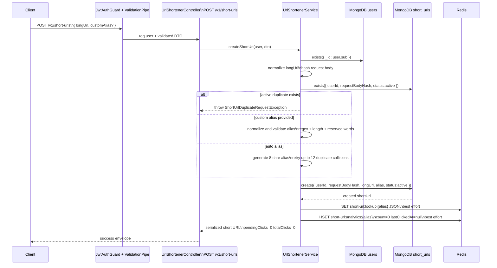
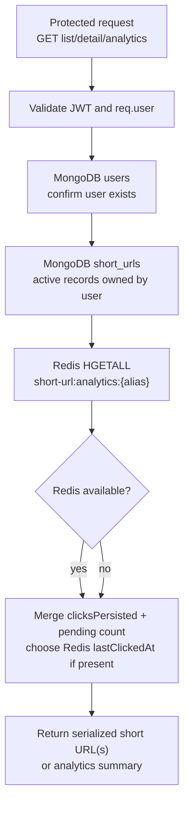
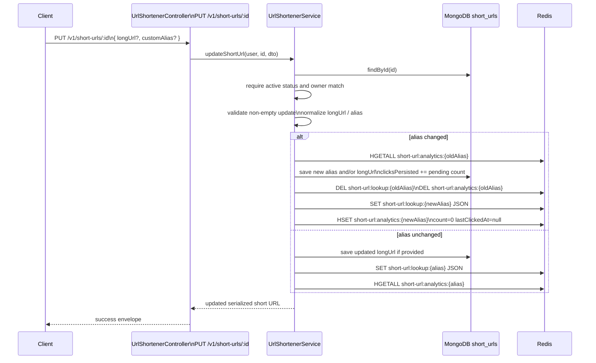
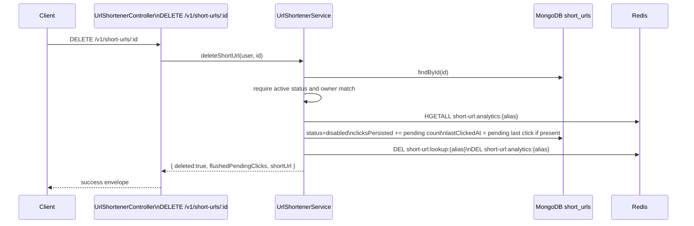
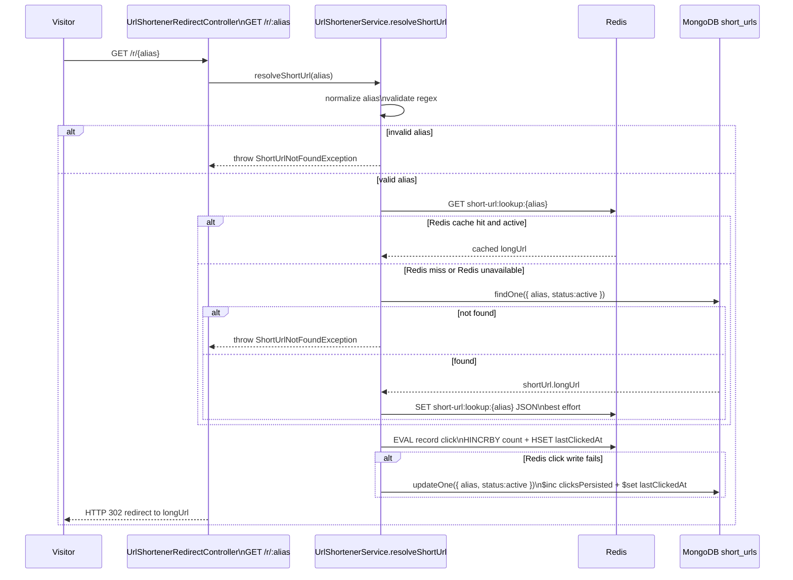
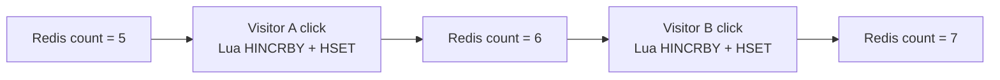
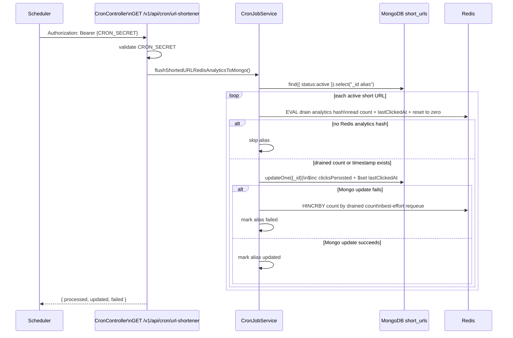
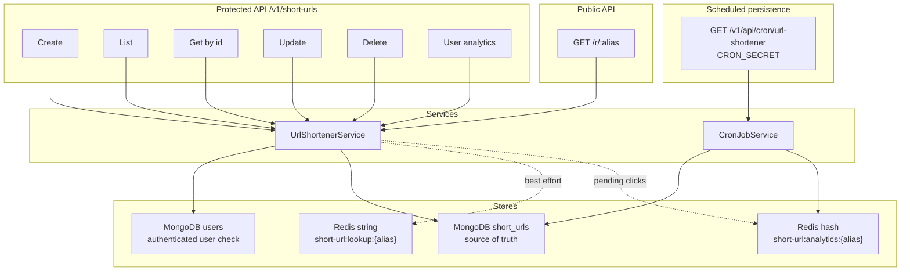

# URL Shortener

## What is a URL shortener?

A URL shortener turns a long destination URL into a compact, shareable link. The
short link uses a small alias, such as `/r/summer-sale`, and the server redirects
visitors to the original destination when they open it.

URL shorteners were created because long links are hard to share, remember,
type, print, and track. They solve practical problems around readability,
limited space, campaign measurement, link ownership, and future editability. A
short URL can stay stable while the destination behind it changes, and it can
collect click analytics without exposing the full destination everywhere it is
shared.

## Who should use it?

URL shorteners are useful for people and teams that share links often and need
control over how those links behave after publication:

- Marketers who need short campaign links and click counts.
- Product teams that share release notes, docs, invite links, or surveys.
- Support and sales teams that send clean links in emails, chats, and tickets.
- Creators and community managers who publish links in social posts, QR codes,
  printed material, or bios.
- Internal teams that want owned, editable links instead of third-party links.

Use it anywhere a long URL would be messy, fragile, hard to type, or difficult
to measure: emails, SMS, social posts, dashboards, QR codes, printed cards,
presentations, support replies, and internal documentation.

## How LinkLab builds it

The LinkLab URL Shortener lets an authenticated user create and manage short
links, while the public redirect route resolves aliases without authentication.
MongoDB is the durable source of truth. Redis is used as an acceleration layer
for redirect lookup and as a short-lived buffer for click analytics.

Controllers:

- `UrlShortenerController` at `/v1/short-urls` handles authenticated create,
  list, detail, update, delete, pagination, and analytics.
- `UrlShortenerRedirectController` at `/r/:alias` handles public redirects.
- `CronController` at `/v1/api/cron/url-shortener` persists pending Redis click
  analytics into MongoDB.

Service and storage:

- `UrlShortenerService` owns create, list, detail, update, delete, redirect, and
  user-level analytics behavior.
- `CronJobService.flushShortedURLRedisAnalyticsToMongo` moves pending Redis
  click analytics into MongoDB.
- MongoDB collection `short_urls` stores the canonical short URL document.
- Redis key `short-url:lookup:{alias}` stores the cached redirect payload.
- Redis key `short-url:analytics:{alias}` stores pending click `count` and
  `lastClickedAt`.

## Why these implementation choices exist

| Choice | Reason |
| --- | --- |
| MongoDB as source of truth | Short links, ownership, status, destination URL, and persisted analytics must survive Redis cache loss. |
| Redis lookup cache | Public redirects should be fast and should not need MongoDB on every click. |
| Redis analytics hash | Click writes can be buffered cheaply without slowing down redirect responses. |
| Lua for click recording | `count` and `lastClickedAt` update together as one atomic Redis operation. |
| Lua for cron drain | Prevents losing clicks that arrive between a separate read and reset. |
| MongoDB fallback on Redis failure | Redirects and click tracking continue even when Redis is unavailable. |
| Soft delete with `status=disabled` | Deleted links stop redirecting while retaining historical records and final analytics. |
| Alias validation and reserved words | Prevents invalid slugs and avoids conflicts with application routes such as `api`, `auth`, and `v1`. |
| Duplicate request hash | Prevents a user from creating multiple active records for the exact same create request. |
| Public redirect route skips response interceptor | Redirects must return a raw HTTP redirect, not the standard JSON success envelope. |

## Responsibilities

| Concern | Durable store | Cache / buffer | Notes |
| --- | --- | --- | --- |
| Short URL ownership | MongoDB `short_urls.userId` | none | Every protected operation checks the authenticated user owns the record. |
| Original destination | MongoDB `short_urls.longUrl` | Redis lookup JSON | Redirects can use Redis, but MongoDB can rebuild the cache. |
| Alias uniqueness | MongoDB unique `alias` index | Redis lookup key | MongoDB prevents race-condition collisions across users. |
| Soft deletion | MongoDB `status=disabled` | Redis keys deleted | Disabled aliases are treated as not found. |
| Click count | MongoDB `clicksPersisted` | Redis analytics hash `count` | Total shown to user is persisted clicks plus pending Redis clicks. |
| Last click time | MongoDB `lastClickedAt` | Redis analytics hash `lastClickedAt` | Redis has the freshest value until cron flushes it. |
| Redis outage | MongoDB fallback | best-effort cache writes | Redirects and click tracking continue using MongoDB atomic update. |

## Endpoint Summary

| Method | Route | Auth | Purpose |
| --- | --- | --- | --- |
| `POST` | `/v1/short-urls` | Protected | Create a short URL for the logged-in user. |
| `GET` | `/v1/short-urls` | Protected | List active short URLs with page/cursor support. |
| `GET` | `/v1/short-urls/analytics` | Protected | Return total active links, total clicks, and top alias. |
| `GET` | `/v1/short-urls/:id` | Protected | Read one owned active short URL by Mongo id. |
| `PUT` | `/v1/short-urls/:id` | Protected | Update destination URL and/or custom alias. |
| `DELETE` | `/v1/short-urls/:id` | Protected | Soft-delete an owned short URL. |
| `GET` | `/r/:alias` | Public | Resolve alias and return raw HTTP redirect. |
| `GET` | `/v1/api/cron/url-shortener` | Cron secret | Drain pending Redis analytics into MongoDB. |

## Validation and Alias Rules

Incoming DTOs are handled by the global `ValidationPipe`, so query values are
transformed before service logic runs.

- `longUrl` is required for creation, must be a URL with protocol, and must not
  exceed 2048 characters.
- `customAlias` is optional on create and optional on update.
- Alias length must be 3 to 32 characters.
- Alias characters must match `^[a-z0-9_-]+$`.
- Alias is normalized before persistence.
- Reserved aliases such as `admin`, `api`, `auth`, `dashboard`, `docs`,
  `health`, `login`, `logout`, `short-urls`, and `v1` are rejected.
- Auto-generated aliases use length 8 and retry up to 12 times when MongoDB
  reports a duplicate key.
- Pagination defaults to limit 10 and caps limit at 100.

## MongoDB ShortUrl Document

| Field | Purpose |
| --- | --- |
| `userId` | Owner reference. Used for protected access control. |
| `requestBodyHash` | SHA-256 hash of the create DTO for active duplicate-request detection. |
| `longUrl` | Canonical destination URL. |
| `alias` | Unique public slug used by `/r/:alias`. |
| `status` | `active` or `disabled`; delete is soft-delete. |
| `clicksPersisted` | Durable click count already flushed from Redis or written by fallback. |
| `lastClickedAt` | Durable latest click time known to MongoDB. |
| `createdAt`, `updatedAt` | Mongoose timestamps. |

Important indexes:

- Unique index on `alias`.
- `(userId, createdAt desc)` for owner lists.
- `(userId, status, _id desc)` for active owner pagination.
- `(alias, status)` for public redirect lookup.
- `(userId, requestBodyHash, status)` for duplicate create detection.

## Create Short URL Flow



## Read, List, and Analytics Flow

Protected reads always confirm that the authenticated user still exists, then
query only active short URLs owned by that user. Response click totals are
computed as:

```text
totalClicks = clicksPersisted from MongoDB + pending count from Redis
```

If Redis cannot be read, pending analytics are treated as zero so the API still
returns durable MongoDB data.



## Update Short URL Flow

Update accepts `longUrl`, `customAlias`, or both. It rejects empty updates,
not-found documents, disabled documents, and records owned by another user.

When only `longUrl` changes, MongoDB is updated and the Redis lookup cache is
refreshed best-effort.

When alias changes, the service preserves pending analytics from the old alias
before moving to the new alias:

1. Read pending analytics for the old alias from Redis.
2. Add pending count into `clicksPersisted`.
3. Copy pending `lastClickedAt` into MongoDB if present.
4. Save the document with the new alias and/or destination.
5. Delete old Redis lookup and analytics keys.
6. Create new lookup and analytics keys for the new alias.



## Delete Short URL Flow

Delete is a soft delete. The document remains in MongoDB with
`status=disabled`, and public redirects treat disabled aliases as not found.
Before disabling the record, the service flushes pending Redis analytics into
the document so the final returned object includes the latest known count.



## Public Redirect Flow with Redis Fallback

The redirect route is public and bypasses the standard success envelope because
it returns a raw HTTP redirect.

Redirect resolution is designed so Redis is helpful but not required:

- If Redis lookup cache is available and has an active payload, the service
  redirects using the cached `longUrl`.
- If Redis cache misses or Redis is unavailable, the service queries MongoDB by
  `{ alias, status: active }`.
- After a MongoDB cache miss recovery, Redis lookup warming is best-effort.
- Click analytics are recorded with one Redis Lua script when Redis is
  available.
- If Redis click tracking fails, MongoDB is updated directly with atomic
  `$inc clicksPersisted` and `$set lastClickedAt`.



## Atomic Redis Click Recording

Click recording uses a Redis Lua script instead of separate `HINCRBY` and
`HSET` calls. This makes the pending click count and latest timestamp update one
atomic Redis operation.

```text
EVAL:
  count = HINCRBY short-url:analytics:{alias} count 1
  HSET short-url:analytics:{alias} lastClickedAt clickedAt
  return count
```

Why this matters:

- Two simultaneous visitors clicking the same alias both increment the counter.
- Redis executes commands/scripts one at a time, so the final count is correct.
- If Redis fails before the script is accepted, the service writes the click to
  MongoDB directly.
- The redirect response should not depend on Redis being healthy.



## Analytics Persistence Cron with Lua Drain

The cron job persists pending Redis analytics into MongoDB. It cannot safely use
separate read and reset commands because a click can arrive between those two
commands and then be erased by the reset.

The current implementation drains each analytics hash with Lua:

```text
EVAL:
  if key does not exist:
    return nil
  count = HGET short-url:analytics:{alias} count
  lastClickedAt = HGET short-url:analytics:{alias} lastClickedAt
  HSET short-url:analytics:{alias} count 0 lastClickedAt null
  return count, lastClickedAt
```

Because Redis runs the script atomically, clicks that arrive after the drain
script are counted in Redis for the next cron run instead of being overwritten.



## Redis Outage Behavior

Redis is not the source of truth. If Redis loses data or becomes unavailable:

- Created short URLs remain in MongoDB.
- Public redirects can still resolve active aliases from MongoDB.
- Missing lookup cache is rebuilt best-effort after MongoDB lookup.
- Pending click counts that existed only in Redis can be lost if Redis crashes
  before cron drains them.
- New clicks during Redis outage are written directly to MongoDB with `$inc`.
- Read APIs still return MongoDB persisted click counts, with pending Redis
  clicks treated as zero when Redis cannot be read.

For stronger protection against Redis process restarts, Redis persistence such
as AOF or managed durable Redis should be enabled. The Lua drain still remains
necessary because persistence does not solve read-then-reset races during cron.

## High-Level URL Shortener Architecture



## Line-by-line explanation for every URL Shortener route

Use this section when explaining the server code route by route.

## Line-by-line: `POST /v1/short-urls`

Controller:

```ts
@Post()
async createShortUrl(
  @Body() dto: CreateShortUrlDto,
  @Req() req: AuthenticatedRequest,
) {
  if (!req.user) {
    throw new AccessTokenExpired();
  }

  return this.urlShortenerService.createShortUrl(req.user, dto);
}
```

Line by line:

```txt
@Post()
Maps this method to POST /v1/short-urls.

@Body() dto
Reads request body after DTO validation.

@Req() req
Reads Express request so the controller can access req.user.

if (!req.user)
Rejects the request if authentication middleware did not attach a user.

createShortUrl(req.user, dto)
Passes authenticated user and validated body to the service.
```

Service:

```ts
const userId = await this.getAuthenticatedUserId(user);
```

Checks that `user.sub` is a valid MongoDB id and that the user still exists in
MongoDB.

```ts
const requestBodyHash = createHash('sha256')
  .update(JSON.stringify(dto))
  .digest('hex');
```

Creates a stable hash for the exact create request. This is used to prevent the
same user from creating the same active short URL request again.

```ts
const existingShortUrl = await this.shortUrlModel
  .exists({
    userId,
    requestBodyHash,
    status: ShortUrlStatus.ACTIVE,
  })
  .exec();
```

Checks MongoDB for an active duplicate owned by the same user.

```ts
if (existingShortUrl) {
  throw new ShortUrlDuplicateRequestException();
}
```

Stops duplicate active create requests.

```ts
const longUrl = normalizeHttpUrl({
  value: dto.longUrl,
  fieldName: 'Long URL',
});
```

Normalizes and validates the destination URL before saving.

Custom alias branch:

```ts
if (dto.customAlias?.trim()) {
  const alias = normalizeAlias(dto.customAlias);
  validateAlias(...);
  const shortUrl = await this.shortUrlModel.create(...);
  await this.warmCache(shortUrl);
  await this.initializeAnalytics(shortUrl.alias);
  return ...;
}
```

Line by line:

```txt
dto.customAlias?.trim()
Only enters this branch when the user provided a non-empty custom alias.

normalizeAlias(dto.customAlias)
Trims and normalizes alias casing.

validateAlias(...)
Checks length, allowed characters, and reserved aliases.

shortUrlModel.create(...)
Creates the MongoDB short_urls document.

warmCache(shortUrl)
Writes short-url:lookup:{alias} to Redis for fast redirects.

initializeAnalytics(alias)
Writes short-url:analytics:{alias} with count 0 and lastClickedAt null.

duplicate key error
Means alias is already used, so service throws ShortUrlAliasAlreadyInUseException.
```

Auto alias branch:

```ts
for (let i = 0; i < AUTO_ALIAS_GENERATION_ATTEMPTS; i += 1) {
  const alias = generateRandomAlias(AUTO_ALIAS_LENGTH);
  const shortUrl = await this.shortUrlModel.create(...);
  await this.warmCache(shortUrl);
  await this.initializeAnalytics(shortUrl.alias);
  return ...;
}
```

Line by line:

```txt
for loop
Tries up to 12 times.

generateRandomAlias(8)
Creates an 8-character alias.

shortUrlModel.create(...)
Attempts to save with that generated alias.

duplicate key error
Means generated alias collided, so continue and try another generated alias.

ShortUrlAliasGenerationFailedException
Thrown only when all 12 generated aliases collide.
```

Redis behavior:

```txt
Create success always tries:
1. warmCache -> Redis lookup payload
2. initializeAnalytics -> Redis pending analytics hash

Both are best effort. MongoDB remains source of truth.
```

## Line-by-line: `GET /v1/short-urls`

This is the paginated list route.

Service:

```ts
const userId = await this.getAuthenticatedUserId(user);
```

Validates authenticated user and returns MongoDB `ObjectId`.

```ts
const limit: number = query.limit ?? DEFAULT_SHORT_URL_PAGE_LIMIT;
const currentPage: number = query.page ?? 1;
```

Uses query values or defaults.

```txt
Default limit = 10
Default page = 1
Max limit is enforced by DTO validation.
```

```ts
const cursorId = query.cursor
  ? toObjectId(query.cursor, 'Cursor id is invalid')
  : null;
```

If a cursor is provided, convert it to `ObjectId`. Cursor means “start after
this item.”

```ts
const skip = cursorId ? 0 : (currentPage - 1) * limit;
```

If using cursor pagination, do not use page skip. If not using cursor, use
normal page skip.

```ts
const baseFilter = {
  userId,
  status: ShortUrlStatus.ACTIVE,
};
```

Only list active short URLs owned by this user.

```ts
const [shortUrls, total] = await Promise.all([
  this.shortUrlModel.find(...).exec(),
  this.shortUrlModel.countDocuments(baseFilter).exec(),
]);
```

Runs the page query and total count at the same time.

```ts
.find({
  ...baseFilter,
  ...(cursorId ? { _id: { $lt: cursorId } } : {}),
})
```

If no cursor:

```txt
Find active links for user.
```

If cursor exists:

```txt
Find active links for user with _id less than cursorId.
Because sort is newest first, this means older records after the cursor.
```

```ts
.sort({ _id: -1 })
```

Sort newest first.

```ts
.skip(skip)
```

Skips records only for page-based pagination.

```ts
.limit(limit + 1)
```

Fetches one extra record to detect whether another page exists.

```ts
const hasMore = shortUrls.length > limit;
const currentPageItems = hasMore ? shortUrls.slice(0, limit) : shortUrls;
```

If extra record exists, `hasMore` is true and the extra record is removed from
the response.

```ts
for (const shortUrl of currentPageItems) {
  const analytics = await this.getAnalytics(shortUrl.alias);
  items.push(this.serializeShortUrl(...));
}
```

For each MongoDB short URL, read Redis analytics and merge it into the response.

```txt
Redis key: short-url:analytics:{alias}
pendingClicks = Redis count
totalClicks = MongoDB clicksPersisted + pendingClicks
```

```ts
const nextCursor = items.length > 0 ? items[items.length - 1].id : null;
```

The next cursor is the last returned item id.

```ts
pagination: {
  totalItems: total,
  totalPages: Math.ceil(total / limit),
  hasMore,
  page: currentPage,
  limit,
  cursor: nextCursor,
}
```

Builds pagination metadata for the frontend.

Redis behavior:

```txt
Reads analytics hash for each returned alias.
Does not warm lookup cache.
Does not clear Redis keys.
If Redis read fails, pendingClicks becomes 0.
```

## Line-by-line: `GET /v1/short-urls/analytics`

Service:

```ts
const userId = await this.getAuthenticatedUserId(user);
```

Verifies authenticated user.

```ts
const shortUrls = await this.shortUrlModel
  .find({
    userId,
    status: ShortUrlStatus.ACTIVE,
  })
  .sort({ _id: -1 })
  .exec();
```

Loads all active short URLs for this user. This route does not use MongoDB
aggregation because pending clicks may still be in Redis.

```ts
let totalClicks = 0;
let topShortUrl: SerializedShortUrl | null = null;
```

Initializes counters in application code.

```ts
for (const shortUrl of shortUrls) {
  const analytics = await this.getAnalytics(shortUrl.alias);
  const serialized = this.serializeShortUrl(...);
  totalClicks += serialized.totalClicks;
  if (topShortUrl === null || serialized.totalClicks > topShortUrl.totalClicks) {
    topShortUrl = serialized;
  }
}
```

For each short URL:

```txt
Read Redis pending analytics.
Combine MongoDB clicksPersisted + Redis pending count.
Add to totalClicks.
Track the alias with the highest totalClicks.
```

```ts
return {
  total: shortUrls.length,
  totalClicks,
  topAlias: topShortUrl?.alias ?? null,
};
```

Returns total active links, total clicks, and top alias.

Redis behavior:

```txt
Reads short-url:analytics:{alias} for every active alias.
If Redis fails for an alias, that alias contributes only MongoDB clicksPersisted.
```

## Line-by-line: `GET /v1/short-urls/:id`

Service:

```ts
const userId = await this.getAuthenticatedUserId(user);
const urlId = toObjectId(shortUrlId, 'Short URL id is invalid');
```

Validates user and converts route id to MongoDB `ObjectId`.

```ts
const shortUrl = await this.shortUrlModel.findById(urlId).exec();
```

Loads one short URL by MongoDB id.

```ts
if (!shortUrl || shortUrl.status === ShortUrlStatus.DISABLED) {
  throw new ShortUrlNotFoundException();
}
```

Rejects missing or disabled links.

```ts
if (String(shortUrl.userId) !== String(userId)) {
  throw new ShortUrlAccessDeniedException();
}
```

Rejects links owned by another user.

```ts
const analytics = await this.getAnalytics(shortUrl.alias);
```

Reads pending Redis analytics for this alias.

```ts
return {
  shortUrl: this.serializeShortUrl(
    shortUrl,
    analytics.count,
    analytics.lastClickedAt,
  ),
};
```

Returns MongoDB document plus Redis pending analytics.

Redis behavior:

```txt
Reads analytics hash only.
Does not read redirect lookup cache.
Does not warm cache.
```

## Line-by-line: `PUT /v1/short-urls/:id`

Service:

```ts
const userId = await this.getAuthenticatedUserId(user);
const urlId = toObjectId(shortUrlId, 'Short URL id is invalid');
const shortUrl = await this.shortUrlModel.findById(urlId).exec();
```

Validates user, converts id, and loads the existing document.

```ts
if (!shortUrl || shortUrl.status === ShortUrlStatus.DISABLED) {
  throw new ShortUrlNotFoundException();
}
```

Cannot update missing or disabled links.

```ts
if (String(shortUrl.userId) !== String(userId)) {
  throw new ShortUrlAccessDeniedException();
}
```

Only the owner can update the link.

```ts
if (
  shortUrl.longUrl === dto.longUrl &&
  shortUrl.alias === dto.customAlias
) {
  throw new ShortUrlNoChangesException();
}
```

Rejects exact raw no-change requests.

```ts
if (dto.longUrl === undefined && dto.customAlias === undefined) {
  throw new ShortUrlUpdateFieldsRequiredException();
}
```

Rejects empty update body.

```ts
const nextLongUrl =
  dto.longUrl !== undefined
    ? normalizeHttpUrl({ value: dto.longUrl, fieldName: 'Long URL' })
    : undefined;
```

Normalizes destination URL only if the client sent `longUrl`.

```ts
const nextAlias =
  dto.customAlias !== undefined
    ? normalizeAlias(dto.customAlias)
    : undefined;
```

Normalizes alias only if client sent `customAlias`.

```ts
if (nextAlias) {
  validateAlias(...);
}
```

Validates alias only when a non-empty alias exists after normalization.

```ts
const originalAlias = shortUrl.alias;
const aliasChanged =
  nextAlias !== undefined && nextAlias !== shortUrl.alias;
```

Stores the old alias and checks if alias actually changed.

```ts
if (aliasChanged) {
  const analytics = await this.getAnalytics(originalAlias);
  shortUrl.clicksPersisted += analytics.count;
  if (analytics.lastClickedAt) {
    shortUrl.lastClickedAt = new Date(analytics.lastClickedAt);
  }
  shortUrl.alias = nextAlias;
}
```

If alias changes:

```txt
Read pending Redis analytics from old alias.
Move pending click count into MongoDB clicksPersisted.
Move pending lastClickedAt into MongoDB if present.
Set document alias to new alias.
```

```ts
if (nextLongUrl !== undefined) {
  shortUrl.longUrl = nextLongUrl;
}
```

Updates long URL if provided.

```ts
await shortUrl.save();
```

Saves the updated MongoDB document. Duplicate alias errors become
`ShortUrlAliasAlreadyInUseException`.

```ts
if (aliasChanged) {
  await this.clearCache(originalAlias);
  await this.warmCache(shortUrl);
  await this.initializeAnalytics(shortUrl.alias);
  return this.serializeShortUrl(shortUrl, 0, null);
}
```

If alias changed:

```txt
Delete old lookup and analytics Redis keys.
Warm new lookup cache.
Create new analytics hash with count 0.
Return pendingClicks as 0 because old pending clicks were flushed into MongoDB.
```

```ts
await this.warmCache(shortUrl);
const analytics = await this.getAnalytics(shortUrl.alias);
return this.serializeShortUrl(shortUrl, analytics.count, analytics.lastClickedAt);
```

If alias did not change:

```txt
Refresh lookup cache for same alias.
Read existing Redis analytics.
Return MongoDB + pending Redis analytics.
```

## Line-by-line: `DELETE /v1/short-urls/:id`

Service:

```ts
const userId = await this.getAuthenticatedUserId(user);
const shortUrl = await this.getOwnedShortUrl(userId, shortUrlId);
```

Validates user and loads owned active short URL.

```ts
const analytics = await this.getAnalytics(shortUrl.alias);
```

Reads pending Redis analytics before deleting Redis keys.

```ts
shortUrl.status = ShortUrlStatus.DISABLED;
shortUrl.clicksPersisted += analytics.count;
```

Soft deletes the link and flushes pending click count into MongoDB.

```ts
if (analytics.lastClickedAt) {
  shortUrl.lastClickedAt = new Date(analytics.lastClickedAt);
}
```

Preserves latest click timestamp from Redis if present.

```ts
await shortUrl.save();
await this.clearCache(shortUrl.alias);
```

Saves disabled status, then deletes Redis lookup and analytics keys.

```ts
return {
  message: 'Short URL deleted successfully',
  deleted: true,
  flushedPendingClicks: analytics.count,
  shortUrl: this.serializeShortUrl(shortUrl, 0, null),
};
```

Returns deleted document and the number of Redis clicks flushed into MongoDB.

Redis behavior:

```txt
Read analytics hash.
Flush pending count into MongoDB.
Delete lookup cache.
Delete analytics hash.
```

## Line-by-line: `GET /r/:alias`

Controller:

```ts
@Public()
@SkipResponseInterceptor()
@Controller('r')
```

Public raw redirect route. It does not use normal JSON response wrapping.

```ts
const longUrl = await this.urlShortenerService.resolveShortUrl(alias);
return res.redirect(longUrl);
```

Service returns destination URL, controller sends HTTP redirect.

Service:

```ts
const alias = normalizeAlias(aliasParam);
```

Normalizes public alias.

```ts
if (!SHORT_URL_ALIAS_REGEX.test(alias)) {
  throw new ShortUrlNotFoundException();
}
```

Invalid alias format is treated as not found.

```ts
const cached = await this.getCachedShortUrl(alias);
const clickedAt = new Date().toISOString();
```

Reads Redis lookup cache and prepares click timestamp.

```ts
if (cached?.status === ShortUrlStatus.ACTIVE) {
  await this.recordClick(alias, clickedAt);
  return cached.longUrl;
}
```

If Redis has an active cached link:

```txt
Record click.
Return cached destination.
Skip MongoDB lookup.
```

```ts
const shortUrl = await this.shortUrlModel
  .findOne({ alias, status: ShortUrlStatus.ACTIVE })
  .exec();
```

If cache misses or is invalid, query MongoDB.

```ts
if (!shortUrl) {
  throw new ShortUrlNotFoundException();
}
```

Only active aliases can redirect.

```ts
await this.warmCache(shortUrl);
await this.recordClick(alias, clickedAt);
return shortUrl.longUrl;
```

After MongoDB fallback:

```txt
Warm Redis lookup cache for next request.
Record click in Redis, or MongoDB if Redis fails.
Return longUrl.
```

## Line-by-line: `GET /v1/api/cron/url-shortener`

Controller:

```ts
this.assertAuthorized(authorization);
```

Checks `Authorization: Bearer {CRON_SECRET}`.

```ts
const result =
  await this.cronService.flushShortedURLRedisAnalyticsToMongo();
```

Runs the Redis-to-Mongo analytics flush.

Cron service:

```ts
const shortUrls = await this.shortUrlModel
  .find({ status: ShortUrlStatus.ACTIVE })
  .select('_id alias')
  .lean()
  .exec();
```

Loads active aliases only. Uses `lean()` because the cron only needs plain data.

```ts
for (const shortUrl of shortUrls) {
  const analyticsKey = getShortUrlAnalyticsKey(shortUrl.alias);
  const analytics = await drainShortUrlAnalyticsHash(...);
}
```

For each active alias, atomically drains pending Redis analytics.

```ts
const count = parseNonNegativeInt(analytics.count);
```

Parses pending click count safely.

```ts
if (count > 0) {
  mongoUpdate.$inc = { clicksPersisted: count };
}
```

Adds MongoDB increment only if there are clicks.

```ts
if (lastClickedAtRaw) {
  mongoUpdate.$set = { lastClickedAt: clickedAt };
}
```

Adds MongoDB timestamp update only if Redis has a valid timestamp.

```ts
await this.shortUrlModel.updateOne(
  { _id: shortUrl._id },
  mongoUpdate,
);
```

Persists drained analytics into MongoDB.

```ts
if (MongoDB update fails and count > 0) {
  incrementHashField(...);
}
```

If MongoDB fails after Redis was drained, the service adds click count back to
Redis to reduce data loss.
